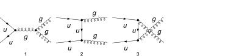
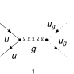

## Load FeynCalc and the necessary add-ons or other packages

```mathematica
description = "Q Qbar -> Gl Gl with ghosts, QCD, matrix element squared, tree";
If[ $FrontEnd === Null, 
  	$FeynCalcStartupMessages = False; 
  	Print[description]; 
  ];
If[ $Notebooks === False, 
  	$FeynCalcStartupMessages = False 
  ];
$LoadAddOns = {"FeynArts"};
<< FeynCalc`
$FAVerbose = 0;
LaunchKernels[8]; 
 
$ParallelizeFeynCalc = True; 
FCCheckVersion[10, 2, 0];
```

$$\text{FeynCalc }\;\text{10.2.0 (dev version, 2026-06-09 14:14:02 +02:00, 96f9ea07). For help, use the }\underline{\text{online} \;\text{documentation},}\;\text{ visit the }\underline{\text{forum}}\;\text{ and have a look at the supplied }\underline{\text{examples}.}\;\text{ The PDF-version of the manual can be downloaded }\underline{\text{here}.}$$

$$\text{If you use FeynCalc in your research, please evaluate FeynCalcHowToCite[] to learn how to cite this software.}$$

$$\text{Please keep in mind that the proper academic attribution of our work is crucial to ensure the future development of this package!}$$

$$\text{FeynArts }\;\text{3.12 (27 Mar 2025) patched for use with FeynCalc, for documentation see the }\underline{\text{manual}}\;\text{ or visit }\underline{\text{www}.\text{feynarts}.\text{de}.}$$

$$\text{If you use FeynArts in your research, please cite}$$

$$\text{ $\bullet $ T. Hahn, Comput. Phys. Commun., 140, 418-431, 2001, arXiv:hep-ph/0012260}$$

## Generate Feynman diagrams

Nicer typesetting

```mathematica
FCAttachTypesettingRule[p1, {SubscriptBox, p, 1}]
FCAttachTypesettingRule[p2, {SubscriptBox, p, 2}]
FCAttachTypesettingRule[q1, {SubscriptBox, q, 1}]
FCAttachTypesettingRule[q2, {SubscriptBox, q, 2}]
```

```mathematica
diags = InsertFields[CreateTopologies[0, 2 -> 2], {F[3, {1}], -F[3, {1}]} -> 
     		{V[5], V[5]}, InsertionLevel -> {Classes}, Model -> "SMQCD"]; 
 
Paint[diags, ColumnsXRows -> {4, 1}, Numbering -> Simple, 
  	SheetHeader -> None, ImageSize -> 128 {4, 1}];
```



```mathematica
diagsGh1 = InsertFields[CreateTopologies[0, 2 -> 2], {F[3, {1}], -F[3, {1}]} -> 
    		{-U[5], U[5]}, InsertionLevel -> {Classes}, Model -> "SMQCD"];
Paint[diagsGh1, ColumnsXRows -> {1, 1}, Numbering -> Simple, 
  	SheetHeader -> None, ImageSize -> 128 {1, 1}];
```



```mathematica
diagsGh2 = InsertFields[CreateTopologies[0, 2 -> 2], {F[3, {1}], -F[3, {1}]} -> 
    		{U[5], -U[5]}, InsertionLevel -> {Classes}, Model -> "SMQCD"];
Paint[diagsGh2, ColumnsXRows -> {1, 1}, Numbering -> Simple, 
  	SheetHeader -> None, ImageSize -> 128 {1, 1}];
```


## Obtain the amplitudes

```mathematica
amp[0] = FCFAConvert[CreateFeynAmp[diags], IncomingMomenta -> {p1, p2},
   	OutgoingMomenta -> {q1, q2}, UndoChiralSplittings -> True, ChangeDimension -> 4, 
   	List -> True, SMP -> True, Contract -> True, DropSumOver -> True];
```

```mathematica
ampGh1[0] = FCFAConvert[CreateFeynAmp[diagsGh1], IncomingMomenta -> {p1, p2}, 
  	OutgoingMomenta -> {q1, q2}, UndoChiralSplittings -> True, ChangeDimension -> 4, 
  	List -> True, SMP -> True, Contract -> True, DropSumOver -> True]
```

$$\left\{\frac{i g_s^2 T_{\text{Col2}\;\text{Col1}}^{\text{Glu5}} f^{\text{Glu3}\;\text{Glu4}\;\text{Glu5}} \left(\varphi (-\overline{p_2},m_u)\right).\left(\bar{\gamma }\cdot \overline{q_2}\right).\left(\varphi (\overline{p_1},m_u)\right)}{(\overline{q_1}+\overline{q_2}){}^2}\right\}$$

```mathematica
ampGh2[0] = FCFAConvert[CreateFeynAmp[diagsGh2], IncomingMomenta -> {p1, p2}, 
  	OutgoingMomenta -> {q1, q2}, UndoChiralSplittings -> True, ChangeDimension -> 4, 
  	List -> True, SMP -> True, Contract -> True, DropSumOver -> True]
```

$$\left\{\frac{i g_s^2 T_{\text{Col2}\;\text{Col1}}^{\text{Glu5}} f^{\text{Glu3}\;\text{Glu4}\;\text{Glu5}} \left(\varphi (-\overline{p_2},m_u)\right).\left(\bar{\gamma }\cdot \overline{q_1}\right).\left(\varphi (\overline{p_1},m_u)\right)}{(\overline{q_1}+\overline{q_2}){}^2}\right\}$$

## Fix the kinematics

```mathematica
FCClearScalarProducts[];
SetMandelstam[s, t, u, p1, p2, -q1, -q2, SMP["m_u"], SMP["m_u"], 0, 0];
```

## Square the amplitudes

```mathematica
ampSquaredUnphys[0] = SquareAmplitude[amp[0], ComplexConjugate[amp[0]], Real -> True];
```

```mathematica
AbsoluteTiming[ampSquaredUnphys[1] = FeynAmpDenominatorExplicit[ampSquaredUnphys[0], FCParallelize -> True] // 
     SUNSimplify[#, FCParallelize -> True] &;]
```

$$\{0.135746,\text{Null}\}$$

```mathematica
AbsoluteTiming[ampSquaredUnphys[2] = ampSquaredUnphys[1] // DoPolarizationSums[#, q1, 0, 
        FCParallelize -> True] & // DoPolarizationSums[#, q2, 0, FCParallelize -> True] &;]
```

$$\{0.31234,\text{Null}\}$$

```mathematica
AbsoluteTiming[ampSquaredUnphys[3] = ampSquaredUnphys[2] // FermionSpinSum[#, ExtraFactor -> 1/2^2, FCParallelize -> True] & // DiracSimplify[#, FCParallelize -> True] &;]
```

$$\{0.811156,\text{Null}\}$$

```mathematica
AbsoluteTiming[ampSquaredUnphys[4] = 1/(SUNN^2) ampSquaredUnphys[3] // TrickMandelstam[#, {s, t, u, 2  SMP["m_u"]^2}, FCParallelize -> True] &;]
```

$$\{0.169753,\text{Null}\}$$

```mathematica
ampSquaredUnphys[5] = Collect2[ampSquaredUnphys[4] // Total, CA, CF, D, 
   Factoring -> Function[{x}, TrickMandelstam[x, {s, t, u, 2  SMP["m_u"]^2}]]]
```

$$-\frac{C_A^2 C_F g_s^4 \left(t^2 m_u^4-6 t^2 u m_u^2-6 t u^2 m_u^2-6 t m_u^6+16 t u m_u^4+u^2 m_u^4+3 m_u^8-6 u m_u^6+2 t^3 u-t^2 u^2+2 t u^3\right)}{N^2 s^2 \left(u-m_u^2\right) \left(t-m_u^2\right)}+\frac{2 C_A C_F^2 g_s^4 \left(-t^3 m_u^2+t^2 m_u^4-5 t^2 u m_u^2-5 t u^2 m_u^2-2 t m_u^6+14 t u m_u^4-u^3 m_u^2+u^2 m_u^4-2 m_u^8-2 u m_u^6+t^3 u+t u^3\right)}{N^2 \left(u-m_u^2\right){}^2 \left(t-m_u^2\right){}^2}-\frac{2 C_F g_s^4 m_u^2 \left(s-4 m_u^2\right)}{N^2 \left(u-m_u^2\right) \left(t-m_u^2\right)}$$

```mathematica
ampSquaredGh1[0] = 1/(SUNN^2) (ampGh1[0] (ComplexConjugate[ampGh1[0]])) // 
       	FeynAmpDenominatorExplicit // SUNSimplify[#, Explicit -> True, 
        	SUNNToCACF -> False] & // FermionSpinSum[#, ExtraFactor -> 1/2^2] & // 
    	DiracSimplify // TrickMandelstam[#, {s, t, u, 2  SMP["m_u"]^2}] & // Total
```

$$-\frac{\left(1-N^2\right) g_s^4 \left(u-m_u^2\right) \left(t-m_u^2\right)}{4 N s^2}$$

```mathematica
ampSquaredGh2[0] = 1/(SUNN^2) (ampGh1[0] (ComplexConjugate[ampGh1[0]])) // 
       	FeynAmpDenominatorExplicit // SUNSimplify[#, Explicit -> True, 
        	SUNNToCACF -> False] & // FermionSpinSum[#, ExtraFactor -> 1/2^2] & // 
    	DiracSimplify // TrickMandelstam[#, {s, t, u, 2  SMP["m_u"]^2}] & // Total
```

$$-\frac{\left(1-N^2\right) g_s^4 \left(u-m_u^2\right) \left(t-m_u^2\right)}{4 N s^2}$$

Subtract unphysical degrees of freedom using ghost contributions

```mathematica
ampSquared[0] = ampSquaredUnphys[5] - ampSquaredGh1[0] - ampSquaredGh2[0] // Together
```

$$-\frac{1}{2 s^2 N^2 \left(m_u^2-t\right){}^2 \left(m_u^2-u\right){}^2}g_s^4 \left(N^3 m_u^{12}+6 C_A^2 C_F m_u^{12}-N m_u^{12}-3 N^3 t m_u^{10}-18 C_A^2 C_F t m_u^{10}+3 N t m_u^{10}-3 N^3 u m_u^{10}-18 C_A^2 C_F u m_u^{10}+3 N u m_u^{10}+8 C_A C_F^2 s^2 m_u^8-16 C_F s^2 m_u^8+3 N^3 t^2 m_u^8+14 C_A^2 C_F t^2 m_u^8-3 N t^2 m_u^8+3 N^3 u^2 m_u^8+14 C_A^2 C_F u^2 m_u^8-3 N u^2 m_u^8+9 N^3 t u m_u^8+62 C_A^2 C_F t u m_u^8-9 N t u m_u^8+4 C_F s^3 m_u^6-N^3 t^3 m_u^6-2 C_A^2 C_F t^3 m_u^6+N t^3 m_u^6-N^3 u^3 m_u^6-2 C_A^2 C_F u^3 m_u^6+N u^3 m_u^6-9 N^3 t u^2 m_u^6-58 C_A^2 C_F t u^2 m_u^6+9 N t u^2 m_u^6+8 C_A C_F^2 s^2 t m_u^6+16 C_F s^2 t m_u^6+8 C_A C_F^2 s^2 u m_u^6+16 C_F s^2 u m_u^6-9 N^3 t^2 u m_u^6-58 C_A^2 C_F t^2 u m_u^6+9 N t^2 u m_u^6+3 N^3 t u^3 m_u^4+18 C_A^2 C_F t u^3 m_u^4-3 N t u^3 m_u^4-4 C_A C_F^2 s^2 t^2 m_u^4-4 C_A C_F^2 s^2 u^2 m_u^4+9 N^3 t^2 u^2 m_u^4+54 C_A^2 C_F t^2 u^2 m_u^4-9 N t^2 u^2 m_u^4-4 C_F s^3 t m_u^4-4 C_F s^3 u m_u^4+3 N^3 t^3 u m_u^4+18 C_A^2 C_F t^3 u m_u^4-3 N t^3 u m_u^4-56 C_A C_F^2 s^2 t u m_u^4-16 C_F s^2 t u m_u^4-4 C_A^2 C_F t u^4 m_u^2+4 C_A C_F^2 s^2 t^3 m_u^2+4 C_A C_F^2 s^2 u^3 m_u^2-3 N^3 t^2 u^3 m_u^2-14 C_A^2 C_F t^2 u^3 m_u^2+3 N t^2 u^3 m_u^2-3 N^3 t^3 u^2 m_u^2-14 C_A^2 C_F t^3 u^2 m_u^2+3 N t^3 u^2 m_u^2+20 C_A C_F^2 s^2 t u^2 m_u^2-4 C_A^2 C_F t^4 u m_u^2+20 C_A C_F^2 s^2 t^2 u m_u^2+4 C_F s^3 t u m_u^2+4 C_A^2 C_F t^2 u^4+N^3 t^3 u^3-2 C_A^2 C_F t^3 u^3-N t^3 u^3-4 C_A C_F^2 s^2 t u^3+4 C_A^2 C_F t^4 u^2-4 C_A C_F^2 s^2 t^3 u\right)$$

```mathematica
ampSquaredMassless[0] = ampSquared[0] // ReplaceAll[#, {SMP["m_u"] -> 0}] & // 
  	TrickMandelstam[#, {s, t, u, 0}] &
```

$$\frac{g_s^4 \left(4 s^2 t^2 C_A C_F^2+4 s^2 u^2 C_A C_F^2-4 t^3 u C_A^2 C_F+2 t^2 u^2 C_A^2 C_F-4 t u^3 C_A^2 C_F+N^3 \left(-t^2\right) u^2+N t^2 u^2\right)}{2 N^2 s^2 t u}$$

```mathematica
ampSquaredMasslessSUNN3[0] = SUNSimplify[ampSquaredMassless[0], SUNNToCACF -> False] /. SUNN -> 3
```

$$-\frac{4 g_s^4 \left(t^2+u^2\right) \left(18 t u-8 s^2\right)}{27 s^2 t u}$$

## Check the final results

```mathematica
knownResults = {
   	(32/27) SMP["g_s"]^4 (t^2 + u^2)/(t u) - (8/3) SMP["g_s"]^4 (t^2 + u^2)/(s^2) 
   };
FCCompareResults[{ampSquaredMasslessSUNN3[0]}, {knownResults}, 
  Text -> {"\tCompare to Ellis, Stirling and Weber, QCD and Collider Physics, Table 7.1:", "CORRECT.", "WRONG!"}, Interrupt -> {Hold[Quit[1]], Automatic}, Factoring -> 
   Function[x, Simplify[TrickMandelstam[x, {s, t, u, 0}]]]]
Print["\tCPU Time used: ", Round[N[TimeUsed[], 3], 0.001], " s."];

```mathematica

$$\text{$\backslash $tCompare to Ellis, Stirling and Weber, QCD and Collider Physics, Table 7.1:} \;\text{CORRECT.}$$

$$\text{True}$$

$$\text{$\backslash $tCPU Time used: }40.636\text{ s.}$$