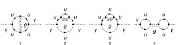

## Load FeynCalc and the necessary add-ons or other packages

```mathematica
description = "Adler function, QCD, massless quarks, 2-loops";
If[ $FrontEnd === Null, 
  	$FeynCalcStartupMessages = False; 
  	Print[description]; 
  ];
If[ $Notebooks === False, 
  	$FeynCalcStartupMessages = False 
  ];
LaunchKernels[4];
$LoadAddOns = {"FeynArts", "FeynHelpers"};
<< FeynCalc`
$FAVerbose = 0;
$ParallelizeFeynCalc = True; 
 
FCCheckVersion[10, 2, 0];
If[ToExpression[StringSplit[$FeynHelpersVersion, "."]][[1]] < 2, 
 	Print["You need at least FeynHelpers 2.0 to run this example."]; 
 	Abort[]; 
 ]
```

$$\text{FeynCalc }\;\text{10.2.1 (dev version, 2026-06-23 16:04:37 +02:00, d2d4541b). For help, use the }\underline{\text{online} \;\text{documentation},}\;\text{ visit the }\underline{\text{forum}}\;\text{ and have a look at the supplied }\underline{\text{examples}.}\;\text{ The PDF-version of the manual can be downloaded }\underline{\text{here}.}$$

$$\text{If you use FeynCalc in your research, please evaluate FeynCalcHowToCite[] to learn how to cite this software.}$$

$$\text{Please keep in mind that the proper academic attribution of our work is crucial to ensure the future development of this package!}$$

$$\text{FeynArts }\;\text{3.12 (27 Mar 2025) patched for use with FeynCalc, for documentation see the }\underline{\text{manual}}\;\text{ or visit }\underline{\text{www}.\text{feynarts}.\text{de}.}$$

$$\text{If you use FeynArts in your research, please cite}$$

$$\text{ $\bullet $ T. Hahn, Comput. Phys. Commun., 140, 418-431, 2001, arXiv:hep-ph/0012260}$$

$$\text{FeynHelpers }\;\text{2.1.0 (2026-06-17 11:21:04 +02:00, 1d1a414a). For help, use the }\underline{\text{online} \;\text{documentation},}\;\text{ visit the }\underline{\text{forum}}\;\text{ and have a look at the supplied }\underline{\text{examples}.}\;\text{ The PDF-version of the manual can be downloaded }\underline{\text{here}.}$$

$$\text{ If you use FeynHelpers in your research, please evaluate FeynHelpersHowToCite[] to learn how to cite this work.}$$

## Generate Feynman diagrams

```mathematica
modelDir = FileNameJoin[{$UserBaseDirectory, "Applications", "FeynCalc", "Examples", "Models", "QCD-EPEM"}];
```

```mathematica
FAPatch[PatchModelsOnly -> True, FAModelsDirectory -> modelDir];

(*Successfully patched FeynArts.*)
```

Nicer typesetting

```mathematica
FCAttachTypesettingRule[mu, "\[Mu]"];
FCAttachTypesettingRule[nu, "\[Nu]"];
```

We compute the hadronic vacuum polarization from a single massless quark flavor.
The full Adler function is obtained by summing over all active quark flavors.

```mathematica
diags = InsertFields[CreateTopologies[2, 1 -> 1, 
     		ExcludeTopologies -> {Tadpoles}], {V[1]} -> {V[1]}, 
    	InsertionLevel -> {Particles}, Model -> FileNameJoin[{modelDir, "QCD-EPEM"}], 
     GenericModel -> FileNameJoin[{modelDir, "QCD-EPEM"}], 
    	ExcludeParticles -> {F[4], F[3, {2 | 3}], V[1]}]; 
 
Paint[diags, ColumnsXRows -> {4, 1}, Numbering -> Simple, 
  	SheetHeader -> None, ImageSize -> 128 {4, 1}];
```



## Master integrals

```mathematica
masslessSunrise = Get[FileNameJoin[{$FeynCalcDirectory, "Examples", "MasterIntegrals", "Mincer", "prop2Lv1xFx10101x00000xxEp999x.m"}]]
```

$$\left\{G^{\text{prop2Lv1}}(1,0,1,0,1)\to -\frac{e^{2 \gamma  \;\text{ep}} \Gamma (1-\text{ep})^3 \Gamma (2 \;\text{ep}-1) (-\text{qq}-i \;\text{eta})^{1-2 \;\text{ep}}}{\Gamma (3-3 \;\text{ep})},\left\{\text{FCTopology}\left(\text{prop2Lv1},\left\{\frac{1}{\text{k1}^2},\frac{1}{\text{k2}^2},\frac{1}{(\text{k1}-\text{k2})^2},\frac{1}{(\text{k1}-q)^2},\frac{1}{(\text{k2}-q)^2}\right\},\{\text{k1},\text{k2}\},\{q\},\{\text{Hold}[\text{SPD}][q,q]\to \;\text{qq}\},\{\}\right)\right\}\right\}$$

```mathematica
masslessBubble = Get[FileNameJoin[{$FeynCalcDirectory, "Examples", "MasterIntegrals", "Mincer", "prop1L00.m"}]]
```

$$\left\{G^{\text{prop1L00}}(1,1)\to \frac{e^{\gamma  \;\text{ep}} \Gamma (1-\text{ep})^2 \Gamma (\text{ep}) (-\text{qq}-i \;\text{eta})^{-\text{ep}}}{\Gamma (2-2 \;\text{ep})},\left\{\text{FCTopology}\left(\text{prop1L00},\left\{\frac{1}{(l^2+i \eta )},\frac{1}{((l-q)^2+i \eta )}\right\},\{l\},\{q\},\{\text{Hold}[\text{Pair}][q,q]\to \;\text{qq}\},\{\}\right)\right\}\right\}$$

## Obtain the amplitude

The 1/(2Pi)^D prefactor per loop is implicit. At 2-loops in massless QCD we don't need to renormalize the divergent correlator to obtain Adler function

An explicit color sum is present only in the last diagram that, however, vanishes.

```mathematica
amp[0] = FCFAConvert[CreateFeynAmp[diags, PreFactor -> 1, 
   	Truncated -> True], IncomingMomenta -> {p}, 
  	OutgoingMomenta -> {q}, LorentzIndexNames -> {mu, nu}, 
  	LoopMomenta -> {k1, k2}, UndoChiralSplittings -> True, 
  	ChangeDimension -> D, List -> True, SMP -> True, DropSumOver -> True, 
  	FinalSubstitutions -> {SMP["m_u"] -> 0}]	
```


$$\text{FCFAConvert: Affected diagrams: }\{\{4,1\},\{4,2\},\{4,3\},\{4\},\{\}\}$$

$$\left\{\frac{i g^{\text{Lor3}\;\text{Lor4}} \;\text{tr}\left((\gamma \cdot (\text{k2}-q)).\left(-\frac{2}{3} i \;\text{e} \gamma ^{\nu }\right).(\gamma \cdot \;\text{k2}).\left(-i g_s \gamma ^{\text{Lor4}} T_{\text{Col4}\;\text{Col3}}^{\text{Glu3}}\right).(-(\gamma \cdot \;\text{k1})).\left(-\frac{2}{3} i \;\text{e} \gamma ^{\mu }\right).(\gamma \cdot (-\text{k1}-q)).\left(-i g_s \gamma ^{\text{Lor3}} T_{\text{Col3}\;\text{Col4}}^{\text{Glu3}}\right)\right)}{\text{k1}^2.\text{k2}^2.(\text{k1}+\text{k2})^2.(\text{k2}-q)^2.(\text{k1}+q)^2},\frac{i g^{\text{Lor3}\;\text{Lor4}} \;\text{tr}\left((\gamma \cdot (\text{k1}-q)).\left(-\frac{2}{3} i \;\text{e} \gamma ^{\nu }\right).(\gamma \cdot \;\text{k1}).\left(-\frac{2}{3} i \;\text{e} \gamma ^{\mu }\right).(\gamma \cdot (\text{k1}-q)).\left(-i g_s \gamma ^{\text{Lor4}} T_{\text{Col3}\;\text{Col4}}^{\text{Glu3}}\right).(\gamma \cdot \;\text{k2}).\left(-i g_s \gamma ^{\text{Lor3}} T_{\text{Col4}\;\text{Col3}}^{\text{Glu3}}\right)\right)}{\text{k1}^2.\text{k2}^2.(\text{k1}-q)^4.(-\text{k1}+\text{k2}+q)^2},\frac{i g^{\text{Lor3}\;\text{Lor4}} \;\text{tr}\left((\gamma \cdot (\text{k1}-q)).\left(\frac{2}{3} i \;\text{e} \gamma ^{\nu }\right).(\gamma \cdot \;\text{k1}).\left(\frac{2}{3} i \;\text{e} \gamma ^{\mu }\right).(\gamma \cdot (\text{k1}-q)).\left(i g_s \gamma ^{\text{Lor4}} T_{\text{Col4}\;\text{Col3}}^{\text{Glu3}}\right).(\gamma \cdot \;\text{k2}).\left(i g_s \gamma ^{\text{Lor3}} T_{\text{Col3}\;\text{Col4}}^{\text{Glu3}}\right)\right)}{\text{k1}^2.\text{k2}^2.(\text{k1}-q)^4.(-\text{k1}+\text{k2}+q)^2},-\frac{i g^{\text{Lor3}\;\text{Lor4}} \;\text{tr}\left((-(\gamma \cdot \;\text{k1})).\left(-\frac{2}{3} i \;\text{e} \gamma ^{\nu }\right).(\gamma \cdot (q-\text{k1})).0\right) \;\text{tr}\left((-(\gamma \cdot \;\text{k2})).\left(-\frac{2}{3} i \;\text{e} \gamma ^{\mu }\right).(\gamma \cdot (-\text{k2}-q)).0\right)}{q^2 \;\text{k1}^2.(\text{k1}-q)^2 \;\text{k2}^2.(\text{k2}+q)^2}\right\}$$

## Fix the kinematics

We keep q^2 = qq as a free symbol so that we can differentiate Pi(q^2) later.

```mathematica
FCClearScalarProducts[];
SPD[q] = qq;
```

## Evaluate the amplitudes

```mathematica
projector = MTD[mu, nu]/ ((D - 1) qq)
```

$$\frac{g^{\mu \nu }}{(D-1) \;\text{qq}}$$

```mathematica
amp[1] = (eQ^2 (3/2)^2 projector amp[0]) // Contract[#, FCParallelize -> True] & // 
   	DiracSimplify[#, FCParallelize -> True] & // 
  	SUNSimplify[#, FCParallelize -> True] &
```

$$\left\{-\left(\left(4 i (2-D) \;\text{e}^2 \;\text{eQ}^2 C_A C_F g_s^2 \left(4 (\text{k1}\cdot \;\text{k2})^2+D \;\text{k2}^2 (\text{k1}\cdot q)-D \;\text{k1}^2 (\text{k2}\cdot q)-D \;\text{qq} (\text{k1}\cdot \;\text{k2})+D \;\text{k1}^2 \;\text{k2}^2-4 (\text{k1}\cdot \;\text{k2}) (\text{k1}\cdot q)+4 (\text{k1}\cdot \;\text{k2}) (\text{k2}\cdot q)-4 \;\text{k2}^2 (\text{k1}\cdot q)+4 \;\text{k1}^2 (\text{k2}\cdot q)-4 (\text{k1}\cdot q) (\text{k2}\cdot q)+4 \;\text{qq} (\text{k1}\cdot \;\text{k2})-4 \;\text{k1}^2 \;\text{k2}^2\right)\right)/\left((1-D) \;\text{qq} \;\text{k1}^2.\text{k2}^2.(\text{k1}+\text{k2})^2.(\text{k2}-q)^2.(\text{k1}+q)^2\right)\right),\frac{4 i (2-D)^2 \;\text{e}^2 \;\text{eQ}^2 C_A C_F g_s^2 \left(2 \;\text{k1}^2 (\text{k2}\cdot q)-2 (\text{k1}\cdot q) (\text{k2}\cdot q)+\text{qq} (\text{k1}\cdot \;\text{k2})-\text{k1}^2 (\text{k1}\cdot \;\text{k2})\right)}{(1-D) \;\text{qq} \;\text{k1}^2.\text{k2}^2.(\text{k1}-q)^4.(\text{k1}-\text{k2}-q)^2},\frac{4 i (2-D)^2 \;\text{e}^2 \;\text{eQ}^2 C_A C_F g_s^2 \left(2 \;\text{k1}^2 (\text{k2}\cdot q)-2 (\text{k1}\cdot q) (\text{k2}\cdot q)+\text{qq} (\text{k1}\cdot \;\text{k2})-\text{k1}^2 (\text{k1}\cdot \;\text{k2})\right)}{(1-D) \;\text{qq} \;\text{k1}^2.\text{k2}^2.(\text{k1}-q)^4.(\text{k1}-\text{k2}-q)^2},0\right\}$$

## Identify and minimize the topologies

```mathematica
{amp[2], topos} = FCLoopFindTopologies[amp[1], {k1, k2}, 
   	FCParallelize -> True, Names -> alderTopos2L];
```

$$\text{FCLoopFindTopologies: Number of the initial candidate topologies: }2$$

$$\text{FCLoopFindTopologies: Number of the identified unique topologies: }2$$

$$\text{FCLoopFindTopologies: Number of the preferred topologies among the unique topologies: }0$$

$$\text{FCLoopFindTopologies: Number of the identified subtopologies: }0$$

$$\text{FCLoopFindTopologies: }\;\text{Final number of found topologies: }2$$

```mathematica
subTopos = FCLoopFindSubtopologies[topos];
```

$$\text{FCLoopFindSubtopologies: }\;\text{Final number of found subtopologies: }4$$

```mathematica
mappings = FCLoopFindTopologyMappings[topos, PreferredTopologies -> subTopos, FCParallelize -> True];
```

$$\text{FCLoopFindIntegralMappings: }\;\text{Final number of found mappings: }2$$

$$\text{FCLoopFindTopologyMappings: }\;\text{Found }1\text{ mapping relations }$$

$$\text{FCLoopFindTopologyMappings: }\;\text{Final number of independent topologies: }1$$

## Rewrite the amplitudes in terms of GLIs

```mathematica
AbsoluteTiming[ampReduced = FCLoopTensorReduce[amp[2], topos, 
    	FCParallelize -> True];]
```

$$\{0.170046,\text{Null}\}$$

```mathematica
AbsoluteTiming[ampPreFinal = FCLoopApplyTopologyMappings[ampReduced, 
    	mappings, FCParallelize -> True];]
```

$$\{0.073369,\text{Null}\}$$

```mathematica
ints = Cases2[ampPreFinal, GLI]
```

$$\left\{G^{\text{alderTopos2L1}}(-1,1,1,1,1),G^{\text{alderTopos2L1}}(0,0,1,1,1),G^{\text{alderTopos2L1}}(0,0,2,0,1),G^{\text{alderTopos2L1}}(0,0,2,1,0),G^{\text{alderTopos2L1}}(0,1,0,1,1),G^{\text{alderTopos2L1}}(0,1,1,0,1),G^{\text{alderTopos2L1}}(0,1,1,1,0),G^{\text{alderTopos2L1}}(0,1,1,1,1),G^{\text{alderTopos2L1}}(0,1,2,0,1),G^{\text{alderTopos2L1}}(0,1,2,1,0),G^{\text{alderTopos2L1}}(1,0,0,1,1),G^{\text{alderTopos2L1}}(1,0,1,0,1),G^{\text{alderTopos2L1}}(1,0,1,1,0),G^{\text{alderTopos2L1}}(1,0,1,1,1),G^{\text{alderTopos2L1}}(1,1,0,0,1),G^{\text{alderTopos2L1}}(1,1,0,1,0),G^{\text{alderTopos2L1}}(1,1,0,1,1),G^{\text{alderTopos2L1}}(1,1,1,-1,1),G^{\text{alderTopos2L1}}(1,1,1,0,0),G^{\text{alderTopos2L1}}(1,1,1,0,1),G^{\text{alderTopos2L1}}(1,1,1,1,0),G^{\text{alderTopos2L1}}(1,1,1,1,1)\right\}$$

```mathematica
dir = FileNameJoin[{$TemporaryDirectory, "Reduction-2L-Adler"}];
Quiet[CreateDirectory[dir]];
```

```mathematica
KiraCreateJobFile[mappings[[2]], ints, dir];
```

```mathematica
KiraCreateIntegralFile[ints, mappings[[2]], dir];
```

$$\text{KiraCreateIntegralFile: Number of loop integrals: }22$$

```mathematica
KiraCreateConfigFiles[mappings[[2]], ints, dir, 
 	KiraMassDimensions -> {qq -> 2}]
```

$$\left(
\begin{array}{cc}
 \;\text{/tmp/Reduction-2L-Adler/alderTopos2L1/config/integralfamilies.yaml} & \;\text{/tmp/Reduction-2L-Adler/alderTopos2L1/config/kinematics.yaml} \\
\end{array}
\right)$$

```mathematica
KiraRunReduction[dir, mappings[[2]], 
 	KiraBinaryPath -> FileNameJoin[{$HomeDirectory, ".local", "bin", "kira"}], 
 	KiraFermatPath -> FileNameJoin[{$HomeDirectory, "bin", "ferl64", "fer64"}]]
```

$$\{\text{True}\}$$

```mathematica
reductionTable = KiraImportResults[mappings[[2]], dir] // Flatten;
```

```mathematica
resPreFinal = Collect2[ampPreFinal /. Dispatch[reductionTable], 
  	GLI, FCParallelize -> True]
```

$$\left\{\frac{2 i (D-2) \left(D^2-7 D+16\right) \;\text{e}^2 \;\text{eQ}^2 C_A C_F g_s^2 G^{\text{alderTopos2L1}}(1,1,1,0,1)}{(D-4) (D-1)}-\frac{4 i (D-2) \left(D^3-6 D^2+20 D-32\right) \;\text{e}^2 \;\text{eQ}^2 C_A C_F g_s^2 G^{\text{alderTopos2L1}}(1,0,1,1,0)}{(D-4)^2 (D-1) \;\text{qq}},-\frac{2 i (D-2)^3 \;\text{e}^2 \;\text{eQ}^2 C_A C_F g_s^2 G^{\text{alderTopos2L1}}(1,0,1,1,0)}{(D-4) (D-1) \;\text{qq}},-\frac{2 i (D-2)^3 \;\text{e}^2 \;\text{eQ}^2 C_A C_F g_s^2 G^{\text{alderTopos2L1}}(1,0,1,1,0)}{(D-4) (D-1) \;\text{qq}},0\right\}$$

## Identify master integrals

```mathematica
mastersPre = Cases2[resPreFinal, GLI]
```

$$\left\{G^{\text{alderTopos2L1}}(1,0,1,1,0),G^{\text{alderTopos2L1}}(1,1,1,0,1)\right\}$$

```mathematica
FCClearScalarProducts[]
factorizingRules = FCLoopCreateFactorizingRules[mastersPre, mappings[[2]]]
```

$$\text{FCLoopFindIntegralMappings: }\;\text{Final number of found mappings: }2$$

$$\text{FCLoopCreateFactorizingRules: }\;\text{Number of factorizing integrals: }1$$

$$\text{FCLoopCreateFactorizingRules: }\;\text{Number of simpler integrals: }1$$

$$\left(
\begin{array}{c}
 G^{\text{alderTopos2L1}}(1,1,1,0,1)\to G^{\text{loopint1}}(1,1)^2 \\
 G^{\text{loopint1}}(1,1) \\
 \;\text{FCTopology}\left(\text{loopint1},\left\{\frac{1}{(\text{k2}^2+i \eta )},\frac{1}{((\text{k2}-q)^2+i \eta )}\right\},\{\text{k2}\},\{q\},\left\{q^2\to \;\text{qq}\right\},\{\}\right) \\
\end{array}
\right)$$

```mathematica
integralMappings = FCLoopFindIntegralMappings[Cases2[{mastersPre /. factorizingRules[[1]]}, GLI], 
  	Join[mappings[[2]], masslessBubble[[2]], masslessSunrise[[2]], factorizingRules[[3]]], PreferredIntegrals -> {masslessBubble[[1]][[1]], 
    	masslessSunrise[[1]][[1]]}, FCParallelize -> True]
```

$$\text{FCLoopFindIntegralMappings: }\;\text{Final number of found mappings: }2$$

$$\left(
\begin{array}{cc}
 G^{\text{loopint1}}(1,1)\to G^{\text{prop1L00}}(1,1) & G^{\text{alderTopos2L1}}(1,0,1,1,0)\to G^{\text{prop2Lv1}}(1,0,1,0,1) \\
 G^{\text{prop1L00}}(1,1) & G^{\text{prop2Lv1}}(1,0,1,0,1) \\
\end{array}
\right)$$

```mathematica
resFinal = Collect2[Total[resPreFinal] /. factorizingRules[[1]] /. Dispatch[integralMappings[[1]]], 
  	GLI, FCParallelize -> True]
```

$$\frac{2 i (D-2) \left(D^2-7 D+16\right) \;\text{e}^2 \;\text{eQ}^2 C_A C_F g_s^2 G^{\text{prop1L00}}(1,1)^2}{(D-4) (D-1)}-\frac{8 i (D-3) (D-2) \left(D^2-4 D+8\right) \;\text{e}^2 \;\text{eQ}^2 C_A C_F g_s^2 G^{\text{prop2Lv1}}(1,0,1,0,1)}{(D-4)^2 (D-1) \;\text{qq}}$$

## Extract Pi(q^2) and compute the Adler function

Our master integrals are calculated using the standard multiloop normalization. To convert it back to the textbook normalization
we need to multiply by I*(4 Pi)^(ep-2) per loop

```mathematica
prefAdler = -I 12 Pi^2 qq
```

$$-12 i \pi ^2 \;\text{qq}$$

```mathematica
piFunc =  ((I*(4*Pi)^(-2 + ep))^2 resFinal) /. masslessBubble[[1]] /. masslessSunrise[[1]] // 
       	FCReplaceD[#, D -> 4 - 2 ep] & // Series[#, {ep, 0, 0}] & // Normal // 
    	ReplaceAll[#, Log[-qq - I eta] -> Log[qq] - I Pi] & // ReplaceAll[#, eta -> 0] & // 
  	Collect2[#, ep, qq] &
```

$$-\frac{i \;\text{e}^2 \;\text{eQ}^2 C_A C_F g_s^2}{128 \pi ^4 \;\text{ep}}+\frac{i \;\text{e}^2 \;\text{eQ}^2 C_A C_F g_s^2 \log (\text{qq})}{64 \pi ^4}+\frac{\text{e}^2 \;\text{eQ}^2 C_A C_F g_s^2 (-25 i+18 \pi -18 i \log (4 \pi )-14 i \psi ^{(2)}(1)+32 i \psi ^{(2)}(2)-54 i \psi ^{(2)}(3))}{1152 \pi ^4}$$

This expression is to be summed over the number of active quark flavors, where eQ should be replaced by the charge 
of the current quark

```mathematica
adlerFunction = SUNSimplify[prefAdler D[piFunc, qq] /. qq -> -QQ, SUNNToCACF -> False]
```

$$-\frac{3 \;\text{e}^2 \;\text{eQ}^2 \left(1-N^2\right) g_s^2}{32 \pi ^2}$$

Normalizing the NLO correction to the LO one we find

```mathematica
adlerFunctionNLO = adlerFunction/(eQ^2*SUNN*SMP["e"]^2) // SUNSimplify
```

$$\frac{3 C_F g_s^2}{16 \pi ^2}$$

## Check the final results

```mathematica
knownResult = (3*CF*SMP["g_s"]^2)/(16*Pi^2);
FCCompareResults[adlerFunctionNLO, knownResult, 
   Text -> {"\tCompare to K. Chetyrkin, arXiv:2206.12948, Eq. (1):", 
     "CORRECT.", "WRONG!"}, Interrupt -> {Hold[Quit[1]], Automatic}];
Print["\tCPU Time used: ", Round[N[TimeUsed[], 4], 0.001], " s."];

```mathematica

$$\text{$\backslash $tCompare to K. Chetyrkin, arXiv:2206.12948, Eq. (1):} \;\text{CORRECT.}$$

$$\text{$\backslash $tCPU Time used: }38.186\text{ s.}$$