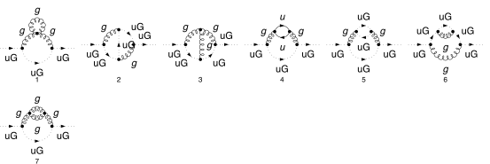
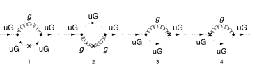
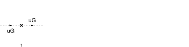

## Load FeynCalc and the necessary add-ons or other packages

This example uses a custom QCD model created with FeynRules.

```mathematica
description = "Renormalization, QCD, MSbar, 2-loop";
If[ $FrontEnd === Null, 
  	$FeynCalcStartupMessages = False; 
  	Print[description]; 
  ];
If[ $Notebooks === False, 
  	$FeynCalcStartupMessages = False 
  ];
LaunchKernels[8];
$LoadAddOns = {"FeynArts", "FeynHelpers"};
<< FeynCalc`
$FAVerbose = 0;
$ParallelizeFeynCalc = True; 
 
FCCheckVersion[10, 2, 0];
If[ToExpression[StringSplit[$FeynHelpersVersion, "."]][[1]] < 2, 
 	Print["You need at least FeynHelpers 2.0 to run this example."]; 
 	Abort[]; 
 ]
```

$$\text{FeynCalc }\;\text{10.2.0 (dev version, 2026-05-18 14:09:14 +02:00, 9ab9d838). For help, use the }\underline{\text{online} \;\text{documentation},}\;\text{ visit the }\underline{\text{forum}}\;\text{ and have a look at the supplied }\underline{\text{examples}.}\;\text{ The PDF-version of the manual can be downloaded }\underline{\text{here}.}$$

$$\text{If you use FeynCalc in your research, please evaluate FeynCalcHowToCite[] to learn how to cite this software.}$$

$$\text{Please keep in mind that the proper academic attribution of our work is crucial to ensure the future development of this package!}$$

$$\text{FeynArts }\;\text{3.12 (27 Mar 2025) patched for use with FeynCalc, for documentation see the }\underline{\text{manual}}\;\text{ or visit }\underline{\text{www}.\text{feynarts}.\text{de}.}$$

$$\text{If you use FeynArts in your research, please cite}$$

$$\text{ $\bullet $ T. Hahn, Comput. Phys. Commun., 140, 418-431, 2001, arXiv:hep-ph/0012260}$$

$$\text{FeynHelpers }\;\text{2.0.0 (2026-02-05 17:03:01 +02:00, 5db84fbb). For help, use the }\underline{\text{online} \;\text{documentation},}\;\text{ visit the }\underline{\text{forum}}\;\text{ and have a look at the supplied }\underline{\text{examples}.}\;\text{ The PDF-version of the manual can be downloaded }\underline{\text{here}.}$$

$$\text{ If you use FeynHelpers in your research, please evaluate FeynHelpersHowToCite[] to learn how to cite this work.}$$

## Configure some options

```mathematica
modelDir = FileNameJoin[{$UserBaseDirectory, "Applications", "FeynCalc", "Examples", "Models", "QCD"}]
```

$$\text{/home/vs/.Wolfram/Applications/FeynCalc/Examples/Models/QCD}$$

```mathematica
FAPatch[PatchModelsOnly -> True, FAModelsDirectory -> modelDir];

(*Successfully patched FeynArts.*)
```

```mathematica
renConstants = Zm | Zpsi | ZA | ZAmxt | Zu | Zumxt | Zg | Zxi
```

$$\text{Zm}|\text{Zpsi}|\text{ZA}|\text{ZAmxt}|\text{Zu}|\text{Zumxt}|\text{Zg}|\text{Zxi}$$

## Generate Feynman diagrams

Nicer typesetting

```mathematica
FCAttachTypesettingRule[mu, "\[Mu]"];
FCAttachTypesettingRule[nu, "\[Nu]"];
FCAttachTypesettingRule[rho, "\[Rho]"];
FCAttachTypesettingRule[si, "\[Sigma]"];
```

```mathematica
diagGhostSE = InsertFields[CreateTopologies[2, 1 -> 1, 
     ExcludeTopologies -> {Tadpoles, WFCorrections, WFCorrectionCTs}], {U[5]} -> {U[5]}, 
    InsertionLevel -> {Particles}, Model -> FileNameJoin[{modelDir, "QCD"}], 
    GenericModel -> FileNameJoin[{modelDir, "QCD"}], ExcludeParticles -> {F[3 | 4, {2 | 3}], F[4, {1}]}];
```

```mathematica
diagGhostSECT = InsertFields[CreateCTTopologies[2, 1 -> 1, 
     ExcludeTopologies -> {Tadpoles, WFCorrections, WFCorrectionCTs}], {U[5]} -> {U[5]}, 
    InsertionLevel -> {Particles}, Model -> FileNameJoin[{modelDir, "QCD"}], 
    GenericModel -> FileNameJoin[{modelDir, "QCD"}], ExcludeParticles -> {F[3 | 4, {2 | 3}], F[4, {1}]}];
```

```mathematica
diagGhostTreeSECT = InsertFields[CreateCTTopologies[1, 1 -> 1, 
     ExcludeTopologies -> {Tadpoles, WFCorrections, WFCorrectionCTs}], {U[5]} -> {U[5]}, 
    InsertionLevel -> {Particles}, Model -> FileNameJoin[{modelDir, "QCD"}], 
    GenericModel -> FileNameJoin[{modelDir, "QCD"}], ExcludeParticles -> {F[3 | 4, {2 | 3}], F[4, {1}]}];
```

Self-energy and vertex diagrams

```mathematica
Paint[diagGhostSE, ColumnsXRows -> {6, 2}, SheetHeader -> None, 
   Numbering -> Simple, ImageSize -> 128 {6, 2}];
```



1-loop counter-term diagrams

```mathematica
Paint[diagGhostSECT, ColumnsXRows -> {4, 1}, SheetHeader -> None, 
   Numbering -> Simple, ImageSize -> 128 {4, 1}];
```



Tree-level counter-term diagrams

```mathematica
Paint[diagGhostTreeSECT, ColumnsXRows -> {4, 1}, SheetHeader -> None, 
   Numbering -> Simple, ImageSize -> 128 {4, 1}];
```



## Master integrals

The only required masters are 1- and 2-loop tadpoles

```mathematica
tadpoleMaster = Get[FileNameJoin[{$FeynCalcDirectory, "Examples", "MasterIntegrals","Tadpoles", "tad1LxFx1x1xxEp999x.m"}]];
```

```mathematica
tadpoleMaster1 = tadpoleMaster /. m1 -> mxt /. tad1L -> "tad1Lv1";
```

```mathematica
tadpoleMaster2 = Get[FileNameJoin[{$FeynCalcDirectory, "Examples", "MasterIntegrals","Tadpoles", 
        "tad2LxFx111x111xxEp1x.m"}]] /. m1 -> mxt /. tad2LxFx111x111xxEp1x -> "tad2Lv2";
```

## Obtain the amplitudes

```mathematica
{ghostSE$RawAmp, ghostSECT$RawAmp, diagGhostTreeSECT$RawAmp} = 
   FCFAConvert[CreateFeynAmp[#, Truncated -> True, 
      	GaugeRules -> {}, PreFactor -> 1], 
     	IncomingMomenta -> {p}, OutgoingMomenta -> {p}, 
     	LorentzIndexNames -> {mu, nu}, DropSumOver -> True, 
     	LoopMomenta -> {k1, k2}, UndoChiralSplittings -> True, 
     	ChangeDimension -> D, SMP -> True, 
     	FinalSubstitutions -> {SMP["m_u"] -> 0, SMP["g_s"] -> 4 Pi Sqrt[as4]}] & /@ {
    	diagGhostSE, diagGhostSECT, diagGhostTreeSECT};
```

## Calculate the amplitudes

### Ghost self-energy at 2 loops

The 2-loop ghost self-energy has superficial degree of divergence equal to 2

```mathematica
FCClearScalarProducts[];
divDegree = 2;
ghostSE$RawAmp2 = Join[ghostSE$RawAmp[[1 ;; 3]], Nf ghostSE$RawAmp[[4 ;; 4]], ghostSE$RawAmp[[5 ;; 7]]];
aux1 = FCLoopGetFeynAmpDenominators[ghostSE$RawAmp2, 
    {k1, k2}, denHead, Momentum -> {p}, "Massless" -> True];
aux2 = FCLoopAddAuxiliaryMass[aux1[[2]], {k1, k2}, -mxt^2, 0, Head -> denHead]
```

$$\left\{\text{denHead}\left(\frac{1}{(\text{k1}^2+i \eta )}\right)\to \frac{1}{(\text{k1}^2-\text{mxt}^2+i \eta )},\text{denHead}\left(\frac{1}{(\text{k2}^2+i \eta )}\right)\to \frac{1}{(\text{k2}^2-\text{mxt}^2+i \eta )},\text{denHead}\left(\frac{1}{((\text{k1}+\text{k2})^2+i \eta )}\right)\to \frac{1}{((\text{k1}+\text{k2})^2-\text{mxt}^2+i \eta )},\text{denHead}\left(\frac{1}{((\text{k1}-p)^2+i \eta )}\right)\to \frac{1}{((\text{k1}-p)^2-\text{mxt}^2+i \eta )},\text{denHead}\left(\frac{1}{((\text{k1}-\text{k2}-p)^2+i \eta )}\right)\to \frac{1}{((\text{k1}-\text{k2}-p)^2-\text{mxt}^2+i \eta )},\text{denHead}\left(\frac{1}{((\text{k2}-p)^2+i \eta )}\right)\to \frac{1}{((\text{k2}-p)^2-\text{mxt}^2+i \eta )},\text{denHead}\left(\frac{1}{((\text{k1}+p)^2+i \eta )}\right)\to \frac{1}{((\text{k1}+p)^2-\text{mxt}^2+i \eta )},\text{denHead}\left(\frac{1}{((-\text{k1}+\text{k2}+p)^2+i \eta )}\right)\to \frac{1}{((-\text{k1}+\text{k2}+p)^2-\text{mxt}^2+i \eta )}\right\}$$

```mathematica
AbsoluteTiming[ghostSE$PreAmp1 = Contract[(aux1[[1]] /. aux2), FCParallelize -> True];]
```

$$\{4.88677,\text{Null}\}$$

```mathematica
AbsoluteTiming[ghostSE$Amp = ghostSE$PreAmp1 // 
      SUNSimplify[#, FCI -> True, FCParallelize -> True] & // DiracSimplify[#, FCI -> True, FCParallelize -> True] &;]
```

$$\{3.84945,\text{Null}\}$$

```mathematica
isoSymbols = FCMakeSymbols[KK, Range[1, $KernelCount], List]
```

$$\{\text{KK1},\text{KK2},\text{KK3},\text{KK4},\text{KK5},\text{KK6},\text{KK7},\text{KK8}\}$$

```mathematica
AbsoluteTiming[ghostSE$Amp1 = Collect2[ghostSE$Amp, p, IsolateNames -> isoSymbols, FCParallelize -> True];]
```

$$\{3.4686,\text{Null}\}$$

```mathematica
AbsoluteTiming[ghostSE$Amp2 = FourSeries[ghostSE$Amp1, {p, 0, divDegree}, FCParallelize -> True];]
```

$$\{12.9578,\text{Null}\}$$

```mathematica
AbsoluteTiming[ghostSE$Amp3 = Collect2[FRH2[ghostSE$Amp2, isoSymbols], FeynAmpDenominator, FCParallelize -> True];]
```

$$\{0.729875,\text{Null}\}$$

The rest of the calculation follows the standard multiloop template

```mathematica
FCClearScalarProducts[]
SPD[p] = pp;
```

```mathematica
AbsoluteTiming[{ghostSE$Amp4, ghostSE$Topos} = FCLoopFindTopologies[ghostSE$Amp3, {k1, k2}, FCI -> True, FCParallelize -> True, 
     FCLoopBasisOverdeterminedQ -> True, FinalSubstitutions -> {Hold[SPD][p] -> pp}];]
```

$$\text{FCLoopFindTopologies: Number of the initial candidate topologies: }3$$

$$\text{FCLoopFindTopologies: Number of the identified unique topologies: }2$$

$$\text{FCLoopFindTopologies: Number of the preferred topologies among the unique topologies: }0$$

$$\text{FCLoopFindTopologies: Number of the identified subtopologies: }1$$

$$\text{FCLoopFindTopologyMappings: }\;\text{Final number of found topologies: }2$$

$$\{1.69034,\text{Null}\}$$

```mathematica
AbsoluteTiming[ghostSE$Amp5 = FCLoopTensorReduce[ghostSE$Amp4, ghostSE$Topos, FCParallelize -> True];]
```

$$\{2.76847,\text{Null}\}$$

```mathematica
AbsoluteTiming[ghostSE$Amp6 = DiracSimplify[ghostSE$Amp5, FCParallelize -> True];]
```

$$\{0.061171,\text{Null}\}$$

```mathematica
AbsoluteTiming[{ghostSE$Amp7, ghostSE$Topos2} = FCLoopRewriteOverdeterminedTopologies[ghostSE$Amp6, ghostSE$Topos, FCParallelize -> True];]
```

$$\text{FCLoopRewriteIncompleteTopologies: }\;\text{No overdetermined topologies detected.}$$

$$\{0.04962,\text{Null}\}$$

```mathematica
AbsoluteTiming[{ghostSE$Amp8, ghostSE$Topos3} = FCLoopRewriteIncompleteTopologies[ghostSE$Amp7, ghostSE$Topos2, FCParallelize -> True];]
```

$$\text{FCLoopRewriteIncompleteTopologies: }\;\text{No incomplete topologies detected.}$$

$$\{0.048266,\text{Null}\}$$

```mathematica
AbsoluteTiming[ghostSE$SubTopos = FCLoopFindSubtopologies[ghostSE$Topos3, Flatten -> True, Remove -> True, FCParallelize -> True];]
```

$$\{0.073612,\text{Null}\}$$

```mathematica
{ghostSE$TopoMappings, 
    ghostSE$FinalTopos} = FCLoopFindTopologyMappings[ghostSE$Topos3, PreferredTopologies -> ghostSE$SubTopos, FCParallelize -> True];
```

$$\text{FCLoopFindTopologyMappings: }\;\text{Found }1\text{ mapping relations }$$

$$\text{FCLoopFindTopologyMappings: }\;\text{Final number of independent topologies: }1$$

```mathematica
AbsoluteTiming[ghostSE$AmpGLI = FCLoopApplyTopologyMappings[ghostSE$Amp8, {ghostSE$TopoMappings, 
      ghostSE$FinalTopos}, FCParallelize -> True];]
```

$$\{0.965351,\text{Null}\}$$

```mathematica
ghostSE$GLIs = Cases2[ghostSE$AmpGLI, GLI];
```

```mathematica
ghostSE$dir = FileNameJoin[{$TemporaryDirectory, "Reduction-ghostSE-2L-massless"}];
Quiet[CreateDirectory[ghostSE$dir]];
```

```mathematica
KiraCreateJobFile[ghostSE$FinalTopos, ghostSE$GLIs, ghostSE$dir]
```

$$\{\text{/tmp/Reduction-ghostSE-2L-massless/fctopology1/job.yaml}\}$$

```mathematica
KiraCreateIntegralFile[ghostSE$GLIs, ghostSE$FinalTopos, ghostSE$dir]
KiraCreateConfigFiles[ghostSE$FinalTopos, ghostSE$GLIs, ghostSE$dir, 
  KiraMassDimensions -> {pp -> 2, mxt -> 1}]
```

$$\text{KiraCreateIntegralFile: Number of loop integrals: }111$$

$$\{\text{/tmp/Reduction-ghostSE-2L-massless/fctopology1/KiraLoopIntegrals}\}$$

$$\left(
\begin{array}{cc}
 \;\text{/tmp/Reduction-ghostSE-2L-massless/fctopology1/config/integralfamilies.yaml} & \;\text{/tmp/Reduction-ghostSE-2L-massless/fctopology1/config/kinematics.yaml} \\
\end{array}
\right)$$

```mathematica
KiraRunReduction[ghostSE$dir, ghostSE$FinalTopos, 
  KiraBinaryPath -> FileNameJoin[{$HomeDirectory, ".local", "bin", "kira"}], 
  KiraFermatPath -> FileNameJoin[{$HomeDirectory, "bin", "ferl64", "fer64"}]]
```

$$\{\text{True}\}$$

```mathematica
ghostSE$ReductionTables = KiraImportResults[ghostSE$FinalTopos, ghostSE$dir] // Flatten;
```

```mathematica
AbsoluteTiming[ghostSE$resPreFinal1 = (ghostSE$AmpGLI /. Dispatch[ghostSE$ReductionTables]);]
```

$$\{0.01556,\text{Null}\}$$

```mathematica
AbsoluteTiming[ghostSE$resPreFinal2 = Map[Collect2[#, GLI, DiracGamma, FCParallelize -> True] &, ghostSE$resPreFinal1];]
```

$$\{0.563049,\text{Null}\}$$

```mathematica
ghostSE$masters = Cases2[ghostSE$resPreFinal1, GLI];
```

```mathematica
ghostSE$MIMappings = FCLoopFindIntegralMappings[ghostSE$masters, Join[tadpoleMaster1[[2]], {tadpoleMaster2[[2]]}, 
    ghostSE$FinalTopos], PreferredIntegrals -> {tadpoleMaster1[[1]][[1]] tadpoleMaster1[[1]][[1]], tadpoleMaster2[[1]][[1]]}]
```

$$\left(
\begin{array}{cc}
 G^{\text{fctopology1}}(1,1,0)\to G^{\text{tad1LxFx1x1xxEp999x}}(1)^2 & G^{\text{fctopology1}}(1,1,1)\to G^{\text{tad2Lv2}}(1,1,1) \\
 G^{\text{tad2Lv2}}(1,1,1) & G^{\text{tad1LxFx1x1xxEp999x}}(1)^2 \\
\end{array}
\right)$$

```mathematica
isoSymbols1 = FCMakeSymbols[LL, Range[1, $KernelCount], List];
isoSymbols2 = FCMakeSymbols[LM, Range[1, $KernelCount], List];
```

```mathematica
AbsoluteTiming[ghostSE$resPreFinal2 = Collect2[ghostSE$resPreFinal1, D, GLI, IsolateNames -> isoSymbols1,FCParallelize -> True] // FCReplaceD[#, D -> 4 - 2 ep] & // ReplaceAll[#, ghostSE$MIMappings[[1]]] & // 
      ReplaceAll[#, {tadpoleMaster1[[1]], tadpoleMaster2[[1]]}] & // Collect2[#, ep, IsolateNames -> isoSymbols2, FCParallelize -> True] &;]
```

$$\{3.42235,\text{Null}\}$$

```mathematica
AbsoluteTiming[ghostSE$resPreFinal3 = ghostSE$resPreFinal2 // Series[#, {ep, 0, -1}] & // Normal // Series[(I*(4*Pi)^(-2 + ep))^2 #, {ep, 0, -1}] & // Normal;]
```

$$\{1.04076,\text{Null}\}$$

```mathematica
AbsoluteTiming[ghostSE$resPreFinal4 = Collect2[FRH2[FRH2[ghostSE$resPreFinal3, isoSymbols2], isoSymbols1],DiracGamma, pp, mxt, ep, FCParallelize -> True];]
```

$$\{0.175886,\text{Null}\}$$

```mathematica
isoSymbols3 = FCMakeSymbols[LH, Range[1, $KernelCount], List];
```

```mathematica
AbsoluteTiming[ghostSE$resPreFinal5 = Series[Total[Collect2[ghostSE$resPreFinal4, mxt, IsolateNames -> isoSymbols3,FCParallelize -> True]], {mxt, 0, 2}] // Normal;]
```

$$\{1.3866,\text{Null}\}$$

```mathematica
AbsoluteTiming[ghostSE$resPreFinal6 = Collect2[FRH2[ghostSE$resPreFinal5, isoSymbols3] // ReplaceAll[#, Log[m_Symbol^2] :> 2 Log[m]] &, DiracGamma, pp, mxt, ep, FCParallelize -> True];]
```

$$\{0.097318,\text{Null}\}$$

```mathematica
ghostSE$resFinal = Collect2[Collect2[ghostSE$resPreFinal6, ep, CA, CF, mq, Nf, SUNFDelta, as4, DiracGamma, GaugeXi, Factoring -> FullSimplify], ep, mq, mxt]
```

$$\frac{i \;\text{as4}^2 \;\text{pp} C_A \delta ^{\text{Glu1}\;\text{Glu2}} \left(3 C_A \xi _{\text{G}}^2-35 C_A+8 N_f\right)}{32 \;\text{ep}^2}-\frac{i \;\text{as4}^2 \;\text{pp} C_A \log (\text{mxt}) \delta ^{\text{Glu1}\;\text{Glu2}} \left(3 C_A \xi _{\text{G}}^2-35 C_A+8 N_f\right)}{8 \;\text{ep}}-\frac{i \;\text{as4}^2 \;\text{pp} C_A \delta ^{\text{Glu1}\;\text{Glu2}} \left(27 C_A \xi _{\text{G}}^3+95 C_A \xi _{\text{G}}^2+199 C_A \xi _{\text{G}}-180 \log (4 \pi ) C_A \xi _{\text{G}}^2-541 C_A+2100 \log (4 \pi ) C_A+72 N_f \xi _{\text{G}}^2+16 N_f \xi _{\text{G}}-608 N_f-480 \log (4 \pi ) N_f\right)}{960 \;\text{ep}}$$

### Gluon self-energy 1-loop CT

```mathematica
FCClearScalarProducts[];
divDegree = 2;
aux1 = FCLoopGetFeynAmpDenominators[ghostSECT$RawAmp, {k1}, denHead, Momentum -> {p}, "Massless" -> True];
aux2 = FCLoopAddAuxiliaryMass[aux1[[2]], {k1}, -mxt^2, 0, Head -> denHead]
```

$$\left\{\text{denHead}\left(\frac{1}{(\text{k1}^2+i \eta )}\right)\to \frac{1}{(\text{k1}^2-\text{mxt}^2+i \eta )},\text{denHead}\left(\frac{1}{((\text{k1}-p)^2+i \eta )}\right)\to \frac{1}{((\text{k1}-p)^2-\text{mxt}^2+i \eta )},\text{denHead}\left(\frac{1}{((\text{k1}+p)^2+i \eta )}\right)\to \frac{1}{((\text{k1}+p)^2-\text{mxt}^2+i \eta )}\right\}$$

```mathematica
ghostSECT$StrName = StringReplace[ToString[Hold[ghostSECT$Amp]], {"Hold[" -> "", "]" -> ""}]
```

$$\text{ghostSECT\$Amp}$$

```mathematica
AbsoluteTiming[ghostSECT$Amp = (aux1[[1]] /. aux2) // Contract[#, FCParallelize -> True] & // 
      SUNSimplify[#, FCParallelize -> True] & // DiracSimplify[#, FCParallelize -> True] &;]
```

$$\{0.260102,\text{Null}\}$$

```mathematica
AbsoluteTiming[ghostSECT$Amp1 = Collect2[ghostSECT$Amp, p, IsolateNames -> KK];]
AbsoluteTiming[ghostSECT$Amp2 = FourSeries[ghostSECT$Amp1, {p, 0, divDegree}, FCParallelize -> True];]
AbsoluteTiming[ghostSECT$Amp3 = Collect2[FRH[ghostSECT$Amp2], FeynAmpDenominator, FCParallelize -> True];]
```

$$\{0.097435,\text{Null}\}$$

$$\{0.137934,\text{Null}\}$$

$$\{0.070545,\text{Null}\}$$

The rest of the calculation follows the standard multiloop template

```mathematica
FCClearScalarProducts[];
SPD[p] = pp;
```

```mathematica
{ghostSECT$Amp4, ghostSECT$Topos} = FCLoopFindTopologies[ghostSECT$Amp3, {k1}, FCParallelize -> True, 
    FCLoopBasisOverdeterminedQ -> True, FinalSubstitutions -> {Hold[SPD][p] -> pp}, Names -> quarkSEtopo];
```

$$\text{FCLoopFindTopologies: Number of the initial candidate topologies: }1$$

$$\text{FCLoopFindTopologies: Number of the identified unique topologies: }1$$

$$\text{FCLoopFindTopologies: Number of the preferred topologies among the unique topologies: }0$$

$$\text{FCLoopFindTopologies: Number of the identified subtopologies: }0$$

$$\text{FCLoopFindTopologyMappings: }\;\text{Final number of found topologies: }1$$

```mathematica
AbsoluteTiming[ghostSECT$Amp5 = FCLoopTensorReduce[ghostSECT$Amp4, ghostSECT$Topos, FCParallelize -> True];]
```

$$\{0.364644,\text{Null}\}$$

```mathematica
AbsoluteTiming[ghostSECT$Amp6 = DiracSimplify[ghostSECT$Amp5, FCParallelize -> True];]
```

$$\{0.020413,\text{Null}\}$$

```mathematica
{ghostSECT$Amp7, ghostSECT$Topos2} = FCLoopRewriteOverdeterminedTopologies[ghostSECT$Amp6, ghostSECT$Topos, FCParallelize -> True];
```

$$\text{FCLoopRewriteIncompleteTopologies: }\;\text{No overdetermined topologies detected.}$$

```mathematica
{ghostSECT$Amp8, ghostSECT$Topos3} = FCLoopRewriteIncompleteTopologies[ghostSECT$Amp7, ghostSECT$Topos2, FCParallelize -> True];
```

$$\text{FCLoopRewriteIncompleteTopologies: }\;\text{No incomplete topologies detected.}$$

```mathematica
AbsoluteTiming[ghostSECT$SubTopos = FCLoopFindSubtopologies[ghostSECT$Topos2, Flatten -> True, Remove -> True, FCParallelize -> True];]
```

$$\{0.033672,\text{Null}\}$$

```mathematica
AbsoluteTiming[{ghostSECT$TopoMappings, ghostSECT$FinalTopos} = FCLoopFindTopologyMappings[ghostSECT$Topos2, PreferredTopologies -> ghostSECT$SubTopos, FCParallelize -> True];]
```

$$\text{FCLoopFindTopologyMappings: }\;\text{Found }0\text{ mapping relations }$$

$$\text{FCLoopFindTopologyMappings: }\;\text{Final number of independent topologies: }1$$

$$\{0.04946,\text{Null}\}$$

```mathematica
AbsoluteTiming[ghostSECT$AmpGLI = FCLoopApplyTopologyMappings[ghostSECT$Amp8, {ghostSECT$TopoMappings, ghostSECT$FinalTopos}, FCParallelize -> True];]
```

$$\{0.118534,\text{Null}\}$$

```mathematica
ghostSECT$GLIs = Cases2[ghostSECT$AmpGLI, GLI];
```

```mathematica
ghostSECT$dir = FileNameJoin[{$TemporaryDirectory, "Reduction-" <> ghostSECT$StrName <> "-1L-massive"}];
Quiet[CreateDirectory[ghostSECT$dir]];
```

```mathematica
KiraCreateJobFile[ghostSECT$FinalTopos, ghostSECT$GLIs, ghostSECT$dir]
```

$$\{\text{/tmp/Reduction-ghostSECT\$Amp-1L-massive/quarkSEtopo1/job.yaml}\}$$

```mathematica
KiraCreateIntegralFile[ghostSECT$GLIs, ghostSECT$FinalTopos, ghostSECT$dir]
KiraCreateConfigFiles[ghostSECT$FinalTopos, ghostSECT$GLIs, ghostSECT$dir, 
  KiraMassDimensions -> {pp -> 2, mxt -> 1}]
```

$$\text{KiraCreateIntegralFile: Number of loop integrals: }5$$

$$\{\text{/tmp/Reduction-ghostSECT\$Amp-1L-massive/quarkSEtopo1/KiraLoopIntegrals}\}$$

$$\left(
\begin{array}{cc}
 \;\text{/tmp/Reduction-ghostSECT\$Amp-1L-massive/quarkSEtopo1/config/integralfamilies.yaml} & \;\text{/tmp/Reduction-ghostSECT\$Amp-1L-massive/quarkSEtopo1/config/kinematics.yaml} \\
\end{array}
\right)$$

```mathematica
KiraRunReduction[ghostSECT$dir, ghostSECT$FinalTopos, 
  KiraBinaryPath -> FileNameJoin[{$HomeDirectory, ".local", "bin", "kira"}], 
  KiraFermatPath -> FileNameJoin[{$HomeDirectory, "bin", "ferl64", "fer64"}]]
```

$$\{\text{True}\}$$

```mathematica
ghostSECT$ReductionTables = KiraImportResults[ghostSECT$FinalTopos, ghostSECT$dir] // Flatten;
```

```mathematica
ghostSECT$resPreFinal1 = Collect2[Total[ghostSECT$AmpGLI /. Dispatch[ghostSECT$ReductionTables]], GLI, 
    GaugeXi, D, DiracGamma, FCParallelize -> True];
```

```mathematica
ghostSECT$masters = Cases2[ghostSECT$resPreFinal1, GLI];
```

```mathematica
ghostSECT$MIMappings = FCLoopFindIntegralMappings[ghostSECT$masters, Join[tadpoleMaster1[[2]], 
    ghostSECT$FinalTopos], PreferredIntegrals -> {tadpoleMaster1[[1]][[1]]}]
```

$$\left(
\begin{array}{c}
 G^{\text{quarkSEtopo1}}(1)\to G^{\text{tad1LxFx1x1xxEp999x}}(1) \\
 G^{\text{tad1LxFx1x1xxEp999x}}(1) \\
\end{array}
\right)$$

Our master integrals are calculated using the standard multiloop normalization. To convert it back to the textbook normalization
we need to multiply by I*(4 Pi)^(ep-2)

At this point we need to insert the 1-loop renormalization constants

```mathematica
knownResults1L = {
    rc[delZA, 1] -> (13*CA - 4*Nf - 3*CA*GaugeXi["G"])/(6*ep), 
    rc[delZAmxt, 1] -> -1/8*(CA + 8*Nf + 3*CA*GaugeXi["G"])/ep, 
    rc[delZxi, 1] -> (13*CA - 4*Nf - 3*CA*GaugeXi["G"])/(6*ep), 
    rc[delZpsi, 1] -> -((CF*GaugeXi["G"])/ep), 
    rc[delZumxt, 1] -> 0, rc[delZu, 1] -> (CA*(3 - GaugeXi["G"]))/(4*ep), 
    rc[delZg, 1] -> -1/6*(11*CA - 2*Nf)/ep};
```

```mathematica
AbsoluteTiming[ghostSECT$resPreFinal2 = Collect2[ghostSECT$resPreFinal1, D, GLI, IsolateNames -> KK] // FCReplaceD[#, D -> 4 - 2 ep] & // 
            ReplaceAll[#, ghostSECT$MIMappings[[1]]] & // ReplaceAll[#, {tadpoleMaster1[[1]], tadpoleMaster2[[1]]}] & // 
          Collect2[#, ep, IsolateNames -> KK2] & // Series[(I*(4*Pi)^(-2 + ep)) #, {ep, 0, 1}] & // Normal // FCLoopAddMissingHigherOrdersWarning[#, ep, epHelp] & // FRH // 
     ReplaceAll[#, {Log[mxt^2] -> 2 Log[mxt]}] &;]
```

$$\{2.72798,\text{Null}\}$$

```mathematica
AbsoluteTiming[ghostSECT$resPreFinal2 = Collect2[ghostSECT$resPreFinal1, Join[{as4}, List @@ renConstants],IsolateNames -> KK] // ReplaceAll[#, Zxi -> ZA] & // ReplaceAll[#, {
         	(h : renConstants) :> 1 + (as4 rc[ToExpression["del" <> ToString[h]], 1] + as4^2 rc[ToExpression["del" <> ToString[h]], 2])}] & // Series[#, {as4, 0, 2}] & // Normal;]
```

$$\{0.1011,\text{Null}\}$$

```mathematica
AbsoluteTiming[ghostSECT$resPreFinal3 = Collect2[ghostSECT$resPreFinal2 // FRH, {rc, D, GLI}, IsolateNames -> KK] // FCReplaceD[#, {D -> 4 - 2 ep}] & // ReplaceRepeated[#, knownResults1L] & // 
        ReplaceAll[#, ghostSECT$MIMappings[[1]]] & // ReplaceAll[#, {tadpoleMaster1[[1]], tadpoleMaster2[[1]]}] & // If[! FreeQ[#, GLI], Abort[], #] & // Collect2[#, ep, IsolateNames -> KK] &;]
```

$$\{0.06031,\text{Null}\}$$

```mathematica
ghostSECT$resFinal = ghostSECT$resPreFinal3 // Series[(I*(4*Pi)^(-2 + ep)) #, {ep, 0, -1}] & // Normal // FRH // 
        Collect2[#, mxt, IsolateNames -> KK] & // Series[#, {mxt, 0, 2}] & // Normal // FRH // ReplaceAll[#, Log[m_^2] :> 2 Log[m]] & // Collect2[#, ep, mq, mxt] &
```

$$-\frac{i \;\text{as4}^2 \;\text{pp} C_A \delta ^{\text{Glu1}\;\text{Glu2}} \left(3 C_A \xi _{\text{G}}^2-35 C_A+8 N_f\right)}{16 \;\text{ep}^2}+\frac{i \;\text{as4}^2 \;\text{pp} C_A \log (\text{mxt}) \delta ^{\text{Glu1}\;\text{Glu2}} \left(3 C_A \xi _{\text{G}}^2-35 C_A+8 N_f\right)}{8 \;\text{ep}}+\frac{i \;\text{as4}^2 \;\text{pp} C_A \delta ^{\text{Glu1}\;\text{Glu2}} \left(27 C_A \xi _{\text{G}}^3+95 C_A \xi _{\text{G}}^2+169 C_A \xi _{\text{G}}-180 \log (4 \pi ) C_A \xi _{\text{G}}^2-1491 C_A+2100 \log (4 \pi ) C_A+72 N_f \xi _{\text{G}}^2+16 N_f \xi _{\text{G}}-408 N_f-480 \log (4 \pi ) N_f\right)}{960 \;\text{ep}}$$

### Determination of renormalization constants

```mathematica
diagGhostTreeSECT$Amp = (Total[diagGhostTreeSECT$RawAmp]) // ReplaceAll[#, Zxi -> ZA] & // ReplaceRepeated[#, {
        	(h : renConstants) :> 1 + (as4 rc[ToExpression["del" <> ToString[h]], 1] + as4^2 rc[ToExpression["del" <> ToString[h]], 2])}] & // 
    	Series[#, {as4, 0, 2}] & // Normal // ReplaceRepeated[#, knownResults1L] &
```

$$\frac{1}{2} i \;\text{as4}^2 \delta ^{\text{Glu1}\;\text{Glu2}} \left(2 \;\text{pp} \;\text{rc}(\text{delZu},2)+2 \;\text{mxt}^2 \;\text{rc}(\text{delZumxt},2)\right)+\frac{i \;\text{as4} \;\text{pp} C_A \left(3-\xi _{\text{G}}\right) \delta ^{\text{Glu1}\;\text{Glu2}}}{4 \;\text{ep}}$$

```mathematica
ghostSE$RenConstants2L = Collect2[Coefficient[SUNSimplify[ ghostSE$resFinal + ghostSECT$resFinal + diagGhostTreeSECT$Amp, SUNNToCACF -> False], as4, 2], 
     as4, mxt, DiracGamma, Factoring -> Simplify] // FCMatchSolve[#, {ep, CF, DiracGamma, mq, mxt, SUNDelta, SUNTF, SUNFDelta, CA, GaugeXi, as4, Pair, pp, Nf, SUNN}] & // Collect2[#, ep] &
```

$$\text{FCMatchSolve: Following coefficients trivially vanish: }\{\text{rc}(\text{delZumxt},2)\to 0\}$$

$$\text{FCMatchSolve: Solving for: }\{\text{rc}(\text{delZu},2)\}$$

$$\text{FCMatchSolve: A solution exists.}$$

$$\left\{\text{rc}(\text{delZumxt},2)\to 0,\text{rc}(\text{delZu},2)\to \frac{N \left(8 N_f+3 N \xi _{\text{G}}^2-35 N\right)}{32 \;\text{ep}^2}-\frac{N \left(20 N_f-3 N \xi _{\text{G}}-95 N\right)}{96 \;\text{ep}}\right\}$$

## Check the final results

Our final QCD 2-loop wave-function renormalization constants

```mathematica
finalResults = Thread[Rule[List @@ renConstants, 
      (List @@ renConstants /. (h : renConstants) :> 1 + as4 rc[ToExpression["del" <> ToString[h]], 1] + as4^2 rc[ToExpression["del" <> ToString[h]], 2]) // 
       ReplaceAll[#, Join[SUNSimplify[knownResults1L, SUNNToCACF -> False], ghostSE$RenConstants2L]] &]] // SelectNotFree[#, Zu, Zumxt] &;
```

```mathematica
finalResults // TableForm
```

$$\begin{array}{l}
 \;\text{Zu}\to \;\text{as4}^2 \left(\frac{N \left(8 N_f+3 N \xi _{\text{G}}^2-35 N\right)}{32 \;\text{ep}^2}-\frac{N \left(20 N_f-3 N \xi _{\text{G}}-95 N\right)}{96 \;\text{ep}}\right)+\frac{\text{as4} N \left(3-\xi _{\text{G}}\right)}{4 \;\text{ep}}+1 \\
 \;\text{Zumxt}\to 1 \\
\end{array}$$

```mathematica
knownResult = {rc[delZumxt, 2] -> 0, 
    rc[delZu, 2] -> -1/96*(SUNN*(20*Nf - 95*SUNN - 3*SUNN*GaugeXi["G"]))/ep + (SUNN*(8*Nf - 35*SUNN + 3*SUNN*GaugeXi["G"]^2))/(32*ep^2)};
```

```mathematica
FCCompareResults[ghostSE$RenConstants2L, knownResult, 
  Text -> {"\tCompare to Chetyrkin, Four-loop renormalization of QCD: full set of renormalization constants and anomalous dimensions, arXiv:hep-ph/0405193:", 
    "CORRECT.", "WRONG!"}, Interrupt -> {Hold[Quit[1]], Automatic}]
Print["\tCPU Time used: ", Round[N[TimeUsed[], 4], 0.001], " s."];

```mathematica

$$\text{$\backslash $tCompare to Chetyrkin, Four-loop renormalization of QCD: full set of renormalization constants and anomalous dimensions, arXiv:hep-ph/0405193:} \;\text{CORRECT.}$$

$$\text{True}$$

$$\text{$\backslash $tCPU Time used: }52.753\text{ s.}$$