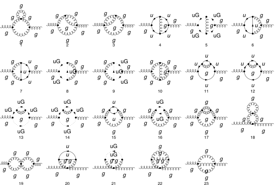
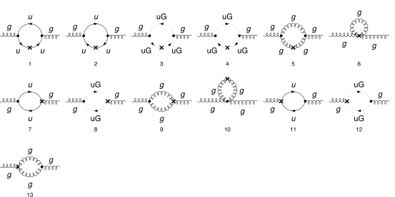

## Load FeynCalc and the necessary add-ons or other packages

This example uses a custom QCD model created with FeynRules.

```mathematica
description = "Renormalization, QCD, MSbar, Gluon self-energy, massless, 2-loop";
If[ $FrontEnd === Null, 
  	$FeynCalcStartupMessages = False; 
  	Print[description]; 
  ];
If[ $Notebooks === False, 
  	$FeynCalcStartupMessages = False 
  ];
LaunchKernels[8];
$LoadAddOns = {"FeynArts", "FeynHelpers"};
<< FeynCalc`
$FAVerbose = 0;
$ParallelizeFeynCalc = True; 
 
FCCheckVersion[10, 2, 0];
If[ToExpression[StringSplit[$FeynHelpersVersion, "."]][[1]] < 2, 
 	Print["You need at least FeynHelpers 2.0 to run this example."]; 
 	Abort[]; 
 ]
```

$$\text{FeynCalc }\;\text{10.2.0 (dev version, 2026-05-18 14:09:14 +02:00, 9ab9d838). For help, use the }\underline{\text{online} \;\text{documentation},}\;\text{ visit the }\underline{\text{forum}}\;\text{ and have a look at the supplied }\underline{\text{examples}.}\;\text{ The PDF-version of the manual can be downloaded }\underline{\text{here}.}$$

$$\text{If you use FeynCalc in your research, please evaluate FeynCalcHowToCite[] to learn how to cite this software.}$$

$$\text{Please keep in mind that the proper academic attribution of our work is crucial to ensure the future development of this package!}$$

$$\text{FeynArts }\;\text{3.12 (27 Mar 2025) patched for use with FeynCalc, for documentation see the }\underline{\text{manual}}\;\text{ or visit }\underline{\text{www}.\text{feynarts}.\text{de}.}$$

$$\text{If you use FeynArts in your research, please cite}$$

$$\text{ $\bullet $ T. Hahn, Comput. Phys. Commun., 140, 418-431, 2001, arXiv:hep-ph/0012260}$$

$$\text{FeynHelpers }\;\text{2.0.0 (2026-02-05 17:03:01 +02:00, 5db84fbb). For help, use the }\underline{\text{online} \;\text{documentation},}\;\text{ visit the }\underline{\text{forum}}\;\text{ and have a look at the supplied }\underline{\text{examples}.}\;\text{ The PDF-version of the manual can be downloaded }\underline{\text{here}.}$$

$$\text{ If you use FeynHelpers in your research, please evaluate FeynHelpersHowToCite[] to learn how to cite this work.}$$

## Configure some options

```mathematica
modelDir = FileNameJoin[{$UserBaseDirectory, "Applications", "FeynCalc", "Examples", "Models", "QCD"}]
```

$$\text{/home/vs/.Wolfram/Applications/FeynCalc/Examples/Models/QCD}$$

```mathematica
FAPatch[PatchModelsOnly -> True, FAModelsDirectory -> modelDir];

(*Successfully patched FeynArts.*)
```

```mathematica
renConstants = Zm | Zpsi | ZA | ZAmxt | Zu | Zumxt | Zg | Zxi
```

$$\text{Zm}|\text{Zpsi}|\text{ZA}|\text{ZAmxt}|\text{Zu}|\text{Zumxt}|\text{Zg}|\text{Zxi}$$

## Generate Feynman diagrams

Nicer typesetting

```mathematica
FCAttachTypesettingRule[mu, "\[Mu]"];
FCAttachTypesettingRule[nu, "\[Nu]"];
FCAttachTypesettingRule[rho, "\[Rho]"];
FCAttachTypesettingRule[si, "\[Sigma]"];
```

```mathematica
diagGluonSE = InsertFields[CreateTopologies[2, 1 -> 1, 
     ExcludeTopologies -> {Tadpoles, WFCorrections, WFCorrectionCTs}], {V[5]} -> {V[5]}, 
    InsertionLevel -> {Particles}, Model -> FileNameJoin[{modelDir, "QCD"}], 
    GenericModel -> FileNameJoin[{modelDir, "QCD"}], ExcludeParticles -> {F[3 | 4, {2 | 3}], F[4, {1}]}];
```

```mathematica
diagGluonSECT = InsertFields[CreateCTTopologies[2, 1 -> 1, 
     ExcludeTopologies -> {Tadpoles, WFCorrections, WFCorrectionCTs}], {V[5]} -> {V[5]}, 
    InsertionLevel -> {Particles}, Model -> FileNameJoin[{modelDir, "QCD"}], 
    GenericModel -> FileNameJoin[{modelDir, "QCD"}], ExcludeParticles -> {F[3 | 4, {2 | 3}], F[4, {1}]}];
```

```mathematica
diagGluonTreeSECT = InsertFields[CreateCTTopologies[1, 1 -> 1, 
     ExcludeTopologies -> {Tadpoles, WFCorrections, WFCorrectionCTs}], {V[5]} -> {V[5]}, 
    InsertionLevel -> {Particles}, Model -> FileNameJoin[{modelDir, "QCD"}], 
    GenericModel -> FileNameJoin[{modelDir, "QCD"}], ExcludeParticles -> {F[3 | 4, {2 | 3}], F[4, {1}]}];
```

Self-energy and vertex diagrams

```mathematica
Paint[diagGluonSE, ColumnsXRows -> {6, 4}, SheetHeader -> None, 
   Numbering -> Simple, ImageSize -> 128 {6, 4}];
```



1-loop counter-term diagrams

```mathematica
Paint[diagGluonSECT, ColumnsXRows -> {6, 3}, SheetHeader -> None, 
   Numbering -> Simple, ImageSize -> 128 {6, 3}];
```



Tree-level counter-term diagrams

```mathematica
Paint[diagGluonTreeSECT, ColumnsXRows -> {4, 1}, SheetHeader -> None, 
   Numbering -> Simple, ImageSize -> 128 {4, 1}];
```


## Master integrals

The only required masters are 1- and 2-loop tadpoles

```mathematica
tadpoleMaster = Get[FileNameJoin[{$FeynCalcDirectory, "Examples", "MasterIntegrals","Tadpoles", "tad1LxFx1x1xxEp999x.m"}]];
```

```mathematica
tadpoleMaster1 = tadpoleMaster /. m1 -> mxt /. tad1L -> "tad1Lv1";
```

```mathematica
tadpoleMaster2 = Get[FileNameJoin[{$FeynCalcDirectory, "Examples", "MasterIntegrals","Tadpoles", 
        "tad2LxFx111x111xxEp1x.m"}]] /. m1 -> mxt /. tad2LxFx111x111xxEp1x -> "tad2Lv2";
```

## Obtain the amplitudes

```mathematica
{gluonSE$RawAmp, gluonSECT$RawAmp, diagGluonTreeSECT$RawAmp} = 
   FCFAConvert[CreateFeynAmp[#, Truncated -> True, 
      	GaugeRules -> {}, PreFactor -> 1], 
     	IncomingMomenta -> {p}, OutgoingMomenta -> {p}, 
     	LorentzIndexNames -> {mu, nu}, DropSumOver -> True, 
     	LoopMomenta -> {k1, k2}, UndoChiralSplittings -> True, 
     	ChangeDimension -> D, SMP -> True, 
     	FinalSubstitutions -> {SMP["m_u"] -> 0, SMP["g_s"] -> 4 Pi Sqrt[as4]}] & /@ {
    	diagGluonSE, diagGluonSECT, diagGluonTreeSECT};
```

## Calculate the amplitudes

### Gluon self-energy at 2 loops

The 2-loop gluon self-energy has superficial degree of divergence equal to 2

```mathematica
FCClearScalarProducts[];
divDegree = 2;
gluonSE$RawAmp2 = Join[gluonSE$RawAmp[[1 ;; 3]], Nf gluonSE$RawAmp[[4 ;; 4]], gluonSE$RawAmp[[5 ;; 5]], Nf gluonSE$RawAmp[[6 ;; 7]], 
    gluonSE$RawAmp[[8 ;; 10]], Nf gluonSE$RawAmp[[11 ;; 12]], gluonSE$RawAmp[[13 ;; 14]], 
    Nf gluonSE$RawAmp[[15 ;; 15]], gluonSE$RawAmp[[16 ;; 19]], Nf gluonSE$RawAmp[[20 ;; 20]], gluonSE$RawAmp[[21 ;; 23]]];
aux1 = FCLoopGetFeynAmpDenominators[gluonSE$RawAmp2, 
    {k1, k2}, denHead, Momentum -> {p}, "Massless" -> True];
aux2 = FCLoopAddAuxiliaryMass[aux1[[2]], {k1, k2}, -mxt^2, 0, Head -> denHead]
```

$$\left\{\text{denHead}\left(\frac{1}{(\text{k1}^2+i \eta )}\right)\to \frac{1}{(\text{k1}^2-\text{mxt}^2+i \eta )},\text{denHead}\left(\frac{1}{(\text{k2}^2+i \eta )}\right)\to \frac{1}{(\text{k2}^2-\text{mxt}^2+i \eta )},\text{denHead}\left(\frac{1}{((\text{k1}+\text{k2})^2+i \eta )}\right)\to \frac{1}{((\text{k1}+\text{k2})^2-\text{mxt}^2+i \eta )},\text{denHead}\left(\frac{1}{((\text{k1}-p)^2+i \eta )}\right)\to \frac{1}{((\text{k1}-p)^2-\text{mxt}^2+i \eta )},\text{denHead}\left(\frac{1}{((\text{k1}-\text{k2}-p)^2+i \eta )}\right)\to \frac{1}{((\text{k1}-\text{k2}-p)^2-\text{mxt}^2+i \eta )},\text{denHead}\left(\frac{1}{((\text{k2}-p)^2+i \eta )}\right)\to \frac{1}{((\text{k2}-p)^2-\text{mxt}^2+i \eta )},\text{denHead}\left(\frac{1}{((\text{k1}+p)^2+i \eta )}\right)\to \frac{1}{((\text{k1}+p)^2-\text{mxt}^2+i \eta )},\text{denHead}\left(\frac{1}{((\text{k2}+p)^2+i \eta )}\right)\to \frac{1}{((\text{k2}+p)^2-\text{mxt}^2+i \eta )},\text{denHead}\left(\frac{1}{((-\text{k1}+\text{k2}+p)^2+i \eta )}\right)\to \frac{1}{((-\text{k1}+\text{k2}+p)^2-\text{mxt}^2+i \eta )},\text{denHead}\left(\frac{1}{((\text{k1}+\text{k2}+p)^2+i \eta )}\right)\to \frac{1}{((\text{k1}+\text{k2}+p)^2-\text{mxt}^2+i \eta )}\right\}$$

```mathematica
AbsoluteTiming[gluonSE$PreAmp1 = Contract[(aux1[[1]] /. aux2), FCParallelize -> True];]
```

$$\{291.689,\text{Null}\}$$

```mathematica
AbsoluteTiming[gluonSE$Amp = gluonSE$PreAmp1 // 
      SUNSimplify[#, FCI -> True, FCParallelize -> True] & // DiracSimplify[#, FCI -> True, FCParallelize -> True] &;]
```

$$\{141.087,\text{Null}\}$$

```mathematica
isoSymbols = FCMakeSymbols[KK, Range[1, $KernelCount], List]
```

$$\{\text{KK1},\text{KK2},\text{KK3},\text{KK4},\text{KK5},\text{KK6},\text{KK7},\text{KK8}\}$$

```mathematica
AbsoluteTiming[gluonSE$Amp1 = Collect2[gluonSE$Amp, p, IsolateNames -> isoSymbols, FCParallelize -> True];]
```

$$\{32.816,\text{Null}\}$$

```mathematica
AbsoluteTiming[gluonSE$Amp2 = FourSeries[gluonSE$Amp1, {p, 0, divDegree}, FCParallelize -> True];]
```

$$\{104.741,\text{Null}\}$$

```mathematica
AbsoluteTiming[gluonSE$Amp3 = Collect2[FRH2[gluonSE$Amp2, isoSymbols], FeynAmpDenominator, FCParallelize -> True];]
```

$$\{6.84925,\text{Null}\}$$

The rest of the calculation follows the standard multiloop template

```mathematica
FCClearScalarProducts[]
SPD[p] = pp;
```

```mathematica
AbsoluteTiming[{gluonSE$Amp4, gluonSE$Topos} = FCLoopFindTopologies[gluonSE$Amp3, {k1, k2}, FCI -> True, FCParallelize -> True, 
     FCLoopBasisOverdeterminedQ -> True, FinalSubstitutions -> {Hold[SPD][p] -> pp}];]
```

$$\text{FCLoopFindTopologies: Number of the initial candidate topologies: }3$$

$$\text{FCLoopFindTopologies: Number of the identified unique topologies: }2$$

$$\text{FCLoopFindTopologies: Number of the preferred topologies among the unique topologies: }0$$

$$\text{FCLoopFindTopologies: Number of the identified subtopologies: }1$$

$$\text{FCLoopFindTopologyMappings: }\;\text{Final number of found topologies: }2$$

$$\{15.8258,\text{Null}\}$$

```mathematica
AbsoluteTiming[gluonSE$Amp5 = FCLoopTensorReduce[gluonSE$Amp4, gluonSE$Topos, FCParallelize -> True];]
```

$$\{95.1376,\text{Null}\}$$

```mathematica
AbsoluteTiming[gluonSE$Amp6 = DiracSimplify[gluonSE$Amp5, FCParallelize -> True];]
```

$$\{0.40667,\text{Null}\}$$

```mathematica
AbsoluteTiming[{gluonSE$Amp7, gluonSE$Topos2} = FCLoopRewriteOverdeterminedTopologies[gluonSE$Amp6, gluonSE$Topos, FCParallelize -> True];]
```

$$\text{FCLoopRewriteIncompleteTopologies: }\;\text{No overdetermined topologies detected.}$$

$$\{0.271974,\text{Null}\}$$

```mathematica
AbsoluteTiming[{gluonSE$Amp8, gluonSE$Topos3} = FCLoopRewriteIncompleteTopologies[gluonSE$Amp7, gluonSE$Topos2, FCParallelize -> True];]
```

$$\text{FCLoopRewriteIncompleteTopologies: }\;\text{No incomplete topologies detected.}$$

$$\{0.254005,\text{Null}\}$$

```mathematica
AbsoluteTiming[gluonSE$SubTopos = FCLoopFindSubtopologies[gluonSE$Topos3, Flatten -> True, Remove -> True, FCParallelize -> True];]
```

$$\{0.084221,\text{Null}\}$$

```mathematica
{gluonSE$TopoMappings, 
    gluonSE$FinalTopos} = FCLoopFindTopologyMappings[gluonSE$Topos3, PreferredTopologies -> gluonSE$SubTopos, FCParallelize -> True];
```

$$\text{FCLoopFindTopologyMappings: }\;\text{Found }1\text{ mapping relations }$$

$$\text{FCLoopFindTopologyMappings: }\;\text{Final number of independent topologies: }1$$

```mathematica
AbsoluteTiming[gluonSE$AmpGLI = FCLoopApplyTopologyMappings[gluonSE$Amp8, {gluonSE$TopoMappings, 
      gluonSE$FinalTopos}, FCParallelize -> True];]
```

$$\{10.9752,\text{Null}\}$$

```mathematica
gluonSE$GLIs = Cases2[gluonSE$AmpGLI, GLI];
```

```mathematica
gluonSE$dir = FileNameJoin[{$TemporaryDirectory, "Reduction-gluonSE-2L-massless"}];
Quiet[CreateDirectory[gluonSE$dir]];
```

```mathematica
KiraCreateJobFile[gluonSE$FinalTopos, gluonSE$GLIs, gluonSE$dir]
```

$$\{\text{/tmp/Reduction-gluonSE-2L-massless/fctopology1/job.yaml}\}$$

```mathematica
KiraCreateIntegralFile[gluonSE$GLIs, gluonSE$FinalTopos, gluonSE$dir]
KiraCreateConfigFiles[gluonSE$FinalTopos, gluonSE$GLIs, gluonSE$dir, 
  KiraMassDimensions -> {pp -> 2, mxt -> 1}]
```

$$\text{KiraCreateIntegralFile: Number of loop integrals: }245$$

$$\{\text{/tmp/Reduction-gluonSE-2L-massless/fctopology1/KiraLoopIntegrals}\}$$

$$\left(
\begin{array}{cc}
 \;\text{/tmp/Reduction-gluonSE-2L-massless/fctopology1/config/integralfamilies.yaml} & \;\text{/tmp/Reduction-gluonSE-2L-massless/fctopology1/config/kinematics.yaml} \\
\end{array}
\right)$$

```mathematica
KiraRunReduction[gluonSE$dir, gluonSE$FinalTopos, 
  KiraBinaryPath -> FileNameJoin[{$HomeDirectory, ".local", "bin", "kira"}], 
  KiraFermatPath -> FileNameJoin[{$HomeDirectory, "bin", "ferl64", "fer64"}]]
```

$$\{\text{True}\}$$

```mathematica
gluonSE$ReductionTables = KiraImportResults[gluonSE$FinalTopos, gluonSE$dir] // Flatten;
```

```mathematica
AbsoluteTiming[gluonSE$resPreFinal1 = (gluonSE$AmpGLI /. Dispatch[gluonSE$ReductionTables]);]
```

$$\{0.308694,\text{Null}\}$$

```mathematica
AbsoluteTiming[gluonSE$resPreFinal2 = Map[Collect2[#, GLI, DiracGamma, FCParallelize -> True] &, gluonSE$resPreFinal1];]
```

$$\{6.46302,\text{Null}\}$$

```mathematica
gluonSE$masters = Cases2[gluonSE$resPreFinal1, GLI];
```

```mathematica
gluonSE$MIMappings = FCLoopFindIntegralMappings[gluonSE$masters, Join[tadpoleMaster1[[2]], {tadpoleMaster2[[2]]}, 
    gluonSE$FinalTopos], PreferredIntegrals -> {tadpoleMaster1[[1]][[1]] tadpoleMaster1[[1]][[1]], tadpoleMaster2[[1]][[1]]}]
```

$$\left(
\begin{array}{cc}
 G^{\text{fctopology1}}(1,1,0)\to G^{\text{tad1LxFx1x1xxEp999x}}(1)^2 & G^{\text{fctopology1}}(1,1,1)\to G^{\text{tad2Lv2}}(1,1,1) \\
 G^{\text{tad2Lv2}}(1,1,1) & G^{\text{tad1LxFx1x1xxEp999x}}(1)^2 \\
\end{array}
\right)$$

```mathematica
isoSymbols1 = FCMakeSymbols[LL, Range[1, $KernelCount], List];
isoSymbols2 = FCMakeSymbols[LM, Range[1, $KernelCount], List];
```

```mathematica
AbsoluteTiming[gluonSE$resPreFinal2 = Collect2[gluonSE$resPreFinal1, D, GLI, IsolateNames -> isoSymbols1,FCParallelize -> True] // FCReplaceD[#, D -> 4 - 2 ep] & // ReplaceAll[#, gluonSE$MIMappings[[1]]] & // 
      ReplaceAll[#, {tadpoleMaster1[[1]], tadpoleMaster2[[1]]}] & // Collect2[#, ep, IsolateNames -> isoSymbols2, FCParallelize -> True] &;]
```

$$\{56.9373,\text{Null}\}$$

```mathematica
AbsoluteTiming[gluonSE$resPreFinal3 = gluonSE$resPreFinal2 // Series[#, {ep, 0, -1}] & // Normal // Series[(I*(4*Pi)^(-2 + ep))^2 #, {ep, 0, -1}] & // Normal;]
```

$$\{4.19234,\text{Null}\}$$

```mathematica
AbsoluteTiming[gluonSE$resPreFinal4 = Collect2[FRH2[FRH2[gluonSE$resPreFinal3, isoSymbols2], isoSymbols1],DiracGamma, pp, mxt, ep, FCParallelize -> True];]
```

$$\{2.31949,\text{Null}\}$$

```mathematica
isoSymbols3 = FCMakeSymbols[LH, Range[1, $KernelCount], List];
```

```mathematica
AbsoluteTiming[gluonSE$resPreFinal5 = Series[Total[Collect2[gluonSE$resPreFinal4, mxt, IsolateNames -> isoSymbols3,FCParallelize -> True]], {mxt, 0, 2}] // Normal;]
```

$$\{12.4501,\text{Null}\}$$

```mathematica
AbsoluteTiming[gluonSE$resPreFinal6 = Collect2[FRH2[gluonSE$resPreFinal5, isoSymbols3] // ReplaceAll[#, Log[m_Symbol^2] :> 2 Log[m]] &, DiracGamma, pp, mxt, ep, FCParallelize -> True];]
```

$$\{0.398977,\text{Null}\}$$

```mathematica
gluonSE$resFinal = Collect2[Collect2[gluonSE$resPreFinal6, ep, CA, CF, mq, Nf, SUNFDelta, as4, DiracGamma, GaugeXi, Factoring -> FullSimplify, FCParallelize -> True], ep, mq, mxt]
```

$$\frac{i \;\text{mxt}^2 \left(15 \xi _{\text{G}}^2 C_A^2+28 \xi _{\text{G}} C_A^2+29 C_A^2+64 N_f C_A+40 N_f \xi _{\text{G}} C_A-32 C_F N_f \xi _{\text{G}}\right) g^{\mu \nu } \delta ^{\text{Glu1}\;\text{Glu2}} \;\text{as4}^2}{32 \;\text{ep}^2}-\frac{i \;\text{mxt}^2 \left(15 \xi _{\text{G}}^2 C_A^2+28 \xi _{\text{G}} C_A^2+29 C_A^2+64 N_f C_A+40 N_f \xi _{\text{G}} C_A-32 C_F N_f \xi _{\text{G}}\right) \log (\text{mxt}) g^{\mu \nu } \delta ^{\text{Glu1}\;\text{Glu2}} \;\text{as4}^2}{8 \;\text{ep}}-\frac{1}{192 \;\text{ep}}i \;\text{mxt}^2 \left(27 C_A^2 \xi _{\text{G}}^3+99 C_A^2 \xi _{\text{G}}^2+72 C_A N_f \xi _{\text{G}}^2-180 C_A^2 \log (4 \pi ) \xi _{\text{G}}^2+35 C_A^2 \xi _{\text{G}}+184 C_A N_f \xi _{\text{G}}-288 C_F N_f \xi _{\text{G}}-336 C_A^2 \log (4 \pi ) \xi _{\text{G}}-480 C_A N_f \log (4 \pi ) \xi _{\text{G}}+384 C_F N_f \log (4 \pi ) \xi _{\text{G}}-101 C_A^2-136 C_A N_f-348 C_A^2 \log (4 \pi )-768 C_A N_f \log (4 \pi )\right) g^{\mu \nu } \delta ^{\text{Glu1}\;\text{Glu2}} \;\text{as4}^2-\frac{i C_A \left(2 \xi _{\text{G}}+3\right) \left(3 \xi _{\text{G}} C_A-13 C_A+4 N_f\right) \left(\text{pp} g^{\mu \nu }-p^{\mu } p^{\nu }\right) \delta ^{\text{Glu1}\;\text{Glu2}} \;\text{as4}^2}{24 \;\text{ep}^2}+\frac{i C_A \left(2 \xi _{\text{G}}+3\right) \left(3 \xi _{\text{G}} C_A-13 C_A+4 N_f\right) \log (\text{mxt}) \left(\text{pp} g^{\mu \nu }-p^{\mu } p^{\nu }\right) \delta ^{\text{Glu1}\;\text{Glu2}} \;\text{as4}^2}{6 \;\text{ep}}+\frac{1}{2880 \;\text{ep}}i \left(141 C_A^2 \;\text{pp} g^{\mu \nu } \xi _{\text{G}}^3-186 C_A^2 p^{\mu } p^{\nu } \xi _{\text{G}}^3+2465 C_A^2 \;\text{pp} g^{\mu \nu } \xi _{\text{G}}^2+376 C_A N_f \;\text{pp} g^{\mu \nu } \xi _{\text{G}}^2-1440 C_A^2 \;\text{pp} \log (4 \pi ) g^{\mu \nu } \xi _{\text{G}}^2-2138 C_A^2 p^{\mu } p^{\nu } \xi _{\text{G}}^2-496 C_A N_f p^{\mu } p^{\nu } \xi _{\text{G}}^2+1440 C_A^2 \log (4 \pi ) p^{\mu } p^{\nu } \xi _{\text{G}}^2-3073 C_A^2 \;\text{pp} g^{\mu \nu } \xi _{\text{G}}+3568 C_A N_f \;\text{pp} g^{\mu \nu } \xi _{\text{G}}-1920 C_F N_f \;\text{pp} g^{\mu \nu } \xi _{\text{G}}+4080 C_A^2 \;\text{pp} \log (4 \pi ) g^{\mu \nu } \xi _{\text{G}}-1920 C_A N_f \;\text{pp} \log (4 \pi ) g^{\mu \nu } \xi _{\text{G}}+3814 C_A^2 p^{\mu } p^{\nu } \xi _{\text{G}}-2752 C_A N_f p^{\mu } p^{\nu } \xi _{\text{G}}+1920 C_F N_f p^{\mu } p^{\nu } \xi _{\text{G}}-4080 C_A^2 \log (4 \pi ) p^{\mu } p^{\nu } \xi _{\text{G}}+1920 C_A N_f \log (4 \pi ) p^{\mu } p^{\nu } \xi _{\text{G}}-4853 C_A^2 \;\text{pp} g^{\mu \nu }-10024 C_A N_f \;\text{pp} g^{\mu \nu }-2880 C_F N_f \;\text{pp} g^{\mu \nu }+9360 C_A^2 \;\text{pp} \log (4 \pi ) g^{\mu \nu }-2880 C_A N_f \;\text{pp} \log (4 \pi ) g^{\mu \nu }+5750 C_A^2 p^{\mu } p^{\nu }+12448 C_A N_f p^{\mu } p^{\nu }+2880 C_F N_f p^{\mu } p^{\nu }-9360 C_A^2 \log (4 \pi ) p^{\mu } p^{\nu }+2880 C_A N_f \log (4 \pi ) p^{\mu } p^{\nu }\right) \delta ^{\text{Glu1}\;\text{Glu2}} \;\text{as4}^2$$

### Gluon self-energy 1-loop CT

```mathematica
FCClearScalarProducts[];
divDegree = 2;
gluonSECT$RawAmp2 = Join[Nf gluonSECT$RawAmp[[1 ;; 2]], gluonSECT$RawAmp[[3 ;; 6]], Nf gluonSECT$RawAmp[[7 ;; 7]], gluonSECT$RawAmp[[8 ;; 10]], 
    Nf gluonSECT$RawAmp[[11 ;; 11]], gluonSECT$RawAmp[[12 ;;]]];
aux1 = FCLoopGetFeynAmpDenominators[gluonSECT$RawAmp2, {k1}, denHead, Momentum -> {p}, "Massless" -> True];
aux2 = FCLoopAddAuxiliaryMass[aux1[[2]], {k1}, -mxt^2, 0, Head -> denHead]
```

$$\left\{\text{denHead}\left(\frac{1}{(\text{k1}^2+i \eta )}\right)\to \frac{1}{(\text{k1}^2-\text{mxt}^2+i \eta )},\text{denHead}\left(\frac{1}{((\text{k1}-p)^2+i \eta )}\right)\to \frac{1}{((\text{k1}-p)^2-\text{mxt}^2+i \eta )},\text{denHead}\left(\frac{1}{((\text{k1}+p)^2+i \eta )}\right)\to \frac{1}{((\text{k1}+p)^2-\text{mxt}^2+i \eta )}\right\}$$

```mathematica
gluonSECT$StrName = StringReplace[ToString[Hold[gluonSECT$Amp]], {"Hold[" -> "", "]" -> ""}]
```

$$\text{gluonSECT\$Amp}$$

```mathematica
AbsoluteTiming[gluonSECT$Amp = (aux1[[1]] /. aux2) // Contract[#, FCParallelize -> True] & // 
      SUNSimplify[#, FCParallelize -> True] & // DiracSimplify[#, FCParallelize -> True] &;]
```

$$\{4.2215,\text{Null}\}$$

```mathematica
AbsoluteTiming[gluonSECT$Amp1 = Collect2[gluonSECT$Amp, p, IsolateNames -> KK];]
AbsoluteTiming[gluonSECT$Amp2 = FourSeries[gluonSECT$Amp1, {p, 0, divDegree}, FCParallelize -> True];]
AbsoluteTiming[gluonSECT$Amp3 = Collect2[FRH[gluonSECT$Amp2], FeynAmpDenominator, FCParallelize -> True];]
```

$$\{0.828307,\text{Null}\}$$

$$\{1.5741,\text{Null}\}$$

$$\{0.375016,\text{Null}\}$$

The rest of the calculation follows the standard multiloop template

```mathematica
FCClearScalarProducts[];
SPD[p] = pp;
```

```mathematica
{gluonSECT$Amp4, gluonSECT$Topos} = FCLoopFindTopologies[gluonSECT$Amp3, {k1}, FCParallelize -> True, 
    FCLoopBasisOverdeterminedQ -> True, FinalSubstitutions -> {Hold[SPD][p] -> pp}, Names -> quarkSEtopo];
```

$$\text{FCLoopFindTopologies: Number of the initial candidate topologies: }1$$

$$\text{FCLoopFindTopologies: Number of the identified unique topologies: }1$$

$$\text{FCLoopFindTopologies: Number of the preferred topologies among the unique topologies: }0$$

$$\text{FCLoopFindTopologies: Number of the identified subtopologies: }0$$

$$\text{FCLoopFindTopologyMappings: }\;\text{Final number of found topologies: }1$$

```mathematica
AbsoluteTiming[gluonSECT$Amp5 = FCLoopTensorReduce[gluonSECT$Amp4, gluonSECT$Topos, FCParallelize -> True];]
```

$$\{1.59345,\text{Null}\}$$

```mathematica
AbsoluteTiming[gluonSECT$Amp6 = DiracSimplify[gluonSECT$Amp5, FCParallelize -> True];]
```

$$\{0.055182,\text{Null}\}$$

```mathematica
{gluonSECT$Amp7, gluonSECT$Topos2} = FCLoopRewriteOverdeterminedTopologies[gluonSECT$Amp6, gluonSECT$Topos, FCParallelize -> True];
```

$$\text{FCLoopRewriteIncompleteTopologies: }\;\text{No overdetermined topologies detected.}$$

```mathematica
{gluonSECT$Amp8, gluonSECT$Topos3} = FCLoopRewriteIncompleteTopologies[gluonSECT$Amp7, gluonSECT$Topos2, FCParallelize -> True];
```

$$\text{FCLoopRewriteIncompleteTopologies: }\;\text{No incomplete topologies detected.}$$

```mathematica
AbsoluteTiming[gluonSECT$SubTopos = FCLoopFindSubtopologies[gluonSECT$Topos2, Flatten -> True, Remove -> True, FCParallelize -> True];]
```

$$\{0.043808,\text{Null}\}$$

```mathematica
AbsoluteTiming[{gluonSECT$TopoMappings, gluonSECT$FinalTopos} = FCLoopFindTopologyMappings[gluonSECT$Topos2, PreferredTopologies -> gluonSECT$SubTopos, FCParallelize -> True];]
```

$$\text{FCLoopFindTopologyMappings: }\;\text{Found }0\text{ mapping relations }$$

$$\text{FCLoopFindTopologyMappings: }\;\text{Final number of independent topologies: }1$$

$$\{0.065862,\text{Null}\}$$

```mathematica
AbsoluteTiming[gluonSECT$AmpGLI = FCLoopApplyTopologyMappings[gluonSECT$Amp8, {gluonSECT$TopoMappings, gluonSECT$FinalTopos}, FCParallelize -> True];]
```

$$\{0.423572,\text{Null}\}$$

```mathematica
gluonSECT$GLIs = Cases2[gluonSECT$AmpGLI, GLI];
```

```mathematica
gluonSECT$dir = FileNameJoin[{$TemporaryDirectory, "Reduction-" <> gluonSECT$StrName <> "-1L-massive"}];
Quiet[CreateDirectory[gluonSECT$dir]];
```

```mathematica
KiraCreateJobFile[gluonSECT$FinalTopos, gluonSECT$GLIs, gluonSECT$dir]
```

$$\{\text{/tmp/Reduction-gluonSECT\$Amp-1L-massive/quarkSEtopo1/job.yaml}\}$$

```mathematica
KiraCreateIntegralFile[gluonSECT$GLIs, gluonSECT$FinalTopos, gluonSECT$dir]
KiraCreateConfigFiles[gluonSECT$FinalTopos, gluonSECT$GLIs, gluonSECT$dir, 
  KiraMassDimensions -> {pp -> 2, mxt -> 1}]
```

$$\text{KiraCreateIntegralFile: Number of loop integrals: }7$$

$$\{\text{/tmp/Reduction-gluonSECT\$Amp-1L-massive/quarkSEtopo1/KiraLoopIntegrals}\}$$

$$\left(
\begin{array}{cc}
 \;\text{/tmp/Reduction-gluonSECT\$Amp-1L-massive/quarkSEtopo1/config/integralfamilies.yaml} & \;\text{/tmp/Reduction-gluonSECT\$Amp-1L-massive/quarkSEtopo1/config/kinematics.yaml} \\
\end{array}
\right)$$

```mathematica
KiraRunReduction[gluonSECT$dir, gluonSECT$FinalTopos, 
  KiraBinaryPath -> FileNameJoin[{$HomeDirectory, ".local", "bin", "kira"}], 
  KiraFermatPath -> FileNameJoin[{$HomeDirectory, "bin", "ferl64", "fer64"}]]
```

$$\{\text{True}\}$$

```mathematica
gluonSECT$ReductionTables = KiraImportResults[gluonSECT$FinalTopos, gluonSECT$dir] // Flatten;
```

```mathematica
gluonSECT$resPreFinal1 = Collect2[Total[gluonSECT$AmpGLI /. Dispatch[gluonSECT$ReductionTables]], GLI, 
    GaugeXi, D, DiracGamma, FCParallelize -> True];
```

```mathematica
gluonSECT$masters = Cases2[gluonSECT$resPreFinal1, GLI];
```

```mathematica
gluonSECT$MIMappings = FCLoopFindIntegralMappings[gluonSECT$masters, Join[tadpoleMaster1[[2]], 
    gluonSECT$FinalTopos], PreferredIntegrals -> {tadpoleMaster1[[1]][[1]]}]
```

$$\left(
\begin{array}{c}
 G^{\text{quarkSEtopo1}}(1)\to G^{\text{tad1LxFx1x1xxEp999x}}(1) \\
 G^{\text{tad1LxFx1x1xxEp999x}}(1) \\
\end{array}
\right)$$

Our master integrals are calculated using the standard multiloop normalization. To convert it back to the textbook normalization
we need to multiply by I*(4 Pi)^(ep-2)

At this point we need to insert the 1-loop renormalization constants

```mathematica
knownResults1L = {
    rc[delZA, 1] -> (13*CA - 4*Nf - 3*CA*GaugeXi["G"])/(6*ep), 
    rc[delZAmxt, 1] -> -1/8*(CA + 8*Nf + 3*CA*GaugeXi["G"])/ep, 
    rc[delZxi, 1] -> (13*CA - 4*Nf - 3*CA*GaugeXi["G"])/(6*ep), 
    rc[delZpsi, 1] -> -((CF*GaugeXi["G"])/ep), 
    rc[delZumxt, 1] -> 0, rc[delZu, 1] -> (CA*(3 - GaugeXi["G"]))/(4*ep), 
    rc[delZg, 1] -> -1/6*(11*CA - 2*Nf)/ep};
```

```mathematica
AbsoluteTiming[gluonSECT$resPreFinal2 = Collect2[gluonSECT$resPreFinal1, D, GLI, IsolateNames -> KK] // FCReplaceD[#, D -> 4 - 2 ep] & // 
            ReplaceAll[#, gluonSECT$MIMappings[[1]]] & // ReplaceAll[#, {tadpoleMaster1[[1]], tadpoleMaster2[[1]]}] & // 
          Collect2[#, ep, IsolateNames -> KK2] & // Series[(I*(4*Pi)^(-2 + ep)) #, {ep, 0, 1}] & // Normal // FCLoopAddMissingHigherOrdersWarning[#, ep, epHelp] & // FRH // 
     ReplaceAll[#, {Log[mxt^2] -> 2 Log[mxt]}] &;]
```

$$\{6.42991,\text{Null}\}$$

```mathematica
AbsoluteTiming[gluonSECT$resPreFinal3 = Collect2[gluonSECT$resPreFinal2, Join[{as4}, List @@ renConstants],IsolateNames -> KK] // ReplaceAll[#, Zxi -> ZA] & // 
       ReplaceAll[#, {(h : renConstants) :> 1 + (as4 rc[ToExpression["del" <> ToString[h]], 1] + as4^2 rc[ToExpression["del" <> ToString[h]], 2])}] & // Series[#, {as4, 0, 2}] & // Normal;]
```

$$\{0.615699,\text{Null}\}$$

```mathematica
gluonSECT$resPreFinal4 = Collect2[gluonSECT$resPreFinal3 // FRH, {rc, D, GLI}, IsolateNames -> KK] // FCReplaceD[#, {D -> 4 - 2 ep}] & // 
        ReplaceRepeated[#, knownResults1L] & // FRH // Series[#, {ep, 0, -1}] & // Normal // Collect2[#, ep, mxt, Factoring -> Simplify, FCParallelize -> True, Pair] &;
```

```mathematica
gluonSECT$resFinal = Collect2[gluonSECT$resPreFinal4, mxt, IsolateNames -> KK] // Series[#, {mxt, 0, 2}] & // Normal // FRH // Collect2[#, ep, mxt, Pair, Factoring -> Simplify, FCParallelize -> True] &
```

$$-\frac{i \;\text{as4}^2 \;\text{mxt}^2 g^{\mu \nu } \delta ^{\text{Glu1}\;\text{Glu2}} \left(4 \xi _{\text{G}} \left(10 C_A N_f+7 C_A^2-8 C_F N_f\right)+C_A \left(29 C_A+64 N_f\right)+15 C_A^2 \xi _{\text{G}}^2\right)}{16 \;\text{ep}^2}+\frac{i \;\text{as4}^2 \;\text{pp} C_A \left(2 \xi _{\text{G}}+3\right) g^{\mu \nu } \delta ^{\text{Glu1}\;\text{Glu2}} \left(3 C_A \xi _{\text{G}}-13 C_A+4 N_f\right)}{12 \;\text{ep}^2}-\frac{i \;\text{as4}^2 C_A \left(2 \xi _{\text{G}}+3\right) p^{\mu } p^{\nu } \delta ^{\text{Glu1}\;\text{Glu2}} \left(3 C_A \xi _{\text{G}}-13 C_A+4 N_f\right)}{12 \;\text{ep}^2}+\frac{i \;\text{as4}^2 \;\text{mxt}^2 \log (\text{mxt}) g^{\mu \nu } \delta ^{\text{Glu1}\;\text{Glu2}} \left(4 \xi _{\text{G}} \left(10 C_A N_f+7 C_A^2-8 C_F N_f\right)+C_A \left(29 C_A+64 N_f\right)+15 C_A^2 \xi _{\text{G}}^2\right)}{8 \;\text{ep}}+\frac{1}{192 \;\text{ep}}i \;\text{as4}^2 \;\text{mxt}^2 g^{\mu \nu } \delta ^{\text{Glu1}\;\text{Glu2}} \left(\xi _{\text{G}} \left(16 (19-30 \log (4 \pi )) C_A N_f+(209-336 \log (4 \pi )) C_A^2+384 (\log (4 \pi )-1) C_F N_f\right)+3 C_A \xi _{\text{G}}^2 \left((53-60 \log (4 \pi )) C_A+24 N_f\right)-C_A \left((43+348 \log (4 \pi )) C_A+8 (7+96 \log (4 \pi )) N_f\right)+27 C_A^2 \xi _{\text{G}}^3\right)-\frac{1}{2880 \;\text{ep}}i \;\text{as4}^2 \;\text{pp} g^{\mu \nu } \delta ^{\text{Glu1}\;\text{Glu2}} \left(\xi _{\text{G}} \left(16 (223-120 \log (4 \pi )) C_A N_f+(4080 \log (4 \pi )-1093) C_A^2-1920 C_F N_f\right)+C_A \xi _{\text{G}}^2 \left(376 N_f-5 (288 \log (4 \pi )-565) C_A\right)+C_A \left((9360 \log (4 \pi )-15473) C_A-8 (803+360 \log (4 \pi )) N_f\right)+141 C_A^2 \xi _{\text{G}}^3\right)+\frac{1}{1440 \;\text{ep}}i \;\text{as4}^2 p^{\mu } p^{\nu } \delta ^{\text{Glu1}\;\text{Glu2}} \left(\xi _{\text{G}} \left(-32 (30 \log (4 \pi )-43) C_A N_f+(2040 \log (4 \pi )-917) C_A^2-960 C_F N_f\right)+C_A \xi _{\text{G}}^2 \left((1249-720 \log (4 \pi )) C_A+248 N_f\right)+C_A \left(5 (936 \log (4 \pi )-1637) C_A-8 (553+180 \log (4 \pi )) N_f\right)+93 C_A^2 \xi _{\text{G}}^3\right)-\frac{i \;\text{as4}^2 \;\text{pp} C_A \left(2 \xi _{\text{G}}+3\right) \log (\text{mxt}) g^{\mu \nu } \delta ^{\text{Glu1}\;\text{Glu2}} \left(3 C_A \xi _{\text{G}}-13 C_A+4 N_f\right)}{6 \;\text{ep}}+\frac{i \;\text{as4}^2 C_A \left(2 \xi _{\text{G}}+3\right) \log (\text{mxt}) p^{\mu } p^{\nu } \delta ^{\text{Glu1}\;\text{Glu2}} \left(3 C_A \xi _{\text{G}}-13 C_A+4 N_f\right)}{6 \;\text{ep}}$$

### Determination of renormalization constants

```mathematica
diagGluonTreeSECT$Amp = (Total[diagGluonTreeSECT$RawAmp]) // ReplaceAll[#, Zxi -> ZA] & // ReplaceRepeated[#, {
        	(h : renConstants) :> 1 + (as4 rc[ToExpression["del" <> ToString[h]], 1] + as4^2 rc[ToExpression["del" <> ToString[h]], 2])}] & // 
    	Series[#, {as4, 0, 2}] & // Normal // ReplaceRepeated[#, knownResults1L] &
```

$$i \;\text{as4}^2 \delta ^{\text{Glu1}\;\text{Glu2}} \left(-\text{pp} \;\text{rc}(\text{delZA},2) g^{\mu \nu }+p^{\mu } p^{\nu } \;\text{rc}(\text{delZA},2)+2 \;\text{mxt}^2 \;\text{rc}(\text{delZAmxt},2) g^{\mu \nu }+\frac{\text{mxt}^2 g^{\mu \nu } \left(3 C_A \xi _{\text{G}}+C_A+8 N_f\right){}^2}{64 \;\text{ep}^2}\right)+i \;\text{as4} \delta ^{\text{Glu1}\;\text{Glu2}} \left(-\frac{\text{mxt}^2 g^{\mu \nu } \left(3 C_A \xi _{\text{G}}+C_A+8 N_f\right)}{4 \;\text{ep}}-\frac{\text{pp} g^{\mu \nu } \left(-3 C_A \xi _{\text{G}}+13 C_A-4 N_f\right)}{6 \;\text{ep}}+\frac{p^{\mu } p^{\nu } \left(-3 C_A \xi _{\text{G}}+13 C_A-4 N_f\right)}{6 \;\text{ep}}\right)$$

```mathematica
gluonSE$RenConstants2L = Collect2[Coefficient[SUNSimplify[gluonSE$resFinal + gluonSECT$resFinal + diagGluonTreeSECT$Amp, SUNNToCACF -> False], as4, 2], 
     as4, mxt, DiracGamma, Factoring -> Simplify] // FCMatchSolve[#, {ep, CF, DiracGamma, mq, mxt, SUNDelta, SUNTF, SUNFDelta, CA, GaugeXi, as4, Pair, pp, Nf, SUNN}] & // Collect2[#, ep] &
```

$$\text{FCMatchSolve: Solving for: }\{\text{rc}(\text{delZA},2),\text{rc}(\text{delZAmxt},2)\}$$

$$\text{FCMatchSolve: A solution exists.}$$

$$\left\{\text{rc}(\text{delZA},2)\to \frac{N \left(2 \xi _{\text{G}}+3\right) \left(4 N_f+3 N \xi _{\text{G}}-13 N\right)}{24 \;\text{ep}^2}-\frac{28 N^2 N_f-8 N_f+2 N^3 \xi _{\text{G}}^2+11 N^3 \xi _{\text{G}}-59 N^3}{16 \;\text{ep} N},\text{rc}(\text{delZAmxt},2)\to -\frac{-32 N_f \xi _{\text{G}}-112 N^2 N_f+64 N N_f^2-21 N^3 \xi _{\text{G}}^2-50 N^3 \xi _{\text{G}}-57 N^3}{128 \;\text{ep}^2 N}-\frac{36 N^2 N_f \xi _{\text{G}}+24 N_f \xi _{\text{G}}+40 N^2 N_f+30 N^3 \xi _{\text{G}}^2+87 N^3 \xi _{\text{G}}+29 N^3}{192 \;\text{ep} N}\right\}$$

## Check the final results

Our final QCD 2-loop wave-function renormalization constants

```mathematica
finalResults = Thread[Rule[List @@ renConstants, 
      (List @@ renConstants /. (h : renConstants) :> 1 + as4 rc[ToExpression["del" <> ToString[h]], 1] + as4^2 rc[ToExpression["del" <> ToString[h]], 2]) // 
       ReplaceAll[#, Join[SUNSimplify[knownResults1L, SUNNToCACF -> False], gluonSE$RenConstants2L]] &]] // SelectNotFree[#, ZA, ZAmxt] &;
```

```mathematica
finalResults // TableForm
```

$$\begin{array}{l}
 \;\text{ZA}\to \;\text{as4}^2 \left(\frac{N \left(2 \xi _{\text{G}}+3\right) \left(4 N_f+3 N \xi _{\text{G}}-13 N\right)}{24 \;\text{ep}^2}-\frac{28 N^2 N_f-8 N_f+2 N^3 \xi _{\text{G}}^2+11 N^3 \xi _{\text{G}}-59 N^3}{16 \;\text{ep} N}\right)-\frac{\text{as4} \left(4 N_f+3 N \xi _{\text{G}}-13 N\right)}{6 \;\text{ep}}+1 \\
 \;\text{ZAmxt}\to \;\text{as4}^2 \left(-\frac{-32 N_f \xi _{\text{G}}-112 N^2 N_f+64 N N_f^2-21 N^3 \xi _{\text{G}}^2-50 N^3 \xi _{\text{G}}-57 N^3}{128 \;\text{ep}^2 N}-\frac{36 N^2 N_f \xi _{\text{G}}+24 N_f \xi _{\text{G}}+40 N^2 N_f+30 N^3 \xi _{\text{G}}^2+87 N^3 \xi _{\text{G}}+29 N^3}{192 \;\text{ep} N}\right)-\frac{\text{as4} \left(8 N_f+3 N \xi _{\text{G}}+N\right)}{8 \;\text{ep}}+1 \\
\end{array}$$

```mathematica
knownResult = {rc[delZA, 2] -> (SUNN*(3 + 2*GaugeXi["G"])*(4*Nf - 13*SUNN + 3*SUNN*GaugeXi["G"]))/(24*ep^2) - 
        (-8*Nf + 28*Nf*SUNN^2 - 59*SUNN^3 + 11*SUNN^3*GaugeXi["G"] + 2*SUNN^3*GaugeXi["G"]^2)/(16*ep*SUNN), 
    rc[delZAmxt, 2] -> -1/128*(64*Nf^2*SUNN - 112*Nf*SUNN^2 - 57*SUNN^3 - 32*Nf*GaugeXi["G"] - 50*SUNN^3*GaugeXi["G"] - 21*SUNN^3*GaugeXi["G"]^2)/(ep^2*SUNN) - 
        (40*Nf*SUNN^2 + 29*SUNN^3 + 24*Nf*GaugeXi["G"] + 36*Nf*SUNN^2*GaugeXi["G"] + 87*SUNN^3*GaugeXi["G"] + 30*SUNN^3*GaugeXi["G"]^2)/(192*ep*SUNN)};
```

```mathematica
FCCompareResults[gluonSE$RenConstants2L, knownResult, 
  Text -> {"\tCompare to Chetyrkin, Four-loop renormalization of QCD: full set of renormalization constants and anomalous dimensions, arXiv:hep-ph/0405193:", 
    "CORRECT.", "WRONG!"}, Interrupt -> {Hold[Quit[1]], Automatic}]
Print["\tCPU Time used: ", Round[N[TimeUsed[], 4], 0.001], " s."];

```mathematica

$$\text{$\backslash $tCompare to Chetyrkin, Four-loop renormalization of QCD: full set of renormalization constants and anomalous dimensions, arXiv:hep-ph/0405193:} \;\text{CORRECT.}$$

$$\text{True}$$

$$\text{$\backslash $tCPU Time used: }456.561\text{ s.}$$