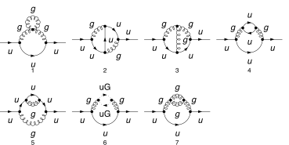
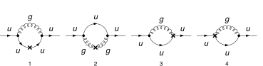
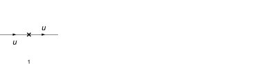

## Load FeynCalc and the necessary add-ons or other packages

This example uses a custom QCD model created with FeynRules.

```mathematica
description = "Renormalization, QCD, MSbar, 2-loop";
If[ $FrontEnd === Null, 
  	$FeynCalcStartupMessages = False; 
  	Print[description]; 
  ];
If[ $Notebooks === False, 
  	$FeynCalcStartupMessages = False 
  ];
LaunchKernels[8];
$LoadAddOns = {"FeynArts", "FeynHelpers"};
<< FeynCalc`
$FAVerbose = 0;
$ParallelizeFeynCalc = True; 
 
FCCheckVersion[10, 2, 0];
If[ToExpression[StringSplit[$FeynHelpersVersion, "."]][[1]] < 2, 
 	Print["You need at least FeynHelpers 2.0 to run this example."]; 
 	Abort[]; 
 ]
```

$$\text{FeynCalc }\;\text{10.2.0 (dev version, 2026-05-18 14:09:14 +02:00, 9ab9d838). For help, use the }\underline{\text{online} \;\text{documentation},}\;\text{ visit the }\underline{\text{forum}}\;\text{ and have a look at the supplied }\underline{\text{examples}.}\;\text{ The PDF-version of the manual can be downloaded }\underline{\text{here}.}$$

$$\text{If you use FeynCalc in your research, please evaluate FeynCalcHowToCite[] to learn how to cite this software.}$$

$$\text{Please keep in mind that the proper academic attribution of our work is crucial to ensure the future development of this package!}$$

$$\text{FeynArts }\;\text{3.12 (27 Mar 2025) patched for use with FeynCalc, for documentation see the }\underline{\text{manual}}\;\text{ or visit }\underline{\text{www}.\text{feynarts}.\text{de}.}$$

$$\text{If you use FeynArts in your research, please cite}$$

$$\text{ $\bullet $ T. Hahn, Comput. Phys. Commun., 140, 418-431, 2001, arXiv:hep-ph/0012260}$$

$$\text{FeynHelpers }\;\text{2.0.0 (2026-02-05 17:03:01 +02:00, 5db84fbb). For help, use the }\underline{\text{online} \;\text{documentation},}\;\text{ visit the }\underline{\text{forum}}\;\text{ and have a look at the supplied }\underline{\text{examples}.}\;\text{ The PDF-version of the manual can be downloaded }\underline{\text{here}.}$$

$$\text{ If you use FeynHelpers in your research, please evaluate FeynHelpersHowToCite[] to learn how to cite this work.}$$

## Configure some options

```mathematica
modelDir = FileNameJoin[{$UserBaseDirectory, "Applications", "FeynCalc", "Examples", "Models", "QCD"}]
```

$$\text{/home/vs/.Wolfram/Applications/FeynCalc/Examples/Models/QCD}$$

```mathematica
FAPatch[PatchModelsOnly -> True, FAModelsDirectory -> modelDir];

(*Successfully patched FeynArts.*)
```

```mathematica
renConstants = Zm | Zpsi | ZA | ZAmxt | Zu | Zumxt | Zg | Zxi
```

$$\text{Zm}|\text{Zpsi}|\text{ZA}|\text{ZAmxt}|\text{Zu}|\text{Zumxt}|\text{Zg}|\text{Zxi}$$

## Generate Feynman diagrams

Nicer typesetting

```mathematica
FCAttachTypesettingRule[mu, "\[Mu]"];
FCAttachTypesettingRule[nu, "\[Nu]"];
FCAttachTypesettingRule[rho, "\[Rho]"];
FCAttachTypesettingRule[si, "\[Sigma]"];
```

```mathematica
diagQuarkSE = InsertFields[CreateTopologies[2, 1 -> 1, 
     ExcludeTopologies -> {Tadpoles, WFCorrections, WFCorrectionCTs}], {F[3, {1}]} -> {F[3, {1}]}, 
    InsertionLevel -> {Particles}, Model -> FileNameJoin[{modelDir, "QCD"}], 
    GenericModel -> FileNameJoin[{modelDir, "QCD"}], ExcludeParticles -> {F[3 | 4, {2 | 3}], F[4, {1}]}];
```

```mathematica
diagQuarkSECT = InsertFields[CreateCTTopologies[2, 1 -> 1, 
     ExcludeTopologies -> {Tadpoles, WFCorrections, WFCorrectionCTs}], {F[3, {1}]} -> {F[3, {1}]}, 
    InsertionLevel -> {Particles}, Model -> FileNameJoin[{modelDir, "QCD"}], 
    GenericModel -> FileNameJoin[{modelDir, "QCD"}]];
```

```mathematica
diagQuarkTreeSECT = InsertFields[CreateCTTopologies[1, 1 -> 1, 
     ExcludeTopologies -> {Tadpoles, WFCorrections, WFCorrectionCTs}], {F[3, {1}]} -> {F[3, {1}]}, 
    InsertionLevel -> {Particles}, Model -> FileNameJoin[{modelDir, "QCD"}], 
    GenericModel -> FileNameJoin[{modelDir, "QCD"}]];
```

Self-energy and vertex diagrams

```mathematica
Paint[diagQuarkSE, ColumnsXRows -> {4, 2}, SheetHeader -> None, 
   Numbering -> Simple, ImageSize -> 128 {4, 2}];
```



1-loop counter-term diagrams

```mathematica
Paint[diagQuarkSECT, ColumnsXRows -> {4, 1}, SheetHeader -> None, 
   Numbering -> Simple, ImageSize -> 128 {4, 1}];
```



Tree-level counter-term diagrams

```mathematica
Paint[diagQuarkTreeSECT, ColumnsXRows -> {4, 1}, SheetHeader -> None, 
   Numbering -> Simple, ImageSize -> 128 {4, 1}];
```



## Master integrals

The only required masters are 1- and 2-loop tadpoles

```mathematica
tadpoleMaster = Get[FileNameJoin[{$FeynCalcDirectory, "Examples", "MasterIntegrals","Tadpoles", "tad1LxFx1x1xxEp999x.m"}]];
```

```mathematica
tadpoleMaster1 = tadpoleMaster /. m1 -> mq /. tad1LxFx1x1xxEp999x -> "tad1Lv1";
tadpoleMaster2 = tadpoleMaster /. m1 -> mxt /. tad1LxFx1x1xxEp999x -> "tad1Lv2";
```

```mathematica
tadpoleMaster1
```

$$\left\{G^{\text{tad1Lv1}}(1)\to -e^{\gamma  \;\text{ep}} \left(\text{mq}^2\right)^{1-\text{ep}} \Gamma (\text{ep}-1),\left\{\text{FCTopology}\left(\text{tad1Lv1},\left\{\frac{1}{(\text{k1}^2-\text{mq}^2+i \eta )}\right\},\{\text{k1}\},\{\},\{\},\{\}\right)\right\}\right\}$$

```mathematica
tadpoleMaster2
```

$$\left\{G^{\text{tad1Lv2}}(1)\to -e^{\gamma  \;\text{ep}} \left(\text{mxt}^2\right)^{1-\text{ep}} \Gamma (\text{ep}-1),\left\{\text{FCTopology}\left(\text{tad1Lv2},\left\{\frac{1}{(\text{k1}^2-\text{mxt}^2+i \eta )}\right\},\{\text{k1}\},\{\},\{\},\{\}\right)\right\}\right\}$$

```mathematica
tadpoleMaster3 = Get[FileNameJoin[{$FeynCalcDirectory, "Examples", "MasterIntegrals","Tadpoles", 
        "tad2LxFx111x111xxEp1x.m"}]] /. m1 -> mq /. tad2LxFx111x111xxEp1x -> "tad2Lv1";
```

```mathematica
tadpoleMaster4 = Get[FileNameJoin[{$FeynCalcDirectory, "Examples", "MasterIntegrals","Tadpoles", 
        "tad2LxFx111x111xxEp1x.m"}]] /. m1 -> mxt /. tad2LxFx111x111xxEp1x -> "tad2Lv2";
```

```mathematica
tadpoleMaster5 = Get[FileNameJoin[{$FeynCalcDirectory, "Examples", "MasterIntegrals","Tadpoles", 
        "tad2LxAm2m1o4x111x122xxEp1x.m"}]] /. {m1 -> mq, m2 -> mxt} /. tad2LxAm2m1o4x111x122xxEp1x -> "tad2Lv3";
```

```mathematica
tadpoleMaster6 = Get[FileNameJoin[{$FeynCalcDirectory, "Examples", "MasterIntegrals","Tadpoles", 
        "tad2LxAm2m1o4x111x112xxEp1x.m"}]] /. {m1 -> mq, m2 -> mxt} /. tad2LxAm2m1o4x111x112xxEp1x -> "tad2Lv4";
```

## Obtain the amplitudes

```mathematica
{quarkSE$RawAmp, quarkSECT$RawAmp, diagQuarkTreeSECT$RawAmp} = 
   FCFAConvert[CreateFeynAmp[#, Truncated -> True, 
      	GaugeRules -> {}, PreFactor -> 1], 
     	IncomingMomenta -> {p}, OutgoingMomenta -> {p}, 
     	LorentzIndexNames -> {mu, nu}, DropSumOver -> True, 
     	LoopMomenta -> {k1, k2}, UndoChiralSplittings -> True, 
     	ChangeDimension -> D, SMP -> True, 
     	FinalSubstitutions -> {SMP["m_u"] -> mq, SMP["g_s"] -> 4 Pi Sqrt[as4]}] & /@ {
    	diagQuarkSE, diagQuarkSECT, diagQuarkTreeSECT};
```

## Calculate the amplitudes

### Quark self-energy at 2 loops

The 2-loop quark self-energy has superficial degree of divergence equal to 1

```mathematica
FCClearScalarProducts[];
divDegree = 1;
aux1 = FCLoopGetFeynAmpDenominators[Join[quarkSE$RawAmp[[1 ;; 3]], {Nf quarkSE$RawAmp[[4]]}, quarkSE$RawAmp[[5 ;;]]], 
    {k1, k2}, denHead, Momentum -> {p}, "Massless" -> True];
aux2 = FCLoopAddAuxiliaryMass[aux1[[2]], {k1, k2}, -mxt^2, 0, Head -> denHead]
```

$$\left\{\text{denHead}\left(\frac{1}{(\text{k1}^2+i \eta )}\right)\to \frac{1}{(\text{k1}^2-\text{mxt}^2+i \eta )},\text{denHead}\left(\frac{1}{(\text{k2}^2+i \eta )}\right)\to \frac{1}{(\text{k2}^2-\text{mxt}^2+i \eta )},\text{denHead}\left(\frac{1}{((\text{k1}+\text{k2})^2+i \eta )}\right)\to \frac{1}{((\text{k1}+\text{k2})^2-\text{mxt}^2+i \eta )},\text{denHead}\left(\frac{1}{((\text{k1}-p)^2+i \eta )}\right)\to \frac{1}{((\text{k1}-p)^2-\text{mxt}^2+i \eta )},\text{denHead}\left(\frac{1}{((\text{k1}-\text{k2}-p)^2+i \eta )}\right)\to \frac{1}{((\text{k1}-\text{k2}-p)^2-\text{mxt}^2+i \eta )},\text{denHead}\left(\frac{1}{((\text{k2}-p)^2+i \eta )}\right)\to \frac{1}{((\text{k2}-p)^2-\text{mxt}^2+i \eta )},\text{denHead}\left(\frac{1}{((\text{k1}+p)^2+i \eta )}\right)\to \frac{1}{((\text{k1}+p)^2-\text{mxt}^2+i \eta )},\text{denHead}\left(\frac{1}{((-\text{k1}+\text{k2}+p)^2+i \eta )}\right)\to \frac{1}{((-\text{k1}+\text{k2}+p)^2-\text{mxt}^2+i \eta )},\text{denHead}\left(\frac{1}{((\text{k1}-p)^2-\text{mq}^2+i \eta )}\right)\to \frac{1}{((\text{k1}-p)^2-\text{mq}^2+i \eta )},\text{denHead}\left(\frac{1}{((\text{k1}-\text{k2}-p)^2-\text{mq}^2+i \eta )}\right)\to \frac{1}{((\text{k1}-\text{k2}-p)^2-\text{mq}^2+i \eta )},\text{denHead}\left(\frac{1}{((\text{k2}-p)^2-\text{mq}^2+i \eta )}\right)\to \frac{1}{((\text{k2}-p)^2-\text{mq}^2+i \eta )}\right\}$$

```mathematica
AbsoluteTiming[quarkSE$Amp = (aux1[[1]] /. aux2) // Contract[#, FCParallelize -> True] & // 
      SUNSimplify[#, FCI -> True, FCParallelize -> True] & // DiracSimplify[#, FCI -> True, FCParallelize -> True] &;]
```

$$\{17.6651,\text{Null}\}$$

```mathematica
isoSymbols = FCMakeSymbols[KK, Range[1, $KernelCount], List]
```

$$\{\text{KK1},\text{KK2},\text{KK3},\text{KK4},\text{KK5},\text{KK6},\text{KK7},\text{KK8}\}$$

```mathematica
AbsoluteTiming[quarkSE$Amp1 = Collect2[quarkSE$Amp, p, IsolateNames -> isoSymbols, FCParallelize -> True];]
```

$$\{8.8598,\text{Null}\}$$

```mathematica
AbsoluteTiming[quarkSE$Amp2 = FourSeries[quarkSE$Amp1, {p, 0, 1}, FCParallelize -> True];]
```

$$\{3.70558,\text{Null}\}$$

```mathematica
AbsoluteTiming[quarkSE$Amp3 = Collect2[FRH2[quarkSE$Amp2, isoSymbols], FeynAmpDenominator, FCParallelize -> True];]
```

$$\{1.568,\text{Null}\}$$

The rest of the calculation follows the standard multiloop template

```mathematica
FCClearScalarProducts[]
SPD[p] = pp;
```

```mathematica
AbsoluteTiming[{quarkSE$Amp4, quarkSE$Topos} = FCLoopFindTopologies[quarkSE$Amp3, {k1, k2}, FCI -> True, FCParallelize -> True, 
     FCLoopBasisOverdeterminedQ -> True, FinalSubstitutions -> {Hold[SPD][p] -> pp}];]
```

$$\text{FCLoopFindTopologies: Number of the initial candidate topologies: }6$$

$$\text{FCLoopFindTopologies: Number of the identified unique topologies: }5$$

$$\text{FCLoopFindTopologies: Number of the preferred topologies among the unique topologies: }0$$

$$\text{FCLoopFindTopologies: Number of the identified subtopologies: }1$$

$$\text{FCLoopFindTopologyMappings: }\;\text{Final number of found topologies: }5$$

$$\{5.43832,\text{Null}\}$$

```mathematica
AbsoluteTiming[quarkSE$Amp5 = FCLoopTensorReduce[quarkSE$Amp4, quarkSE$Topos, FCParallelize -> True];]
```

$$\{17.55,\text{Null}\}$$

```mathematica
AbsoluteTiming[quarkSE$Amp6 = DiracSimplify[quarkSE$Amp5, FCParallelize -> True];]
```

$$\{1.58069,\text{Null}\}$$

```mathematica
AbsoluteTiming[{quarkSE$Amp7, quarkSE$Topos2} = FCLoopRewriteOverdeterminedTopologies[quarkSE$Amp6, quarkSE$Topos, FCParallelize -> True];]
```

$$\text{FCLoopRewriteOverdeterminedTopologies: }\;\text{Found }5\text{ overdetermined topologies.}$$

$$\text{FCLoopRewriteOverdeterminedTopologies: }\;\text{Generated }319\text{ new topologies through partial fractioning.}$$

$$\text{FCLoopRewriteOverdeterminedTopologies: }\;\text{Final number of topologies: }16$$

$$\{4.49004,\text{Null}\}$$

```mathematica
AbsoluteTiming[{quarkSE$Amp8, quarkSE$Topos3} = FCLoopRewriteIncompleteTopologies[quarkSE$Amp7, quarkSE$Topos2, FCParallelize -> True];]
```

$$\text{FCLoopRewriteIncompleteTopologies: }\;\text{Found }2\text{ incomplete topologies.}$$

$$\{0.752916,\text{Null}\}$$

```mathematica
AbsoluteTiming[quarkSE$SubTopos = FCLoopFindSubtopologies[quarkSE$Topos3, Flatten -> True, Remove -> True, FCParallelize -> True];]
```

$$\{0.248584,\text{Null}\}$$

```mathematica
{quarkSE$TopoMappings, 
    quarkSE$FinalTopos} = FCLoopFindTopologyMappings[quarkSE$Topos3, PreferredTopologies -> quarkSE$SubTopos, FCParallelize -> True];
```

$$\text{FCLoopFindTopologyMappings: }\;\text{Found }12\text{ mapping relations }$$

$$\text{FCLoopFindTopologyMappings: }\;\text{Final number of independent topologies: }4$$

```mathematica
AbsoluteTiming[quarkSE$AmpGLI = FCLoopApplyTopologyMappings[quarkSE$Amp8, {quarkSE$TopoMappings, 
      quarkSE$FinalTopos}, FCParallelize -> True];]
```

$$\{14.7864,\text{Null}\}$$

```mathematica
quarkSE$GLIs = Cases2[quarkSE$AmpGLI, GLI];
```

```mathematica
quarkSE$dir = FileNameJoin[{$TemporaryDirectory, "Reduction-quarkSE-2L-massive"}];
Quiet[CreateDirectory[quarkSE$dir]];
```

```mathematica
KiraCreateJobFile[quarkSE$FinalTopos, quarkSE$GLIs, quarkSE$dir]
```

$$\{\text{/tmp/Reduction-quarkSE-2L-massive/fcPFRTopology1/job.yaml},\text{/tmp/Reduction-quarkSE-2L-massive/fcPFRTopology10/job.yaml},\text{/tmp/Reduction-quarkSE-2L-massive/fcPFRTopology12/job.yaml},\text{/tmp/Reduction-quarkSE-2L-massive/fcPFRTopology15/job.yaml}\}$$

```mathematica
KiraCreateIntegralFile[quarkSE$GLIs, quarkSE$FinalTopos, quarkSE$dir]
KiraCreateConfigFiles[quarkSE$FinalTopos, quarkSE$GLIs, quarkSE$dir, 
  KiraMassDimensions -> {pp -> 2, mq -> 1, mxt -> 1}]
```

$$\text{KiraCreateIntegralFile: Number of loop integrals: }102$$

$$\text{KiraCreateIntegralFile: Number of loop integrals: }121$$

$$\text{KiraCreateIntegralFile: Number of loop integrals: }188$$

$$\text{KiraCreateIntegralFile: Number of loop integrals: }42$$

$$\{\text{/tmp/Reduction-quarkSE-2L-massive/fcPFRTopology1/KiraLoopIntegrals},\text{/tmp/Reduction-quarkSE-2L-massive/fcPFRTopology10/KiraLoopIntegrals},\text{/tmp/Reduction-quarkSE-2L-massive/fcPFRTopology12/KiraLoopIntegrals},\text{/tmp/Reduction-quarkSE-2L-massive/fcPFRTopology15/KiraLoopIntegrals}\}$$

$$\left(
\begin{array}{cc}
 \;\text{/tmp/Reduction-quarkSE-2L-massive/fcPFRTopology1/config/integralfamilies.yaml} & \;\text{/tmp/Reduction-quarkSE-2L-massive/fcPFRTopology1/config/kinematics.yaml} \\
 \;\text{/tmp/Reduction-quarkSE-2L-massive/fcPFRTopology10/config/integralfamilies.yaml} & \;\text{/tmp/Reduction-quarkSE-2L-massive/fcPFRTopology10/config/kinematics.yaml} \\
 \;\text{/tmp/Reduction-quarkSE-2L-massive/fcPFRTopology12/config/integralfamilies.yaml} & \;\text{/tmp/Reduction-quarkSE-2L-massive/fcPFRTopology12/config/kinematics.yaml} \\
 \;\text{/tmp/Reduction-quarkSE-2L-massive/fcPFRTopology15/config/integralfamilies.yaml} & \;\text{/tmp/Reduction-quarkSE-2L-massive/fcPFRTopology15/config/kinematics.yaml} \\
\end{array}
\right)$$

```mathematica
KiraRunReduction[quarkSE$dir, quarkSE$FinalTopos, 
  KiraBinaryPath -> FileNameJoin[{$HomeDirectory, ".local", "bin", "kira"}], 
  KiraFermatPath -> FileNameJoin[{$HomeDirectory, "bin", "ferl64", "fer64"}]]
```

$$\{\text{True},\text{True},\text{True},\text{True}\}$$

```mathematica
quarkSE$ReductionTables = KiraImportResults[quarkSE$FinalTopos, quarkSE$dir] // Flatten;
```

```mathematica
AbsoluteTiming[quarkSE$resPreFinal1 = (quarkSE$AmpGLI /. Dispatch[quarkSE$ReductionTables]);]
```

$$\{0.210634,\text{Null}\}$$

```mathematica
AbsoluteTiming[quarkSE$resPreFinal2 = Map[Collect2[#, GLI, DiracGamma, FCParallelize -> True] &, quarkSE$resPreFinal1];]
```

$$\{10.4277,\text{Null}\}$$

```mathematica
quarkSE$masters = Cases2[quarkSE$resPreFinal1, GLI];
```

```mathematica
quarkSE$MIMappings = FCLoopFindIntegralMappings[quarkSE$masters, Join[tadpoleMaster1[[2]], tadpoleMaster2[[2]], {tadpoleMaster3[[2]]}, {tadpoleMaster4[[2]]} 
   , {tadpoleMaster5[[2]]}, {tadpoleMaster6[[2]]}, quarkSE$FinalTopos],PreferredIntegrals -> {tadpoleMaster2[[1]][[1]] tadpoleMaster2[[1]][[1]], 
     tadpoleMaster1[[1]][[1]] tadpoleMaster1[[1]][[1]], tadpoleMaster1[[1]][[1]] tadpoleMaster2[[1]][[1]], 
     tadpoleMaster3[[1]][[1]], 
     tadpoleMaster4[[1]][[1]], 
     tadpoleMaster5[[1]][[1]], 
     tadpoleMaster6[[1]][[1]]}]
```

$$\left\{\left\{G^{\text{fcPFRTopology1}}(1,0,1)\to G^{\text{tad1Lv1}}(1) G^{\text{tad1Lv2}}(1),G^{\text{fcPFRTopology10}}(1,0,1)\to G^{\text{tad1Lv1}}(1) G^{\text{tad1Lv2}}(1),G^{\text{fcPFRTopology1}}(1,1,0)\to G^{\text{tad1Lv1}}(1)^2,G^{\text{fcPFRTopology15}}(1,1,0)\to G^{\text{tad1Lv1}}(1)^2,G^{\text{fcPFRTopology1}}(1,1,1)\to G^{\text{tad2Lv4}}(1,1,1),G^{\text{fcPFRTopology10}}(1,1,0)\to G^{\text{tad1Lv2}}(1)^2,G^{\text{fcPFRTopology12}}(1,1,0)\to G^{\text{tad1Lv2}}(1)^2,G^{\text{fcPFRTopology10}}(1,1,1)\to G^{\text{tad2Lv3}}(1,1,1),G^{\text{fcPFRTopology12}}(1,1,1)\to G^{\text{tad2Lv2}}(1,1,1),G^{\text{fcPFRTopology15}}(1,1,1)\to G^{\text{tad2Lv1}}(1,1,1)\right\},\left\{G^{\text{tad1Lv1}}(1)^2,G^{\text{tad1Lv1}}(1) G^{\text{tad1Lv2}}(1),G^{\text{tad1Lv2}}(1)^2,G^{\text{tad2Lv1}}(1,1,1),G^{\text{tad2Lv2}}(1,1,1),G^{\text{tad2Lv3}}(1,1,1),G^{\text{tad2Lv4}}(1,1,1)\right\}\right\}$$

```mathematica
isoSymbols1 = FCMakeSymbols[LL, Range[1, $KernelCount], List];
isoSymbols2 = FCMakeSymbols[LM, Range[1, $KernelCount], List];
```

```mathematica
AbsoluteTiming[quarkSE$resPreFinal2 = Collect2[quarkSE$resPreFinal1, D, GLI, IsolateNames -> isoSymbols1,FCParallelize -> True] // FCReplaceD[#, D -> 4 - 2 ep] & // ReplaceAll[#, quarkSE$MIMappings[[1]]] & // 
      ReplaceAll[#, {tadpoleMaster1[[1]], tadpoleMaster2[[1]], tadpoleMaster3[[1]], tadpoleMaster4[[1]], tadpoleMaster5[[1]],tadpoleMaster6[[1]]}] & // Collect2[#, ep, IsolateNames -> isoSymbols2, FCParallelize -> True] &;]
```

$$\{13.8007,\text{Null}\}$$

```mathematica
AbsoluteTiming[quarkSE$resPreFinal3 = quarkSE$resPreFinal2 // Series[#, {ep, 0, -1}] & // Normal // Series[(I*(4*Pi)^(-2 + ep))^2 #, {ep, 0, -1}] & // Normal;]
```

$$\{2.88618,\text{Null}\}$$

```mathematica
AbsoluteTiming[quarkSE$resPreFinal4 = Collect2[FRH2[FRH2[quarkSE$resPreFinal3, isoSymbols2], isoSymbols1],DiracGamma, pp, mxt, ep, FCParallelize -> True];]
```

$$\{3.13225,\text{Null}\}$$

```mathematica
isoSymbols3 = FCMakeSymbols[LH, Range[1, $KernelCount], List];
```

```mathematica
AbsoluteTiming[quarkSE$resPreFinal5 = Series[Total[Collect2[quarkSE$resPreFinal4, mxt, IsolateNames -> isoSymbols3,FCParallelize -> True]], {mxt, 0, 0}] // Normal;]
```

$$\{19.6076,\text{Null}\}$$

```mathematica
AbsoluteTiming[quarkSE$resPreFinal6 = Collect2[FRH2[quarkSE$resPreFinal5, isoSymbols3] // ReplaceAll[#, Log[m_Symbol^2] :> 2 Log[m]] &, DiracGamma, pp, mxt, ep, FCParallelize -> True];]
```

$$\{0.224541,\text{Null}\}$$

```mathematica
quarkSE$resFinal = Collect2[Collect2[quarkSE$resPreFinal6, ep, CA, CF, mq, Nf, SUNFDelta, as4, DiracGamma, GaugeXi, Factoring -> FullSimplify], ep, mq, mxt]
```

$$-\frac{i \;\text{as4}^2 \;\text{mq} \delta _{\text{Col1}\;\text{Col2}} \left(-4 C_A C_F \xi _{\text{G}}^2-12 C_A C_F \xi _{\text{G}}+3 C_A^2 \xi _{\text{G}}^2+9 C_A^2 \xi _{\text{G}}+22 C_A^2-8 C_F N_f+4 C_F^2 \xi _{\text{G}}^2+24 C_F^2 \xi _{\text{G}}+36 C_F^2-3 \xi _{\text{G}}^2-9 \xi _{\text{G}}-22\right)}{8 \;\text{ep}^2}+\frac{i \;\text{as4}^2 \xi _{\text{G}} \delta _{\text{Col1}\;\text{Col2}} \gamma \cdot p \left(-4 C_A C_F \xi _{\text{G}}+3 C_A^2 \xi _{\text{G}}+3 C_A^2+4 C_F^2 \xi _{\text{G}}-3 \xi _{\text{G}}-3\right)}{8 \;\text{ep}^2}+\frac{i \;\text{as4}^2 \;\text{mq} \log (\text{mq}) \delta _{\text{Col1}\;\text{Col2}} \left(-4 C_A C_F \xi _{\text{G}}^2-12 C_A C_F \xi _{\text{G}}+3 C_A^2 \xi _{\text{G}}^2+9 C_A^2 \xi _{\text{G}}+22 C_A^2-8 C_F N_f+4 C_F^2 \xi _{\text{G}}^2+24 C_F^2 \xi _{\text{G}}+36 C_F^2-3 \xi _{\text{G}}^2-9 \xi _{\text{G}}-22\right)}{2 \;\text{ep}}-\frac{1}{16 \;\text{ep}}i \;\text{as4}^2 \;\text{mq} \delta _{\text{Col1}\;\text{Col2}} \left(-12 C_A C_F \xi _{\text{G}}^2-8 C_A C_F \xi _{\text{G}}-16 \log (4 \pi ) C_A C_F \xi _{\text{G}}^2-48 \log (4 \pi ) C_A C_F \xi _{\text{G}}+36 C_A C_F+11 C_A^2 \xi _{\text{G}}^2+24 C_A^2 \xi _{\text{G}}+12 \log (4 \pi ) C_A^2 \xi _{\text{G}}^2+36 \log (4 \pi ) C_A^2 \xi _{\text{G}}+101 C_A^2+88 \log (4 \pi ) C_A^2-32 C_F N_f-32 \log (\pi ) C_F N_f-32 \log (4) C_F N_f+16 C_F^2 \xi _{\text{G}}^2-32 C_F^2 \xi _{\text{G}}+96 \log (4 \pi ) C_F^2 \xi _{\text{G}}+16 \log (\pi ) C_F^2 \xi _{\text{G}}^2+16 \log (4) C_F^2 \xi _{\text{G}}^2-240 C_F^2+144 \log (4 \pi ) C_F^2-11 \xi _{\text{G}}^2-24 \xi _{\text{G}}-12 \log (4 \pi ) \xi _{\text{G}}^2-36 \log (4 \pi ) \xi _{\text{G}}-101-88 \log (4 \pi )\right)+\frac{1}{8 \;\text{ep}}i \;\text{as4}^2 \delta _{\text{Col1}\;\text{Col2}} \gamma \cdot p \left(-5 C_A C_F \xi _{\text{G}}^2-8 \log (4 \pi ) C_A C_F \xi _{\text{G}}^2+3 C_A C_F+4 C_A^2 \xi _{\text{G}}^2+7 C_A^2 \xi _{\text{G}}+6 \log (4 \pi ) C_A^2 \xi _{\text{G}}^2+6 \log (4 \pi ) C_A^2 \xi _{\text{G}}+11 C_A^2-4 C_F N_f+4 C_F^2 \xi _{\text{G}}^2-48 C_F^2 \xi _{\text{G}}+8 \log (4 \pi ) C_F^2 \xi _{\text{G}}^2-6 C_F^2-4 \xi _{\text{G}}^2-7 \xi _{\text{G}}-6 \log (4 \pi ) \xi _{\text{G}}^2-6 \log (4 \pi ) \xi _{\text{G}}-11\right)-\frac{i \;\text{as4}^2 \xi _{\text{G}} \log (\text{mq}) \delta _{\text{Col1}\;\text{Col2}} \gamma \cdot p \left(-4 C_A C_F \xi _{\text{G}}+3 C_A^2 \xi _{\text{G}}+3 C_A^2+4 C_F^2 \xi _{\text{G}}-3 \xi _{\text{G}}-3\right)}{2 \;\text{ep}}$$

### Quark self-energy 1-loop CT

```mathematica
FCClearScalarProducts[];
divDegree = 1;
aux1 = FCLoopGetFeynAmpDenominators[quarkSECT$RawAmp, {k1}, denHead, Momentum -> {p}, "Massless" -> True];
aux2 = FCLoopAddAuxiliaryMass[aux1[[2]], {k1}, -mxt^2, 0, Head -> denHead]
```

$$\left\{\text{denHead}\left(\frac{1}{(\text{k1}^2+i \eta )}\right)\to \frac{1}{(\text{k1}^2-\text{mxt}^2+i \eta )},\text{denHead}\left(\frac{1}{((\text{k1}-p)^2+i \eta )}\right)\to \frac{1}{((\text{k1}-p)^2-\text{mxt}^2+i \eta )},\text{denHead}\left(\frac{1}{((\text{k1}+p)^2+i \eta )}\right)\to \frac{1}{((\text{k1}+p)^2-\text{mxt}^2+i \eta )},\text{denHead}\left(\frac{1}{((\text{k1}+p)^2-\text{mq}^2+i \eta )}\right)\to \frac{1}{((\text{k1}+p)^2-\text{mq}^2+i \eta )}\right\}$$

```mathematica
quarkSECT$StrName = StringReplace[ToString[Hold[quarkSECT$Amp]], {"Hold[" -> "", "]" -> ""}]
```

$$\text{quarkSECT\$Amp}$$

```mathematica
AbsoluteTiming[quarkSECT$Amp = (aux1[[1]] /. aux2) // Contract[#, FCParallelize -> True] & // 
      SUNSimplify[#, FCParallelize -> True] & // DiracSimplify[#, FCParallelize -> True] &;]
```

$$\{0.861518,\text{Null}\}$$

```mathematica
AbsoluteTiming[quarkSECT$Amp1 = Collect2[quarkSECT$Amp, p, IsolateNames -> KK];]
AbsoluteTiming[quarkSECT$Amp2 = FourSeries[quarkSECT$Amp1, {p, 0, divDegree}, FCParallelize -> True];]
AbsoluteTiming[quarkSECT$Amp3 = Collect2[FRH[quarkSECT$Amp2], FeynAmpDenominator, FCParallelize -> True];]
```

$$\{0.295724,\text{Null}\}$$

$$\{0.131099,\text{Null}\}$$

$$\{0.174416,\text{Null}\}$$

The rest of the calculation follows the standard multiloop template

```mathematica
FCClearScalarProducts[];
SPD[p] = pp;
```

```mathematica
{quarkSECT$Amp4, quarkSECT$Topos} = FCLoopFindTopologies[quarkSECT$Amp3, {k1}, FCParallelize -> True, 
    FCLoopBasisOverdeterminedQ -> True, FinalSubstitutions -> {Hold[SPD][p] -> pp}, Names -> quarkSEtopo];
```

$$\text{FCLoopFindTopologies: Number of the initial candidate topologies: }1$$

$$\text{FCLoopFindTopologies: Number of the identified unique topologies: }1$$

$$\text{FCLoopFindTopologies: Number of the preferred topologies among the unique topologies: }0$$

$$\text{FCLoopFindTopologies: Number of the identified subtopologies: }0$$

$$\text{FCLoopFindTopologyMappings: }\;\text{Final number of found topologies: }1$$

```mathematica
AbsoluteTiming[quarkSECT$Amp5 = FCLoopTensorReduce[quarkSECT$Amp4, quarkSECT$Topos, FCParallelize -> True];]
```

$$\{0.806291,\text{Null}\}$$

```mathematica
AbsoluteTiming[quarkSECT$Amp6 = DiracSimplify[quarkSECT$Amp5, FCParallelize -> True];]
```

$$\{0.210257,\text{Null}\}$$

```mathematica
{quarkSECT$Amp7, quarkSECT$Topos2} = FCLoopRewriteOverdeterminedTopologies[quarkSECT$Amp6, quarkSECT$Topos, FCParallelize -> True];
```

$$\text{FCLoopRewriteOverdeterminedTopologies: }\;\text{Found }1\text{ overdetermined topologies.}$$

$$\text{FCLoopRewriteOverdeterminedTopologies: }\;\text{Generated }32\text{ new topologies through partial fractioning.}$$

$$\text{FCLoopRewriteOverdeterminedTopologies: }\;\text{Final number of topologies: }2$$

```mathematica
{quarkSECT$Amp8, quarkSECT$Topos3} = FCLoopRewriteIncompleteTopologies[quarkSECT$Amp7, quarkSECT$Topos2, FCParallelize -> True];
```

$$\text{FCLoopRewriteIncompleteTopologies: }\;\text{No incomplete topologies detected.}$$

```mathematica
AbsoluteTiming[quarkSECT$SubTopos = FCLoopFindSubtopologies[quarkSECT$Topos2, Flatten -> True, Remove -> True, FCParallelize -> True];]
```

$$\{0.065296,\text{Null}\}$$

```mathematica
AbsoluteTiming[{quarkSECT$TopoMappings, quarkSECT$FinalTopos} = FCLoopFindTopologyMappings[quarkSECT$Topos2, PreferredTopologies -> quarkSECT$SubTopos, FCParallelize -> True];]
```

$$\text{FCLoopFindTopologyMappings: }\;\text{Found }0\text{ mapping relations }$$

$$\text{FCLoopFindTopologyMappings: }\;\text{Final number of independent topologies: }2$$

$$\{0.065997,\text{Null}\}$$

```mathematica
AbsoluteTiming[quarkSECT$AmpGLI = FCLoopApplyTopologyMappings[quarkSECT$Amp8, {quarkSECT$TopoMappings, quarkSECT$FinalTopos}, FCParallelize -> True];]
```

$$\{0.895562,\text{Null}\}$$

```mathematica
quarkSECT$GLIs = Cases2[quarkSECT$AmpGLI, GLI];
```

```mathematica
quarkSECT$dir = FileNameJoin[{$TemporaryDirectory, "Reduction-" <> quarkSECT$StrName <> "-1L-massive"}];
Quiet[CreateDirectory[quarkSECT$dir]];
```

```mathematica
KiraCreateJobFile[quarkSECT$FinalTopos, quarkSECT$GLIs, quarkSECT$dir]
```

$$\{\text{/tmp/Reduction-quarkSECT\$Amp-1L-massive/fcPFRTopology1/job.yaml},\text{/tmp/Reduction-quarkSECT\$Amp-1L-massive/fcPFRTopology2/job.yaml}\}$$

```mathematica
KiraCreateIntegralFile[quarkSECT$GLIs, quarkSECT$FinalTopos, quarkSECT$dir]
KiraCreateConfigFiles[quarkSECT$FinalTopos, quarkSECT$GLIs, quarkSECT$dir, 
  KiraMassDimensions -> {pp -> 2, mq -> 1, mxt -> 1}]
```

$$\text{KiraCreateIntegralFile: Number of loop integrals: }6$$

$$\text{KiraCreateIntegralFile: Number of loop integrals: }8$$

$$\{\text{/tmp/Reduction-quarkSECT\$Amp-1L-massive/fcPFRTopology1/KiraLoopIntegrals},\text{/tmp/Reduction-quarkSECT\$Amp-1L-massive/fcPFRTopology2/KiraLoopIntegrals}\}$$

$$\left(
\begin{array}{cc}
 \;\text{/tmp/Reduction-quarkSECT\$Amp-1L-massive/fcPFRTopology1/config/integralfamilies.yaml} & \;\text{/tmp/Reduction-quarkSECT\$Amp-1L-massive/fcPFRTopology1/config/kinematics.yaml} \\
 \;\text{/tmp/Reduction-quarkSECT\$Amp-1L-massive/fcPFRTopology2/config/integralfamilies.yaml} & \;\text{/tmp/Reduction-quarkSECT\$Amp-1L-massive/fcPFRTopology2/config/kinematics.yaml} \\
\end{array}
\right)$$

```mathematica
KiraRunReduction[quarkSECT$dir, quarkSECT$FinalTopos, 
  KiraBinaryPath -> FileNameJoin[{$HomeDirectory, ".local", "bin", "kira"}], 
  KiraFermatPath -> FileNameJoin[{$HomeDirectory, "bin", "ferl64", "fer64"}]]
```

$$\{\text{True},\text{True}\}$$

```mathematica
quarkSECT$ReductionTables = KiraImportResults[quarkSECT$FinalTopos, quarkSECT$dir] // Flatten;
```

```mathematica
quarkSECT$resPreFinal1 = Collect2[Total[quarkSECT$AmpGLI /. Dispatch[quarkSECT$ReductionTables]], GLI, 
    GaugeXi, D, DiracGamma, FCParallelize -> True];
```

```mathematica
quarkSECT$masters = Cases2[quarkSECT$resPreFinal1, GLI];
```

```mathematica
quarkSECT$MIMappings = FCLoopFindIntegralMappings[quarkSECT$masters, Join[tadpoleMaster1[[2]], tadpoleMaster2[[2]], 
    quarkSECT$FinalTopos], PreferredIntegrals -> {tadpoleMaster1[[1]][[1]], tadpoleMaster2[[1]][[1]]}]
```

$$\left(
\begin{array}{cc}
 G^{\text{fcPFRTopology1}}(1)\to G^{\text{tad1Lv1}}(1) & G^{\text{fcPFRTopology2}}(1)\to G^{\text{tad1Lv2}}(1) \\
 G^{\text{tad1Lv1}}(1) & G^{\text{tad1Lv2}}(1) \\
\end{array}
\right)$$

Our master integrals are calculated using the standard multiloop normalization. To convert it back to the textbook normalization
we need to multiply by I*(4 Pi)^(ep-2)

At this point we need to insert the 1-loop renormalization constants

```mathematica
knownResults1L = {
    rc[delZA, 1] -> (13*CA - 4*Nf - 3*CA*GaugeXi["G"])/(6*ep), 
    rc[delZAmxt, 1] -> - (CA*( 1 +  3*GaugeXi["G"]))/(8*ep), 
    rc[delZxi, 1] -> (13*CA - 4*Nf - 3*CA*GaugeXi["G"])/(6*ep), 
    rc[delZm, 1] -> - (3*CF)/ep, 
    rc[delZpsi, 1] -> -((CF*GaugeXi["G"])/ep), 
    rc[delZumxt, 1] -> 0, 
    rc[delZu, 1] -> (CA*(3 - GaugeXi["G"]))/(4*ep), 
    rc[delZg, 1] -> -1/6*(11*CA - 2*Nf)/ep};
```

```mathematica
AbsoluteTiming[quarkSECT$resPreFinal2 = Collect2[quarkSECT$resPreFinal1, D, GLI, IsolateNames -> KK] // FCReplaceD[#, D -> 4 - 2 ep] & // 
            ReplaceAll[#, quarkSECT$MIMappings[[1]]] & // ReplaceAll[#, {tadpoleMaster1[[1]], tadpoleMaster2[[1]]}] & // 
          Collect2[#, ep, IsolateNames -> KK2] & // Series[(I*(4*Pi)^(-2 + ep)) #, {ep, 0, 1}] & // Normal // FCLoopAddMissingHigherOrdersWarning[#, ep, epHelp] & // FRH // 
     ReplaceAll[#, {Log[mxt^2] -> 2 Log[mxt]}] &;]
```

$$\{9.77544,\text{Null}\}$$

```mathematica
AbsoluteTiming[quarkSECT$resPreFinal2 = Collect2[quarkSECT$resPreFinal1, Join[{as4}, List @@ renConstants],IsolateNames -> KK] // ReplaceAll[#, Zxi -> ZA] & // ReplaceAll[#, {
         	(h : renConstants) :> 1 + (as4 rc[ToExpression["del" <> ToString[h]], 1] + as4^2 rc[ToExpression["del" <> ToString[h]], 2])}] & // Series[#, {as4, 0, 2}] & // Normal;]
```

$$\{0.495296,\text{Null}\}$$

```mathematica
AbsoluteTiming[quarkSECT$resPreFinal3 = Collect2[quarkSECT$resPreFinal2 // FRH, {rc, D, GLI}, IsolateNames -> KK] // FCReplaceD[#, {D -> 4 - 2 ep}] & // ReplaceRepeated[#, knownResults1L] & // 
        ReplaceAll[#, quarkSECT$MIMappings[[1]]] & // ReplaceAll[#, {tadpoleMaster1[[1]], tadpoleMaster2[[1]]}] & // If[! FreeQ[#, GLI], Abort[], #] & // Collect2[#, ep, IsolateNames -> KK] &;]
```

$$\{0.707515,\text{Null}\}$$

```mathematica
quarkSECT$resFinal = quarkSECT$resPreFinal3 // Series[(I*(4*Pi)^(-2 + ep)) #, {ep, 0, -1}] & // Normal // FRH // 
        Collect2[#, mxt, IsolateNames -> KK] & // Series[#, {mxt, 0, 0}] & // Normal // FRH // ReplaceAll[#, Log[m_^2] :> 2 Log[m]] & // Collect2[#, ep, mq, mxt] &
```

$$\frac{i \;\text{as4}^2 \;\text{mq} C_F \delta _{\text{Col1}\;\text{Col2}} \left(C_A \xi _{\text{G}}^2+3 C_A \xi _{\text{G}}+22 C_A+2 C_F \xi _{\text{G}}^2+12 C_F \xi _{\text{G}}+18 C_F-4 N_f\right)}{2 \;\text{ep}^2}-\frac{i \;\text{as4}^2 C_F \xi _{\text{G}} \delta _{\text{Col1}\;\text{Col2}} \gamma \cdot p \left(C_A \xi _{\text{G}}+3 C_A+2 C_F \xi _{\text{G}}\right)}{2 \;\text{ep}^2}-\frac{i \;\text{as4}^2 \;\text{mq} C_F \log (\text{mq}) \delta _{\text{Col1}\;\text{Col2}} \left(C_A \xi _{\text{G}}^2+3 C_A \xi _{\text{G}}+22 C_A+2 C_F \xi _{\text{G}}^2+12 C_F \xi _{\text{G}}+18 C_F-4 N_f\right)}{\text{ep}}+\frac{1}{6 \;\text{ep}}i \;\text{as4}^2 \;\text{mq} C_F \delta _{\text{Col1}\;\text{Col2}} \left(3 C_A \xi _{\text{G}}^2+9 C_A \xi _{\text{G}}+3 \log (4 \pi ) C_A \xi _{\text{G}}^2+9 \log (4 \pi ) C_A \xi _{\text{G}}+22 C_A+66 \log (4 \pi ) C_A+6 C_F \xi _{\text{G}}^2-12 C_F \xi _{\text{G}}+6 \log (4 \pi ) C_F \xi _{\text{G}}^2+36 \log (4 \pi ) C_F \xi _{\text{G}}-90 C_F+54 \log (4 \pi ) C_F-4 N_f-12 \log (4 \pi ) N_f\right)+\frac{i \;\text{as4}^2 C_F \xi _{\text{G}} \log (\text{mq}) \delta _{\text{Col1}\;\text{Col2}} \gamma \cdot p \left(C_A \xi _{\text{G}}+3 C_A+2 C_F \xi _{\text{G}}\right)}{\text{ep}}-\frac{i \;\text{as4}^2 C_F \xi _{\text{G}} \delta _{\text{Col1}\;\text{Col2}} \gamma \cdot p \left(C_A \xi _{\text{G}}+2 \log (4 \pi ) C_A \xi _{\text{G}}+3 C_A+6 \log (4 \pi ) C_A+2 C_F \xi _{\text{G}}+4 \log (4 \pi ) C_F \xi _{\text{G}}-24 C_F\right)}{4 \;\text{ep}}$$

### Determination of renormalization constants

```mathematica
diagQuarkTreeSECT$Amp = (Total[diagQuarkTreeSECT$RawAmp]) // ReplaceRepeated[#, {
        	(h : renConstants) :> 1 + (as4 rc[ToExpression["del" <> ToString[h]], 1] + as4^2 rc[ToExpression["del" <> ToString[h]], 2])}] & // 
    	Series[#, {as4, 0, 2}] & // Normal // ReplaceRepeated[#, knownResults1L] &
```

$$-i \;\text{as4}^2 \delta _{\text{Col1}\;\text{Col2}} \left(\text{mq} \;\text{rc}(\text{delZm},2)+\text{mq} \;\text{rc}(\text{delZpsi},2)-\text{rc}(\text{delZpsi},2) \gamma \cdot p+\frac{3 \;\text{mq} C_F^2 \xi _{\text{G}}}{\text{ep}^2}\right)-i \;\text{as4} \delta _{\text{Col1}\;\text{Col2}} \left(-\frac{\text{mq} C_F \xi _{\text{G}}}{\text{ep}}+\frac{C_F \xi _{\text{G}} \gamma \cdot p}{\text{ep}}-\frac{3 \;\text{mq} C_F}{\text{ep}}\right)$$

```mathematica
quarkSE$RenConstants2L = Collect2[Coefficient[SUNSimplify[quarkSE$resFinal + quarkSECT$resFinal + diagQuarkTreeSECT$Amp, SUNNToCACF -> False], as4, 2], as4, mxt, DiracGamma, Factoring -> FullSimplify] // 
   	FCMatchSolve[#, {ep, CF, DiracGamma, mq, mxt, SUNDelta, SUNTF, SUNFDelta, CA, GaugeXi, as4, Pair, pp, Nf, SUNN}] & // Collect2[#, ep] &
```

$$\text{FCMatchSolve: Solving for: }\{\text{rc}(\text{delZm},2),\text{rc}(\text{delZpsi},2)\}$$

$$\text{FCMatchSolve: A solution exists.}$$

$$\left\{\text{rc}(\text{delZm},2)\to \frac{(N-1) (N+1) \left(-4 N N_f+31 N^2-9\right)}{8 \;\text{ep}^2 N^2}-\frac{(N-1) (N+1) \left(-20 N N_f+203 N^2-9\right)}{48 \;\text{ep} N^2},\text{rc}(\text{delZpsi},2)\to \frac{(N-1) (N+1) \xi _{\text{G}} \left(-\xi _{\text{G}}+2 N^2 \xi _{\text{G}}+3 N^2\right)}{8 \;\text{ep}^2 N^2}-\frac{(N-1) (N+1) \left(-4 N N_f+N^2 \xi _{\text{G}}^2+8 N^2 \xi _{\text{G}}+22 N^2+3\right)}{16 \;\text{ep} N^2}\right\}$$

## Check the final results

Our final QCD 2-loop wave-function renormalization constants

```mathematica
finalResults = Thread[Rule[List @@ renConstants, 
      (List @@ renConstants /. (h : renConstants) :> 1 + as4 rc[ToExpression["del" <> ToString[h]], 1] + as4^2 rc[ToExpression["del" <> ToString[h]], 2]) // 
       ReplaceAll[#, Join[SUNSimplify[knownResults1L, SUNNToCACF -> False], quarkSE$RenConstants2L]] &]] // SelectNotFree[#, Zpsi, Zm] &;
```

```mathematica
finalResults // TableForm
```

$$\begin{array}{l}
 \;\text{Zm}\to \;\text{as4}^2 \left(\frac{(N-1) (N+1) \left(-4 N N_f+31 N^2-9\right)}{8 \;\text{ep}^2 N^2}-\frac{(N-1) (N+1) \left(-20 N N_f+203 N^2-9\right)}{48 \;\text{ep} N^2}\right)+\frac{3 \;\text{as4} \left(1-N^2\right)}{2 \;\text{ep} N}+1 \\
 \;\text{Zpsi}\to \;\text{as4}^2 \left(\frac{(N-1) (N+1) \xi _{\text{G}} \left(-\xi _{\text{G}}+2 N^2 \xi _{\text{G}}+3 N^2\right)}{8 \;\text{ep}^2 N^2}-\frac{(N-1) (N+1) \left(-4 N N_f+N^2 \xi _{\text{G}}^2+8 N^2 \xi _{\text{G}}+22 N^2+3\right)}{16 \;\text{ep} N^2}\right)+\frac{\text{as4} \left(1-N^2\right) \xi _{\text{G}}}{2 \;\text{ep} N}+1 \\
\end{array}$$

```mathematica
knownResult = {rc[delZm, 2] -> ((-1 + SUNN)*(1 + SUNN)*(-9 - 4*Nf*SUNN + 31*SUNN^2))/(8*ep^2*SUNN^2) - ((-1 + SUNN)*(1 + SUNN)*(-9 - 20*Nf*SUNN + 203*SUNN^2))/(48*ep*SUNN^2), 
    rc[delZpsi, 2] -> ((-1 + SUNN)*(1 + SUNN)*GaugeXi["G"]*(3*SUNN^2 - GaugeXi["G"] + 2*SUNN^2*GaugeXi["G"]))/(8*ep^2*SUNN^2) - 
        ((-1 + SUNN)*(1 + SUNN)*(3 - 4*Nf*SUNN + 22*SUNN^2 + 8*SUNN^2*GaugeXi["G"] + SUNN^2*GaugeXi["G"]^2))/(16*ep*SUNN^2)};
```

```mathematica
FCCompareResults[quarkSE$RenConstants2L, knownResult, 
  Text -> {"\tCompare to Chetyrkin, Four-loop renormalization of QCD: full set of renormalization constants and anomalous dimensions, arXiv:hep-ph/0405193:", 
    "CORRECT.", "WRONG!"}, Interrupt -> {Hold[Quit[1]], Automatic}]
Print["\tCPU Time used: ", Round[N[TimeUsed[], 4], 0.001], " s."];

```mathematica

$$\text{$\backslash $tCompare to Chetyrkin, Four-loop renormalization of QCD: full set of renormalization constants and anomalous dimensions, arXiv:hep-ph/0405193:} \;\text{CORRECT.}$$

$$\text{True}$$

$$\text{$\backslash $tCPU Time used: }143.443\text{ s.}$$