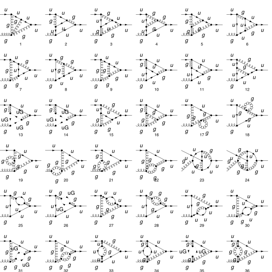
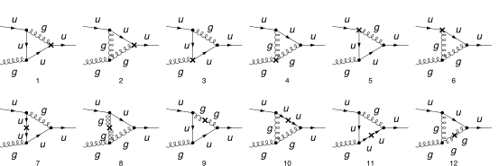

## Load FeynCalc and the necessary add-ons or other packages

This example uses a custom QCD model created with FeynRules.

```mathematica
description = "Renormalization, QCD, MSbar, Quark-gluon vertex, massless, 2-loop";
If[ $FrontEnd === Null, 
  	$FeynCalcStartupMessages = False; 
  	Print[description]; 
  ];
If[ $Notebooks === False, 
  	$FeynCalcStartupMessages = False 
  ];
LaunchKernels[$ProcessorCount];
$LoadAddOns = {"FeynArts", "FeynHelpers"};
<< FeynCalc`
$FAVerbose = 0;
$ParallelizeFeynCalc = True; 
 
FCCheckVersion[10, 2, 0];
If[ToExpression[StringSplit[$FeynHelpersVersion, "."]][[1]] < 2, 
 	Print["You need at least FeynHelpers 2.0 to run this example."]; 
 	Abort[]; 
 ]
```

$$\text{FeynCalc }\;\text{10.2.0 (dev version, 2026-05-18 14:09:14 +02:00, 9ab9d838). For help, use the }\underline{\text{online} \;\text{documentation},}\;\text{ visit the }\underline{\text{forum}}\;\text{ and have a look at the supplied }\underline{\text{examples}.}\;\text{ The PDF-version of the manual can be downloaded }\underline{\text{here}.}$$

$$\text{If you use FeynCalc in your research, please evaluate FeynCalcHowToCite[] to learn how to cite this software.}$$

$$\text{Please keep in mind that the proper academic attribution of our work is crucial to ensure the future development of this package!}$$

$$\text{FeynArts }\;\text{3.12 (27 Mar 2025) patched for use with FeynCalc, for documentation see the }\underline{\text{manual}}\;\text{ or visit }\underline{\text{www}.\text{feynarts}.\text{de}.}$$

$$\text{If you use FeynArts in your research, please cite}$$

$$\text{ $\bullet $ T. Hahn, Comput. Phys. Commun., 140, 418-431, 2001, arXiv:hep-ph/0012260}$$

$$\text{FeynHelpers }\;\text{2.0.0 (2026-02-05 17:03:01 +02:00, 5db84fbb). For help, use the }\underline{\text{online} \;\text{documentation},}\;\text{ visit the }\underline{\text{forum}}\;\text{ and have a look at the supplied }\underline{\text{examples}.}\;\text{ The PDF-version of the manual can be downloaded }\underline{\text{here}.}$$

$$\text{ If you use FeynHelpers in your research, please evaluate FeynHelpersHowToCite[] to learn how to cite this work.}$$

## Configure some options

```mathematica
modelDir = FileNameJoin[{$UserBaseDirectory, "Applications", "FeynCalc", "Examples", "Models", "QCD"}]
```

$$\text{/home/vs/.Wolfram/Applications/FeynCalc/Examples/Models/QCD}$$

```mathematica
FAPatch[PatchModelsOnly -> True, FAModelsDirectory -> modelDir];

(*Successfully patched FeynArts.*)
```

```mathematica
renConstants = Zm | Zpsi | ZA | ZAmxt | Zu | Zumxt | Zg | Zxi
```

$$\text{Zm}|\text{Zpsi}|\text{ZA}|\text{ZAmxt}|\text{Zu}|\text{Zumxt}|\text{Zg}|\text{Zxi}$$

## Generate Feynman diagrams

Nicer typesetting

```mathematica
FCAttachTypesettingRule[mu, "\[Mu]"];
FCAttachTypesettingRule[nu, "\[Nu]"];
FCAttachTypesettingRule[rho, "\[Rho]"];
FCAttachTypesettingRule[si, "\[Sigma]"];
```

```mathematica
diagQuarkGluonVTX = InsertFields[CreateTopologies[2, 2 -> 1, 
     ExcludeTopologies -> {Tadpoles, WFCorrections, WFCorrectionCTs}], {F[3, {1}], V[5]} -> {F[3, {1}]}, 
    InsertionLevel -> {Particles}, Model -> FileNameJoin[{modelDir, "QCD"}], 
    GenericModel -> FileNameJoin[{modelDir, "QCD"}], ExcludeParticles -> {F[3 | 4, {2 | 3}], F[4, {1}]}];
```

```mathematica
diagQuarkGluonVTXCT = InsertFields[CreateCTTopologies[2, 2 -> 1, 
     ExcludeTopologies -> {Tadpoles, WFCorrections, WFCorrectionCTs}], {F[3, {1}], V[5]} -> {F[3, {1}]}, 
    InsertionLevel -> {Particles}, Model -> FileNameJoin[{modelDir, "QCD"}], 
    GenericModel -> FileNameJoin[{modelDir, "QCD"}], ExcludeParticles -> {F[3 | 4, {2 | 3}], F[4, {1}]}];
```

```mathematica
diagQuarkGluonTreeVTXCT = InsertFields[CreateCTTopologies[1, 2 -> 1, 
     ExcludeTopologies -> {Tadpoles, WFCorrections, WFCorrectionCTs}], {F[3, {1}], V[5]} -> {F[3, {1}]}, 
    InsertionLevel -> {Particles}, Model -> FileNameJoin[{modelDir, "QCD"}], 
    GenericModel -> FileNameJoin[{modelDir, "QCD"}], ExcludeParticles -> {F[3 | 4, {2 | 3}], F[4, {1}]}];
```

2-loop diagrams

```mathematica
Paint[diagQuarkGluonVTX, ColumnsXRows -> {6, 6}, SheetHeader -> None, 
   Numbering -> Simple, ImageSize -> 128 {6, 6}];
```



1-loop counter-term diagrams

```mathematica
Paint[diagQuarkGluonVTXCT, ColumnsXRows -> {6, 2}, SheetHeader -> None, 
   Numbering -> Simple, ImageSize -> 128 {6, 2}];
```



Tree-level counter-term diagrams

```mathematica
Paint[diagQuarkGluonTreeVTXCT, ColumnsXRows -> {4, 1}, SheetHeader -> None, 
   Numbering -> Simple, ImageSize -> 128 {4, 1}];
```


## Master integrals

The only required masters are 1- and 2-loop tadpoles

```mathematica
tadpoleMaster = Get[FileNameJoin[{$FeynCalcDirectory, "Examples", "MasterIntegrals","Tadpoles", "tad1LxFx1x1xxEp999x.m"}]];
```

```mathematica
tadpoleMaster1 = tadpoleMaster /. m1 -> mxt /. tad1L -> "tad1Lv1";
```

```mathematica
tadpoleMaster2 = Get[FileNameJoin[{$FeynCalcDirectory, "Examples", "MasterIntegrals","Tadpoles", 
        "tad2LxFx111x111xxEp1x.m"}]] /. m1 -> mxt /. tad2LxFx111x111xxEp1x -> "tad2Lv2";
```

## Obtain the amplitudes

```mathematica
{quarkGluonVTX$RawAmp, quarkGluonVTXCT$RawAmp, diagQuarkGluonTreeSECT$RawAmp} = 
   FCFAConvert[CreateFeynAmp[#, Truncated -> True, 
      	GaugeRules -> {}, PreFactor -> 1], 
     	IncomingMomenta -> {p1, p2}, OutgoingMomenta -> {q}, 
     	LorentzIndexNames -> {mu, nu}, DropSumOver -> True, 
     	LoopMomenta -> {k1, k2}, UndoChiralSplittings -> True, 
     	ChangeDimension -> D, SMP -> True, 
     	FinalSubstitutions -> {SMP["m_u"] -> 0, SMP["g_s"] -> 4 Pi Sqrt[as4]}] & /@ {
    	diagQuarkGluonVTX, diagQuarkGluonVTXCT, diagQuarkGluonTreeVTXCT};
```

## Calculate the amplitudes

### Quark-gluon vertex at 2 loops

The 2-loop Quark-gluon vertex has superficial degree of divergence equal to 0. We set q=0, so that p+p2=q yields p=-p2

```mathematica
FCClearScalarProducts[];
divDegree = 0;
quarkGluonVTX$RawAmp2 = Join[quarkGluonVTX$RawAmp[[1 ;; 9]], Nf quarkGluonVTX$RawAmp[[10 ;; 11]], 
    quarkGluonVTX$RawAmp[[12 ;; 24]], Nf quarkGluonVTX$RawAmp[[25 ;; 25]], 
    quarkGluonVTX$RawAmp[[26 ;; 29]], Nf quarkGluonVTX$RawAmp[[30 ;; 30]], quarkGluonVTX$RawAmp[[31 ;; 33]], Nf quarkGluonVTX$RawAmp[[34 ;; 34]], quarkGluonVTX$RawAmp[[35 ;; 36]]];
aux1 = FCLoopGetFeynAmpDenominators[quarkGluonVTX$RawAmp2 /. q -> 0 /. p2 -> -p /. p1 -> p, 
    {k1, k2}, denHead, Momentum -> {p}, "Massless" -> True];
aux2 = FCLoopAddAuxiliaryMass[aux1[[2]], {k1, k2}, -mxt^2, 0, Head -> denHead]
```

$$\left\{\text{denHead}\left(\frac{1}{(\text{k1}^2+i \eta )}\right)\to \frac{1}{(\text{k1}^2-\text{mxt}^2+i \eta )},\text{denHead}\left(\frac{1}{(\text{k2}^2+i \eta )}\right)\to \frac{1}{(\text{k2}^2-\text{mxt}^2+i \eta )},\text{denHead}\left(\frac{1}{((\text{k2}-\text{k1})^2+i \eta )}\right)\to \frac{1}{((\text{k2}-\text{k1})^2-\text{mxt}^2+i \eta )},\text{denHead}\left(\frac{1}{((\text{k1}+\text{k2})^2+i \eta )}\right)\to \frac{1}{((\text{k1}+\text{k2})^2-\text{mxt}^2+i \eta )},\text{denHead}\left(\frac{1}{((\text{k1}-p)^2+i \eta )}\right)\to \frac{1}{((\text{k1}-p)^2-\text{mxt}^2+i \eta )},\text{denHead}\left(\frac{1}{((\text{k1}-\text{k2}-p)^2+i \eta )}\right)\to \frac{1}{((\text{k1}-\text{k2}-p)^2-\text{mxt}^2+i \eta )},\text{denHead}\left(\frac{1}{((\text{k2}-p)^2+i \eta )}\right)\to \frac{1}{((\text{k2}-p)^2-\text{mxt}^2+i \eta )},\text{denHead}\left(\frac{1}{((\text{k1}+\text{k2}-p)^2+i \eta )}\right)\to \frac{1}{((\text{k1}+\text{k2}-p)^2-\text{mxt}^2+i \eta )},\text{denHead}\left(\frac{1}{((\text{k1}+p)^2+i \eta )}\right)\to \frac{1}{((\text{k1}+p)^2-\text{mxt}^2+i \eta )},\text{denHead}\left(\frac{1}{((\text{k2}+p)^2+i \eta )}\right)\to \frac{1}{((\text{k2}+p)^2-\text{mxt}^2+i \eta )},\text{denHead}\left(\frac{1}{((-\text{k1}+\text{k2}+p)^2+i \eta )}\right)\to \frac{1}{((-\text{k1}+\text{k2}+p)^2-\text{mxt}^2+i \eta )}\right\}$$

```mathematica
AbsoluteTiming[quarkGluonVTX$PreAmp1 = Contract[(aux1[[1]] /. aux2), FCParallelize -> True];]
```

$$\{105.694,\text{Null}\}$$

```mathematica
AbsoluteTiming[quarkGluonVTX$PreAmp2 = SUNSimplify[quarkGluonVTX$PreAmp1, FCParallelize -> True];]
```

$$\{71.7405,\text{Null}\}$$

```mathematica
AbsoluteTiming[quarkGluonVTX$PreAmp3 = DiracSimplify[quarkGluonVTX$PreAmp2, FCParallelize -> True];]
```

$$\{123.975,\text{Null}\}$$

```mathematica
quarkGluonVTX$Amp = quarkGluonVTX$PreAmp3;
```

```mathematica
isoSymbols = FCMakeSymbols[KK, Range[1, $KernelCount], List]
```

$$\{\text{KK1},\text{KK2},\text{KK3},\text{KK4},\text{KK5},\text{KK6},\text{KK7},\text{KK8}\}$$

```mathematica
AbsoluteTiming[quarkGluonVTX$Amp1 = Collect2[quarkGluonVTX$Amp, p, IsolateNames -> isoSymbols, FCParallelize -> True];]
```

$$\{44.5403,\text{Null}\}$$

```mathematica
AbsoluteTiming[quarkGluonVTX$Amp2 = FourSeries[quarkGluonVTX$Amp1, {p, 0, divDegree}, FCParallelize -> True];]
```

$$\{0.963554,\text{Null}\}$$

```mathematica
AbsoluteTiming[quarkGluonVTX$Amp3 = Collect2[FRH2[quarkGluonVTX$Amp2, isoSymbols], FeynAmpDenominator, FCParallelize -> True];]
```

$$\{2.48791,\text{Null}\}$$

The rest of the calculation follows the standard multiloop template

```mathematica
FCClearScalarProducts[]
SPD[p] = pp;
```

```mathematica
AbsoluteTiming[{quarkGluonVTX$Amp4, quarkGluonVTX$Topos} = FCLoopFindTopologies[quarkGluonVTX$Amp3, {k1, k2}, FCI -> True, FCParallelize -> True, 
     FCLoopBasisOverdeterminedQ -> True, FinalSubstitutions -> {Hold[SPD][p] -> pp}];]
```

$$\text{FCLoopFindTopologies: Number of the initial candidate topologies: }3$$

$$\text{FCLoopFindTopologies: Number of the identified unique topologies: }2$$

$$\text{FCLoopFindTopologies: Number of the preferred topologies among the unique topologies: }0$$

$$\text{FCLoopFindTopologies: Number of the identified subtopologies: }1$$

$$\text{FCLoopFindTopologyMappings: }\;\text{Final number of found topologies: }2$$

$$\{3.49675,\text{Null}\}$$

```mathematica
AbsoluteTiming[quarkGluonVTX$Amp5 = FCLoopTensorReduce[quarkGluonVTX$Amp4, quarkGluonVTX$Topos, FCParallelize -> True];]
```

$$\{14.3878,\text{Null}\}$$

```mathematica
AbsoluteTiming[quarkGluonVTX$Amp6 = DiracSimplify[quarkGluonVTX$Amp5, FCParallelize -> True];]
```

$$\{2.26678,\text{Null}\}$$

```mathematica
AbsoluteTiming[{quarkGluonVTX$Amp7, quarkGluonVTX$Topos2} = FCLoopRewriteOverdeterminedTopologies[quarkGluonVTX$Amp6, quarkGluonVTX$Topos, FCParallelize -> True];]
```

$$\text{FCLoopRewriteIncompleteTopologies: }\;\text{No overdetermined topologies detected.}$$

$$\{0.120113,\text{Null}\}$$

```mathematica
AbsoluteTiming[{quarkGluonVTX$Amp8, quarkGluonVTX$Topos3} = FCLoopRewriteIncompleteTopologies[quarkGluonVTX$Amp7, quarkGluonVTX$Topos2, FCParallelize -> True];]
```

$$\text{FCLoopRewriteIncompleteTopologies: }\;\text{No incomplete topologies detected.}$$

$$\{0.136238,\text{Null}\}$$

```mathematica
AbsoluteTiming[quarkGluonVTX$SubTopos = FCLoopFindSubtopologies[quarkGluonVTX$Topos3, Flatten -> True, Remove -> True, FCParallelize -> True];]
```

$$\{0.091805,\text{Null}\}$$

```mathematica
{quarkGluonVTX$TopoMappings, 
    quarkGluonVTX$FinalTopos} = FCLoopFindTopologyMappings[quarkGluonVTX$Topos3, PreferredTopologies -> quarkGluonVTX$SubTopos, FCParallelize -> True];
```

$$\text{FCLoopFindTopologyMappings: }\;\text{Found }1\text{ mapping relations }$$

$$\text{FCLoopFindTopologyMappings: }\;\text{Final number of independent topologies: }1$$

```mathematica
AbsoluteTiming[quarkGluonVTX$AmpGLI = FCLoopApplyTopologyMappings[quarkGluonVTX$Amp8, {quarkGluonVTX$TopoMappings, 
      quarkGluonVTX$FinalTopos}, FCParallelize -> True];]
```

$$\{3.17069,\text{Null}\}$$

```mathematica
quarkGluonVTX$GLIs = Cases2[quarkGluonVTX$AmpGLI, GLI];
```

```mathematica
quarkGluonVTX$dir = FileNameJoin[{$TemporaryDirectory, "Reduction-quarkGluonVTX-2L-massless"}];
Quiet[CreateDirectory[quarkGluonVTX$dir]];
```

```mathematica
KiraCreateJobFile[quarkGluonVTX$FinalTopos, quarkGluonVTX$GLIs, quarkGluonVTX$dir]
```

$$\{\text{/tmp/Reduction-quarkGluonVTX-2L-massless/fctopology1/job.yaml}\}$$

```mathematica
KiraCreateIntegralFile[quarkGluonVTX$GLIs, quarkGluonVTX$FinalTopos, quarkGluonVTX$dir]
KiraCreateConfigFiles[quarkGluonVTX$FinalTopos, quarkGluonVTX$GLIs, quarkGluonVTX$dir, 
  KiraMassDimensions -> {pp -> 2, mxt -> 1}]
```

$$\text{KiraCreateIntegralFile: Number of loop integrals: }112$$

$$\{\text{/tmp/Reduction-quarkGluonVTX-2L-massless/fctopology1/KiraLoopIntegrals}\}$$

$$\left(
\begin{array}{cc}
 \;\text{/tmp/Reduction-quarkGluonVTX-2L-massless/fctopology1/config/integralfamilies.yaml} & \;\text{/tmp/Reduction-quarkGluonVTX-2L-massless/fctopology1/config/kinematics.yaml} \\
\end{array}
\right)$$

```mathematica
KiraRunReduction[quarkGluonVTX$dir, quarkGluonVTX$FinalTopos, 
  KiraBinaryPath -> FileNameJoin[{$HomeDirectory, ".local", "bin", "kira"}], 
  KiraFermatPath -> FileNameJoin[{$HomeDirectory, "bin", "ferl64", "fer64"}]]
```

$$\{\text{True}\}$$

```mathematica
quarkGluonVTX$ReductionTables = KiraImportResults[quarkGluonVTX$FinalTopos, quarkGluonVTX$dir] // Flatten;
```

```mathematica
AbsoluteTiming[quarkGluonVTX$resPreFinal1 = (quarkGluonVTX$AmpGLI /. Dispatch[quarkGluonVTX$ReductionTables]);]
```

$$\{0.044018,\text{Null}\}$$

```mathematica
AbsoluteTiming[quarkGluonVTX$resPreFinal2 = Map[Collect2[#, GLI, DiracGamma, FCParallelize -> True] &, quarkGluonVTX$resPreFinal1];]
```

$$\{2.22246,\text{Null}\}$$

```mathematica
quarkGluonVTX$masters = Cases2[quarkGluonVTX$resPreFinal1, GLI];
```

```mathematica
quarkGluonVTX$MIMappings = FCLoopFindIntegralMappings[quarkGluonVTX$masters, Join[tadpoleMaster1[[2]], {tadpoleMaster2[[2]]}, 
    quarkGluonVTX$FinalTopos], PreferredIntegrals -> {tadpoleMaster1[[1]][[1]] tadpoleMaster1[[1]][[1]], tadpoleMaster2[[1]][[1]]}]
```

$$\left(
\begin{array}{cc}
 G^{\text{fctopology1}}(1,1,0)\to G^{\text{tad1LxFx1x1xxEp999x}}(1)^2 & G^{\text{fctopology1}}(1,1,1)\to G^{\text{tad2Lv2}}(1,1,1) \\
 G^{\text{tad2Lv2}}(1,1,1) & G^{\text{tad1LxFx1x1xxEp999x}}(1)^2 \\
\end{array}
\right)$$

```mathematica
isoSymbols1 = FCMakeSymbols[LL, Range[1, $KernelCount], List];
isoSymbols2 = FCMakeSymbols[LM, Range[1, $KernelCount], List];
```

```mathematica
AbsoluteTiming[quarkGluonVTX$resPreFinal2 = Collect2[quarkGluonVTX$resPreFinal1, D, GLI, IsolateNames -> isoSymbols1, FCParallelize -> True] // FCReplaceD[#, D -> 4 - 2 ep] & // ReplaceAll[#, quarkGluonVTX$MIMappings[[1]]] & // 
      ReplaceAll[#, {tadpoleMaster1[[1]], tadpoleMaster2[[1]]}] & // Collect2[#, ep, IsolateNames -> isoSymbols2, FCParallelize -> True] &;]
```

$$\{17.636,\text{Null}\}$$

```mathematica
AbsoluteTiming[quarkGluonVTX$resPreFinal3 = quarkGluonVTX$resPreFinal2 // Series[#, {ep, 0, -1}] & // Normal //Series[(I*(4*Pi)^(-2 + ep))^2 #, {ep, 0, -1}] & // Normal;]
```

$$\{2.95328,\text{Null}\}$$

```mathematica
AbsoluteTiming[quarkGluonVTX$resPreFinal4 = Collect2[FRH2[FRH2[quarkGluonVTX$resPreFinal3, isoSymbols2], isoSymbols1], DiracGamma, pp, mxt, ep, FCParallelize -> True];]
```

$$\{0.953866,\text{Null}\}$$

```mathematica
isoSymbols3 = FCMakeSymbols[LH, Range[1, $KernelCount], List];
```

```mathematica
AbsoluteTiming[quarkGluonVTX$resPreFinal5 = Series[Total[Collect2[quarkGluonVTX$resPreFinal4, mxt, IsolateNames -> isoSymbols3, FCParallelize -> True]], {mxt, 0, 2}] // Normal;]
```

$$\{10.3333,\text{Null}\}$$

```mathematica
AbsoluteTiming[quarkGluonVTX$resPreFinal6 = Collect2[FRH2[quarkGluonVTX$resPreFinal5, isoSymbols3] // ReplaceAll[#, Log[m_Symbol^2] :> 2 Log[m]] &, DiracGamma, pp, mxt, ep, FCParallelize -> True];]
```

$$\{0.391249,\text{Null}\}$$

```mathematica
quarkGluonVTX$resFinal = Collect2[Collect2[quarkGluonVTX$resPreFinal6, ep, CA, CF, mq, Nf, SUNFDelta, as4, DiracGamma, GaugeXi, Factoring -> FullSimplify], ep, mq, mxt]
```

$$-\frac{1}{16 \;\text{ep}^2 C_A^2}i \pi  \;\text{as4}^{5/2} \gamma ^{\mu } T_{\text{Col3}\;\text{Col1}}^{\text{Glu2}} \left(-32 C_A^4 C_F N_f \xi _{\text{G}}-32 C_A^4 C_F N_f+16 C_A^5 N_f \xi _{\text{G}}-16 C_A^3 N_f \xi _{\text{G}}+16 C_A^5 N_f-32 C_A^3 N_f+86 C_A^3 C_F \xi _{\text{G}}^2+78 C_A^3 C_F \xi _{\text{G}}-64 C_A^2 C_F^2 \xi _{\text{G}}^2+24 C_A^3 C_F+3 C_A^4 \xi _{\text{G}}^2+33 C_A^4 \xi _{\text{G}}-21 C_A^2 \xi _{\text{G}}^2-9 C_A^2 \xi _{\text{G}}+94 C_A^4+12 C_A^2+24 \xi _{\text{G}}^2\right)+\frac{1}{4 \;\text{ep} C_A^2}i \pi  \;\text{as4}^{5/2} \gamma ^{\mu } \log (\text{mxt}) T_{\text{Col3}\;\text{Col1}}^{\text{Glu2}} \left(-32 C_A^4 C_F N_f \xi _{\text{G}}-32 C_A^4 C_F N_f+16 C_A^5 N_f \xi _{\text{G}}-16 C_A^3 N_f \xi _{\text{G}}+16 C_A^5 N_f-32 C_A^3 N_f+86 C_A^3 C_F \xi _{\text{G}}^2+78 C_A^3 C_F \xi _{\text{G}}-64 C_A^2 C_F^2 \xi _{\text{G}}^2+24 C_A^3 C_F+3 C_A^4 \xi _{\text{G}}^2+33 C_A^4 \xi _{\text{G}}-21 C_A^2 \xi _{\text{G}}^2-9 C_A^2 \xi _{\text{G}}+94 C_A^4+12 C_A^2+24 \xi _{\text{G}}^2\right)-\frac{1}{480 \;\text{ep} C_A^2}i \pi  \;\text{as4}^{5/2} \gamma ^{\mu } T_{\text{Col3}\;\text{Col1}}^{\text{Glu2}} \left(1120 C_A^4 C_F N_f \xi _{\text{G}}-768 C_A^2 C_F N_f \xi _{\text{G}}^2-384 C_A^2 C_F N_f \xi _{\text{G}}-1920 \log (4 \pi ) C_A^4 C_F N_f \xi _{\text{G}}+800 C_A^4 C_F N_f+832 C_A^2 C_F N_f-1920 \log (4 \pi ) C_A^4 C_F N_f-560 C_A^5 N_f \xi _{\text{G}}-192 C_A^3 N_f \xi _{\text{G}}^2-16 C_A^3 N_f \xi _{\text{G}}+960 \log (4 \pi ) C_A^5 N_f \xi _{\text{G}}-960 \log (4 \pi ) C_A^3 N_f \xi _{\text{G}}-400 C_A^5 N_f-1792 C_A^3 N_f+960 \log (4 \pi ) C_A^5 N_f-1920 \log (4 \pi ) C_A^3 N_f+180 C_A^3 C_F \xi _{\text{G}}^3-4450 C_A^3 C_F \xi _{\text{G}}^2-2850 C_A^3 C_F \xi _{\text{G}}+4160 C_A^2 C_F^2 \xi _{\text{G}}^2+1920 C_A^2 C_F^2 \xi _{\text{G}}+5160 \log (4 \pi ) C_A^3 C_F \xi _{\text{G}}^2+4680 \log (4 \pi ) C_A^3 C_F \xi _{\text{G}}-3840 \log (4 \pi ) C_A^2 C_F^2 \xi _{\text{G}}^2+2580 C_A^3 C_F+1440 \log (4 \pi ) C_A^3 C_F-306 C_A^4 \xi _{\text{G}}^3-465 C_A^4 \xi _{\text{G}}^2-1707 C_A^4 \xi _{\text{G}}+234 C_A^2 \xi _{\text{G}}^3+1155 C_A^2 \xi _{\text{G}}^2+963 C_A^2 \xi _{\text{G}}+180 \log (4 \pi ) C_A^4 \xi _{\text{G}}^2+1980 \log (4 \pi ) C_A^4 \xi _{\text{G}}-1260 \log (4 \pi ) C_A^2 \xi _{\text{G}}^2-540 \log (4 \pi ) C_A^2 \xi _{\text{G}}-2532 C_A^4+4658 C_A^2+5640 \log (4 \pi ) C_A^4+720 \log (4 \pi ) C_A^2-1200 \xi _{\text{G}}^2-960 \xi _{\text{G}}+1440 \log (4 \pi ) \xi _{\text{G}}^2-360\right)$$

### Quark-gluon vertex 1-loop CT

```mathematica
FCClearScalarProducts[];
divDegree = 0;
aux1 = FCLoopGetFeynAmpDenominators[quarkGluonVTXCT$RawAmp /. q -> 0 /. p2 -> -p /. p1 -> p, {k1}, denHead, Momentum -> {p}, "Massless" -> True];
aux2 = FCLoopAddAuxiliaryMass[aux1[[2]], {k1}, -mxt^2, 0, Head -> denHead]
```

$$\left\{\text{denHead}\left(\frac{1}{(\text{k1}^2+i \eta )}\right)\to \frac{1}{(\text{k1}^2-\text{mxt}^2+i \eta )},\text{denHead}\left(\frac{1}{((\text{k1}-p)^2+i \eta )}\right)\to \frac{1}{((\text{k1}-p)^2-\text{mxt}^2+i \eta )},\text{denHead}\left(\frac{1}{((\text{k1}+p)^2+i \eta )}\right)\to \frac{1}{((\text{k1}+p)^2-\text{mxt}^2+i \eta )}\right\}$$

```mathematica
quarkGluonVTXCT$StrName = StringReplace[ToString[Hold[quarkGluonVTXCT$Amp]], {"Hold[" -> "", "]" -> ""}]
```

$$\text{quarkGluonVTXCT\$Amp}$$

```mathematica
AbsoluteTiming[quarkGluonVTXCT$Amp = (aux1[[1]] /. aux2) // Contract[#, FCParallelize -> True] & // 
      SUNSimplify[#, FCParallelize -> True] & // DiracSimplify[#, FCParallelize -> True] &;]
```

$$\{4.19877,\text{Null}\}$$

```mathematica
AbsoluteTiming[quarkGluonVTXCT$Amp1 = Collect2[quarkGluonVTXCT$Amp, p, IsolateNames -> KK];]
AbsoluteTiming[quarkGluonVTXCT$Amp2 = FourSeries[quarkGluonVTXCT$Amp1, {p, 0, divDegree}, FCParallelize -> True];]
AbsoluteTiming[quarkGluonVTXCT$Amp3 = Collect2[FRH[quarkGluonVTXCT$Amp2], FeynAmpDenominator, FCParallelize -> True];]
```

$$\{1.84996,\text{Null}\}$$

$$\{0.049333,\text{Null}\}$$

$$\{0.118709,\text{Null}\}$$

The rest of the calculation follows the standard multiloop template

```mathematica
FCClearScalarProducts[];
SPD[p] = pp;
```

```mathematica
{quarkGluonVTXCT$Amp4, quarkGluonVTXCT$Topos} = FCLoopFindTopologies[quarkGluonVTXCT$Amp3, {k1}, FCParallelize -> True, 
    FCLoopBasisOverdeterminedQ -> True, FinalSubstitutions -> {Hold[SPD][p] -> pp}, Names -> quarkSEtopo];
```

$$\text{FCLoopFindTopologies: Number of the initial candidate topologies: }1$$

$$\text{FCLoopFindTopologies: Number of the identified unique topologies: }1$$

$$\text{FCLoopFindTopologies: Number of the preferred topologies among the unique topologies: }0$$

$$\text{FCLoopFindTopologies: Number of the identified subtopologies: }0$$

$$\text{FCLoopFindTopologyMappings: }\;\text{Final number of found topologies: }1$$

```mathematica
AbsoluteTiming[quarkGluonVTXCT$Amp5 = FCLoopTensorReduce[quarkGluonVTXCT$Amp4, quarkGluonVTXCT$Topos, FCParallelize -> True];]
```

$$\{0.716091,\text{Null}\}$$

```mathematica
AbsoluteTiming[quarkGluonVTXCT$Amp6 = DiracSimplify[quarkGluonVTXCT$Amp5, FCParallelize -> True];]
```

$$\{0.233335,\text{Null}\}$$

```mathematica
{quarkGluonVTXCT$Amp7, quarkGluonVTXCT$Topos2} = FCLoopRewriteOverdeterminedTopologies[quarkGluonVTXCT$Amp6, quarkGluonVTXCT$Topos, FCParallelize -> True];
```

$$\text{FCLoopRewriteIncompleteTopologies: }\;\text{No overdetermined topologies detected.}$$

```mathematica
{quarkGluonVTXCT$Amp8, quarkGluonVTXCT$Topos3} = FCLoopRewriteIncompleteTopologies[quarkGluonVTXCT$Amp7, quarkGluonVTXCT$Topos2, FCParallelize -> True];
```

$$\text{FCLoopRewriteIncompleteTopologies: }\;\text{No incomplete topologies detected.}$$

```mathematica
AbsoluteTiming[quarkGluonVTXCT$SubTopos = FCLoopFindSubtopologies[quarkGluonVTXCT$Topos2, Flatten -> True, Remove -> True, FCParallelize -> True];]
```

$$\{0.045682,\text{Null}\}$$

```mathematica
AbsoluteTiming[{quarkGluonVTXCT$TopoMappings, quarkGluonVTXCT$FinalTopos} = FCLoopFindTopologyMappings[quarkGluonVTXCT$Topos2, PreferredTopologies -> quarkGluonVTXCT$SubTopos, FCParallelize -> True];]
```

$$\text{FCLoopFindTopologyMappings: }\;\text{Found }0\text{ mapping relations }$$

$$\text{FCLoopFindTopologyMappings: }\;\text{Final number of independent topologies: }1$$

$$\{0.054808,\text{Null}\}$$

```mathematica
AbsoluteTiming[quarkGluonVTXCT$AmpGLI = FCLoopApplyTopologyMappings[quarkGluonVTXCT$Amp8, {quarkGluonVTXCT$TopoMappings, quarkGluonVTXCT$FinalTopos}, FCParallelize -> True];]
```

$$\{0.23529,\text{Null}\}$$

```mathematica
quarkGluonVTXCT$GLIs = Cases2[quarkGluonVTXCT$AmpGLI, GLI];
```

```mathematica
quarkGluonVTXCT$dir = FileNameJoin[{$TemporaryDirectory, "Reduction-" <> quarkGluonVTXCT$StrName <> "-1L-massive"}];
Quiet[CreateDirectory[quarkGluonVTXCT$dir]];
```

```mathematica
KiraCreateJobFile[quarkGluonVTXCT$FinalTopos, quarkGluonVTXCT$GLIs, quarkGluonVTXCT$dir]
```

$$\{\text{/tmp/Reduction-quarkGluonVTXCT\$Amp-1L-massive/quarkSEtopo1/job.yaml}\}$$

```mathematica
KiraCreateIntegralFile[quarkGluonVTXCT$GLIs, quarkGluonVTXCT$FinalTopos, quarkGluonVTXCT$dir]
KiraCreateConfigFiles[quarkGluonVTXCT$FinalTopos, quarkGluonVTXCT$GLIs, quarkGluonVTXCT$dir, 
  KiraMassDimensions -> {pp -> 2, mxt -> 1}]
```

$$\text{KiraCreateIntegralFile: Number of loop integrals: }5$$

$$\{\text{/tmp/Reduction-quarkGluonVTXCT\$Amp-1L-massive/quarkSEtopo1/KiraLoopIntegrals}\}$$

$$\left(
\begin{array}{cc}
 \;\text{/tmp/Reduction-quarkGluonVTXCT\$Amp-1L-massive/quarkSEtopo1/config/integralfamilies.yaml} & \;\text{/tmp/Reduction-quarkGluonVTXCT\$Amp-1L-massive/quarkSEtopo1/config/kinematics.yaml} \\
\end{array}
\right)$$

```mathematica
KiraRunReduction[quarkGluonVTXCT$dir, quarkGluonVTXCT$FinalTopos, 
  KiraBinaryPath -> FileNameJoin[{$HomeDirectory, ".local", "bin", "kira"}], 
  KiraFermatPath -> FileNameJoin[{$HomeDirectory, "bin", "ferl64", "fer64"}]]
```

$$\{\text{True}\}$$

```mathematica
quarkGluonVTXCT$ReductionTables = KiraImportResults[quarkGluonVTXCT$FinalTopos, quarkGluonVTXCT$dir] //Flatten;
```

```mathematica
quarkGluonVTXCT$resPreFinal1 = Collect2[Total[quarkGluonVTXCT$AmpGLI /. Dispatch[quarkGluonVTXCT$ReductionTables]], GLI, 
    GaugeXi, D, DiracGamma, FCParallelize -> True];
```

```mathematica
quarkGluonVTXCT$masters = Cases2[quarkGluonVTXCT$resPreFinal1, GLI];
```

```mathematica
quarkGluonVTXCT$MIMappings = FCLoopFindIntegralMappings[quarkGluonVTXCT$masters, Join[tadpoleMaster1[[2]], 
    quarkGluonVTXCT$FinalTopos], PreferredIntegrals -> {tadpoleMaster1[[1]][[1]]}]
```

$$\left(
\begin{array}{c}
 G^{\text{quarkSEtopo1}}(1)\to G^{\text{tad1LxFx1x1xxEp999x}}(1) \\
 G^{\text{tad1LxFx1x1xxEp999x}}(1) \\
\end{array}
\right)$$

Our master integrals are calculated using the standard multiloop normalization. To convert it back to the textbook normalization
we need to multiply by I*(4 Pi)^(ep-2)

At this point we need to insert the 1-loop renormalization constants

```mathematica
knownResults1L = {
    rc[delZA, 1] -> (13*CA - 4*Nf - 3*CA*GaugeXi["G"])/(6*ep), 
    rc[delZAmxt, 1] -> - 1/8*(CA + 8*Nf + 3*CA*GaugeXi["G"])/ep, 
    rc[delZxi, 1] -> (13*CA - 4*Nf - 3*CA*GaugeXi["G"])/(6*ep), 
    rc[delZpsi, 1] -> -((CF*GaugeXi["G"])/ep), 
    rc[delZumxt, 1] -> 0, rc[delZu, 1] -> (CA*(3 - GaugeXi["G"]))/(4*ep), 
    rc[delZg, 1] -> -1/6*(11*CA - 2*Nf)/ep};
```

```mathematica
knownResults2L = {rc[delZA, 2] -> (SUNN*(3 + 2*GaugeXi["G"])*(4*Nf - 13*SUNN + 3*SUNN*GaugeXi["G"]))/(24*ep^2) - 
        (-8*Nf + 28*Nf*SUNN^2 - 59*SUNN^3 + 11*SUNN^3*GaugeXi["G"] + 2*SUNN^3*GaugeXi["G"]^2)/(16*ep*SUNN), 
       rc[delZpsi, 2] -> ((-1 + SUNN)*(1 + SUNN)*GaugeXi["G"]*(3*SUNN^2 - GaugeXi["G"] + 2*SUNN^2*GaugeXi["G"]))/(8*ep^2*SUNN^2) - 
        ((-1 + SUNN)*(1 + SUNN)*(3 - 4*Nf*SUNN + 22*SUNN^2 + 8*SUNN^2*GaugeXi["G"] + SUNN^2*GaugeXi["G"]^2))/(16*ep*SUNN^2) };
```

```mathematica
AbsoluteTiming[quarkGluonVTXCT$resPreFinal2 = Collect2[quarkGluonVTXCT$resPreFinal1, D, GLI, IsolateNames -> KK] // FCReplaceD[#, D -> 4 - 2 ep] & // 
            ReplaceAll[#, quarkGluonVTXCT$MIMappings[[1]]] & // ReplaceAll[#, {tadpoleMaster1[[1]], tadpoleMaster2[[1]]}] & // 
          Collect2[#, ep, IsolateNames -> KK2] & // Series[(I*(4*Pi)^(-2 + ep)) #, {ep, 0, 1}] & // Normal // FCLoopAddMissingHigherOrdersWarning[#, ep, epHelp] & // FRH // 
     ReplaceAll[#, {Log[mxt^2] -> 2 Log[mxt]}] &;]
```

$$\{3.09634,\text{Null}\}$$

```mathematica
AbsoluteTiming[quarkGluonVTXCT$resPreFinal3 = Collect2[quarkGluonVTXCT$resPreFinal2, Join[{as4}, List @@ renConstants], IsolateNames -> KK] // ReplaceAll[#, Zxi -> ZA] & // 
       ReplaceAll[#, {(h : renConstants) :> 1 + (as4 rc[ToExpression["del" <> ToString[h]], 1] + as4^2 rc[ToExpression["del" <> ToString[h]], 2])}] & // Series[#, {as4, 0, 3}] & // Normal;]
```

$$\{0.284273,\text{Null}\}$$

```mathematica
quarkGluonVTXCT$resFinal = Collect2[quarkGluonVTXCT$resPreFinal3 // FRH, {rc, D, GLI}, IsolateNames -> KK] // FCReplaceD[#, {D -> 4 - 2 ep}] & // 
       ReplaceRepeated[#, knownResults1L] & // FRH // Series[#, {ep, 0, -1}] & // Normal // Collect2[#, ep, mq, mxt] &
```

$$\frac{i \pi  \;\text{as4}^{5/2} \gamma ^{\mu } T_{\text{Col3}\;\text{Col1}}^{\text{Glu2}} \left(-8 C_A N_f+16 C_A C_F \xi _{\text{G}}^2+48 C_A C_F \xi _{\text{G}}+3 C_A^2 \xi _{\text{G}}^2+12 C_A^2 \xi _{\text{G}}+53 C_A^2+16 C_F^2 \xi _{\text{G}}^2\right)}{4 \;\text{ep}^2}-\frac{i \pi  \;\text{as4}^{5/2} \gamma ^{\mu } \log (\text{mxt}) T_{\text{Col3}\;\text{Col1}}^{\text{Glu2}} \left(-8 C_A N_f+16 C_A C_F \xi _{\text{G}}^2+48 C_A C_F \xi _{\text{G}}+3 C_A^2 \xi _{\text{G}}^2+12 C_A^2 \xi _{\text{G}}+53 C_A^2+16 C_F^2 \xi _{\text{G}}^2\right)}{2 \;\text{ep}}-\frac{1}{240 \;\text{ep}}i \pi  \;\text{as4}^{5/2} \gamma ^{\mu } T_{\text{Col3}\;\text{Col1}}^{\text{Glu2}} \left(96 C_A N_f \xi _{\text{G}}^2+288 C_A N_f \xi _{\text{G}}+896 C_A N_f+480 \log (4 \pi ) C_A N_f+144 C_A C_F \xi _{\text{G}}^3+1100 C_A C_F \xi _{\text{G}}^2+1428 C_A C_F \xi _{\text{G}}-960 \log (4 \pi ) C_A C_F \xi _{\text{G}}^2-2880 \log (4 \pi ) C_A C_F \xi _{\text{G}}+5648 C_A C_F+36 C_A^2 \xi _{\text{G}}^3+315 C_A^2 \xi _{\text{G}}^2+1182 C_A^2 \xi _{\text{G}}-180 \log (4 \pi ) C_A^2 \xi _{\text{G}}^2-720 \log (4 \pi ) C_A^2 \xi _{\text{G}}+67 C_A^2-3180 \log (4 \pi ) C_A^2+384 C_F N_f \xi _{\text{G}}^2+192 C_F N_f \xi _{\text{G}}-896 C_F N_f+320 C_F^2 \xi _{\text{G}}^2+960 C_F^2 \xi _{\text{G}}-960 \log (4 \pi ) C_F^2 \xi _{\text{G}}^2\right)$$

### Determination of renormalization constants

```mathematica
diagQuarkGluonTreeVTXCTGluonTreeSECT$Amp = (Total[diagQuarkGluonTreeSECT$RawAmp]) // ReplaceAll[#, Zxi -> ZA] & // ReplaceRepeated[#, {
        	(h : renConstants) :> 1 + (as4 rc[ToExpression["del" <> ToString[h]], 1] + as4^2 rc[ToExpression["del" <> ToString[h]], 2])}] & // 
    	Series[#, {as4, 0, 3}] & // Normal // ReplaceRepeated[#, Join[knownResults1L, knownResults2L]] &
```

$$\frac{1}{2} i \pi  \;\text{as4}^{5/2} \gamma ^{\mu } T_{\text{Col3}\;\text{Col1}}^{\text{Glu2}} \left(-8 \;\text{rc}(\text{delZg},2)+\frac{2 C_F \xi _{\text{G}} \left(-3 C_A \xi _{\text{G}}+13 C_A-4 N_f\right)}{3 \;\text{ep}^2}-\frac{4 C_F \xi _{\text{G}} \left(11 C_A-2 N_f\right)}{3 \;\text{ep}^2}+\frac{\left(-3 C_A \xi _{\text{G}}+13 C_A-4 N_f\right){}^2}{36 \;\text{ep}^2}+\frac{\left(11 C_A-2 N_f\right) \left(-3 C_A \xi _{\text{G}}+13 C_A-4 N_f\right)}{9 \;\text{ep}^2}-8 \left(\frac{(N-1) (N+1) \xi _{\text{G}} \left(-\xi _{\text{G}}+2 N^2 \xi _{\text{G}}+3 N^2\right)}{8 \;\text{ep}^2 N^2}-\frac{(N-1) (N+1) \left(-4 N N_f+N^2 \xi _{\text{G}}^2+8 N^2 \xi _{\text{G}}+22 N^2+3\right)}{16 \;\text{ep} N^2}\right)-4 \left(\frac{N \left(2 \xi _{\text{G}}+3\right) \left(4 N_f+3 N \xi _{\text{G}}-13 N\right)}{24 \;\text{ep}^2}-\frac{28 N^2 N_f-8 N_f+2 N^3 \xi _{\text{G}}^2+11 N^3 \xi _{\text{G}}-59 N^3}{16 \;\text{ep} N}\right)\right)-4 i \pi  \;\text{as4}^{3/2} \gamma ^{\mu } T_{\text{Col3}\;\text{Col1}}^{\text{Glu2}} \left(\frac{-3 C_A \xi _{\text{G}}+13 C_A-4 N_f}{12 \;\text{ep}}-\frac{11 C_A-2 N_f}{6 \;\text{ep}}-\frac{C_F \xi _{\text{G}}}{\text{ep}}\right)$$

```mathematica
quarkGluonVTX$RenConstants2L = Collect2[Coefficient[SUNSimplify[ quarkGluonVTX$resFinal + quarkGluonVTXCT$resFinal + diagQuarkGluonTreeVTXCTGluonTreeSECT$Amp, SUNNToCACF -> False],as4, 5/2], 
     as4, mxt, DiracGamma, Factoring -> Simplify] // FCMatchSolve[#, {ep, CF, DiracGamma, mq, mxt, SUNDelta, SUNTF, SUNFDelta, CA, GaugeXi, as4, Pair, pp, Nf, SUNN}] & // Collect2[#, ep] &
```

$$\text{FCMatchSolve: Solving for: }\{\text{rc}(\text{delZg},2)\}$$

$$\text{FCMatchSolve: A solution exists.}$$

$$\left\{\text{rc}(\text{delZg},2)\to \frac{\left(2 N_f-11 N\right){}^2}{24 \;\text{ep}^2}+\frac{13 N^2 N_f-3 N_f-34 N^3}{12 \;\text{ep} N}\right\}$$

## Check the final results

Our final QCD 2-loop wave-function renormalization constants

```mathematica
finalResults = Thread[Rule[List @@ renConstants, 
      (List @@ renConstants /. (h : renConstants) :> 1 + as4 rc[ToExpression["del" <> ToString[h]], 1] + as4^2 rc[ToExpression["del" <> ToString[h]], 2]) // 
       ReplaceAll[#, Join[SUNSimplify[knownResults1L, SUNNToCACF -> False], quarkGluonVTX$RenConstants2L]] &]] // SelectNotFree[#, Zg] &;
```

```mathematica
finalResults // TableForm
```

$$\begin{array}{l}
 \;\text{Zg}\to \;\text{as4}^2 \left(\frac{\left(2 N_f-11 N\right){}^2}{24 \;\text{ep}^2}+\frac{13 N^2 N_f-3 N_f-34 N^3}{12 \;\text{ep} N}\right)+\frac{\text{as4} \left(2 N_f-11 N\right)}{6 \;\text{ep}}+1 \\
\end{array}$$

```mathematica
knownResult = {rc[delZg, 2] -> (2*Nf - 11*SUNN)^2/(24*ep^2) + (-3*Nf + 13*Nf*SUNN^2 - 34*SUNN^3)/(12*ep*SUNN)};
```

Notice that Chetyrkin's results is for Zal=Zg^2

```mathematica
FCCompareResults[quarkGluonVTX$RenConstants2L, knownResult, 
  Text -> {"\tCompare to Chetyrkin, Four-loop renormalization of QCD: full set of renormalization constants and anomalous dimensions, arXiv:hep-ph/0405193:", 
    "CORRECT.", "WRONG!"}, Interrupt -> {Hold[Quit[1]], Automatic}]
Print["\tCPU Time used: ", Round[N[TimeUsed[], 4], 0.001], " s."];

```mathematica

$$\text{$\backslash $tCompare to Chetyrkin, Four-loop renormalization of QCD: full set of renormalization constants and anomalous dimensions, arXiv:hep-ph/0405193:} \;\text{CORRECT.}$$

$$\text{True}$$

$$\text{$\backslash $tCPU Time used: }256.027\text{ s.}$$