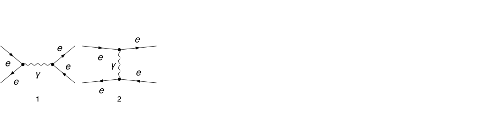
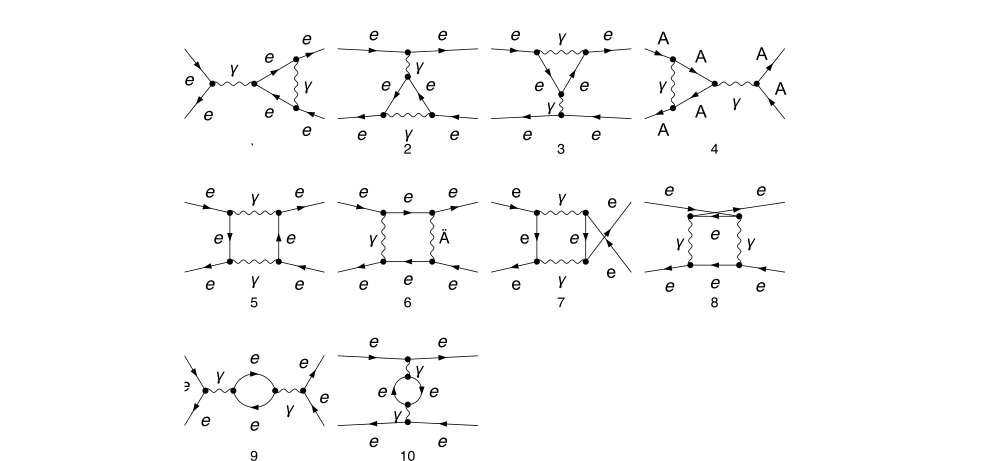
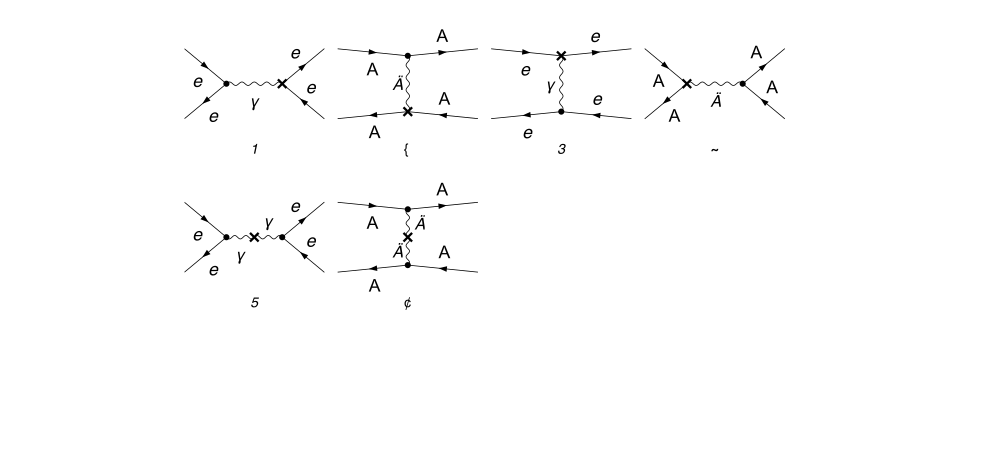

```mathematica
(* :Title: ElAel-ElAel2													*)
  
 (*
 	This software is covered by the GNU General Public License 3.
 	Copyright (C) 1990-2026 Rolf Mertig
 	Copyright (C) 1997-2026 Frederik Orellana
 	Copyright (C) 2014-2026 Vladyslav Shtabovenko
 *)
  
 (* :Summary:  El Ael -> El Ael, QED, Born-virtual, 1-loop		*)
  
 (* ------------------------------------------------------------------------ *)
 
```

---
title: Bhabha scattering
---


## Load FeynCalc and the necessary add-ons or other packages

```mathematica
description = "El Ael -> El Ael, QED, Born-virtual, 1-loop";
If[ $FrontEnd === Null, 
  	$FeynCalcStartupMessages = False; 
  	Print[description]; 
  ];
If[ $Notebooks === False, 
  	$FeynCalcStartupMessages = False 
  ];
LaunchKernels[4];
$LoadAddOns = {"FeynArts", "FeynHelpers"};
<< FeynCalc`
$FAVerbose = 0;
$ParallelizeFeynCalc = True; 
 
FCCheckVersion[10, 2, 0];
If[ToExpression[StringSplit[$FeynHelpersVersion, "."]][[1]] < 2, 
 	Print["You need at least FeynHelpers 2.0 to run this example."]; 
 	Abort[]; 
 ]
```

$$\text{FeynCalc }\;\text{10.2.0 (dev version, 2025-12-22 21:09:03 +01:00, fcd53f9b). For help, use the }\underline{\text{online} \;\text{documentation},}\;\text{ visit the }\underline{\text{forum}}\;\text{ and have a look at the supplied }\underline{\text{examples}.}\;\text{ The PDF-version of the manual can be downloaded }\underline{\text{here}.}$$

$$\text{If you use FeynCalc in your research, please evaluate FeynCalcHowToCite[] to learn how to cite this software.}$$

$$\text{Please keep in mind that the proper academic attribution of our work is crucial to ensure the future development of this package!}$$

$$\text{FeynArts }\;\text{3.12 (27 Mar 2025) patched for use with FeynCalc, for documentation see the }\underline{\text{manual}}\;\text{ or visit }\underline{\text{www}.\text{feynarts}.\text{de}.}$$

$$\text{If you use FeynArts in your research, please cite}$$

$$\text{ $\bullet $ T. Hahn, Comput. Phys. Commun., 140, 418-431, 2001, arXiv:hep-ph/0012260}$$

$$\text{FeynHelpers }\;\text{2.0.0 (2025-12-22 19:07:44 +01:00, c92fb9f5). For help, use the }\underline{\text{online} \;\text{documentation},}\;\text{ visit the }\underline{\text{forum}}\;\text{ and have a look at the supplied }\underline{\text{examples}.}\;\text{The PDF-version of the manual can be downloaded }\underline{\text{here}.}$$

$$\text{ If you use FeynHelpers in your research, please evaluate FeynHelpersHowToCite[] to learn how to cite this work.}$$

## Generate Feynman diagrams

Nicer typesetting

```mathematica
FCAttachTypesettingRule[p1, {SubscriptBox, "p", "1"}]
FCAttachTypesettingRule[p2, {SubscriptBox, "p", "2"}]
FCAttachTypesettingRule[k1, {SubscriptBox, "k", "1"}]
FCAttachTypesettingRule[k2, {SubscriptBox, "k", "2"}]
```

```mathematica
diagsTree = InsertFields[CreateTopologies[0, 2 -> 2, 
    	ExcludeTopologies -> {Tadpoles, WFCorrections}], {F[2, {1}], -F[2, {1}]} -> 
    	{F[2, {1}], -F[2, {1}]}, InsertionLevel -> {Particles}, 
   	Restrictions -> QEDOnly, ExcludeParticles -> {F[1 | 3 | 4, _], F[2, {3}]}];
Paint[diagsTree, ColumnsXRows -> {6, 1}, Numbering -> Simple, 
  	SheetHeader -> None, ImageSize -> {1024, 256}];
```



```mathematica
diagsLoop = InsertFields[CreateTopologies[1, 2 -> 2, 
    	ExcludeTopologies -> {Tadpoles, WFCorrections}], {F[2, {1}], -F[2, {1}]} -> 
    	{F[2, {1}], -F[2, {1}]}, InsertionLevel -> {Particles}, 
   	Restrictions -> QEDOnly, ExcludeParticles -> {F[1 | 3 | 4, _], F[2, {3}]}];
Paint[DiagramExtract[diagsLoop, 1 .. 8, 9, 11], ColumnsXRows -> {4, 3}, Numbering -> Simple, 
  	SheetHeader -> None, ImageSize -> {1024, 480}];
```



```mathematica
diagsLoopCT = InsertFields[CreateCTTopologies[1, 2 -> 2, ExcludeTopologies -> {Tadpoles, WFCorrectionCTs}], 
    		{F[2, {1}], -F[2, {1}]} -> {F[2, {1}], -F[2, {1}]}, InsertionLevel -> {Particles}, 
    		Restrictions -> QEDOnly, ExcludeParticles -> {F[1 | 3 | 4, _], F[2, {3}]}]; 
 
Paint[diagsLoopCT, ColumnsXRows -> {4, 3}, Numbering -> Simple, 
  	SheetHeader -> None, ImageSize -> {1024, 480}];
```



## Obtain the amplitudes

```mathematica
ampLoopCT[0] = FCFAConvert[CreateFeynAmp[diagsLoopCT, Truncated -> False, PreFactor -> 1] //. 
     {(h : dZfL1 | dZfR1)[z__] :> dZf1[z], Conjugate[(h : dZfL1 | dZfR1)[z__]] :> dZf1[z], dZZA1 -> 0}, 
    IncomingMomenta -> {p1, p2}, OutgoingMomenta -> {k1, k2}, LoopMomenta -> {l}, ChangeDimension -> D, 
    DropSumOver -> True, UndoChiralSplittings -> True, SMP -> True, 
    FinalSubstitutions -> {SMP["m_e"] -> 0, SMP["m_mu"] -> 0}];
```

```mathematica
ampLoop[0] = FCFAConvert[CreateFeynAmp[DiagramExtract[diagsLoop, 1 .. 8, 9, 11], 
    	Truncated -> False, PreFactor -> 1], IncomingMomenta -> {p1, p2},OutgoingMomenta -> {k1, k2}, 
   	LoopMomenta -> {q}, ChangeDimension -> D, DropSumOver -> True, UndoChiralSplittings -> True, 
   	SMP -> True, FinalSubstitutions -> {SMP["m_e"] -> 0, SMP["m_mu"] -> 0}];
```

```mathematica
ampTree[0] = FCFAConvert[CreateFeynAmp[diagsTree, Truncated -> False, PreFactor -> 1], 
   	IncomingMomenta -> {p1, p2}, OutgoingMomenta -> {k1, k2}, 
   	ChangeDimension -> D, DropSumOver -> True, UndoChiralSplittings -> True, 
   	SMP -> True, FinalSubstitutions -> {SMP["m_e"] -> 0, SMP["m_mu"] -> 0}];
```

## Fix the kinematics

```mathematica
FCClearScalarProducts[];
SetMandelstam[-t - u(*s*), t, u, p1, p2, -k1, -k2, 0, 0, 0, 0]
```

$$\left\{0,\frac{1}{2} (-t-u),-\frac{t}{2},-\frac{u}{2},0,-\frac{u}{2},-\frac{t}{2},0,\frac{1}{2} (-t-u),0,0,\frac{1}{2} (-t-u),-\frac{t}{2},-\frac{u}{2},0,-\frac{u}{2},-\frac{t}{2},0,\frac{1}{2} (-t-u),0\right\}$$

## Evaluate the amplitudes

```mathematica
ampTree[1] = ampTree[0] // DotSimplify[#, Expanding -> False] &;
```

```mathematica
ampTree[2] = ampTree[1] // Contract[#, FCParallelize -> True] & // DiracSimplify[#, FCParallelize -> True] & // 
     FeynAmpDenominatorExplicit // FCCanonicalizeDummyIndices[#, LorentzIndexNames -> {mu}, FCParallelize -> True] & // Total
```

$$\frac{i \;\text{e}^2 \left(\varphi (k_1)\right).\gamma ^{\text{mu}}.\left(\varphi (p_1)\right) \left(\varphi (-p_2)\right).\gamma ^{\text{mu}}.\left(\varphi (-k_2)\right)}{t}-\frac{i \;\text{e}^2 \left(\varphi (k_1)\right).\gamma ^{\text{mu}}.\left(\varphi (-k_2)\right) \left(\varphi (-p_2)\right).\gamma ^{\text{mu}}.\left(\varphi (p_1)\right)}{-t-u}$$

```mathematica
ampLoopCT[1] = ampLoopCT[0] // DotSimplify[#, Expanding -> False] &;
```

```mathematica
amlLoop[0] = Join[ampLoop[0][[1 ;; 8]], Nf ampLoop[0][[9 ;; 9]], Nf ampLoop[0][[10 ;; 10]]];
```

```mathematica
AbsoluteTiming[amlLoop[1] = amlLoop[0] // Contract[#, FCParallelize -> True] & // DiracSimplify[#, FCParallelize -> True] &;]
```

$$\{0.39252,\text{Null}\}$$

## Identify and minimize the topologies

```mathematica
{amlLoop[2], topos} = FCLoopFindTopologies[amlLoop[1], {q}, FCParallelize -> True];
```

$$\text{FCLoopFindTopologies: Number of the initial candidate topologies: }9$$

$$\text{FCLoopFindTopologies: Number of the identified unique topologies: }6$$

$$\text{FCLoopFindTopologies: Number of the preferred topologies among the unique topologies: }0$$

$$\text{FCLoopFindTopologies: Number of the identified subtopologies: }3$$

```mathematica
subtopos = FCLoopFindSubtopologies[topos, FCParallelize -> True];
```

```mathematica
mappings = FCLoopFindTopologyMappings[topos, PreferredTopologies -> subtopos, FCParallelize -> True];
```

$$\text{FCLoopFindTopologyMappings: }\;\text{Found }3\text{ mapping relations }$$

$$\text{FCLoopFindTopologyMappings: }\;\text{Final number of independent topologies: }3$$

## Rewrite the amplitude in terms of GLIs

```mathematica
AbsoluteTiming[ampReduced = FCLoopTensorReduce[amlLoop[2], topos, FCParallelize -> True];]
```

$$\{2.04755,\text{Null}\}$$

```mathematica
AbsoluteTiming[ampPreFinal = FCLoopApplyTopologyMappings[ampReduced, mappings, FCParallelize -> True];]
```

$$\{4.54486,\text{Null}\}$$

```mathematica
AbsoluteTiming[ampFinal = ampPreFinal // DiracSimplify[#, FCParallelize -> True] & // 
       FCCanonicalizeDummyIndices[#, LorentzIndexNames -> {mu, nu, rho}, FCParallelize -> True] & //
      FeynAmpDenominatorExplicit // Collect2[#, DOT, FCParallelize -> True] &;]
```

$$\{7.16698,\text{Null}\}$$

```mathematica
dir = FileNameJoin[{$TemporaryDirectory, "Reduction-ElAelToElAel2"}];
Quiet[CreateDirectory[dir]];
```

```mathematica
FIREPrepareStartFile[mappings[[2]], dir];
```

```mathematica
FIRECreateLiteRedFiles[dir, mappings[[2]]];
```

```mathematica
FIRECreateStartFile[dir, mappings[[2]]];
```

```mathematica
FIRECreateIntegralFile[Cases2[ampPreFinal, GLI], mappings[[2]], dir];
```

$$\text{FIRECreateIntegralFile: }\;\text{fctopology1}\;\text{, number of loop integrals: }43$$

$$\text{FIRECreateIntegralFile: }\;\text{fctopology2}\;\text{, number of loop integrals: }21$$

$$\text{FIRECreateIntegralFile: }\;\text{fctopology3}\;\text{, number of loop integrals: }28$$

```mathematica
FIRECreateConfigFile[mappings[[2]], dir];
```

$$\text{FIRECreateConfigFile: Created .config file fctopology1.config for }\;\text{fctopology1}$$

$$\text{FIRECreateConfigFile: Created .config file fctopology2.config for }\;\text{fctopology2}$$

$$\text{FIRECreateConfigFile: Created .config file fctopology3.config for }\;\text{fctopology3}$$

```mathematica
FIRERunReduction[dir, mappings[[2]]];
```

```mathematica
reductionTable = FIREImportResults[mappings[[2]], dir] // Flatten;
```

```mathematica
resPreFinal = Collect2[Total[ampFinal /. Dispatch[reductionTable]], GLI, FCParallelize -> True];
```

```mathematica
integralMappings = FCLoopFindIntegralMappings[Cases2[resPreFinal, GLI], mappings[[2]], FCParallelize -> True]
```

$$\left\{\left\{G^{\text{fctopology2}}(0,1,0,1)\to G^{\text{fctopology1}}(0,1,0,1),G^{\text{fctopology3}}(0,1,0,1)\to G^{\text{fctopology1}}(1,0,1,0),G^{\text{fctopology3}}(1,0,1,0)\to G^{\text{fctopology2}}(1,0,1,0)\right\},\left\{G^{\text{fctopology1}}(0,1,0,1),G^{\text{fctopology1}}(1,0,1,0),G^{\text{fctopology1}}(1,1,1,1),G^{\text{fctopology2}}(1,0,1,0),G^{\text{fctopology2}}(1,1,1,1),G^{\text{fctopology3}}(1,1,1,1)\right\}\right\}$$

```mathematica
resFinal = Collect2[(resPreFinal /. Dispatch[integralMappings[[1]]]), GLI, FCParallelize -> True];
```

Obtain the Born-virtual interference term

```mathematica
(*about 10 seconds*)
  AbsoluteTiming[bornVirtualUnrenormalized[0] = 
    	Collect2[resFinal, Spinor, LorentzIndex, IsolateNames -> KK] *
         	ComplexConjugate[ampTree[2]] // 
        	FermionSpinSum[#, ExtraFactor -> 1/2^2] & // DiracSimplify //
      	FRH // Collect2[#, GLI, FCParallelize -> True] &;]
```

$$\{14.8367,\text{Null}\}$$

Master integrals using the standard textbook normalization

```mathematica
ruleMasters = {GLI["fctopology1", {0, 1, 0, 1}] -> (I/16)/(ep*Pi^2) + (2*I - I*EulerGamma + Pi)/(16*Pi^2) + 
      (ep*(48*I - (24*I)*EulerGamma + (6*I)*EulerGamma^2 + 24*Pi - 12*EulerGamma*Pi - (7*I)*Pi^2))/
          (192*Pi^2) + ((I/8)*Log[2])/Pi^2 + (ep*(2*I - I*EulerGamma + Pi)*Log[2])/(8*Pi^2) + ((I/8)*ep*Log[2]^2)/Pi^2 + 
         ((I/16)*Log[Pi])/Pi^2 + (ep*(2*I - I*EulerGamma + Pi)*Log[Pi])/(16*Pi^2) + 
        ((I/8)*ep*Log[2]*Log[Pi])/Pi^2 + ((I/32)*ep*Log[Pi]^2)/Pi^2 - ((I/16)*Log[-t - u])/Pi^2 - 
        (ep*(2*I - I*EulerGamma + Pi)*Log[-t - u])/(16*Pi^2) - ((I/8)*ep*Log[2]*Log[-t - u])/Pi^2 - 
        ((I/16)*ep*Log[Pi]*Log[-t - u])/Pi^2 + ((I/32)*ep*Log[-t - u]^2)/Pi^2, 
      GLI["fctopology1", {1, 0, 1, 0}] -> (I/16)/(ep*Pi^2) - ((I/16)*(-2 + EulerGamma))/Pi^2 - 
        ((I/192)*ep*(-48 + 24*EulerGamma - 6*EulerGamma^2 + Pi^2))/Pi^2 + ((I/8)*Log[2])/Pi^2 - 
        ((I/8)*ep*(-2 + EulerGamma)*Log[2])/Pi^2 + ((I/8)*ep*Log[2]^2)/Pi^2 + ((I/16)*Log[Pi])/Pi^2 - 
        ((I/16)*ep*(-2 + EulerGamma)*Log[Pi])/Pi^2 + ((I/8)*ep*Log[2]*Log[Pi])/Pi^2 + ((I/32)*ep*Log[Pi]^2)/Pi^2 - 
        ((I/16)*Log[-t])/Pi^2 + ((I/16)*ep*(-2 + EulerGamma)*Log[-t])/Pi^2 - 
        ((I/8)*ep*Log[2]*Log[-t])/Pi^2 - ((I/16)*ep*Log[Pi]*Log[-t])/Pi^2 + ((I/32)*ep*Log[-t]^2)/Pi^2, 
    GLI["fctopology2", {1, 0, 1, 0}] -> (I/16)/(ep*Pi^2) - ((I/16)*(-2 + EulerGamma))/Pi^2 - 
      ((I/192)*ep*(-48 + 24*EulerGamma - 6*EulerGamma^2 + Pi^2))/Pi^2 + ((I/8)*Log[2])/Pi^2 - 
        ((I/8)*ep*(-2 + EulerGamma)*Log[2])/Pi^2 + ((I/8)*ep*Log[2]^2)/Pi^2 + ((I/16)*Log[Pi])/Pi^2 - 
        ((I/16)*ep*(-2 + EulerGamma)*Log[Pi])/Pi^2 + ((I/8)*ep*Log[2]*Log[Pi])/Pi^2 + 
        ((I/32)*ep*Log[Pi]^2)/Pi^2 - ((I/16)*Log[-u])/Pi^2 + ((I/16)*ep*(-2 + EulerGamma)*Log[-u])/Pi^2 - 
        ((I/8)*ep*Log[2]*Log[-u])/Pi^2 - ((I/16)*ep*Log[Pi]*Log[-u])/Pi^2 + 
        ((I/32)*ep*Log[-u]^2)/Pi^2, GLI["fctopology1", {1, 1, 1, 1}] -> (-1/4*I)/(ep^2*Pi^2*t*(t + u)) + 
        ((I/8)*(2*EulerGamma + I*Pi))/(ep*Pi^2*t*(t + u)) + 
        ((-3*I)*EulerGamma^2 + 3*EulerGamma*Pi + (2*I)*Pi^2)/(24*Pi^2*t*(t + u)) - ((I/2)*Log[2])/(ep*Pi^2*t*(t + u)) + 
        ((I/4)*(2*EulerGamma + I*Pi)*Log[2])/(Pi^2*t*(t + u)) - 
        ((I/2)*Log[2]^2)/(Pi^2*t*(t + u)) - ((I/4)*Log[Pi])/(ep*Pi^2*t*(t + u)) + 
        ((I/8)*(2*EulerGamma + I*Pi)*Log[Pi])/(Pi^2*t*(t + u)) - ((I/2)*Log[2]*Log[Pi])/(Pi^2*t*(t + u)) - 
        ((I/8)*Log[Pi]^2)/(Pi^2*t*(t + u)) + ((I/8)*Log[-t])/(ep*Pi^2*t*(t + u)) + 
        (((-I)*EulerGamma + Pi)*Log[-t])/(8*Pi^2*t*(t + u)) + ((I/4)*Log[2]*Log[-t])/(Pi^2*t*(t + u)) + 
        ((I/8)*Log[Pi]*Log[-t])/(Pi^2*t*(t + u)) + ((I/8)*Log[-t - u])/(ep*Pi^2*t*(t + u)) - 
        ((I/8)*EulerGamma*Log[-t - u])/(Pi^2*t*(t + u)) + ((I/4)*Log[2]*Log[-t - u])/(Pi^2*t*(t + u)) + 
        ((I/8)*Log[Pi]*Log[-t - u])/(Pi^2*t*(t + u)) - ((I/8)*Log[-t]*Log[-t - u])/(Pi^2*t*(t + u)), 
    GLI["fctopology2", {1, 1, 1, 1}] -> (-1/4*I)/(ep^2*Pi^2*u*(t + u)) + ((I/8)*(2*EulerGamma + I*Pi))/(ep*Pi^2*u*(t + u)) + 
        ((-3*I)*EulerGamma^2 + 3*EulerGamma*Pi + (2*I)*Pi^2)/(24*Pi^2*u*(t + u)) - 
        ((I/2)*Log[2])/(ep*Pi^2*u*(t + u)) + ((I/4)*(2*EulerGamma + I*Pi)*Log[2])/(Pi^2*u*(t + u)) - 
        ((I/2)*Log[2]^2)/(Pi^2*u*(t + u)) - ((I/4)*Log[Pi])/(ep*Pi^2*u*(t + u)) + 
        ((I/8)*(2*EulerGamma + I*Pi)*Log[Pi])/(Pi^2*u*(t + u)) - ((I/2)*Log[2]*Log[Pi])/(Pi^2*u*(t + u)) - 
        ((I/8)*Log[Pi]^2)/(Pi^2*u*(t + u)) + ((I/8)*Log[-t - u])/(ep*Pi^2*u*(t + u)) - 
        ((I/8)*EulerGamma*Log[-t - u])/(Pi^2*u*(t + u)) + ((I/4)*Log[2]*Log[-t - u])/(Pi^2*u*(t + u)) + 
        ((I/8)*Log[Pi]*Log[-t - u])/(Pi^2*u*(t + u)) + ((I/8)*Log[-u])/(ep*Pi^2*u*(t + u)) + 
        (((-I)*EulerGamma + Pi)*Log[-u])/(8*Pi^2*u*(t + u)) + ((I/4)*Log[2]*Log[-u])/(Pi^2*u*(t + u)) + 
        ((I/8)*Log[Pi]*Log[-u])/(Pi^2*u*(t + u)) - ((I/8)*Log[-t - u]*Log[-u])/(Pi^2*u*(t + u)), 
    GLI["fctopology3", {1, 1, 1, 1}] -> (I/4)/(ep^2*Pi^2*t*u) - ((I/4)*EulerGamma)/(ep*Pi^2*t*u) + 
      ((I/24)*(3*EulerGamma^2 - 2*Pi^2))/(Pi^2*t*u) + ((I/2)*Log[2])/(ep*Pi^2*t*u) - 
        ((I/2)*EulerGamma*Log[2])/(Pi^2*t*u) + ((I/2)*Log[2]^2)/(Pi^2*t*u) + ((I/4)*Log[Pi])/(ep*Pi^2*t*u) - 
        ((I/4)*EulerGamma*Log[Pi])/(Pi^2*t*u) + ((I/2)*Log[2]*Log[Pi])/(Pi^2*t*u) + 
        ((I/8)*Log[Pi]^2)/(Pi^2*t*u) - ((I/8)*Log[-t])/(ep*Pi^2*t*u) + ((I/8)*EulerGamma*Log[-t])/(Pi^2*t*u) - 
        ((I/4)*Log[2]*Log[-t])/(Pi^2*t*u) - ((I/8)*Log[Pi]*Log[-t])/(Pi^2*t*u) - 
        ((I/8)*Log[-u])/(ep*Pi^2*t*u) + ((I/8)*EulerGamma*Log[-u])/(Pi^2*t*u) - 
        ((I/4)*Log[2]*Log[-u])/(Pi^2*t*u) - ((I/8)*Log[Pi]*Log[-u])/(Pi^2*t*u) + ((I/8)*Log[-t]*Log[-u])/(Pi^2*t*u)};
```

```mathematica
bornVirtualUnrenormalized[1] = Collect2[FCReplaceD[(bornVirtualUnrenormalized[0] /. ruleMasters), D -> 4 - 2 ep], ep, 
        IsolateNames -> KK] // Series[#, {ep, 0, 0}] & // Normal // FRH // Collect2[#, ep] &;
```

The explicit expressions for the PaVe functions can be obtained e.g. using Package-X / PaXEvaluate

Put together the counter-term contribution. The wave-function renormalization must be done in the OS scheme, which gives no contribution due to massless electrons and muons.

```mathematica
MSbarRC = {
   	SMP["dZ_psi"] -> 0, 
   	SMP["dZ_A"] -> - Nf SMP["e"]^2/(12 Pi^2) (1/ep - EulerGamma + Log[4 Pi]) 
   };
```

```mathematica
RuleRS = {
   	dZe1 -> - 1/2 SMP["dZ_A"], 
   	dZAA1 -> SMP["dZ_A"], 
   	(dZf1 | dZf2)[__] -> SMP["dZ_psi"] 
   };
```

```mathematica
fullCTAndResidue[0] = (ampLoopCT[1] /. RuleRS /. MSbarRC) // FeynAmpDenominatorExplicit // Contract[#, FCParallelize -> True] & // 
     	DiracSimplify[#, FCParallelize -> True] & // FCCanonicalizeDummyIndices[#, LorentzIndexNames -> {mu}, FCParallelize -> True] & // Total;
```

Get the interference of the counter term and residue contribution with the Born amplitude

```mathematica
bornCTAndResidue[0] = fullCTAndResidue[0] ComplexConjugate[ampTree[2]] // FermionSpinSum[#, ExtraFactor -> 1/2^2] & // 
       DiracSimplify // Simplify // FCReplaceD[#, D -> 4 - 2 ep] & // Series[#, {ep, 0, 0}] & // Normal
```

$$\frac{\text{e}^6 N_f \left(t^4+2 t^3 u+3 t^2 u^2+2 t u^3+u^4\right)}{3 \pi ^2 \;\text{ep} t^2 (t+u)^2}+\frac{\text{e}^6 N_f \left(4 t^2 u^2-4 (\gamma -\log (4 \pi )) \left(t^4+2 t^3 u+3 t^2 u^2+2 t u^3+u^4\right)+4 t u^3\right)}{12 \pi ^2 t^2 (t+u)^2}$$

Finally, we obtain the UV-finite but IR-divergent Born-virtual interference term

```mathematica
bornVirtualRenormalized[0] = (bornVirtualUnrenormalized[1] + bornCTAndResidue[0]) // Collect2[#, ep, FCParallelize -> True] &;
```

Introduce the prefactor from the literature that removes $\Gamma_E$ and logs of $\pi$

```mathematica
bornVirtualRenormalized[1] = Series[FCReplaceD[1/Exp[ep (Log[4 Pi] - EulerGamma)] bornVirtualRenormalized[0], D -> 4 - 2 ep], {ep, 0, 0}] // Normal // 
    ReplaceAll[#, Log[4 Pi] -> 2 Log[2] + Log[Pi]] & // Collect2[#, ep, FCParallelize -> True] &
```

$$-\frac{\left(t^2+u t+u^2\right)^2 \;\text{e}^6}{\text{ep}^2 \pi ^2 t^2 (t+u)^2}+\frac{1}{2 \;\text{ep} \pi ^2 t^2 (t+u)^2}\left(2 \log (-t) t^4+2 \log (-t-u) t^4-2 \log (-u) t^4+2 i \pi  t^4-3 t^4+4 i \pi  u t^3-6 u t^3+4 u \log (-t) t^3+4 u \log (-t-u) t^3-4 u \log (-u) t^3+6 i \pi  u^2 t^2-11 u^2 t^2+6 u^2 \log (-t) t^2+6 u^2 \log (-t-u) t^2-6 u^2 \log (-u) t^2+4 i \pi  u^3 t-8 u^3 t+4 u^3 \log (-t) t+4 u^3 \log (-t-u) t-4 u^3 \log (-u) t+2 i \pi  u^4-3 u^4+2 u^4 \log (-t)+2 u^4 \log (-t-u)-2 u^4 \log (-u)\right) \;\text{e}^6+\frac{1}{72 \pi ^2 t^2 (t+u)^2}\left(-9 \log ^2(-t) t^4-9 \log ^2(-t-u) t^4+18 \log ^2(-u) t^4-40 N_f t^4+12 N_f \log (-t) t^4-72 i \pi  \log (-t) t^4+72 \log (-t) t^4+12 N_f \log (-t-u) t^4-72 \log (-t) \log (-t-u) t^4-18 i \pi  \log (-t-u) t^4+72 \log (-t-u) t^4+18 \log (-t) \log (-u) t^4+18 \log (-t-u) \log (-u) t^4+18 i \pi  \log (-u) t^4-36 \log (-u) t^4+33 \pi ^2 t^4+12 i N_f \pi  t^4+72 i \pi  t^4-216 t^4-36 u \log ^2(-t) t^3+36 u \log ^2(-u) t^3-80 N_f u t^3+48 \pi ^2 u t^3+18 i \pi  u t^3-432 u t^3+48 N_f u \log (-t) t^3-144 i \pi  u \log (-t) t^3+270 u \log (-t) t^3+18 u \log (-t-u) t^3-144 u \log (-t) \log (-t-u) t^3-72 u \log (-u) t^3+72 u \log (-t) \log (-u) t^3-120 N_f u^2 t^2+63 \pi ^2 u^2 t^2+72 i \pi  u^2 t^2-900 u^2 t^2-36 u^2 \log ^2(-t) t^2+18 u^2 \log ^2(-t-u) t^2+36 u^2 \log ^2(-u) t^2+72 N_f u^2 \log (-t) t^2-270 i \pi  u^2 \log (-t) t^2+450 u^2 \log (-t) t^2+36 i \pi  u^2 \log (-t-u) t^2+72 u^2 \log (-t-u) t^2-270 u^2 \log (-t) \log (-t-u) t^2+18 i \pi  u^2 \log (-u) t^2-126 u^2 \log (-u) t^2+126 u^2 \log (-t) \log (-u) t^2+18 u^2 \log (-t-u) \log (-u) t^2-80 N_f u^3 t+12 \pi ^2 u^3 t-12 i N_f \pi  u^3 t+18 i \pi  u^3 t-684 u^3 t-45 u^3 \log ^2(-t) t+45 u^3 \log ^2(-t-u) t+18 u^3 \log ^2(-u) t+60 N_f u^3 \log (-t) t-198 i \pi  u^3 \log (-t) t+360 u^3 \log (-t) t-12 N_f u^3 \log (-t-u) t+90 i \pi  u^3 \log (-t-u) t+18 u^3 \log (-t-u) t-198 u^3 \log (-t) \log (-t-u) t-36 i \pi  u^3 \log (-u) t-90 u^3 \log (-u) t+144 u^3 \log (-t) \log (-u) t-36 u^3 \log (-t-u) \log (-u) t-40 N_f u^4+6 \pi ^2 u^4-288 u^4-36 u^4 \log ^2(-t)+24 N_f u^4 \log (-t)-72 i \pi  u^4 \log (-t)+108 u^4 \log (-t)-72 u^4 \log (-t) \log (-t-u)+72 u^4 \log (-t) \log (-u)\right) \;\text{e}^6$$

We can compare our O(eps^0) result to Eq. 2.32 in arXiv:hep-ph/0010075

```mathematica
ClearAll[LitA, LitATilde, auxBox6, Box6Eval, TriEval];
Li4 = PolyLog[4, #1] &;
ruleLit = {LitV -> Log[-s/u], LitW -> Log[-t/u], v -> s/u, w -> t/u};
```

```mathematica
LitA = (
    4*GaugeXi*(1 - 2 ep)*u/s^2 ((2 - 3*ep) u^2 - 6*ep*t*u + 3 (2 - ep) t^2)*Box6[s, t] 
     
     - 4 GaugeXi/(1 - 2 ep)*t/s^2*((4 - 12*ep + 7*ep^2) t^2 - 
        6*ep*(1 - 2*ep)*t*u + (4 - 10*ep + 5*ep^2)*u^2)*Tri[t] 
     
     - 8/((1 - 2*ep) (3 - 2*ep))*1/s*(2 ep (1 - ep)*t*((1 - ep)*t - ep*u)*Nf - 
        ep (3 - 2*ep)*(2 - ep + 2*ep^2)*t*u + 
        (1 - ep) (3 - 2*ep) (2 - (1 - GaugeXi)*ep + 2 ep^2) t^2)*Tri[s]);
```

```mathematica
LitATilde = (
    8 (1 - 2 ep) u/(s t) ((1 - 4 ep + ep^2) t^2 - 
        2 ep (2 - ep) t*u + (1 - ep)^2 u^2) Box6[s, t] 
     
     + 8 (1 - 2 ep) 1/s (ep (2 - 3 ep - ep^2) t^2 + 
        2 ep (1 - 3 ep - ep^2) t*u - (2 - 2 ep + 3 ep^2 + ep^3) u^2) Box6[s, u] 
     
     - 8 (1 - ep)/((1 - 2*ep) (3 - 2*ep))*1/t (2 ep*(1 - ep) (u^2 + ep s t) Nf 
        - (3 - 2 ep) (2 ep (1 + ep^2) t^2 + ep (3 + 2 ep^2) t*u - 
          	2 (1 - ep + ep^2) u^2)) Tri[s] 
     
     + 8/(1 - 2*ep)*1/s (ep (2 - 5 ep + 2 ep^2 - ep^3) t^2 + 
       	ep (1 - 3 ep + ep^2 - ep^3) t*u - 
       	(1 - ep) (2 - 3 ep - ep^2) u^2) Tri[t] 
     
     - 8/(1 - 2*ep)*u/(s t) (ep (2 - 4 ep + ep^2 - ep^3) t^2 + 
       	ep (2 - 3 ep - ep^3) t*u - (1 - ep) (2 - 4 ep - ep^2) u^2) Tri[u]);
```

```mathematica
auxBox6 = (1/2 ((LitV - LitW)^2 + Pi^2) + 2*ep*(Li3[-v] - LitV Li2[-v] - 1/3 LitV^3 - Pi^2/2 LitV) 
      - 2 ep^2 (Li4[-v] + LitW Li3[-v] - 1/2 LitV^2 Li2[-v] - 1/8 LitV^4 - 
         1/6 LitV^3 LitW + 1/4*LitV^2*LitW^2 - Pi^2/4 LitV^2 - Pi^2/3 LitV LitW - 2 Zeta4)); 
 
Box6Eval[s, t] = u^(-1 - ep)/(2 (1 - 2*ep)) (1 - Pi^2/12 ep^2) (
      auxBox6 + (auxBox6 /. {LitW -> LitV, LitV -> LitW, v -> w, w -> v})); 
 
Box6Eval[s, u] = Box6Eval[s, t] /. ruleLit /. {t -> u, u -> t}; 
 
TriEval[s_] := -(-s)^(-1 - ep)/ep^2 (1 - Pi^2/12 ep^2 - 
    	7/3 Zeta[3] ep^3 - 47/16 Zeta4 ep^4)
```

```mathematica
reLitAux = (( 2/3 Nf/ep*8 ((t^2 + u^2)/s^2 - ep) 
        
        + ((LitA /. {Tri -> TriEval, Box6 -> Box6Eval} /. ruleLit) + 
          (LitA /. {Tri -> TriEval, Box6 -> Box6Eval} /. 
              {GaugeXi -> -GaugeXi} /. ruleLit /. {t -> u, u -> t})) /. GaugeXi -> 1) + 
     
     +2/3 Nf/ep*8*(1 - ep) ((u^2)/(s t) + ep) 
     
     + ((LitATilde /. {Tri -> TriEval, Box6 -> Box6Eval} /. ruleLit)));
```

knownResult is the 1-loop result. Notice that is also an implicit overall prefactor prefLit from Eq. 2.8

```mathematica
prefLit = 32 Pi^2/SMP["e"]^6;
```

```mathematica
knownResult = (reLitAux + (reLitAux /. {s -> t, t -> s}));
```

```mathematica
knownResultExpanded = Series[FCReplaceD[knownResult, D -> 4 - 2 ep], {ep, 0, 0}] // Normal;
```

```mathematica
((prefLit bornVirtualRenormalized[1] - knownResultExpanded) /. s -> -t - u) // PowerExpand // ReplaceRepeated[#, Log[-t - u] -> Log[t + u] - I Pi] & // Simplify
```

$$0$$

```mathematica
diff = ((prefLit bornVirtualRenormalized[1] - knownResultExpanded) /. s -> -t - u) // PowerExpand // 
    ReplaceRepeated[#, Log[-t - u] -> Log[t + u] - I Pi] & // Simplify
```

$$0$$

## Check the final results

```mathematica
FCCompareResults[0, diff, 
   Text -> {"\tCompare to arXiv:hep-ph/0010075:", 
     "CORRECT.", "WRONG!"}, Interrupt -> {Hold[Quit[1]], Automatic}];
Print["\tCPU Time used: ", Round[N[TimeUsed[], 4], 0.001], " s."];

```mathematica

$$\text{$\backslash $tCompare to arXiv:hep-ph/0010075:} \;\text{CORRECT.}$$

$$\text{$\backslash $tCPU Time used: }57.136\text{ s.}$$