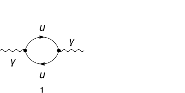
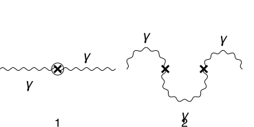
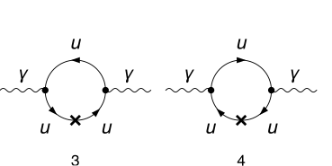
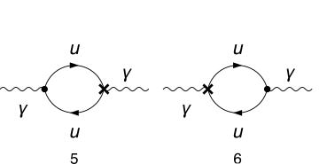
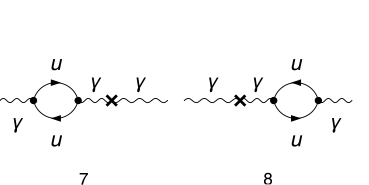

## Load FeynCalc and the necessary add-ons or other packages

```mathematica
description = "Ga -> Ga, QED, only UV divergences, 1-loop";
If[ $FrontEnd === Null, 
  	$FeynCalcStartupMessages = False; 
  	Print[description]; 
  ];
If[ $Notebooks === False, 
  	$FeynCalcStartupMessages = False 
  ];
LaunchKernels[4];
$LoadAddOns = {"FeynArts", "FeynHelpers"};
<< FeynCalc`
$FAVerbose = 0;
$ParallelizeFeynCalc = True; 
 
FCCheckVersion[10, 2, 0];
If[ToExpression[StringSplit[$FeynHelpersVersion, "."]][[1]] < 2, 
 	Print["You need at least FeynHelpers 2.0 to run this example."]; 
 	Abort[]; 
 ]
```

$$\text{FeynCalc }\;\text{10.2.0 (dev version, 2026-05-18 15:58:48 +02:00, 1a8e687c). For help, use the }\underline{\text{online} \;\text{documentation},}\;\text{ visit the }\underline{\text{forum}}\;\text{ and have a look at the supplied }\underline{\text{examples}.}\;\text{ The PDF-version of the manual can be downloaded }\underline{\text{here}.}$$

$$\text{If you use FeynCalc in your research, please evaluate FeynCalcHowToCite[] to learn how to cite this software.}$$

$$\text{Please keep in mind that the proper academic attribution of our work is crucial to ensure the future development of this package!}$$

$$\text{FeynArts }\;\text{3.12 (27 Mar 2025) patched for use with FeynCalc, for documentation see the }\underline{\text{manual}}\;\text{ or visit }\underline{\text{www}.\text{feynarts}.\text{de}.}$$

$$\text{If you use FeynArts in your research, please cite}$$

$$\text{ $\bullet $ T. Hahn, Comput. Phys. Commun., 140, 418-431, 2001, arXiv:hep-ph/0012260}$$

$$\text{FeynHelpers }\;\text{2.0.0 (2026-02-05 17:03:01 +02:00, 5db84fbb). For help, use the }\underline{\text{online} \;\text{documentation},}\;\text{ visit the }\underline{\text{forum}}\;\text{ and have a look at the supplied }\underline{\text{examples}.}\;\text{ The PDF-version of the manual can be downloaded }\underline{\text{here}.}$$

$$\text{ If you use FeynHelpers in your research, please evaluate FeynHelpersHowToCite[] to learn how to cite this work.}$$

## Generate Feynman diagrams

Nicer typesetting

```mathematica
FCAttachTypesettingRule[mu, "\[Mu]"];
FCAttachTypesettingRule[nu, "\[Nu]"];
```

```mathematica
diags = InsertFields[CreateTopologies[1, 1 -> 1], {V[1]} -> 
    		{V[1]}, InsertionLevel -> {Particles}, 
   		ExcludeParticles -> {S[_], V[2 | 3], (S | U)[_], F[4], F[3, {2 | 3}], F[2]}];
diagsCT = InsertFields[CreateCTTopologies[2, 1 -> 1], {V[1]} -> 
    		{V[1]}, InsertionLevel -> {Particles}, 
   		ExcludeParticles -> {S[_], V[2 | 3], (S | U)[_], V[2 | 3 | 4], F[4], F[3, {2 | 3}], F[2]}];
```

```mathematica
Paint[diags, ColumnsXRows -> {2, 1}, Numbering -> Simple, 
  	SheetHeader -> None, ImageSize -> 256 {2, 1}];
```



```mathematica
Paint[diagsCT, ColumnsXRows -> {2, 1}, Numbering -> Simple, 
  	SheetHeader -> None, ImageSize -> 256 {2, 1}];
```









## Obtain the amplitude

```mathematica
photonSE$RawAmp = FCFAConvert[CreateFeynAmp[diags, Truncated -> True, PreFactor -> 1], 
    	IncomingMomenta -> {q}, OutgoingMomenta -> {q}, LoopMomenta -> {k}, 
    	LorentzIndexNames -> {mu, nu}, UndoChiralSplittings -> True, 
    	ChangeDimension -> D, SMP -> True] /. {SumOver[SUNFIndex[Col3], 3] -> SUNN} /. SMP["m_e"] | SMP["m_u"] -> 0
```

$$\left\{\frac{N \;\text{tr}\left((-(\gamma \cdot k)).\left(-\frac{2}{3} i \;\text{e} \gamma ^{\nu }\right).(\gamma \cdot (q-k)).\left(-\frac{2}{3} i \;\text{e} \gamma ^{\mu }\right)\right)}{k^2.(k-q)^2}\right\}$$

```mathematica
photonSE$Amp1 = {(3/2)^2 eQ^2 Nf photonSE$RawAmp[[1]]}
```

$$\left\{\frac{9 \;\text{eQ}^2 N N_f \;\text{tr}\left((-(\gamma \cdot k)).\left(-\frac{2}{3} i \;\text{e} \gamma ^{\nu }\right).(\gamma \cdot (q-k)).\left(-\frac{2}{3} i \;\text{e} \gamma ^{\mu }\right)\right)}{4 k^2.(k-q)^2}\right\}$$

```mathematica
photonSECT$AmpRaw = FCFAConvert[CreateFeynAmp[diagsCT, Truncated -> True, PreFactor -> 1],
   	IncomingMomenta -> {q}, OutgoingMomenta -> {q}, LoopMomenta -> {k},
   	LorentzIndexNames -> {mu, nu}, UndoChiralSplittings -> True, 
   	ChangeDimension -> D, SMP -> True] /. {SumOver[SUNFIndex[Col3], 3] -> SUNN}
```

$$\left\{\frac{1}{4} i \;\text{dZZA1}^2 g^{\mu \nu } m_Z^2-i \left(-\frac{\text{dZZA1}^2}{4}-\text{dZAA2}\right) q^{\mu } q^{\nu }-i \left(\frac{\text{dZZA1}^2}{4}+\text{dZAA2}\right) g^{\mu \nu } q^2,-\frac{i g^{\text{Lor3}\;\text{Lor4}} \left(i \;\text{dZAA1} q^{\text{Lor3}} q^{\nu }-i \;\text{dZAA1} g^{\text{Lor3}\nu } q^2\right) \left(i \;\text{dZAA1} q^{\text{Lor4}} q^{\mu }-i \;\text{dZAA1} g^{\text{Lor4}\mu } q^2\right)}{q^2},\frac{1}{\left(k^2-m_u^2\right){}^2.\left((k+q)^2-m_u^2\right)}i N \;\text{tr}\left(\left(\gamma \cdot k+m_u\right).\left(\frac{2}{3} i \gamma ^{\nu } \;\text{e}\right).\left(\gamma \cdot (k+q)+m_u\right).\left(\frac{2}{3} i \gamma ^{\mu } \;\text{e}\right).\left(\gamma \cdot k+m_u\right).\left(-i (\gamma \cdot k).\bar{\gamma }^6 \left(-\frac{1}{2} \;\text{dZfL1}(3,1,1)^*-\frac{1}{2} \;\text{dZfL1}(3,1,1)\right)-i (-(\gamma \cdot k)).\bar{\gamma }^7 \left(\frac{1}{2} \;\text{dZfR1}(3,1,1)^*+\frac{1}{2} \;\text{dZfR1}(3,1,1)\right)+i \bar{\gamma }^7 \left(-\text{dMf1}(3,1)-\frac{1}{2} \;\text{dZfR1}(3,1,1)^* m_u-\frac{1}{2} \;\text{dZfL1}(3,1,1) m_u\right)+i \bar{\gamma }^6 \left(-\text{dMf1}(3,1)-\frac{1}{2} \;\text{dZfL1}(3,1,1)^* m_u-\frac{1}{2} \;\text{dZfR1}(3,1,1) m_u\right)\right)\right),\frac{1}{\left(k^2-m_u^2\right){}^2.\left((k+q)^2-m_u^2\right)}i N \;\text{tr}\left(\left(\gamma \cdot k+m_u\right).\left(-\frac{2}{3} i \gamma ^{\nu } \;\text{e}\right).\left(\gamma \cdot (k+q)+m_u\right).\left(-\frac{2}{3} i \gamma ^{\mu } \;\text{e}\right).\left(\gamma \cdot k+m_u\right).\left(i (-(\gamma \cdot k)).\bar{\gamma }^7 \left(-\frac{1}{2} \;\text{dZfL1}(3,1,1)^*-\frac{1}{2} \;\text{dZfL1}(3,1,1)\right)+i (\gamma \cdot k).\bar{\gamma }^6 \left(\frac{1}{2} \;\text{dZfR1}(3,1,1)^*+\frac{1}{2} \;\text{dZfR1}(3,1,1)\right)+i \bar{\gamma }^7 \left(-\text{dMf1}(3,1)-\frac{1}{2} \;\text{dZfR1}(3,1,1)^* m_u-\frac{1}{2} \;\text{dZfL1}(3,1,1) m_u\right)+i \bar{\gamma }^6 \left(-\text{dMf1}(3,1)-\frac{1}{2} \;\text{dZfL1}(3,1,1)^* m_u-\frac{1}{2} \;\text{dZfR1}(3,1,1) m_u\right)\right)\right),\frac{1}{\left(k^2-m_u^2\right).\left((k-q)^2-m_u^2\right)}N \;\text{tr}\left(\left(m_u-\gamma \cdot k\right).\left(i \gamma ^{\nu }.\bar{\gamma }^6 \;\text{e} \left(-\frac{2}{3} \left(\frac{\text{dZAA1}}{2}+\text{dZe1}+\frac{1}{2} \;\text{dZfR1}(3,1,1)^*+\frac{1}{2} \;\text{dZfR1}(3,1,1)\right)-\frac{\text{dZZA1} \left(\left.\sin (\theta _W\right)\right)}{3 \left(\left.\cos (\theta _W\right)\right)}\right)+i \gamma ^{\nu }.\bar{\gamma }^7 \;\text{e} \left(\frac{\text{dZZA1} \left(\frac{1}{2}-\frac{2}{3} \left(\left.\sin (\theta _W\right)\right){}^2\right)}{2 \left(\left.\cos (\theta _W\right)\right) \left(\left.\sin (\theta _W\right)\right)}-\frac{2}{3} \left(\frac{\text{dZAA1}}{2}+\text{dZe1}+\frac{1}{2} \;\text{dZfL1}(3,1,1)^*+\frac{1}{2} \;\text{dZfL1}(3,1,1)\right)\right)\right).\left(\gamma \cdot (q-k)+m_u\right).\left(-\frac{2}{3} i \gamma ^{\mu } \;\text{e}\right)\right),\frac{1}{\left(k^2-m_u^2\right).\left((k-q)^2-m_u^2\right)}N \;\text{tr}\left(\left(m_u-\gamma \cdot k\right).\left(-\frac{2}{3} i \gamma ^{\nu } \;\text{e}\right).\left(\gamma \cdot (q-k)+m_u\right).\left(i \gamma ^{\mu }.\bar{\gamma }^6 \;\text{e} \left(-\frac{2}{3} \left(\frac{\text{dZAA1}}{2}+\text{dZe1}+\frac{1}{2} \;\text{dZfR1}(3,1,1)^*+\frac{1}{2} \;\text{dZfR1}(3,1,1)\right)-\frac{\text{dZZA1} \left(\left.\sin (\theta _W\right)\right)}{3 \left(\left.\cos (\theta _W\right)\right)}\right)+i \gamma ^{\mu }.\bar{\gamma }^7 \;\text{e} \left(\frac{\text{dZZA1} \left(\frac{1}{2}-\frac{2}{3} \left(\left.\sin (\theta _W\right)\right){}^2\right)}{2 \left(\left.\cos (\theta _W\right)\right) \left(\left.\sin (\theta _W\right)\right)}-\frac{2}{3} \left(\frac{\text{dZAA1}}{2}+\text{dZe1}+\frac{1}{2} \;\text{dZfL1}(3,1,1)^*+\frac{1}{2} \;\text{dZfL1}(3,1,1)\right)\right)\right)\right),-\frac{i N \;\text{tr}\left(\left(m_u-\gamma \cdot k\right).\left(-\frac{2}{3} i \gamma ^{\text{Lor4}} \;\text{e}\right).\left(\gamma \cdot (q-k)+m_u\right).\left(-\frac{2}{3} i \gamma ^{\mu } \;\text{e}\right)\right) g^{\text{Lor3}\;\text{Lor4}} \left(i \;\text{dZAA1} q^{\text{Lor3}} q^{\nu }-i \;\text{dZAA1} g^{\text{Lor3}\nu } q^2\right)}{\left(k^2-m_u^2\right).\left((k-q)^2-m_u^2\right) q^2},-\frac{i N \;\text{tr}\left(\left(m_u-\gamma \cdot k\right).\left(-\frac{2}{3} i \gamma ^{\text{Lor4}} \;\text{e}\right).\left(\gamma \cdot (-k-q)+m_u\right).\left(-\frac{2}{3} i \gamma ^{\nu } \;\text{e}\right)\right) g^{\text{Lor3}\;\text{Lor4}} \left(i \;\text{dZAA1} q^{\text{Lor3}} q^{\mu }-i \;\text{dZAA1} g^{\text{Lor3}\mu } q^2\right)}{\left(k^2-m_u^2\right).\left((k+q)^2-m_u^2\right) q^2}\right\}$$

## Calculate the amplitude

```mathematica
FCClearScalarProducts[];
SPD[q] = qq;
```

```mathematica
projector = MTD[mu, nu]/((1 - D) qq)
```

$$\frac{g^{\mu \nu }}{(1-D) \;\text{qq}}$$

```mathematica
photonSE$Amp2 = (photonSE$Amp1 projector) // Contract[#, FCParallelize -> True] & // DiracSimplify[#, FCParallelize -> True] &
```

$$\left\{\frac{4 D \;\text{e}^2 \;\text{eQ}^2 k^2 N N_f}{(1-D) \;\text{qq} k^2.(k-q)^2}-\frac{8 \;\text{e}^2 \;\text{eQ}^2 k^2 N N_f}{(1-D) \;\text{qq} k^2.(k-q)^2}-\frac{4 D \;\text{e}^2 \;\text{eQ}^2 N N_f (k\cdot q)}{(1-D) \;\text{qq} k^2.(k-q)^2}+\frac{8 \;\text{e}^2 \;\text{eQ}^2 N N_f (k\cdot q)}{(1-D) \;\text{qq} k^2.(k-q)^2}\right\}$$

```mathematica
{photonSE$Amp3, photonSE$Topos} = FCLoopFindTopologies[photonSE$Amp2, {k}, FCParallelize -> True, 
    FCLoopBasisOverdeterminedQ -> True, FinalSubstitutions -> {Hold[SPD][q] -> qq}, Names -> photonSEtopo];
```

$$\text{FCLoopFindTopologies: Number of the initial candidate topologies: }1$$

$$\text{FCLoopFindTopologies: Number of the identified unique topologies: }1$$

$$\text{FCLoopFindTopologies: Number of the preferred topologies among the unique topologies: }0$$

$$\text{FCLoopFindTopologies: Number of the identified subtopologies: }0$$

$$\text{FCLoopFindTopologyMappings: }\;\text{Final number of found topologies: }1$$

```mathematica
AbsoluteTiming[photonSE$Amp4 = FCLoopTensorReduce[photonSE$Amp3, photonSE$Topos, FCParallelize -> True];]
```

$$\{0.144082,\text{Null}\}$$

```mathematica
{photonSE$TopoMappings, photonSE$FinalTopos} = FCLoopFindTopologyMappings[photonSE$Topos]
```

$$\text{FCLoopFindTopologyMappings: }\;\text{Found }0\text{ mapping relations }$$

$$\text{FCLoopFindTopologyMappings: }\;\text{Final number of independent topologies: }1$$

$$\left\{\{\},\left\{\text{FCTopology}\left(\text{photonSEtopo1},\left\{\frac{1}{(k^2+i \eta )},\frac{1}{((k-q)^2+i \eta )}\right\},\{k\},\{q\},\{\text{Hold}[\text{SPD}][q]\to \;\text{qq},\text{Hold}[\text{Pair}][q,q]\to \;\text{qq}\},\{\}\right)\right\}\right\}$$

```mathematica
photonSE$AmpGLI = FCLoopApplyTopologyMappings[photonSE$Amp4, {photonSE$TopoMappings, photonSE$FinalTopos}, FCParallelize -> True];
```

```mathematica
photonSE$GLIs = Cases2[photonSE$AmpGLI, GLI];
```

```mathematica
photonSE$dir = FileNameJoin[{$TemporaryDirectory, "Reduction-photonSE-1L"}];
Quiet[CreateDirectory[photonSE$dir]];
```

```mathematica
KiraCreateJobFile[photonSE$FinalTopos, photonSE$GLIs, photonSE$dir]
```

$$\{\text{/tmp/Reduction-photonSE-1L/photonSEtopo1/job.yaml}\}$$

```mathematica
KiraCreateIntegralFile[photonSE$GLIs, photonSE$FinalTopos, photonSE$dir]
KiraCreateConfigFiles[photonSE$FinalTopos, photonSE$GLIs, photonSE$dir, 
  KiraMassDimensions -> {qq -> 2}]
```

$$\text{KiraCreateIntegralFile: Number of loop integrals: }3$$

$$\{\text{/tmp/Reduction-photonSE-1L/photonSEtopo1/KiraLoopIntegrals}\}$$

$$\left(
\begin{array}{cc}
 \;\text{/tmp/Reduction-photonSE-1L/photonSEtopo1/config/integralfamilies.yaml} & \;\text{/tmp/Reduction-photonSE-1L/photonSEtopo1/config/kinematics.yaml} \\
\end{array}
\right)$$

```mathematica
KiraRunReduction[photonSE$dir, photonSE$FinalTopos, 
  KiraBinaryPath -> FileNameJoin[{$HomeDirectory, ".local", "bin", "kira"}], 
  KiraFermatPath -> FileNameJoin[{$HomeDirectory, "bin", "ferl64", "fer64"}]]
```

$$\{\text{True}\}$$

```mathematica
photonSE$ReductionTables = KiraImportResults[photonSE$FinalTopos, photonSE$dir] // Flatten;
```

```mathematica
photonSE$resPreFinal = Collect2[Total[photonSE$AmpGLI /. Dispatch[photonSE$ReductionTables]],GLI, 
   GaugeXi, FCParallelize -> True]
```

$$\frac{2 (D-2) \;\text{e}^2 \;\text{eQ}^2 N N_f G^{\text{photonSEtopo1}}(1,1)}{D-1}$$

```mathematica
miRes = Get["/media/Data/Projects/VS/FeynCalc/FeynCalc/Examples/MasterIntegrals/Mincer/prop1L00.m"]
```

$$\left\{G^{\text{prop1L00}}(1,1)\to \frac{e^{\gamma  \;\text{ep}} \Gamma (1-\text{ep})^2 \Gamma (\text{ep}) (-\text{qq}-i \;\text{eta})^{-\text{ep}}}{\Gamma (2-2 \;\text{ep})},\left\{\text{FCTopology}\left(\text{prop1L00},\left\{\frac{1}{(l^2+i \eta )},\frac{1}{((l-q)^2+i \eta )}\right\},\{l\},\{q\},\{\text{qq}\to \;\text{qq}\},\{\}\right)\right\}\right\}$$

```mathematica
aux = Series[photonSE$resPreFinal /. GLI[photonSEtopo1, {1, 1}] -> miRes[[1]][[2]] /. D -> 4 - 2 ep, {ep, 0, 0}] // Normal
```

$$\frac{4 \;\text{e}^2 \;\text{eQ}^2 N N_f}{3 \;\text{ep}}-\frac{4}{9} \;\text{e}^2 \;\text{eQ}^2 N N_f (-5+3 \log (-\text{qq}-i \;\text{eta}))$$

```mathematica
qq D[aux /. Log[-qq - I eta] -> Log[qq] - I Pi , qq]
12 Pi^2 %/(4 Pi)^2
```

$$-\frac{4}{3} \;\text{e}^2 \;\text{eQ}^2 N N_f$$

$$\text{e}^2 \left(-\text{eQ}^2\right) N N_f$$

## Check the final results

Keep in mind that Peskin and Schroeder use D = 4-Epsilon,
while we did the calculation with D = 4-2Epsilon.

```mathematica
knownResult = -SMP["e"]^2/(4 Pi)^(D/2) Gamma[2 - D/2]/
          	(SMP["m_e"]^2 - x (1 - x) SPD[p, p])^(2 - D/2)*(8 x (1 - x)) // 
        	FCReplaceD[#, D -> 4 - Epsilon] & // Series[#, {Epsilon, 0, 0}] & // 
      	Normal // SelectNotFree2[#, Epsilon] & // Integrate[#, {x, 0, 1}] & // 
   	ReplaceAll[#, 1/Epsilon -> 1/(2 Epsilon)] &;
FCCompareResults[pi[0], knownResult, 
   Text -> {"\tCompare to Peskin and Schroeder, An Introduction to QFT, Eq 10.44:", 
     "CORRECT.", "WRONG!"}, Interrupt -> {Hold[Quit[1]], Automatic}];
Print["\tCPU Time used: ", Round[N[TimeUsed[], 4], 0.001], " s."];

```mathematica

$$\text{$\backslash $tCompare to Peskin and Schroeder, An Introduction to QFT, Eq 10.44:} \;\text{WRONG!}$$

$$\text{$\backslash $tCPU Time used: }31.027\text{ s.}$$