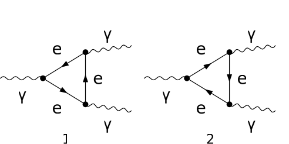

## Load FeynCalc and the necessary add-ons or other packages

```mathematica
description = "Ga -> Ga Ga, QED, amplitude, 1-loop";
If[ $FrontEnd === Null, 
  	$FeynCalcStartupMessages = False; 
  	Print[description]; 
  ];
If[ $Notebooks === False, 
  	$FeynCalcStartupMessages = False 
  ];
$LoadAddOns = {"FeynArts"};
<< FeynCalc`
$FAVerbose = 0; 
 
FCCheckVersion[9, 3, 1];
```

$$\text{FeynCalc }\;\text{10.0.0 (dev version, 2023-12-20 22:40:59 +01:00, dff3b835). For help, use the }\underline{\text{online} \;\text{documentation}}\;\text{, check out the }\underline{\text{wiki}}\;\text{ or visit the }\underline{\text{forum}.}$$

$$\text{Please check our }\underline{\text{FAQ}}\;\text{ for answers to some common FeynCalc questions and have a look at the supplied }\underline{\text{examples}.}$$

$$\text{If you use FeynCalc in your research, please evaluate FeynCalcHowToCite[] to learn how to cite this software.}$$

$$\text{Please keep in mind that the proper academic attribution of our work is crucial to ensure the future development of this package!}$$

$$\text{FeynArts }\;\text{3.11 (3 Aug 2020) patched for use with FeynCalc, for documentation see the }\underline{\text{manual}}\;\text{ or visit }\underline{\text{www}.\text{feynarts}.\text{de}.}$$

$$\text{If you use FeynArts in your research, please cite}$$

$$\text{ $\bullet $ T. Hahn, Comput. Phys. Commun., 140, 418-431, 2001, arXiv:hep-ph/0012260}$$

## Generate Feynman diagrams

Nicer typesetting

```mathematica
MakeBoxes[mu, TraditionalForm] := "\[Mu]";
MakeBoxes[nu, TraditionalForm] := "\[Nu]";
MakeBoxes[rho, TraditionalForm] := "\[Rho]";
MakeBoxes[k1, TraditionalForm] := "\!\(\*SubscriptBox[\(k\), \(1\)]\)";
MakeBoxes[k2, TraditionalForm] := "\!\(\*SubscriptBox[\(k\), \(2\)]\)";
MakeBoxes[k3, TraditionalForm] := "\!\(\*SubscriptBox[\(k\), \(3\)]\)";
```

```mathematica
diags = InsertFields[CreateTopologies[1, 1 -> 2], 
    		{V[1]} -> {V[1], V[1]}, InsertionLevel -> {Particles}, 
    		ExcludeParticles -> {S[_], V[_], U[_], F[3 | 4], F[2, {2 | 3}]}]; 
 
Paint[diags, ColumnsXRows -> {2, 1}, Numbering -> Simple, 
  	SheetHeader -> None, ImageSize -> {512, 256}];
```



## Obtain the amplitude

The 1/(2Pi)^D prefactor is implicit.

```mathematica
amp[0] = FCFAConvert[CreateFeynAmp[diags, PreFactor -> 1, 
   	Truncated -> True], IncomingMomenta -> {k1}, 
  	OutgoingMomenta -> {k2, k3}, LoopMomenta -> {q}, 
  	LorentzIndexNames -> {mu, nu, rho}, UndoChiralSplittings -> True, 
  	ChangeDimension -> D, List -> False, SMP -> True]
```

$$\frac{i \;\text{tr}\left(\left(m_e+\gamma \cdot \left(q-k_2-k_3\right)\right).\left(-i \;\text{e} \gamma ^{\rho }\right).\left(m_e+\gamma \cdot \left(q-k_2\right)\right).\left(-i \;\text{e} \gamma ^{\nu }\right).\left(m_e+\gamma \cdot q\right).\left(-i \;\text{e} \gamma ^{\mu }\right)\right)}{\left(q^2-m_e^2\right).\left((q-k_2){}^2-m_e^2\right).\left((-k_2-k_3+q){}^2-m_e^2\right)}+\frac{i \;\text{tr}\left(\left(m_e+\gamma \cdot \left(q-k_2-k_3\right)\right).\left(i \;\text{e} \gamma ^{\rho }\right).\left(m_e+\gamma \cdot \left(q-k_2\right)\right).\left(i \;\text{e} \gamma ^{\nu }\right).\left(m_e+\gamma \cdot q\right).\left(i \;\text{e} \gamma ^{\mu }\right)\right)}{\left(q^2-m_e^2\right).\left((q-k_2){}^2-m_e^2\right).\left((-k_2-k_3+q){}^2-m_e^2\right)}$$

## Calculate the amplitude

We obtain two triangle diagrams. The sum vanishes because the contribution of the first diagram cancels the contribution of the second diagram.

```mathematica
amp[1] = amp[0] // FCTraceFactor
```

$$0$$

## Check the final results

```mathematica
FCCompareResults[amp[1], 0, 
   Text -> {"\tVerify Furry's theorem for 3-photons at 1-loop:", 
     "CORRECT.", "WRONG!"}, Interrupt -> {Hold[Quit[1]], Automatic}];
Print["\tCPU Time used: ", Round[N[TimeUsed[], 4], 0.001], " s."];
```

$$\text{$\backslash $tVerify Furry's theorem for 3-photons at 1-loop:} \;\text{CORRECT.}$$

$$\text{$\backslash $tCPU Time used: }17.695\text{ s.}$$