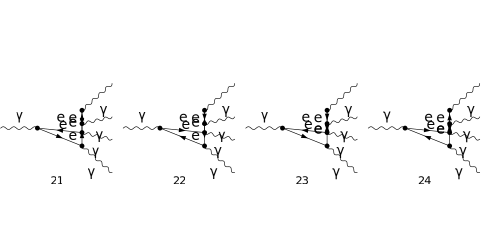

## Load FeynCalc and the necessary add-ons or other packages

```mathematica
description = "Ga -> Ga Ga Ga Ga, QED, amplitude, 1-loop";
If[ $FrontEnd === Null, 
  	$FeynCalcStartupMessages = False; 
  	Print[description]; 
  ];
If[ $Notebooks === False, 
  	$FeynCalcStartupMessages = False 
  ];
$LoadAddOns = {"FeynArts"};
<< FeynCalc`
$FAVerbose = 0; 
 
FCCheckVersion[9, 3, 1];
```

$$\text{FeynCalc }\;\text{10.0.0 (dev version, 2023-12-20 22:40:59 +01:00, dff3b835). For help, use the }\underline{\text{online} \;\text{documentation}}\;\text{, check out the }\underline{\text{wiki}}\;\text{ or visit the }\underline{\text{forum}.}$$

$$\text{Please check our }\underline{\text{FAQ}}\;\text{ for answers to some common FeynCalc questions and have a look at the supplied }\underline{\text{examples}.}$$

$$\text{If you use FeynCalc in your research, please evaluate FeynCalcHowToCite[] to learn how to cite this software.}$$

$$\text{Please keep in mind that the proper academic attribution of our work is crucial to ensure the future development of this package!}$$

$$\text{FeynArts }\;\text{3.11 (3 Aug 2020) patched for use with FeynCalc, for documentation see the }\underline{\text{manual}}\;\text{ or visit }\underline{\text{www}.\text{feynarts}.\text{de}.}$$

$$\text{If you use FeynArts in your research, please cite}$$

$$\text{ $\bullet $ T. Hahn, Comput. Phys. Commun., 140, 418-431, 2001, arXiv:hep-ph/0012260}$$

## Generate Feynman diagrams

Nicer typesetting

```mathematica
MakeBoxes[mu, TraditionalForm] := "\[Mu]";
MakeBoxes[nu, TraditionalForm] := "\[Nu]";
MakeBoxes[rho, TraditionalForm] := "\[Rho]";
MakeBoxes[k1, TraditionalForm] := "\!\(\*SubscriptBox[\(k\), \(1\)]\)";
MakeBoxes[k2, TraditionalForm] := "\!\(\*SubscriptBox[\(k\), \(2\)]\)";
MakeBoxes[k3, TraditionalForm] := "\!\(\*SubscriptBox[\(k\), \(3\)]\)";
MakeBoxes[k4, TraditionalForm] := "\!\(\*SubscriptBox[\(k\), \(4\)]\)";
MakeBoxes[k5, TraditionalForm] := "\!\(\*SubscriptBox[\(k\), \(5\)]\)";
```

```mathematica
diags = InsertFields[CreateTopologies[1, 1 -> 4], 
    		{V[1]} -> {V[1], V[1], V[1], V[1]}, InsertionLevel -> {Particles}, 
    		ExcludeParticles -> {S[_], V[_], U[_], F[3 | 4], F[2, {2 | 3}]}]; 
 
Paint[diags, ColumnsXRows -> {4, 1}, Numbering -> Simple, 
  	SheetHeader -> None, ImageSize -> {512, 256}];
```




## Obtain the amplitude

The 1/(2Pi)^D prefactor is implicit.

```mathematica
amp[0] = FCFAConvert[CreateFeynAmp[diags, PreFactor -> 1, 
   	Truncated -> True], IncomingMomenta -> {k1}, 
  	OutgoingMomenta -> {k2, k3, k4, k5}, LoopMomenta -> {q}, 
  	LorentzIndexNames -> {mu, nu, rho}, UndoChiralSplittings -> True, 
  	ChangeDimension -> D, List -> True, SMP -> True]
```

$$\left\{-\frac{i \;\text{tr}\left(\left(\gamma \cdot \left(-k_2-k_3-k_4-k_5+q\right)+m_e\right).\left(-i \gamma ^{\rho } \;\text{e}\right).\left(\gamma \cdot \left(-k_2-k_4-k_5+q\right)+m_e\right).\left(-i \gamma ^{\text{Lor5}} \;\text{e}\right).\left(\gamma \cdot \left(-k_2-k_4+q\right)+m_e\right).\left(-i \gamma ^{\text{Lor4}} \;\text{e}\right).\left(\gamma \cdot \left(q-k_2\right)+m_e\right).\left(-i \gamma ^{\nu } \;\text{e}\right).\left(\gamma \cdot q+m_e\right).\left(-i \gamma ^{\mu } \;\text{e}\right)\right)}{\left(q^2-m_e^2\right).\left((q-k_2){}^2-m_e^2\right).\left((-k_2-k_4+q){}^2-m_e^2\right).\left((-k_2-k_4-k_5+q){}^2-m_e^2\right).\left((-k_2-k_3-k_4-k_5+q){}^2-m_e^2\right)},-\frac{i \;\text{tr}\left(\left(\gamma \cdot \left(-k_2-k_3-k_4-k_5+q\right)+m_e\right).\left(i \gamma ^{\rho } \;\text{e}\right).\left(\gamma \cdot \left(-k_2-k_4-k_5+q\right)+m_e\right).\left(i \gamma ^{\text{Lor5}} \;\text{e}\right).\left(\gamma \cdot \left(-k_2-k_4+q\right)+m_e\right).\left(i \gamma ^{\text{Lor4}} \;\text{e}\right).\left(\gamma \cdot \left(q-k_2\right)+m_e\right).\left(i \gamma ^{\nu } \;\text{e}\right).\left(\gamma \cdot q+m_e\right).\left(i \gamma ^{\mu } \;\text{e}\right)\right)}{\left(q^2-m_e^2\right).\left((q-k_2){}^2-m_e^2\right).\left((-k_2-k_4+q){}^2-m_e^2\right).\left((-k_2-k_4-k_5+q){}^2-m_e^2\right).\left((-k_2-k_3-k_4-k_5+q){}^2-m_e^2\right)},-\frac{i \;\text{tr}\left(\left(m_e-\gamma \cdot q\right).\left(i \gamma ^{\nu } \;\text{e}\right).\left(\gamma \cdot \left(k_2-q\right)+m_e\right).\left(i \gamma ^{\text{Lor5}} \;\text{e}\right).\left(\gamma \cdot \left(k_2+k_5-q\right)+m_e\right).\left(i \gamma ^{\text{Lor4}} \;\text{e}\right).\left(\gamma \cdot \left(k_2+k_4+k_5-q\right)+m_e\right).\left(i \gamma ^{\rho } \;\text{e}\right).\left(\gamma \cdot \left(k_2+k_3+k_4+k_5-q\right)+m_e\right).\left(i \gamma ^{\mu } \;\text{e}\right)\right)}{\left(q^2-m_e^2\right).\left((q-k_2){}^2-m_e^2\right).\left((-k_2-k_5+q){}^2-m_e^2\right).\left((-k_2-k_4-k_5+q){}^2-m_e^2\right).\left((-k_2-k_3-k_4-k_5+q){}^2-m_e^2\right)},-\frac{i \;\text{tr}\left(\left(m_e-\gamma \cdot q\right).\left(-i \gamma ^{\nu } \;\text{e}\right).\left(\gamma \cdot \left(k_2-q\right)+m_e\right).\left(-i \gamma ^{\text{Lor5}} \;\text{e}\right).\left(\gamma \cdot \left(k_2+k_5-q\right)+m_e\right).\left(-i \gamma ^{\text{Lor4}} \;\text{e}\right).\left(\gamma \cdot \left(k_2+k_4+k_5-q\right)+m_e\right).\left(-i \gamma ^{\rho } \;\text{e}\right).\left(\gamma \cdot \left(k_2+k_3+k_4+k_5-q\right)+m_e\right).\left(-i \gamma ^{\mu } \;\text{e}\right)\right)}{\left(q^2-m_e^2\right).\left((q-k_2){}^2-m_e^2\right).\left((-k_2-k_5+q){}^2-m_e^2\right).\left((-k_2-k_4-k_5+q){}^2-m_e^2\right).\left((-k_2-k_3-k_4-k_5+q){}^2-m_e^2\right)},-\frac{i \;\text{tr}\left(\left(\gamma \cdot \left(-k_2-k_3-k_4-k_5+q\right)+m_e\right).\left(-i \gamma ^{\text{Lor4}} \;\text{e}\right).\left(\gamma \cdot \left(-k_2-k_3-k_5+q\right)+m_e\right).\left(-i \gamma ^{\text{Lor5}} \;\text{e}\right).\left(\gamma \cdot \left(-k_2-k_3+q\right)+m_e\right).\left(-i \gamma ^{\rho } \;\text{e}\right).\left(\gamma \cdot \left(q-k_2\right)+m_e\right).\left(-i \gamma ^{\nu } \;\text{e}\right).\left(\gamma \cdot q+m_e\right).\left(-i \gamma ^{\mu } \;\text{e}\right)\right)}{\left(q^2-m_e^2\right).\left((q-k_2){}^2-m_e^2\right).\left((-k_2-k_3+q){}^2-m_e^2\right).\left((-k_2-k_3-k_5+q){}^2-m_e^2\right).\left((-k_2-k_3-k_4-k_5+q){}^2-m_e^2\right)},-\frac{i \;\text{tr}\left(\left(\gamma \cdot \left(-k_2-k_3-k_4-k_5+q\right)+m_e\right).\left(i \gamma ^{\text{Lor4}} \;\text{e}\right).\left(\gamma \cdot \left(-k_2-k_3-k_5+q\right)+m_e\right).\left(i \gamma ^{\text{Lor5}} \;\text{e}\right).\left(\gamma \cdot \left(-k_2-k_3+q\right)+m_e\right).\left(i \gamma ^{\rho } \;\text{e}\right).\left(\gamma \cdot \left(q-k_2\right)+m_e\right).\left(i \gamma ^{\nu } \;\text{e}\right).\left(\gamma \cdot q+m_e\right).\left(i \gamma ^{\mu } \;\text{e}\right)\right)}{\left(q^2-m_e^2\right).\left((q-k_2){}^2-m_e^2\right).\left((-k_2-k_3+q){}^2-m_e^2\right).\left((-k_2-k_3-k_5+q){}^2-m_e^2\right).\left((-k_2-k_3-k_4-k_5+q){}^2-m_e^2\right)},-\frac{i \;\text{tr}\left(\left(m_e-\gamma \cdot q\right).\left(i \gamma ^{\nu } \;\text{e}\right).\left(\gamma \cdot \left(k_2-q\right)+m_e\right).\left(i \gamma ^{\text{Lor5}} \;\text{e}\right).\left(\gamma \cdot \left(k_2+k_5-q\right)+m_e\right).\left(i \gamma ^{\rho } \;\text{e}\right).\left(\gamma \cdot \left(k_2+k_3+k_5-q\right)+m_e\right).\left(i \gamma ^{\text{Lor4}} \;\text{e}\right).\left(\gamma \cdot \left(k_2+k_3+k_4+k_5-q\right)+m_e\right).\left(i \gamma ^{\mu } \;\text{e}\right)\right)}{\left(q^2-m_e^2\right).\left((q-k_2){}^2-m_e^2\right).\left((-k_2-k_5+q){}^2-m_e^2\right).\left((-k_2-k_3-k_5+q){}^2-m_e^2\right).\left((-k_2-k_3-k_4-k_5+q){}^2-m_e^2\right)},-\frac{i \;\text{tr}\left(\left(m_e-\gamma \cdot q\right).\left(-i \gamma ^{\nu } \;\text{e}\right).\left(\gamma \cdot \left(k_2-q\right)+m_e\right).\left(-i \gamma ^{\text{Lor5}} \;\text{e}\right).\left(\gamma \cdot \left(k_2+k_5-q\right)+m_e\right).\left(-i \gamma ^{\rho } \;\text{e}\right).\left(\gamma \cdot \left(k_2+k_3+k_5-q\right)+m_e\right).\left(-i \gamma ^{\text{Lor4}} \;\text{e}\right).\left(\gamma \cdot \left(k_2+k_3+k_4+k_5-q\right)+m_e\right).\left(-i \gamma ^{\mu } \;\text{e}\right)\right)}{\left(q^2-m_e^2\right).\left((q-k_2){}^2-m_e^2\right).\left((-k_2-k_5+q){}^2-m_e^2\right).\left((-k_2-k_3-k_5+q){}^2-m_e^2\right).\left((-k_2-k_3-k_4-k_5+q){}^2-m_e^2\right)},-\frac{i \;\text{tr}\left(\left(\gamma \cdot \left(-k_2-k_3-k_4-k_5+q\right)+m_e\right).\left(-i \gamma ^{\text{Lor5}} \;\text{e}\right).\left(\gamma \cdot \left(-k_2-k_3-k_4+q\right)+m_e\right).\left(-i \gamma ^{\text{Lor4}} \;\text{e}\right).\left(\gamma \cdot \left(-k_2-k_3+q\right)+m_e\right).\left(-i \gamma ^{\rho } \;\text{e}\right).\left(\gamma \cdot \left(q-k_2\right)+m_e\right).\left(-i \gamma ^{\nu } \;\text{e}\right).\left(\gamma \cdot q+m_e\right).\left(-i \gamma ^{\mu } \;\text{e}\right)\right)}{\left(q^2-m_e^2\right).\left((q-k_2){}^2-m_e^2\right).\left((-k_2-k_3+q){}^2-m_e^2\right).\left((-k_2-k_3-k_4+q){}^2-m_e^2\right).\left((-k_2-k_3-k_4-k_5+q){}^2-m_e^2\right)},-\frac{i \;\text{tr}\left(\left(\gamma \cdot \left(-k_2-k_3-k_4-k_5+q\right)+m_e\right).\left(i \gamma ^{\text{Lor5}} \;\text{e}\right).\left(\gamma \cdot \left(-k_2-k_3-k_4+q\right)+m_e\right).\left(i \gamma ^{\text{Lor4}} \;\text{e}\right).\left(\gamma \cdot \left(-k_2-k_3+q\right)+m_e\right).\left(i \gamma ^{\rho } \;\text{e}\right).\left(\gamma \cdot \left(q-k_2\right)+m_e\right).\left(i \gamma ^{\nu } \;\text{e}\right).\left(\gamma \cdot q+m_e\right).\left(i \gamma ^{\mu } \;\text{e}\right)\right)}{\left(q^2-m_e^2\right).\left((q-k_2){}^2-m_e^2\right).\left((-k_2-k_3+q){}^2-m_e^2\right).\left((-k_2-k_3-k_4+q){}^2-m_e^2\right).\left((-k_2-k_3-k_4-k_5+q){}^2-m_e^2\right)},-\frac{i \;\text{tr}\left(\left(m_e-\gamma \cdot q\right).\left(i \gamma ^{\nu } \;\text{e}\right).\left(\gamma \cdot \left(k_2-q\right)+m_e\right).\left(i \gamma ^{\text{Lor4}} \;\text{e}\right).\left(\gamma \cdot \left(k_2+k_4-q\right)+m_e\right).\left(i \gamma ^{\rho } \;\text{e}\right).\left(\gamma \cdot \left(k_2+k_3+k_4-q\right)+m_e\right).\left(i \gamma ^{\text{Lor5}} \;\text{e}\right).\left(\gamma \cdot \left(k_2+k_3+k_4+k_5-q\right)+m_e\right).\left(i \gamma ^{\mu } \;\text{e}\right)\right)}{\left(q^2-m_e^2\right).\left((q-k_2){}^2-m_e^2\right).\left((-k_2-k_4+q){}^2-m_e^2\right).\left((-k_2-k_3-k_4+q){}^2-m_e^2\right).\left((-k_2-k_3-k_4-k_5+q){}^2-m_e^2\right)},-\frac{i \;\text{tr}\left(\left(m_e-\gamma \cdot q\right).\left(-i \gamma ^{\nu } \;\text{e}\right).\left(\gamma \cdot \left(k_2-q\right)+m_e\right).\left(-i \gamma ^{\text{Lor4}} \;\text{e}\right).\left(\gamma \cdot \left(k_2+k_4-q\right)+m_e\right).\left(-i \gamma ^{\rho } \;\text{e}\right).\left(\gamma \cdot \left(k_2+k_3+k_4-q\right)+m_e\right).\left(-i \gamma ^{\text{Lor5}} \;\text{e}\right).\left(\gamma \cdot \left(k_2+k_3+k_4+k_5-q\right)+m_e\right).\left(-i \gamma ^{\mu } \;\text{e}\right)\right)}{\left(q^2-m_e^2\right).\left((q-k_2){}^2-m_e^2\right).\left((-k_2-k_4+q){}^2-m_e^2\right).\left((-k_2-k_3-k_4+q){}^2-m_e^2\right).\left((-k_2-k_3-k_4-k_5+q){}^2-m_e^2\right)},-\frac{i \;\text{tr}\left(\left(\gamma \cdot \left(-k_2-k_3-k_4-k_5+q\right)+m_e\right).\left(-i \gamma ^{\text{Lor4}} \;\text{e}\right).\left(\gamma \cdot \left(-k_2-k_3-k_5+q\right)+m_e\right).\left(-i \gamma ^{\text{Lor5}} \;\text{e}\right).\left(\gamma \cdot \left(-k_2-k_3+q\right)+m_e\right).\left(-i \gamma ^{\nu } \;\text{e}\right).\left(\gamma \cdot \left(q-k_3\right)+m_e\right).\left(-i \gamma ^{\rho } \;\text{e}\right).\left(\gamma \cdot q+m_e\right).\left(-i \gamma ^{\mu } \;\text{e}\right)\right)}{\left(q^2-m_e^2\right).\left((q-k_3){}^2-m_e^2\right).\left((-k_2-k_3+q){}^2-m_e^2\right).\left((-k_2-k_3-k_5+q){}^2-m_e^2\right).\left((-k_2-k_3-k_4-k_5+q){}^2-m_e^2\right)},-\frac{i \;\text{tr}\left(\left(\gamma \cdot \left(-k_2-k_3-k_4-k_5+q\right)+m_e\right).\left(i \gamma ^{\text{Lor4}} \;\text{e}\right).\left(\gamma \cdot \left(-k_2-k_3-k_5+q\right)+m_e\right).\left(i \gamma ^{\text{Lor5}} \;\text{e}\right).\left(\gamma \cdot \left(-k_2-k_3+q\right)+m_e\right).\left(i \gamma ^{\nu } \;\text{e}\right).\left(\gamma \cdot \left(q-k_3\right)+m_e\right).\left(i \gamma ^{\rho } \;\text{e}\right).\left(\gamma \cdot q+m_e\right).\left(i \gamma ^{\mu } \;\text{e}\right)\right)}{\left(q^2-m_e^2\right).\left((q-k_3){}^2-m_e^2\right).\left((-k_2-k_3+q){}^2-m_e^2\right).\left((-k_2-k_3-k_5+q){}^2-m_e^2\right).\left((-k_2-k_3-k_4-k_5+q){}^2-m_e^2\right)},-\frac{i \;\text{tr}\left(\left(m_e-\gamma \cdot q\right).\left(i \gamma ^{\rho } \;\text{e}\right).\left(\gamma \cdot \left(k_3-q\right)+m_e\right).\left(i \gamma ^{\text{Lor5}} \;\text{e}\right).\left(\gamma \cdot \left(k_3+k_5-q\right)+m_e\right).\left(i \gamma ^{\nu } \;\text{e}\right).\left(\gamma \cdot \left(k_2+k_3+k_5-q\right)+m_e\right).\left(i \gamma ^{\text{Lor4}} \;\text{e}\right).\left(\gamma \cdot \left(k_2+k_3+k_4+k_5-q\right)+m_e\right).\left(i \gamma ^{\mu } \;\text{e}\right)\right)}{\left(q^2-m_e^2\right).\left((q-k_3){}^2-m_e^2\right).\left((-k_3-k_5+q){}^2-m_e^2\right).\left((-k_2-k_3-k_5+q){}^2-m_e^2\right).\left((-k_2-k_3-k_4-k_5+q){}^2-m_e^2\right)},-\frac{i \;\text{tr}\left(\left(m_e-\gamma \cdot q\right).\left(-i \gamma ^{\rho } \;\text{e}\right).\left(\gamma \cdot \left(k_3-q\right)+m_e\right).\left(-i \gamma ^{\text{Lor5}} \;\text{e}\right).\left(\gamma \cdot \left(k_3+k_5-q\right)+m_e\right).\left(-i \gamma ^{\nu } \;\text{e}\right).\left(\gamma \cdot \left(k_2+k_3+k_5-q\right)+m_e\right).\left(-i \gamma ^{\text{Lor4}} \;\text{e}\right).\left(\gamma \cdot \left(k_2+k_3+k_4+k_5-q\right)+m_e\right).\left(-i \gamma ^{\mu } \;\text{e}\right)\right)}{\left(q^2-m_e^2\right).\left((q-k_3){}^2-m_e^2\right).\left((-k_3-k_5+q){}^2-m_e^2\right).\left((-k_2-k_3-k_5+q){}^2-m_e^2\right).\left((-k_2-k_3-k_4-k_5+q){}^2-m_e^2\right)},-\frac{i \;\text{tr}\left(\left(\gamma \cdot \left(-k_2-k_3-k_4-k_5+q\right)+m_e\right).\left(-i \gamma ^{\text{Lor5}} \;\text{e}\right).\left(\gamma \cdot \left(-k_2-k_3-k_4+q\right)+m_e\right).\left(-i \gamma ^{\text{Lor4}} \;\text{e}\right).\left(\gamma \cdot \left(-k_2-k_3+q\right)+m_e\right).\left(-i \gamma ^{\nu } \;\text{e}\right).\left(\gamma \cdot \left(q-k_3\right)+m_e\right).\left(-i \gamma ^{\rho } \;\text{e}\right).\left(\gamma \cdot q+m_e\right).\left(-i \gamma ^{\mu } \;\text{e}\right)\right)}{\left(q^2-m_e^2\right).\left((q-k_3){}^2-m_e^2\right).\left((-k_2-k_3+q){}^2-m_e^2\right).\left((-k_2-k_3-k_4+q){}^2-m_e^2\right).\left((-k_2-k_3-k_4-k_5+q){}^2-m_e^2\right)},-\frac{i \;\text{tr}\left(\left(\gamma \cdot \left(-k_2-k_3-k_4-k_5+q\right)+m_e\right).\left(i \gamma ^{\text{Lor5}} \;\text{e}\right).\left(\gamma \cdot \left(-k_2-k_3-k_4+q\right)+m_e\right).\left(i \gamma ^{\text{Lor4}} \;\text{e}\right).\left(\gamma \cdot \left(-k_2-k_3+q\right)+m_e\right).\left(i \gamma ^{\nu } \;\text{e}\right).\left(\gamma \cdot \left(q-k_3\right)+m_e\right).\left(i \gamma ^{\rho } \;\text{e}\right).\left(\gamma \cdot q+m_e\right).\left(i \gamma ^{\mu } \;\text{e}\right)\right)}{\left(q^2-m_e^2\right).\left((q-k_3){}^2-m_e^2\right).\left((-k_2-k_3+q){}^2-m_e^2\right).\left((-k_2-k_3-k_4+q){}^2-m_e^2\right).\left((-k_2-k_3-k_4-k_5+q){}^2-m_e^2\right)},-\frac{i \;\text{tr}\left(\left(m_e-\gamma \cdot q\right).\left(i \gamma ^{\rho } \;\text{e}\right).\left(\gamma \cdot \left(k_3-q\right)+m_e\right).\left(i \gamma ^{\text{Lor4}} \;\text{e}\right).\left(\gamma \cdot \left(k_3+k_4-q\right)+m_e\right).\left(i \gamma ^{\nu } \;\text{e}\right).\left(\gamma \cdot \left(k_2+k_3+k_4-q\right)+m_e\right).\left(i \gamma ^{\text{Lor5}} \;\text{e}\right).\left(\gamma \cdot \left(k_2+k_3+k_4+k_5-q\right)+m_e\right).\left(i \gamma ^{\mu } \;\text{e}\right)\right)}{\left(q^2-m_e^2\right).\left((q-k_3){}^2-m_e^2\right).\left((-k_3-k_4+q){}^2-m_e^2\right).\left((-k_2-k_3-k_4+q){}^2-m_e^2\right).\left((-k_2-k_3-k_4-k_5+q){}^2-m_e^2\right)},-\frac{i \;\text{tr}\left(\left(m_e-\gamma \cdot q\right).\left(-i \gamma ^{\rho } \;\text{e}\right).\left(\gamma \cdot \left(k_3-q\right)+m_e\right).\left(-i \gamma ^{\text{Lor4}} \;\text{e}\right).\left(\gamma \cdot \left(k_3+k_4-q\right)+m_e\right).\left(-i \gamma ^{\nu } \;\text{e}\right).\left(\gamma \cdot \left(k_2+k_3+k_4-q\right)+m_e\right).\left(-i \gamma ^{\text{Lor5}} \;\text{e}\right).\left(\gamma \cdot \left(k_2+k_3+k_4+k_5-q\right)+m_e\right).\left(-i \gamma ^{\mu } \;\text{e}\right)\right)}{\left(q^2-m_e^2\right).\left((q-k_3){}^2-m_e^2\right).\left((-k_3-k_4+q){}^2-m_e^2\right).\left((-k_2-k_3-k_4+q){}^2-m_e^2\right).\left((-k_2-k_3-k_4-k_5+q){}^2-m_e^2\right)},-\frac{i \;\text{tr}\left(\left(\gamma \cdot \left(-k_2-k_3-k_4-k_5+q\right)+m_e\right).\left(-i \gamma ^{\text{Lor5}} \;\text{e}\right).\left(\gamma \cdot \left(-k_2-k_3-k_4+q\right)+m_e\right).\left(-i \gamma ^{\rho } \;\text{e}\right).\left(\gamma \cdot \left(-k_2-k_4+q\right)+m_e\right).\left(-i \gamma ^{\nu } \;\text{e}\right).\left(\gamma \cdot \left(q-k_4\right)+m_e\right).\left(-i \gamma ^{\text{Lor4}} \;\text{e}\right).\left(\gamma \cdot q+m_e\right).\left(-i \gamma ^{\mu } \;\text{e}\right)\right)}{\left(q^2-m_e^2\right).\left((q-k_4){}^2-m_e^2\right).\left((-k_2-k_4+q){}^2-m_e^2\right).\left((-k_2-k_3-k_4+q){}^2-m_e^2\right).\left((-k_2-k_3-k_4-k_5+q){}^2-m_e^2\right)},-\frac{i \;\text{tr}\left(\left(\gamma \cdot \left(-k_2-k_3-k_4-k_5+q\right)+m_e\right).\left(i \gamma ^{\text{Lor5}} \;\text{e}\right).\left(\gamma \cdot \left(-k_2-k_3-k_4+q\right)+m_e\right).\left(i \gamma ^{\rho } \;\text{e}\right).\left(\gamma \cdot \left(-k_2-k_4+q\right)+m_e\right).\left(i \gamma ^{\nu } \;\text{e}\right).\left(\gamma \cdot \left(q-k_4\right)+m_e\right).\left(i \gamma ^{\text{Lor4}} \;\text{e}\right).\left(\gamma \cdot q+m_e\right).\left(i \gamma ^{\mu } \;\text{e}\right)\right)}{\left(q^2-m_e^2\right).\left((q-k_4){}^2-m_e^2\right).\left((-k_2-k_4+q){}^2-m_e^2\right).\left((-k_2-k_3-k_4+q){}^2-m_e^2\right).\left((-k_2-k_3-k_4-k_5+q){}^2-m_e^2\right)},-\frac{i \;\text{tr}\left(\left(\gamma \cdot \left(-k_2-k_3-k_4-k_5+q\right)+m_e\right).\left(-i \gamma ^{\text{Lor5}} \;\text{e}\right).\left(\gamma \cdot \left(-k_2-k_3-k_4+q\right)+m_e\right).\left(-i \gamma ^{\nu } \;\text{e}\right).\left(\gamma \cdot \left(-k_3-k_4+q\right)+m_e\right).\left(-i \gamma ^{\rho } \;\text{e}\right).\left(\gamma \cdot \left(q-k_4\right)+m_e\right).\left(-i \gamma ^{\text{Lor4}} \;\text{e}\right).\left(\gamma \cdot q+m_e\right).\left(-i \gamma ^{\mu } \;\text{e}\right)\right)}{\left(q^2-m_e^2\right).\left((q-k_4){}^2-m_e^2\right).\left((-k_3-k_4+q){}^2-m_e^2\right).\left((-k_2-k_3-k_4+q){}^2-m_e^2\right).\left((-k_2-k_3-k_4-k_5+q){}^2-m_e^2\right)},-\frac{i \;\text{tr}\left(\left(\gamma \cdot \left(-k_2-k_3-k_4-k_5+q\right)+m_e\right).\left(i \gamma ^{\text{Lor5}} \;\text{e}\right).\left(\gamma \cdot \left(-k_2-k_3-k_4+q\right)+m_e\right).\left(i \gamma ^{\nu } \;\text{e}\right).\left(\gamma \cdot \left(-k_3-k_4+q\right)+m_e\right).\left(i \gamma ^{\rho } \;\text{e}\right).\left(\gamma \cdot \left(q-k_4\right)+m_e\right).\left(i \gamma ^{\text{Lor4}} \;\text{e}\right).\left(\gamma \cdot q+m_e\right).\left(i \gamma ^{\mu } \;\text{e}\right)\right)}{\left(q^2-m_e^2\right).\left((q-k_4){}^2-m_e^2\right).\left((-k_3-k_4+q){}^2-m_e^2\right).\left((-k_2-k_3-k_4+q){}^2-m_e^2\right).\left((-k_2-k_3-k_4-k_5+q){}^2-m_e^2\right)}\right\}$$

## Calculate the amplitude

We obtain 24 diagrams. The sum vanishes because the contribution of each odd diagram is exactly cancelled by the contribution of the next even diagram, i.e. A1+A2=0, A3+A4=0 and so on

```mathematica
amp[1] = amp[0] // FCTraceFactor;
```

```mathematica
amp[2] = Total /@ Partition[amp[1], 2, 2, 1, {}]
```

$$\{0,0,0,0,0,0,0,0,0,0,0,0\}$$

```mathematica
amp[3] = Total[amp[2]]
```

$$0$$

## Check the final results

```mathematica
FCCompareResults[amp[3], 0, 
   Text -> {"\tVerify Furry's theorem for 5-photons at 1-loop:", 
     "CORRECT.", "WRONG!"}, Interrupt -> {Hold[Quit[1]], Automatic}];
Print["\tCPU Time used: ", Round[N[TimeUsed[], 4], 0.001], " s."];
```

$$\text{$\backslash $tVerify Furry's theorem for 5-photons at 1-loop:} \;\text{CORRECT.}$$

$$\text{$\backslash $tCPU Time used: }26.748\text{ s.}$$