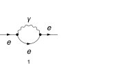
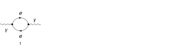
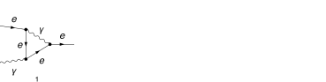
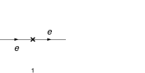
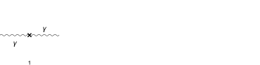
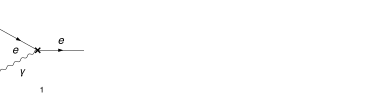

## Load FeynCalc and the necessary add-ons or other packages

This example uses a custom QED model created with FeynRules.

```mathematica
description = "Renormalization, QED, MSbar, 1-loop";
If[ $FrontEnd === Null, 
  	$FeynCalcStartupMessages = False; 
  	Print[description]; 
  ];
If[ $Notebooks === False, 
  	$FeynCalcStartupMessages = False 
  ];
LaunchKernels[4];
$LoadAddOns = {"FeynArts", "FeynHelpers"};
<< FeynCalc`
$FAVerbose = 0;
$ParallelizeFeynCalc = True; 
 
FCCheckVersion[10, 2, 0];
If[ToExpression[StringSplit[$FeynHelpersVersion, "."]][[1]] < 2, 
 	Print["You need at least FeynHelpers 2.0 to run this example."]; 
 	Abort[]; 
 ]
```

$$\text{FeynCalc }\;\text{10.2.0 (dev version, 2026-05-18 15:58:48 +02:00, 1a8e687c). For help, use the }\underline{\text{online} \;\text{documentation},}\;\text{ visit the }\underline{\text{forum}}\;\text{ and have a look at the supplied }\underline{\text{examples}.}\;\text{ The PDF-version of the manual can be downloaded }\underline{\text{here}.}$$

$$\text{If you use FeynCalc in your research, please evaluate FeynCalcHowToCite[] to learn how to cite this software.}$$

$$\text{Please keep in mind that the proper academic attribution of our work is crucial to ensure the future development of this package!}$$

$$\text{FeynArts }\;\text{3.12 (27 Mar 2025) patched for use with FeynCalc, for documentation see the }\underline{\text{manual}}\;\text{ or visit }\underline{\text{www}.\text{feynarts}.\text{de}.}$$

$$\text{If you use FeynArts in your research, please cite}$$

$$\text{ $\bullet $ T. Hahn, Comput. Phys. Commun., 140, 418-431, 2001, arXiv:hep-ph/0012260}$$

$$\text{FeynHelpers }\;\text{2.0.0 (2026-02-05 17:03:01 +02:00, 5db84fbb). For help, use the }\underline{\text{online} \;\text{documentation},}\;\text{ visit the }\underline{\text{forum}}\;\text{ and have a look at the supplied }\underline{\text{examples}.}\;\text{ The PDF-version of the manual can be downloaded }\underline{\text{here}.}$$

$$\text{ If you use FeynHelpers in your research, please evaluate FeynHelpersHowToCite[] to learn how to cite this work.}$$

## Configure some options

```mathematica
modelDir = FileNameJoin[{$UserBaseDirectory, "Applications", "FeynCalc", "Examples", "Models", "QED"}];
```

```mathematica
FAPatch[PatchModelsOnly -> True, FAModelsDirectory -> modelDir];

(*Successfully patched FeynArts.*)
```

Here we define all Z-factors for renormalization constants present in the Lagrangian

```mathematica
renConstants = Zm | Zpsi | ZA | ZAmxt | Ze | Zxi
```

$$\text{Zm}|\text{Zpsi}|\text{ZA}|\text{ZAmxt}|\text{Ze}|\text{Zxi}$$

## Generate Feynman diagrams

Nicer typesetting

```mathematica
FCAttachTypesettingRule[mu, "\[Mu]"];
FCAttachTypesettingRule[nu, "\[Nu]"];
FCAttachTypesettingRule[rho, "\[Rho]"];
FCAttachTypesettingRule[si, "\[Sigma]"];
```

```mathematica
diagLeptonSE = InsertFields[CreateTopologies[1, 1 -> 1, 
     ExcludeTopologies -> {Tadpoles, WFCorrections, WFCorrectionCTs}], {F[2, {1}]} -> {F[2, {1}]}, 
    InsertionLevel -> {Particles}, Model -> FileNameJoin[{modelDir, "QED"}], 
    GenericModel -> FileNameJoin[{modelDir, "QED"}], ExcludeParticles -> {F[2, {2 | 3}]}];
```

```mathematica
diagPhotonSE = InsertFields[CreateTopologies[1, 1 -> 1, 
     ExcludeTopologies -> {Tadpoles, WFCorrections, WFCorrectionCTs}], {V[1]} -> {V[1]}, 
    InsertionLevel -> {Particles}, Model -> FileNameJoin[{modelDir, "QED"}], 
    GenericModel -> FileNameJoin[{modelDir, "QED"}], ExcludeParticles -> {F[2, {2 | 3}]}];
```

```mathematica
diagLeptonPhotonVTX = InsertFields[CreateTopologies[1, 2 -> 1, 
     ExcludeTopologies -> {Tadpoles, WFCorrections, WFCorrectionCTs}], {F[2, {1}], V[1]} -> {F[2, {1}]}, 
    InsertionLevel -> {Particles}, Model -> FileNameJoin[{modelDir, "QED"}], 
    GenericModel -> FileNameJoin[{modelDir, "QED"}], ExcludeParticles -> {F[2, {2 | 3}]}];
```

```mathematica
diagLeptonSECT = InsertFields[CreateCTTopologies[1, 1 -> 1, 
     ExcludeTopologies -> {Tadpoles, WFCorrections, WFCorrectionCTs}], {F[2, {1}]} -> {F[2, {1}]}, 
    InsertionLevel -> {Particles}, Model -> FileNameJoin[{modelDir, "QED"}], 
    GenericModel -> FileNameJoin[{modelDir, "QED"}], ExcludeParticles -> {F[2, {2 | 3}]}];
```

```mathematica
diagPhotonSECT = InsertFields[CreateCTTopologies[1, 1 -> 1, 
     ExcludeTopologies -> {Tadpoles, WFCorrections, WFCorrectionCTs}], {V[1]} -> {V[1]}, 
    InsertionLevel -> {Particles}, Model -> FileNameJoin[{modelDir, "QED"}], 
    GenericModel -> FileNameJoin[{modelDir, "QED"}], ExcludeParticles -> {F[2, {2 | 3}]}];
```

```mathematica
diagLeptonPhotonVTXCT = InsertFields[CreateCTTopologies[1, 2 -> 1, 
     ExcludeTopologies -> {Tadpoles, WFCorrections, WFCorrectionCTs}], {F[2, {1}], V[1]} -> {F[2, {1}]}, 
    InsertionLevel -> {Particles}, Model -> FileNameJoin[{modelDir, "QED"}], 
    GenericModel -> FileNameJoin[{modelDir, "QED"}], ExcludeParticles -> {F[2, {2 | 3}]}];
```

Self-energy and vertex diagrams

```mathematica
Paint[diagLeptonSE, ColumnsXRows -> {2, 1}, SheetHeader -> None, 
   Numbering -> Simple, ImageSize -> 128 {2, 1}];
Paint[diagPhotonSE, ColumnsXRows -> {4, 1}, SheetHeader -> None, 
   Numbering -> Simple, ImageSize -> 128 {4, 1}];
Paint[diagLeptonPhotonVTX, ColumnsXRows -> {4, 1}, SheetHeader -> None, 
   Numbering -> Simple, ImageSize -> 128 {4, 1}];
```







Counter-term diagrams

```mathematica
Paint[diagLeptonSECT, ColumnsXRows -> {2, 1}, SheetHeader -> None, 
   Numbering -> Simple, ImageSize -> 128 {2, 1}];
Paint[diagPhotonSECT, ColumnsXRows -> {4, 1}, SheetHeader -> None, 
   Numbering -> Simple, ImageSize -> 128 {4, 1}];
Paint[diagLeptonPhotonVTXCT, ColumnsXRows -> {4, 1}, SheetHeader -> None, 
   Numbering -> Simple, ImageSize -> 128 {4, 1}];
```







## Master integrals

The only required masters are 1-loop tadpoles


```mathematica
tadpoleMaster = Get[FileNameJoin[{$FeynCalcDirectory, "Examples", "MasterIntegrals","Tadpoles", "tad1LxFx1x1xxEp999x.m"}]];
```

```mathematica
tadpoleMaster1 = tadpoleMaster /. m1 -> ml /. tad1LxFx1x1xxEp999x -> "tad1Lv1";
tadpoleMaster2 = tadpoleMaster /. m1 -> mxt /. tad1LxFx1x1xxEp999x -> "tad1Lv2";
```

```mathematica
tadpoleMaster1
```

$$\left\{G^{\text{tad1Lv1}}(1)\to -e^{\gamma  \;\text{ep}} \left(\text{ml}^2\right)^{1-\text{ep}} \Gamma (\text{ep}-1),\left\{\text{FCTopology}\left(\text{tad1Lv1},\left\{\frac{1}{(\text{k1}^2-\text{ml}^2+i \eta )}\right\},\{\text{k1}\},\{\},\{\},\{\}\right)\right\}\right\}$$

```mathematica
tadpoleMaster2
```

$$\left\{G^{\text{tad1Lv2}}(1)\to -e^{\gamma  \;\text{ep}} \left(\text{mxt}^2\right)^{1-\text{ep}} \Gamma (\text{ep}-1),\left\{\text{FCTopology}\left(\text{tad1Lv2},\left\{\frac{1}{(\text{k1}^2-\text{mxt}^2+i \eta )}\right\},\{\text{k1}\},\{\},\{\},\{\}\right)\right\}\right\}$$

## Obtain the amplitudes

```mathematica
{leptonSE$RawAmp, photonSE$RawAmp, leptonSECT$RawAmp, photonSECT$RawAmp} = 
   FCFAConvert[CreateFeynAmp[#, Truncated -> True, 
      	GaugeRules -> {}, PreFactor -> 1], 
     	IncomingMomenta -> {p}, OutgoingMomenta -> {p}, 
     	LorentzIndexNames -> {mu, nu}, DropSumOver -> True, 
     	LoopMomenta -> {k}, UndoChiralSplittings -> True, 
     	ChangeDimension -> D, SMP -> True, 
     	FinalSubstitutions -> {SMP["m_e"] -> ml, SMP["e"] -> 4 Pi Sqrt[a4]}] & /@ {
    	diagLeptonSE, diagPhotonSE, diagLeptonSECT, diagPhotonSECT};
```

```mathematica
{leptonPhotonVTX$RawAmp, leptonPhotonVTXCT$RawAmp} = 
   FCFAConvert[CreateFeynAmp[#, Truncated -> True, 
      	GaugeRules -> {}, PreFactor -> 1], 
     	IncomingMomenta -> {p1, p2}, OutgoingMomenta -> {q}, 
     	LorentzIndexNames -> {mu, nu}, DropSumOver -> True, 
     	LoopMomenta -> {k}, UndoChiralSplittings -> True, 
     	ChangeDimension -> D, SMP -> True, 
     	FinalSubstitutions -> {SMP["m_e"] -> ml, SMP["e"] -> 4 Pi Sqrt[a4]}] & /@ {
    	diagLeptonPhotonVTX, diagLeptonPhotonVTXCT 
    	};
```

## Calculate the amplitudes

Infrared rearrangement works both for massive and massless leptons. However, in both cases we get different renormalization constants for the "photon mass". This is why both calculations are needed if we want to reuse these results at higher loops orders.

### Lepton self-energy

The 1-loop lepton self-energy has superficial degree of divergence equal to 1

```mathematica
FCClearScalarProducts[];
divDegree = 1;
aux1 = FCLoopGetFeynAmpDenominators[leptonSE$RawAmp, {k}, denHead, Momentum -> {p}, "Massless" -> True];
aux2 = FCLoopAddAuxiliaryMass[aux1[[2]], {k}, -mxt^2, 0, Head -> denHead]
```

$$\left\{\text{denHead}\left(\frac{1}{((k-p)^2+i \eta )}\right)\to \frac{1}{((k-p)^2-\text{mxt}^2+i \eta )}\right\}$$

```mathematica
leptonSE$StrName = StringReplace[ToString[Hold[leptonSE$Amp]], {"Hold[" -> "", "]" -> ""}]
```

$$\text{leptonSE\$Amp}$$

```mathematica
AbsoluteTiming[leptonSE$Amp = (aux1[[1]] /. aux2) // Contract[#, FCParallelize -> True] & // 
      SUNSimplify[#, FCParallelize -> True] & // DiracSimplify[#, FCParallelize -> True] &;]
```

$$\{0.143688,\text{Null}\}$$

flagCheck is a safety flag to ensure that higher order terms in p (higher than the divergence degree) do not  contribute to the poles

```mathematica
AbsoluteTiming[leptonSE$Amp1 = Collect2[leptonSE$Amp, p, IsolateNames -> KK];]
AbsoluteTiming[leptonSE$Amp2 = FourSeries[leptonSE$Amp1, {p, 0, divDegree}, FCParallelize -> True];]
AbsoluteTiming[leptonSE$Amp3 = Collect2[FRH[leptonSE$Amp2], FeynAmpDenominator, FCParallelize -> True];]
```

$$\{0.038089,\text{Null}\}$$

$$\{0.076349,\text{Null}\}$$

$$\{0.023505,\text{Null}\}$$

The rest of the calculation follows the standard multiloop template

```mathematica
FCClearScalarProducts[];
SPD[p] = pp;
```

```mathematica
{leptonSE$Amp4, leptonSE$Topos} = FCLoopFindTopologies[leptonSE$Amp3, {k}, FCParallelize -> True, 
    FCLoopBasisOverdeterminedQ -> True, FinalSubstitutions -> {Hold[SPD][p] -> pp}, Names -> leptonSEtopo];
```

$$\text{FCLoopFindTopologies: Number of the initial candidate topologies: }1$$

$$\text{FCLoopFindTopologies: Number of the identified unique topologies: }1$$

$$\text{FCLoopFindTopologies: Number of the preferred topologies among the unique topologies: }0$$

$$\text{FCLoopFindTopologies: Number of the identified subtopologies: }0$$

$$\text{FCLoopFindTopologyMappings: }\;\text{Final number of found topologies: }1$$

```mathematica
AbsoluteTiming[leptonSE$Amp5 = FCLoopTensorReduce[leptonSE$Amp4, leptonSE$Topos, FCParallelize -> True];]
```

$$\{0.387859,\text{Null}\}$$

```mathematica
{leptonSE$Amp6, leptonSE$Topos2} = FCLoopRewriteOverdeterminedTopologies[leptonSE$Amp5, leptonSE$Topos];
```

$$\text{FCLoopRewriteOverdeterminedTopologies: }\;\text{Found }1\text{ overdetermined topologies.}$$

$$\text{FCLoopRewriteOverdeterminedTopologies: }\;\text{Generated }9\text{ new topologies through partial fractioning.}$$

$$\text{FCLoopRewriteOverdeterminedTopologies: }\;\text{Final number of topologies: }2$$

```mathematica
leptonSE$SubTopos = FCLoopFindSubtopologies[leptonSE$Topos2, Flatten -> True, Remove -> True]
```

$$\{\}$$

```mathematica
{leptonSE$TopoMappings, leptonSE$FinalTopos} = FCLoopFindTopologyMappings[leptonSE$Topos2, PreferredTopologies -> leptonSE$SubTopos];
```

$$\text{FCLoopFindTopologyMappings: }\;\text{Found }0\text{ mapping relations }$$

$$\text{FCLoopFindTopologyMappings: }\;\text{Final number of independent topologies: }2$$

```mathematica
leptonSE$AmpGLI = FCLoopApplyTopologyMappings[leptonSE$Amp6, {leptonSE$TopoMappings, leptonSE$FinalTopos}, FCParallelize -> True];
```

```mathematica
leptonSE$GLIs = Cases2[leptonSE$AmpGLI, GLI];
```

```mathematica
leptonSE$dir = FileNameJoin[{$TemporaryDirectory, "Reduction-" <> leptonSE$StrName <> "-1L"}];
Quiet[CreateDirectory[leptonSE$dir]];
```

```mathematica
KiraCreateJobFile[leptonSE$FinalTopos, leptonSE$GLIs, leptonSE$dir]
```

$$\{\text{/tmp/Reduction-leptonSE\$Amp-1L/fcPFRTopology1/job.yaml},\text{/tmp/Reduction-leptonSE\$Amp-1L/fcPFRTopology2/job.yaml}\}$$

```mathematica
KiraCreateIntegralFile[leptonSE$GLIs, leptonSE$FinalTopos, leptonSE$dir]
KiraCreateConfigFiles[leptonSE$FinalTopos, leptonSE$GLIs, leptonSE$dir, 
  KiraMassDimensions -> {pp -> 2, ml -> 1, mxt -> 1}]
```

$$\text{KiraCreateIntegralFile: Number of loop integrals: }3$$

$$\text{KiraCreateIntegralFile: Number of loop integrals: }5$$

$$\{\text{/tmp/Reduction-leptonSE\$Amp-1L/fcPFRTopology1/KiraLoopIntegrals},\text{/tmp/Reduction-leptonSE\$Amp-1L/fcPFRTopology2/KiraLoopIntegrals}\}$$

$$\left(
\begin{array}{cc}
 \;\text{/tmp/Reduction-leptonSE\$Amp-1L/fcPFRTopology1/config/integralfamilies.yaml} & \;\text{/tmp/Reduction-leptonSE\$Amp-1L/fcPFRTopology1/config/kinematics.yaml} \\
 \;\text{/tmp/Reduction-leptonSE\$Amp-1L/fcPFRTopology2/config/integralfamilies.yaml} & \;\text{/tmp/Reduction-leptonSE\$Amp-1L/fcPFRTopology2/config/kinematics.yaml} \\
\end{array}
\right)$$

```mathematica
KiraRunReduction[leptonSE$dir, leptonSE$FinalTopos, 
  KiraBinaryPath -> FileNameJoin[{$HomeDirectory, ".local", "bin", "kira"}], 
  KiraFermatPath -> FileNameJoin[{$HomeDirectory, "bin", "ferl64", "fer64"}]]
```

$$\{\text{True},\text{True}\}$$

```mathematica
leptonSE$ReductionTables = KiraImportResults[leptonSE$FinalTopos, leptonSE$dir] // Flatten;
```

```mathematica
leptonSE$resPreFinal = Collect2[Total[leptonSE$AmpGLI /. Dispatch[leptonSE$ReductionTables]] // FeynAmpDenominatorExplicit, GLI, 
    GaugeXi, flagCheck, D, DiracGamma, FCParallelize -> True];
```

```mathematica
leptonSE$masters = Cases2[leptonSE$resPreFinal, GLI];
```

```mathematica
leptonSE$MIMappings = FCLoopFindIntegralMappings[leptonSE$masters, Join[tadpoleMaster1[[2]], tadpoleMaster2[[2]], 
    leptonSE$FinalTopos], PreferredIntegrals -> {tadpoleMaster1[[1]][[1]], tadpoleMaster2[[1]][[1]]}]
```

$$\left(
\begin{array}{cc}
 G^{\text{fcPFRTopology1}}(1)\to G^{\text{tad1Lv1}}(1) & G^{\text{fcPFRTopology2}}(1)\to G^{\text{tad1Lv2}}(1) \\
 G^{\text{tad1Lv1}}(1) & G^{\text{tad1Lv2}}(1) \\
\end{array}
\right)$$

Our master integrals are calculated using the standard multiloop normalization. To convert it back to the textbook normalization
we need to multiply by I*(4 Pi)^(ep-2)

```mathematica
leptonSE$resFinal = Collect2[leptonSE$resPreFinal, D, GLI, IsolateNames -> KK] // FCReplaceD[#, D -> 4 - 2 ep] & // 
         ReplaceAll[#, leptonSE$MIMappings[[1]]] & // ReplaceAll[#, {tadpoleMaster1[[1]], tadpoleMaster2[[1]]}] & // 
       Collect2[#, ep, IsolateNames -> KK2] & // Series[(I*(4*Pi)^(-2 + ep)) #, {ep, 0, -1}] & // Normal // FRH //Collect2[#, DiracGamma] &
```

$$\frac{i \;\text{a4} \xi _{V(1)} \gamma \cdot p}{\text{ep}}-\frac{i \;\text{a4} \;\text{ml} \left(\xi _{V(1)}+3\right)}{\text{ep}}$$

```mathematica
leptonSE$RenConstants = (leptonSE$resFinal + Total[leptonSECT$RawAmp]) // ReplaceRepeated[#, {
          	(h : renConstants) :> 1 + alpha a4 rc[ToExpression["del" <> ToString[h]], 1]}] & // 
      	Series[#, {alpha, 0, 1}] & // Normal // 
    	ReplaceAll[#, alpha -> 1] & // Collect2[#, DiracGamma] & // 
  	FCMatchSolve[#, {ep, CF, DiracGamma, ml, mxt, SUNDelta, SUNFDelta, GaugeXi, a4}] &
```

$$\text{FCMatchSolve: Solving for: }\{\text{rc}(\text{delZm},1),\text{rc}(\text{delZpsi},1)\}$$

$$\text{FCMatchSolve: A solution exists.}$$

$$\left\{\text{rc}(\text{delZm},1)\to -\frac{3}{\text{ep}},\text{rc}(\text{delZpsi},1)\to -\frac{\xi _{V(1)}}{\text{ep}}\right\}$$

### Photon self-energy

The 1-loop photon self-energy has superficial degree of divergence equal to 2. We also add the number of flavors by hand by multiplying the corresponding diagrams with Nf.

```mathematica
FCClearScalarProducts[];
photonSE$RawAmp2 = {Nf photonSE$RawAmp[[1]]};
divDegree = 2;
aux1 = FCLoopGetFeynAmpDenominators[photonSE$RawAmp2, {k}, denHead, Momentum -> {p}, "Massless" -> True];
aux2 = FCLoopAddAuxiliaryMass[aux1[[2]], {k}, -mxt^2, 0, Head -> denHead]
```

$$\left\{\text{denHead}\left(\frac{1}{((k-p)^2-\text{ml}^2+i \eta )}\right)\to \frac{1}{((k-p)^2-\text{ml}^2+i \eta )}\right\}$$

```mathematica
photonSE$StrName = StringReplace[ToString[Hold[photonSE$Amp]], {"Hold[" -> "", "]" -> ""}]
```

$$\text{photonSE\$Amp}$$

```mathematica
AbsoluteTiming[photonSE$Amp = (aux1[[1]] /. aux2) // Contract[#, FCParallelize -> True] & // 
      SUNSimplify[#, FCParallelize -> True] & // DiracSimplify[#, FCParallelize -> True] &;]
```

$$\{0.1356,\text{Null}\}$$

flagCheck is a safety flag to ensure that higher order terms in p (higher than the divergence degree) do not  contribute to the poles

```mathematica
AbsoluteTiming[photonSE$Amp1 = Collect2[photonSE$Amp, p, IsolateNames -> KK];]
AbsoluteTiming[photonSE$Amp2 = FourSeries[photonSE$Amp1, {p, 0, divDegree}, FCParallelize -> True];]
AbsoluteTiming[photonSE$Amp3 = Collect2[FRH[photonSE$Amp2], FeynAmpDenominator, FCParallelize -> True];]
```

$$\{0.012634,\text{Null}\}$$

$$\{0.087919,\text{Null}\}$$

$$\{0.035541,\text{Null}\}$$

The rest of the calculation follows the standard multiloop template

```mathematica
FCClearScalarProducts[];
SPD[p] = pp;
```

```mathematica
{photonSE$Amp4, photonSE$Topos} = FCLoopFindTopologies[photonSE$Amp3, {k}, FCParallelize -> True, 
    FCLoopBasisOverdeterminedQ -> True, FinalSubstitutions -> {Hold[SPD][p] -> pp}, Names -> photonSEtopo];
```

$$\text{FCLoopFindTopologies: Number of the initial candidate topologies: }1$$

$$\text{FCLoopFindTopologies: Number of the identified unique topologies: }1$$

$$\text{FCLoopFindTopologies: Number of the preferred topologies among the unique topologies: }0$$

$$\text{FCLoopFindTopologies: Number of the identified subtopologies: }0$$

$$\text{FCLoopFindTopologyMappings: }\;\text{Final number of found topologies: }1$$

```mathematica
AbsoluteTiming[photonSE$Amp5 = FCLoopTensorReduce[photonSE$Amp4, photonSE$Topos, FCParallelize -> True];]
```

$$\{0.283148,\text{Null}\}$$

```mathematica
{photonSE$Amp6, photonSE$Topos2} = FCLoopRewriteOverdeterminedTopologies[photonSE$Amp5, photonSE$Topos];
```

$$\text{FCLoopRewriteIncompleteTopologies: }\;\text{No overdetermined topologies detected.}$$

```mathematica
photonSE$SubTopos = FCLoopFindSubtopologies[photonSE$Topos2, Flatten -> True, Remove -> True]
```

$$\{\}$$

```mathematica
{photonSE$TopoMappings, photonSE$FinalTopos} = FCLoopFindTopologyMappings[photonSE$Topos2, PreferredTopologies -> photonSE$SubTopos];
```

$$\text{FCLoopFindTopologyMappings: }\;\text{Found }0\text{ mapping relations }$$

$$\text{FCLoopFindTopologyMappings: }\;\text{Final number of independent topologies: }1$$

```mathematica
photonSE$AmpGLI = FCLoopApplyTopologyMappings[photonSE$Amp6, {photonSE$TopoMappings, photonSE$FinalTopos}, FCParallelize -> True];
```

```mathematica
photonSE$GLIs = Cases2[photonSE$AmpGLI, GLI];
```

```mathematica
photonSE$dir = FileNameJoin[{$TemporaryDirectory, "Reduction-" <> photonSE$StrName <> "-1L"}];
Quiet[CreateDirectory[photonSE$dir]];
```

```mathematica
KiraCreateJobFile[photonSE$FinalTopos, photonSE$GLIs, photonSE$dir]
```

$$\{\text{/tmp/Reduction-photonSE\$Amp-1L/photonSEtopo1/job.yaml}\}$$

```mathematica
KiraCreateIntegralFile[photonSE$GLIs, photonSE$FinalTopos, photonSE$dir]
KiraCreateConfigFiles[photonSE$FinalTopos, photonSE$GLIs, photonSE$dir, 
  KiraMassDimensions -> {pp -> 2, ml -> 1, mxt -> 1}]
```

$$\text{KiraCreateIntegralFile: Number of loop integrals: }4$$

$$\{\text{/tmp/Reduction-photonSE\$Amp-1L/photonSEtopo1/KiraLoopIntegrals}\}$$

$$\left(
\begin{array}{cc}
 \;\text{/tmp/Reduction-photonSE\$Amp-1L/photonSEtopo1/config/integralfamilies.yaml} & \;\text{/tmp/Reduction-photonSE\$Amp-1L/photonSEtopo1/config/kinematics.yaml} \\
\end{array}
\right)$$

```mathematica
KiraRunReduction[photonSE$dir, photonSE$FinalTopos, 
  KiraBinaryPath -> FileNameJoin[{$HomeDirectory, ".local", "bin", "kira"}], 
  KiraFermatPath -> FileNameJoin[{$HomeDirectory, "bin", "ferl64", "fer64"}]]
```

$$\{\text{True}\}$$

```mathematica
photonSE$ReductionTables = KiraImportResults[photonSE$FinalTopos, photonSE$dir] // Flatten;
```

```mathematica
photonSE$resPreFinal = Collect2[Total[photonSE$AmpGLI /. Dispatch[photonSE$ReductionTables]] // FeynAmpDenominatorExplicit, GLI, 
    GaugeXi, flagCheck, D, DiracGamma, FCParallelize -> True];
```

```mathematica
photonSE$masters = Cases2[photonSE$resPreFinal, GLI];
```

```mathematica
photonSE$MIMappings = FCLoopFindIntegralMappings[photonSE$masters, Join[tadpoleMaster1[[2]], tadpoleMaster2[[2]], 
    photonSE$FinalTopos], PreferredIntegrals -> {tadpoleMaster1[[1]][[1]], tadpoleMaster2[[1]][[1]]}]
```

$$\left(
\begin{array}{c}
 G^{\text{photonSEtopo1}}(1)\to G^{\text{tad1Lv1}}(1) \\
 G^{\text{tad1Lv1}}(1) \\
\end{array}
\right)$$

Our master integrals are calculated using the standard multiloop normalization. To convert it back to the textbook normalization
we need to multiply by I*(4 Pi)^(ep-2)

```mathematica
photonSE$resFinal = Collect2[photonSE$resPreFinal, D, GLI, IsolateNames -> KK] // FCReplaceD[#, D -> 4 - 2 ep] & // 
         ReplaceAll[#, photonSE$MIMappings[[1]]] & // ReplaceAll[#, {tadpoleMaster1[[1]], tadpoleMaster2[[1]]}] & // 
       Collect2[#, ep, IsolateNames -> KK2] & // Series[(I*(4*Pi)^(-2 + ep)) #, {ep, 0, -1}] & // Normal // FRH //Collect2[#, DiracGamma] &
```

$$-\frac{4 i \;\text{a4} N_f \left(\text{pp} g^{\mu \nu }-p^{\mu } p^{\nu }\right)}{3 \;\text{ep}}$$

```mathematica
photonSE$RenConstants = (photonSE$resFinal + Total[photonSECT$RawAmp]) // ReplaceRepeated[#, {
          	(h : renConstants) :> 1 + alpha a4 rc[ToExpression["del" <> ToString[h]], 1]}] & // 
      	Series[#, {alpha, 0, 1}] & // Normal // 
    	ReplaceAll[#, alpha -> 1] & // Collect2[#, DiracGamma, pp, Pair, mxt] & // 
  	FCMatchSolve[#, {ep, CF, DiracGamma, ml, mxt, SUNDelta, SUNFDelta, CA, GaugeXi, a4, Pair, pp, Nf}] &
```

$$\text{FCMatchSolve: Following coefficients trivially vanish: }\{\text{rc}(\text{delZAmxt},1)\to 0\}$$

$$\text{FCMatchSolve: Solving for: }\{\text{rc}(\text{delZA},1),\text{rc}(\text{delZxi},1)\}$$

$$\text{FCMatchSolve: A solution exists.}$$

$$\left\{\text{rc}(\text{delZAmxt},1)\to 0,\text{rc}(\text{delZA},1)\to -\frac{4 N_f}{3 \;\text{ep}},\text{rc}(\text{delZxi},1)\to -\frac{4 N_f}{3 \;\text{ep}}\right\}$$

### Lepton-photon vertex

The 1-loop lepton-photon-vertex has superficial degree of divergence equal to 0. We set q=0, so that p+p2=q yields p=-p2

```mathematica
FCClearScalarProducts[];
divDegree = 0;
aux1 = FCLoopGetFeynAmpDenominators[leptonPhotonVTX$RawAmp /. q -> 0 /. p2 -> -p, {k}, denHead, Momentum -> {p}, "Massless" -> True];
aux2 = FCLoopAddAuxiliaryMass[aux1[[2]], {k}, -mxt^2, 0, Head -> denHead]
```

$$\left\{\text{denHead}\left(\frac{1}{((k-p)^2+i \eta )}\right)\to \frac{1}{((k-p)^2-\text{mxt}^2+i \eta )},\text{denHead}\left(\frac{1}{((k-p)^2-\text{ml}^2+i \eta )}\right)\to \frac{1}{((k-p)^2-\text{ml}^2+i \eta )}\right\}$$

```mathematica
leptonPhotonVTX$StrName = StringReplace[ToString[Hold[leptonPhotonVTX$Amp]], {"Hold[" -> "", "]" -> ""}]
```

$$\text{leptonPhotonVTX\$Amp}$$

```mathematica
AbsoluteTiming[leptonPhotonVTX$Amp = (aux1[[1]] /. aux2) // Contract[#, FCParallelize -> True] & // 
      SUNSimplify[#, FCParallelize -> True] & // DiracSimplify[#, FCParallelize -> True] &;]
```

$$\{0.234239,\text{Null}\}$$

```mathematica
AbsoluteTiming[leptonPhotonVTX$Amp1 = Collect2[leptonPhotonVTX$Amp, p, IsolateNames -> KK];]
AbsoluteTiming[leptonPhotonVTX$Amp2 = FourSeries[leptonPhotonVTX$Amp1, {p, 0, divDegree}, FCParallelize -> True];]
AbsoluteTiming[leptonPhotonVTX$Amp3 = Collect2[FRH[leptonPhotonVTX$Amp2], FeynAmpDenominator, FCParallelize -> True];]
```

$$\{0.069615,\text{Null}\}$$

$$\{0.029393,\text{Null}\}$$

$$\{0.045947,\text{Null}\}$$

The rest of the calculation follows the standard multiloop template

```mathematica
FCClearScalarProducts[];
SPD[p] = pp;
```

```mathematica
{leptonPhotonVTX$Amp4, leptonPhotonVTX$Topos} = FCLoopFindTopologies[leptonPhotonVTX$Amp3, {k}, FCParallelize -> True, 
    FCLoopBasisOverdeterminedQ -> True, FinalSubstitutions -> {Hold[SPD][p] -> pp}, Names -> leptonPhotonVTXtopo];
```

$$\text{FCLoopFindTopologies: Number of the initial candidate topologies: }1$$

$$\text{FCLoopFindTopologies: Number of the identified unique topologies: }1$$

$$\text{FCLoopFindTopologies: Number of the preferred topologies among the unique topologies: }0$$

$$\text{FCLoopFindTopologies: Number of the identified subtopologies: }0$$

$$\text{FCLoopFindTopologyMappings: }\;\text{Final number of found topologies: }1$$

```mathematica
AbsoluteTiming[leptonPhotonVTX$Amp5 = FCLoopTensorReduce[leptonPhotonVTX$Amp4, leptonPhotonVTX$Topos, FCParallelize -> True];]
```

$$\{0.340732,\text{Null}\}$$

```mathematica
{leptonPhotonVTX$Amp6, leptonPhotonVTX$Topos2} = FCLoopRewriteOverdeterminedTopologies[leptonPhotonVTX$Amp5, leptonPhotonVTX$Topos];
```

$$\text{FCLoopRewriteOverdeterminedTopologies: }\;\text{Found }1\text{ overdetermined topologies.}$$

$$\text{FCLoopRewriteOverdeterminedTopologies: }\;\text{Generated }7\text{ new topologies through partial fractioning.}$$

$$\text{FCLoopRewriteOverdeterminedTopologies: }\;\text{Final number of topologies: }2$$

```mathematica
leptonPhotonVTX$SubTopos = FCLoopFindSubtopologies[leptonPhotonVTX$Topos2, Flatten -> True, Remove -> True]
```

$$\{\}$$

```mathematica
{leptonPhotonVTX$TopoMappings, leptonPhotonVTX$FinalTopos} = FCLoopFindTopologyMappings[leptonPhotonVTX$Topos2, PreferredTopologies -> leptonPhotonVTX$SubTopos];
```

$$\text{FCLoopFindTopologyMappings: }\;\text{Found }0\text{ mapping relations }$$

$$\text{FCLoopFindTopologyMappings: }\;\text{Final number of independent topologies: }2$$

```mathematica
leptonPhotonVTX$AmpGLI = FCLoopApplyTopologyMappings[leptonPhotonVTX$Amp6, {leptonPhotonVTX$TopoMappings, leptonPhotonVTX$FinalTopos}, FCParallelize -> True];
```

```mathematica
leptonPhotonVTX$GLIs = Cases2[leptonPhotonVTX$AmpGLI, GLI];
```

```mathematica
leptonPhotonVTX$dir = FileNameJoin[{$TemporaryDirectory, "Reduction-" <> leptonPhotonVTX$StrName <> "-1L"}];
Quiet[CreateDirectory[leptonPhotonVTX$dir]];
```

```mathematica
KiraCreateJobFile[leptonPhotonVTX$FinalTopos, leptonPhotonVTX$GLIs, leptonPhotonVTX$dir]
```

$$\{\text{/tmp/Reduction-leptonPhotonVTX\$Amp-1L/fcPFRTopology1/job.yaml},\text{/tmp/Reduction-leptonPhotonVTX\$Amp-1L/fcPFRTopology2/job.yaml}\}$$

```mathematica
KiraCreateIntegralFile[leptonPhotonVTX$GLIs, leptonPhotonVTX$FinalTopos, leptonPhotonVTX$dir]
KiraCreateConfigFiles[leptonPhotonVTX$FinalTopos, leptonPhotonVTX$GLIs, leptonPhotonVTX$dir, 
  KiraMassDimensions -> {pp -> 2, ml -> 1, mxt -> 1}]
```

$$\text{KiraCreateIntegralFile: Number of loop integrals: }4$$

$$\text{KiraCreateIntegralFile: Number of loop integrals: }4$$

$$\{\text{/tmp/Reduction-leptonPhotonVTX\$Amp-1L/fcPFRTopology1/KiraLoopIntegrals},\text{/tmp/Reduction-leptonPhotonVTX\$Amp-1L/fcPFRTopology2/KiraLoopIntegrals}\}$$

$$\left(
\begin{array}{cc}
 \;\text{/tmp/Reduction-leptonPhotonVTX\$Amp-1L/fcPFRTopology1/config/integralfamilies.yaml} & \;\text{/tmp/Reduction-leptonPhotonVTX\$Amp-1L/fcPFRTopology1/config/kinematics.yaml} \\
 \;\text{/tmp/Reduction-leptonPhotonVTX\$Amp-1L/fcPFRTopology2/config/integralfamilies.yaml} & \;\text{/tmp/Reduction-leptonPhotonVTX\$Amp-1L/fcPFRTopology2/config/kinematics.yaml} \\
\end{array}
\right)$$

```mathematica
KiraRunReduction[leptonPhotonVTX$dir, leptonPhotonVTX$FinalTopos, 
  KiraBinaryPath -> FileNameJoin[{$HomeDirectory, ".local", "bin", "kira"}], 
  KiraFermatPath -> FileNameJoin[{$HomeDirectory, "bin", "ferl64", "fer64"}]]
```

$$\{\text{True},\text{True}\}$$

```mathematica
leptonPhotonVTX$ReductionTables = KiraImportResults[leptonPhotonVTX$FinalTopos, leptonPhotonVTX$dir] //Flatten;
```

```mathematica
leptonPhotonVTX$resPreFinal = Collect2[Total[leptonPhotonVTX$AmpGLI /. Dispatch[leptonPhotonVTX$ReductionTables]] // FeynAmpDenominatorExplicit, GLI, 
    GaugeXi, flagCheck, D, DiracGamma, FCParallelize -> True];
```

```mathematica
leptonPhotonVTX$masters = Cases2[leptonPhotonVTX$resPreFinal, GLI];
```

```mathematica
leptonPhotonVTX$MIMappings = FCLoopFindIntegralMappings[leptonPhotonVTX$masters, Join[tadpoleMaster1[[2]], tadpoleMaster2[[2]], 
    leptonPhotonVTX$FinalTopos], PreferredIntegrals -> {tadpoleMaster1[[1]][[1]], tadpoleMaster2[[1]][[1]]}]
```

$$\left(
\begin{array}{cc}
 G^{\text{fcPFRTopology1}}(1)\to G^{\text{tad1Lv1}}(1) & G^{\text{fcPFRTopology2}}(1)\to G^{\text{tad1Lv2}}(1) \\
 G^{\text{tad1Lv1}}(1) & G^{\text{tad1Lv2}}(1) \\
\end{array}
\right)$$

Our master integrals are calculated using the standard multiloop normalization. To convert it back to the textbook normalization
we need to multiply by I*(4 Pi)^(ep-2)

```mathematica
leptonPhotonVTX$resFinal = Collect2[leptonPhotonVTX$resPreFinal, D, GLI, IsolateNames -> KK] // FCReplaceD[#, D -> 4 - 2 ep] & // 
         ReplaceAll[#, leptonPhotonVTX$MIMappings[[1]]] & // ReplaceAll[#, {tadpoleMaster1[[1]], tadpoleMaster2[[1]]}] & // 
       Collect2[#, ep, IsolateNames -> KK2] & // Series[(I*(4*Pi)^(-2 + ep)) #, {ep, 0, -1}] & // Normal // FRH //Collect2[#, DiracGamma] &
```

$$\frac{4 i \pi  \;\text{a4}^{3/2} \gamma ^{\mu } \xi _{V(1)}}{\text{ep}}$$

```mathematica
leptonPhotonVTX$resFinal + Total[leptonPhotonVTXCT$RawAmp]
```

$$\frac{4 i \pi  \;\text{a4}^{3/2} \gamma ^{\mu } \xi _{V(1)}}{\text{ep}}+4 i \pi  \sqrt{\text{a4}} \gamma ^{\mu } \left(\sqrt{\text{ZA}} \;\text{Ze} \;\text{Zpsi}-1\right)$$

```mathematica
leptonPhotonVTX$RenConstants = (leptonPhotonVTX$resFinal + Total[leptonPhotonVTXCT$RawAmp]) // ReplaceRepeated[#, {
           	(h : renConstants) :> 1 + alpha a4 rc[ToExpression["del" <> ToString[h]], 1]}] & // 
       	Series[#, {alpha, 0, 1}] & // Normal // ReplaceAll[#, Join[photonSE$RenConstants, leptonSE$RenConstants]] & // 
    	ReplaceAll[#, alpha -> 1] & // Collect2[#, DiracGamma, pp, Pair, mxt] & // 
  	FCMatchSolve[#, {ep, CF, DiracGamma, ml, mxt, SUNDelta, SUNTF, SUNFDelta, CA, GaugeXi, a4, Pair, pp, Nf}] &
```

$$\text{FCMatchSolve: Solving for: }\{\text{rc}(\text{delZe},1)\}$$

$$\text{FCMatchSolve: A solution exists.}$$

$$\left\{\text{rc}(\text{delZe},1)\to \frac{2 N_f}{3 \;\text{ep}}\right\}$$

## Check the final results

Our final QED 1-loop renormalization constants

```mathematica
finalResults = Thread[Rule[List @@ renConstants, 
    (List @@ renConstants /. (h : renConstants) :> 1 + a4 rc[ToExpression["del" <> ToString[h]], 1]) // ReplaceAll[#, Join[photonSE$RenConstants, leptonSE$RenConstants, 
        leptonPhotonVTX$RenConstants]] &]]
```

$$\left\{\text{Zm}\to 1-\frac{3 \;\text{a4}}{\text{ep}},\text{Zpsi}\to 1-\frac{\text{a4} \xi _{V(1)}}{\text{ep}},\text{ZA}\to 1-\frac{4 \;\text{a4} N_f}{3 \;\text{ep}},\text{ZAmxt}\to 1,\text{Ze}\to \frac{2 \;\text{a4} N_f}{3 \;\text{ep}}+1,\text{Zxi}\to 1-\frac{4 \;\text{a4} N_f}{3 \;\text{ep}}\right\}$$

```mathematica
knownResult = {
    rc[delZAmxt, 1] -> 0, 
    rc[delZA, 1] -> (-4*Nf)/(3*ep), 
    rc[delZxi, 1] -> (-4*Nf)/(3*ep), rc[delZm, 1] -> -3/ep, 
    rc[delZpsi, 1] -> -(GaugeXi[V[1]]/ep), 
    rc[delZe, 1] -> (2*Nf)/(3*ep)};
```

```mathematica
FCCompareResults[Join[photonSE$RenConstants, leptonSE$RenConstants, 
    leptonPhotonVTX$RenConstants] /. Rule -> Equal, knownResult /. Rule -> Equal, 
  Text -> {"\tCheck the final result:", 
    "CORRECT.", "WRONG!"}, Interrupt -> {Hold[Quit[1]], Automatic}]
Print["\tCPU Time used: ", Round[N[TimeUsed[], 4], 0.001], " s."];

```mathematica

$$\text{$\backslash $tCheck the final result:} \;\text{CORRECT.}$$

$$\text{True}$$

$$\text{$\backslash $tCPU Time used: }38.337\text{ s.}$$