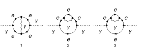
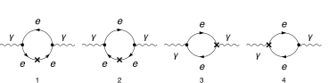

## Load FeynCalc and the necessary add-ons or other packages

This example uses a custom QED model created with FeynRules.

```mathematica
description = "Renormalization, QED, MSbar, Photon self-energy, massless, 2-loop";
If[ $FrontEnd === Null, 
  	$FeynCalcStartupMessages = False; 
  	Print[description]; 
  ];
If[ $Notebooks === False, 
  	$FeynCalcStartupMessages = False 
  ];
LaunchKernels[8];
$LoadAddOns = {"FeynArts", "FeynHelpers"};
<< FeynCalc`
$FAVerbose = 0;
$ParallelizeFeynCalc = True; 
 
FCCheckVersion[10, 2, 0];
If[ToExpression[StringSplit[$FeynHelpersVersion, "."]][[1]] < 2, 
 	Print["You need at least FeynHelpers 2.0 to run this example."]; 
 	Abort[]; 
 ]
```

$$\text{FeynCalc }\;\text{10.2.0 (dev version, 2026-05-18 15:58:48 +02:00, 1a8e687c). For help, use the }\underline{\text{online} \;\text{documentation},}\;\text{ visit the }\underline{\text{forum}}\;\text{ and have a look at the supplied }\underline{\text{examples}.}\;\text{ The PDF-version of the manual can be downloaded }\underline{\text{here}.}$$

$$\text{If you use FeynCalc in your research, please evaluate FeynCalcHowToCite[] to learn how to cite this software.}$$

$$\text{Please keep in mind that the proper academic attribution of our work is crucial to ensure the future development of this package!}$$

$$\text{FeynArts }\;\text{3.12 (27 Mar 2025) patched for use with FeynCalc, for documentation see the }\underline{\text{manual}}\;\text{ or visit }\underline{\text{www}.\text{feynarts}.\text{de}.}$$

$$\text{If you use FeynArts in your research, please cite}$$

$$\text{ $\bullet $ T. Hahn, Comput. Phys. Commun., 140, 418-431, 2001, arXiv:hep-ph/0012260}$$

$$\text{FeynHelpers }\;\text{2.0.0 (2026-02-05 17:03:01 +02:00, 5db84fbb). For help, use the }\underline{\text{online} \;\text{documentation},}\;\text{ visit the }\underline{\text{forum}}\;\text{ and have a look at the supplied }\underline{\text{examples}.}\;\text{ The PDF-version of the manual can be downloaded }\underline{\text{here}.}$$

$$\text{ If you use FeynHelpers in your research, please evaluate FeynHelpersHowToCite[] to learn how to cite this work.}$$

## Configure some options

```mathematica
modelDir = FileNameJoin[{$UserBaseDirectory, "Applications", "FeynCalc", "Examples", "Models", "QED"}]
```

$$\text{/home/vs/.Wolfram/Applications/FeynCalc/Examples/Models/QED}$$

```mathematica
FAPatch[PatchModelsOnly -> True, FAModelsDirectory -> modelDir];

(*Successfully patched FeynArts.*)
```

```mathematica
renConstants = Zm | Zpsi | ZA | ZAmxt | Ze | Zxi
```

$$\text{Zm}|\text{Zpsi}|\text{ZA}|\text{ZAmxt}|\text{Ze}|\text{Zxi}$$

## Generate Feynman diagrams

Nicer typesetting

```mathematica
FCAttachTypesettingRule[mu, "\[Mu]"];
FCAttachTypesettingRule[nu, "\[Nu]"];
FCAttachTypesettingRule[rho, "\[Rho]"];
FCAttachTypesettingRule[si, "\[Sigma]"];
```

```mathematica
diagPhotonSE = InsertFields[CreateTopologies[2, 1 -> 1, 
     ExcludeTopologies -> {Tadpoles, WFCorrections, WFCorrectionCTs}], {V[1]} -> {V[1]}, 
    InsertionLevel -> {Particles}, Model -> FileNameJoin[{modelDir, "QED"}], 
    GenericModel -> FileNameJoin[{modelDir, "QED"}], ExcludeParticles -> {F[2, {2 | 3}]}];
```

```mathematica
diagPhotonSECT = InsertFields[CreateCTTopologies[2, 1 -> 1, 
     ExcludeTopologies -> {Tadpoles, WFCorrections, WFCorrectionCTs}], {V[1]} -> {V[1]}, 
    InsertionLevel -> {Particles}, Model -> FileNameJoin[{modelDir, "QED"}], 
    GenericModel -> FileNameJoin[{modelDir, "QED"}], ExcludeParticles -> {F[2, {2 | 3}]}];
```

```mathematica
diagPhotonTreeSECT = InsertFields[CreateCTTopologies[1, 1 -> 1, 
     ExcludeTopologies -> {Tadpoles, WFCorrections, WFCorrectionCTs}], {V[1]} -> {V[1]}, 
    InsertionLevel -> {Particles}, Model -> FileNameJoin[{modelDir, "QED"}], 
    GenericModel -> FileNameJoin[{modelDir, "QED"}], ExcludeParticles -> {F[2, {2 | 3}]}];
```

Self-energy and vertex diagrams

```mathematica
Paint[diagPhotonSE, ColumnsXRows -> {3, 1}, SheetHeader -> None, 
   Numbering -> Simple, ImageSize -> 128 {3, 1}];
```



1-loop counter-term diagrams

```mathematica
Paint[diagPhotonSECT, ColumnsXRows -> {4, 1}, SheetHeader -> None, 
   Numbering -> Simple, ImageSize -> 128 {4, 1}];
```



Tree-level counter-term diagrams

```mathematica
Paint[diagPhotonTreeSECT, ColumnsXRows -> {4, 1}, SheetHeader -> None,
   Numbering -> Simple, ImageSize -> 128 {4, 1}];
```


## Master integrals

The only required masters are 1- and 2-loop tadpoles

```mathematica
tadpoleMaster = Get[FileNameJoin[{$FeynCalcDirectory, "Examples", "MasterIntegrals","Tadpoles", "tad1LxFx1x1xxEp999x.m"}]];
```

```mathematica
tadpoleMaster1 = tadpoleMaster /. m1 -> mxt /. tad1L -> "tad1Lv1";
```

```mathematica
tadpoleMaster2 = Get[FileNameJoin[{$FeynCalcDirectory, "Examples", "MasterIntegrals","Tadpoles", 
        "tad2LxFx111x111xxEp1x.m"}]] /. m1 -> mxt /. tad2LxFx111x111xxEp1x -> "tad2Lv2";
```

## Obtain the amplitudes

```mathematica
{photonSE$RawAmp, photonSECT$RawAmp, diagPhotonTreeSECT$RawAmp} = 
   FCFAConvert[CreateFeynAmp[#, Truncated -> True, 
      	GaugeRules -> {}, PreFactor -> 1], 
     	IncomingMomenta -> {p}, OutgoingMomenta -> {p}, 
     	LorentzIndexNames -> {mu, nu}, DropSumOver -> True, 
     	LoopMomenta -> {k1, k2}, UndoChiralSplittings -> True, 
     	ChangeDimension -> D, SMP -> True, 
     	FinalSubstitutions -> {SMP["m_e"] -> 0, SMP["e"] -> 4 Pi Sqrt[a4]}] & /@ {
    	diagPhotonSE, diagPhotonSECT, diagPhotonTreeSECT};
```

## Calculate the amplitudes

### Photon self-energy at 2 loops

The 2-loop photon self-energy has superficial degree of divergence equal to 2

```mathematica
FCClearScalarProducts[];
divDegree = 2;
aux1 = FCLoopGetFeynAmpDenominators[Nf photonSE$RawAmp, 
    {k1, k2}, denHead, Momentum -> {p}, "Massless" -> True];
aux2 = FCLoopAddAuxiliaryMass[aux1[[2]], {k1, k2}, -mxt^2, 0, Head -> denHead]
```

$$\left\{\text{denHead}\left(\frac{1}{(\text{k1}^2+i \eta )}\right)\to \frac{1}{(\text{k1}^2-\text{mxt}^2+i \eta )},\text{denHead}\left(\frac{1}{(\text{k2}^2+i \eta )}\right)\to \frac{1}{(\text{k2}^2-\text{mxt}^2+i \eta )},\text{denHead}\left(\frac{1}{((\text{k1}+\text{k2})^2+i \eta )}\right)\to \frac{1}{((\text{k1}+\text{k2})^2-\text{mxt}^2+i \eta )},\text{denHead}\left(\frac{1}{((\text{k1}-p)^2+i \eta )}\right)\to \frac{1}{((\text{k1}-p)^2-\text{mxt}^2+i \eta )},\text{denHead}\left(\frac{1}{((\text{k2}-p)^2+i \eta )}\right)\to \frac{1}{((\text{k2}-p)^2-\text{mxt}^2+i \eta )},\text{denHead}\left(\frac{1}{((\text{k1}+p)^2+i \eta )}\right)\to \frac{1}{((\text{k1}+p)^2-\text{mxt}^2+i \eta )},\text{denHead}\left(\frac{1}{((-\text{k1}+\text{k2}+p)^2+i \eta )}\right)\to \frac{1}{((-\text{k1}+\text{k2}+p)^2-\text{mxt}^2+i \eta )}\right\}$$

```mathematica
AbsoluteTiming[photonSE$PreAmp1 = Contract[(aux1[[1]] /. aux2), FCParallelize -> True];]
```

$$\{0.143735,\text{Null}\}$$

```mathematica
AbsoluteTiming[photonSE$Amp = photonSE$PreAmp1 // 
      SUNSimplify[#, FCI -> True, FCParallelize -> True] & // DiracSimplify[#, FCI -> True, FCParallelize -> True] &;]
```

$$\{0.453874,\text{Null}\}$$

```mathematica
isoSymbols = FCMakeSymbols[KK, Range[1, $KernelCount], List]
```

$$\{\text{KK1},\text{KK2},\text{KK3},\text{KK4},\text{KK5},\text{KK6},\text{KK7},\text{KK8}\}$$

```mathematica
AbsoluteTiming[photonSE$Amp1 = Collect2[photonSE$Amp, p, IsolateNames -> isoSymbols, FCParallelize -> True];]
```

$$\{0.28325,\text{Null}\}$$

```mathematica
AbsoluteTiming[photonSE$Amp2 = FourSeries[photonSE$Amp1, {p, 0, divDegree}, FCParallelize -> True];]
```

$$\{1.5857,\text{Null}\}$$

```mathematica
AbsoluteTiming[photonSE$Amp3 = Collect2[FRH2[photonSE$Amp2, isoSymbols], FeynAmpDenominator, FCParallelize -> True];]
```

$$\{0.382135,\text{Null}\}$$

The rest of the calculation follows the standard multiloop template

```mathematica
FCClearScalarProducts[]
SPD[p] = pp;
```

```mathematica
AbsoluteTiming[{photonSE$Amp4, photonSE$Topos} = FCLoopFindTopologies[photonSE$Amp3, {k1, k2}, FCI -> True, FCParallelize -> True, 
     FCLoopBasisOverdeterminedQ -> True, FinalSubstitutions -> {Hold[SPD][p] -> pp}];]
```

$$\text{FCLoopFindTopologies: Number of the initial candidate topologies: }2$$

$$\text{FCLoopFindTopologies: Number of the identified unique topologies: }2$$

$$\text{FCLoopFindTopologies: Number of the preferred topologies among the unique topologies: }0$$

$$\text{FCLoopFindTopologies: Number of the identified subtopologies: }0$$

$$\text{FCLoopFindTopologyMappings: }\;\text{Final number of found topologies: }2$$

$$\{0.974646,\text{Null}\}$$

```mathematica
AbsoluteTiming[photonSE$Amp5 = FCLoopTensorReduce[photonSE$Amp4, photonSE$Topos, FCParallelize -> True];]
```

$$\{2.25307,\text{Null}\}$$

```mathematica
AbsoluteTiming[photonSE$Amp6 = DiracSimplify[photonSE$Amp5, FCParallelize -> True];]
```

$$\{0.051568,\text{Null}\}$$

```mathematica
AbsoluteTiming[{photonSE$Amp7, photonSE$Topos2} = FCLoopRewriteOverdeterminedTopologies[photonSE$Amp6, photonSE$Topos, FCParallelize -> True];]
```

$$\text{FCLoopRewriteIncompleteTopologies: }\;\text{No overdetermined topologies detected.}$$

$$\{0.050532,\text{Null}\}$$

```mathematica
AbsoluteTiming[{photonSE$Amp8, photonSE$Topos3} = FCLoopRewriteIncompleteTopologies[photonSE$Amp7, photonSE$Topos2, FCParallelize -> True];]
```

$$\text{FCLoopRewriteIncompleteTopologies: }\;\text{No incomplete topologies detected.}$$

$$\{0.039562,\text{Null}\}$$

```mathematica
AbsoluteTiming[photonSE$SubTopos = FCLoopFindSubtopologies[photonSE$Topos3, Flatten -> True, Remove -> True, FCParallelize -> True];]
```

$$\{0.071435,\text{Null}\}$$

```mathematica
{photonSE$TopoMappings, 
    photonSE$FinalTopos} = FCLoopFindTopologyMappings[photonSE$Topos3, PreferredTopologies -> photonSE$SubTopos, FCParallelize -> True];
```

$$\text{FCLoopFindTopologyMappings: }\;\text{Found }1\text{ mapping relations }$$

$$\text{FCLoopFindTopologyMappings: }\;\text{Final number of independent topologies: }1$$

```mathematica
AbsoluteTiming[photonSE$AmpGLI = FCLoopApplyTopologyMappings[photonSE$Amp8, {photonSE$TopoMappings, 
      photonSE$FinalTopos}, FCParallelize -> True];]
```

$$\{1.26001,\text{Null}\}$$

```mathematica
photonSE$GLIs = Cases2[photonSE$AmpGLI, GLI];
```

```mathematica
photonSE$dir = FileNameJoin[{$TemporaryDirectory, "Reduction-photonSE-2L-massless"}];
Quiet[CreateDirectory[photonSE$dir]];
```

```mathematica
KiraCreateJobFile[photonSE$FinalTopos, photonSE$GLIs, photonSE$dir]
```

$$\{\text{/tmp/Reduction-photonSE-2L-massless/fctopology1/job.yaml}\}$$

```mathematica
KiraCreateIntegralFile[photonSE$GLIs, photonSE$FinalTopos, photonSE$dir]
KiraCreateConfigFiles[photonSE$FinalTopos, photonSE$GLIs, photonSE$dir, 
  KiraMassDimensions -> {pp -> 2, mxt -> 1}]
```

$$\text{KiraCreateIntegralFile: Number of loop integrals: }97$$

$$\{\text{/tmp/Reduction-photonSE-2L-massless/fctopology1/KiraLoopIntegrals}\}$$

$$\left(
\begin{array}{cc}
 \;\text{/tmp/Reduction-photonSE-2L-massless/fctopology1/config/integralfamilies.yaml} & \;\text{/tmp/Reduction-photonSE-2L-massless/fctopology1/config/kinematics.yaml} \\
\end{array}
\right)$$

```mathematica
KiraRunReduction[photonSE$dir, photonSE$FinalTopos, 
  KiraBinaryPath -> FileNameJoin[{$HomeDirectory, ".local", "bin", "kira"}], 
  KiraFermatPath -> FileNameJoin[{$HomeDirectory, "bin", "ferl64", "fer64"}]]
```

$$\{\text{True}\}$$

```mathematica
photonSE$ReductionTables = KiraImportResults[photonSE$FinalTopos, photonSE$dir] // Flatten;
```

```mathematica
AbsoluteTiming[photonSE$resPreFinal1 = (photonSE$AmpGLI /. Dispatch[photonSE$ReductionTables]);]
```

$$\{0.013636,\text{Null}\}$$

```mathematica
AbsoluteTiming[photonSE$resPreFinal2 = Map[Collect2[#, GLI, DiracGamma, FCParallelize -> True] &, photonSE$resPreFinal1];]
```

$$\{0.381002,\text{Null}\}$$

```mathematica
photonSE$masters = Cases2[photonSE$resPreFinal1, GLI];
```

```mathematica
photonSE$MIMappings = FCLoopFindIntegralMappings[photonSE$masters, Join[tadpoleMaster1[[2]], {tadpoleMaster2[[2]]}, 
    photonSE$FinalTopos], PreferredIntegrals -> {tadpoleMaster1[[1]][[1]] tadpoleMaster1[[1]][[1]], tadpoleMaster2[[1]][[1]]}]
```

$$\left(
\begin{array}{cc}
 G^{\text{fctopology1}}(1,1,0)\to G^{\text{tad1LxFx1x1xxEp999x}}(1)^2 & G^{\text{fctopology1}}(1,1,1)\to G^{\text{tad2Lv2}}(1,1,1) \\
 G^{\text{tad2Lv2}}(1,1,1) & G^{\text{tad1LxFx1x1xxEp999x}}(1)^2 \\
\end{array}
\right)$$

```mathematica
isoSymbols1 = FCMakeSymbols[LL, Range[1, $KernelCount], List];
isoSymbols2 = FCMakeSymbols[LM, Range[1, $KernelCount], List];
```

```mathematica
AbsoluteTiming[photonSE$resPreFinal2 = Collect2[photonSE$resPreFinal1, D, GLI, IsolateNames -> isoSymbols1, FCParallelize -> True] // FCReplaceD[#, D -> 4 - 2 ep] & // ReplaceAll[#, photonSE$MIMappings[[1]]] & // 
      ReplaceAll[#, {tadpoleMaster1[[1]], tadpoleMaster2[[1]]}] & // Collect2[#, ep, IsolateNames -> isoSymbols2, FCParallelize -> True] &;]
```

$$\{14.0703,\text{Null}\}$$

```mathematica
AbsoluteTiming[photonSE$resPreFinal3 = photonSE$resPreFinal2 // Series[#, {ep, 0, -1}] & // Normal // Series[(I*(4*Pi)^(-2 + ep))^2 #, {ep, 0, -1}] & // Normal;]
```

$$\{1.28462,\text{Null}\}$$

```mathematica
AbsoluteTiming[photonSE$resPreFinal4 = Collect2[FRH2[FRH2[photonSE$resPreFinal3, isoSymbols2], isoSymbols1], DiracGamma, pp, mxt, ep, FCParallelize -> True];]
```

$$\{0.427573,\text{Null}\}$$

```mathematica
isoSymbols3 = FCMakeSymbols[LH, Range[1, $KernelCount], List];
```

```mathematica
AbsoluteTiming[photonSE$resPreFinal5 = Series[Total[Collect2[photonSE$resPreFinal4, mxt, IsolateNames -> isoSymbols3, FCParallelize -> True]], {mxt, 0, 2}] // Normal;]
```

$$\{1.38986,\text{Null}\}$$

```mathematica
AbsoluteTiming[photonSE$resPreFinal6 = Collect2[FRH2[photonSE$resPreFinal5, isoSymbols3] // ReplaceAll[#, Log[m_Symbol^2] :> 2 Log[m]] &, DiracGamma, pp, mxt, ep, FCParallelize -> True];]
```

$$\{0.081635,\text{Null}\}$$

```mathematica
photonSE$resFinal = Collect2[Collect2[photonSE$resPreFinal6, ep, CA, CF, ml, Nf, SUNFDelta, a4, DiracGamma, GaugeXi, Factoring -> FullSimplify, FCParallelize -> True], ep, ml, mxt]
```

$$-\frac{2 i \;\text{a4}^2 \;\text{mxt}^2 N_f \xi _{V(1)} g^{\mu \nu }}{\text{ep}^2}+\frac{8 i \;\text{a4}^2 \;\text{mxt}^2 N_f \log (\text{mxt}) \xi _{V(1)} g^{\mu \nu }}{\text{ep}}-\frac{i \;\text{a4}^2 \;\text{mxt}^2 (4 \log (4 \pi )-3) N_f \xi _{V(1)} g^{\mu \nu }}{\text{ep}}-\frac{2 i \;\text{a4}^2 N_f \left(2 \xi _{V(1)}+3\right) \left(\text{pp} g^{\mu \nu }-p^{\mu } p^{\nu }\right)}{3 \;\text{ep}}$$

### Photon self-energy 1-loop CT

```mathematica
FCClearScalarProducts[];
divDegree = 2;
aux1 = FCLoopGetFeynAmpDenominators[Nf photonSECT$RawAmp, {k1}, denHead, Momentum -> {p}, "Massless" -> True];
aux2 = FCLoopAddAuxiliaryMass[aux1[[2]], {k1}, -mxt^2, 0, Head -> denHead]
```

$$\left\{\text{denHead}\left(\frac{1}{(\text{k1}^2+i \eta )}\right)\to \frac{1}{(\text{k1}^2-\text{mxt}^2+i \eta )},\text{denHead}\left(\frac{1}{((\text{k1}-p)^2+i \eta )}\right)\to \frac{1}{((\text{k1}-p)^2-\text{mxt}^2+i \eta )},\text{denHead}\left(\frac{1}{((\text{k1}+p)^2+i \eta )}\right)\to \frac{1}{((\text{k1}+p)^2-\text{mxt}^2+i \eta )}\right\}$$

```mathematica
photonSECT$StrName = StringReplace[ToString[Hold[photonSECT$Amp]], {"Hold[" -> "", "]" -> ""}]
```

$$\text{photonSECT\$Amp}$$

```mathematica
AbsoluteTiming[photonSECT$Amp = (aux1[[1]] /. aux2) // Contract[#, FCParallelize -> True] & // 
      SUNSimplify[#, FCParallelize -> True] & // DiracSimplify[#, FCParallelize -> True] &;]
```

$$\{0.130859,\text{Null}\}$$

```mathematica
AbsoluteTiming[photonSECT$Amp1 = Collect2[photonSECT$Amp, p, IsolateNames -> KK];]
AbsoluteTiming[photonSECT$Amp2 = FourSeries[photonSECT$Amp1, {p, 0, divDegree}, FCParallelize -> True];]
AbsoluteTiming[photonSECT$Amp3 = Collect2[FRH[photonSECT$Amp2], FeynAmpDenominator, FCParallelize -> True];]
```

$$\{0.039975,\text{Null}\}$$

$$\{0.121603,\text{Null}\}$$

$$\{0.038232,\text{Null}\}$$

The rest of the calculation follows the standard multiloop template

```mathematica
FCClearScalarProducts[];
SPD[p] = pp;
```

```mathematica
{photonSECT$Amp4, photonSECT$Topos} = FCLoopFindTopologies[photonSECT$Amp3, {k1}, FCParallelize -> True, 
    FCLoopBasisOverdeterminedQ -> True, FinalSubstitutions -> {Hold[SPD][p] -> pp}, Names -> quarkSEtopo];
```

$$\text{FCLoopFindTopologies: Number of the initial candidate topologies: }1$$

$$\text{FCLoopFindTopologies: Number of the identified unique topologies: }1$$

$$\text{FCLoopFindTopologies: Number of the preferred topologies among the unique topologies: }0$$

$$\text{FCLoopFindTopologies: Number of the identified subtopologies: }0$$

$$\text{FCLoopFindTopologyMappings: }\;\text{Final number of found topologies: }1$$

```mathematica
AbsoluteTiming[photonSECT$Amp5 = FCLoopTensorReduce[photonSECT$Amp4, photonSECT$Topos, FCParallelize -> True];]
```

$$\{0.361471,\text{Null}\}$$

```mathematica
AbsoluteTiming[photonSECT$Amp6 = DiracSimplify[photonSECT$Amp5, FCParallelize -> True];]
```

$$\{0.016004,\text{Null}\}$$

```mathematica
{photonSECT$Amp7, photonSECT$Topos2} = FCLoopRewriteOverdeterminedTopologies[photonSECT$Amp6, photonSECT$Topos, FCParallelize -> True];
```

$$\text{FCLoopRewriteIncompleteTopologies: }\;\text{No overdetermined topologies detected.}$$

```mathematica
{photonSECT$Amp8, photonSECT$Topos3} = FCLoopRewriteIncompleteTopologies[photonSECT$Amp7, photonSECT$Topos2, FCParallelize -> True];
```

$$\text{FCLoopRewriteIncompleteTopologies: }\;\text{No incomplete topologies detected.}$$

```mathematica
AbsoluteTiming[photonSECT$SubTopos = FCLoopFindSubtopologies[photonSECT$Topos2, Flatten -> True, Remove -> True, FCParallelize -> True];]
```

$$\{0.037327,\text{Null}\}$$

```mathematica
AbsoluteTiming[{photonSECT$TopoMappings, photonSECT$FinalTopos} = FCLoopFindTopologyMappings[photonSECT$Topos2, PreferredTopologies -> photonSECT$SubTopos, FCParallelize -> True];]
```

$$\text{FCLoopFindTopologyMappings: }\;\text{Found }0\text{ mapping relations }$$

$$\text{FCLoopFindTopologyMappings: }\;\text{Final number of independent topologies: }1$$

$$\{0.052703,\text{Null}\}$$

```mathematica
AbsoluteTiming[photonSECT$AmpGLI = FCLoopApplyTopologyMappings[photonSECT$Amp8, {photonSECT$TopoMappings, photonSECT$FinalTopos},FCParallelize -> True];]
```

$$\{0.086216,\text{Null}\}$$

```mathematica
photonSECT$GLIs = Cases2[photonSECT$AmpGLI, GLI];
```

```mathematica
photonSECT$dir = FileNameJoin[{$TemporaryDirectory, "Reduction-" <> photonSECT$StrName <> "-1L-massive"}];
Quiet[CreateDirectory[photonSECT$dir]];
```

```mathematica
KiraCreateJobFile[photonSECT$FinalTopos, photonSECT$GLIs, photonSECT$dir]
```

$$\{\text{/tmp/Reduction-photonSECT\$Amp-1L-massive/quarkSEtopo1/job.yaml}\}$$

```mathematica
KiraCreateIntegralFile[photonSECT$GLIs, photonSECT$FinalTopos, photonSECT$dir]
KiraCreateConfigFiles[photonSECT$FinalTopos, photonSECT$GLIs, photonSECT$dir, 
  KiraMassDimensions -> {pp -> 2, mxt -> 1}]
```

$$\text{KiraCreateIntegralFile: Number of loop integrals: }5$$

$$\{\text{/tmp/Reduction-photonSECT\$Amp-1L-massive/quarkSEtopo1/KiraLoopIntegrals}\}$$

$$\left(
\begin{array}{cc}
 \;\text{/tmp/Reduction-photonSECT\$Amp-1L-massive/quarkSEtopo1/config/integralfamilies.yaml} & \;\text{/tmp/Reduction-photonSECT\$Amp-1L-massive/quarkSEtopo1/config/kinematics.yaml} \\
\end{array}
\right)$$

```mathematica
KiraRunReduction[photonSECT$dir, photonSECT$FinalTopos, 
  KiraBinaryPath -> FileNameJoin[{$HomeDirectory, ".local", "bin", "kira"}], 
  KiraFermatPath -> FileNameJoin[{$HomeDirectory, "bin", "ferl64", "fer64"}]]
```

$$\{\text{True}\}$$

```mathematica
photonSECT$ReductionTables = KiraImportResults[photonSECT$FinalTopos, photonSECT$dir] // Flatten;
```

```mathematica
photonSECT$resPreFinal1 = Collect2[Total[photonSECT$AmpGLI /. Dispatch[photonSECT$ReductionTables]], GLI, 
    GaugeXi, D, DiracGamma, FCParallelize -> True];
```

```mathematica
photonSECT$masters = Cases2[photonSECT$resPreFinal1, GLI];
```

```mathematica
photonSECT$MIMappings = FCLoopFindIntegralMappings[photonSECT$masters, Join[tadpoleMaster1[[2]], 
    photonSECT$FinalTopos], PreferredIntegrals -> {tadpoleMaster1[[1]][[1]]}]
```

$$\left(
\begin{array}{c}
 G^{\text{quarkSEtopo1}}(1)\to G^{\text{tad1LxFx1x1xxEp999x}}(1) \\
 G^{\text{tad1LxFx1x1xxEp999x}}(1) \\
\end{array}
\right)$$

Our master integrals are calculated using the standard multiloop normalization. To convert it back to the textbook normalization
we need to multiply by I*(4 Pi)^(ep-2)

At this point we need to insert the 1-loop renormalization constants

```mathematica
knownResults1L = {
    rc[delZA, 1] -> (-4*Nf)/(3*ep), 
    rc[delZAmxt, 1] -> -2 Nf/ep, 
    rc[delZxi, 1] -> (-4*Nf)/(3*ep), 
    rc[delZpsi, 1] -> -(GaugeXi[V[1]]/ep), 
    rc[delZe, 1] -> (2*Nf)/(3*ep)};
```

```mathematica
AbsoluteTiming[photonSECT$resPreFinal2 = Collect2[photonSECT$resPreFinal1, D, GLI, IsolateNames -> KK] // FCReplaceD[#, D -> 4 - 2 ep] & // 
            ReplaceAll[#, photonSECT$MIMappings[[1]]] & // ReplaceAll[#, {tadpoleMaster1[[1]], tadpoleMaster2[[1]]}] & // 
          Collect2[#, ep, IsolateNames -> KK2] & // Series[(I*(4*Pi)^(-2 + ep)) #, {ep, 0, 1}] & // Normal // FCLoopAddMissingHigherOrdersWarning[#, ep, epHelp] & // FRH // 
     ReplaceAll[#, {Log[mxt^2] -> 2 Log[mxt]}] &;]
```

$$\{4.00868,\text{Null}\}$$

```mathematica
AbsoluteTiming[photonSECT$resPreFinal3 = Collect2[photonSECT$resPreFinal2, Join[{a4}, List @@ renConstants],IsolateNames -> KK] // ReplaceAll[#, Zxi -> ZA] & // 
       ReplaceAll[#, {(h : renConstants) :> 1 + (a4 rc[ToExpression["del" <> ToString[h]], 1] + a4^2 rc[ToExpression["del" <> ToString[h]], 2])}] & // Series[#, {a4, 0, 2}] & // Normal;]
```

$$\{0.054221,\text{Null}\}$$

```mathematica
photonSECT$resPreFinal4 = Collect2[photonSECT$resPreFinal3 // FRH, {rc, D, GLI}, IsolateNames -> KK] // FCReplaceD[#, {D -> 4 - 2 ep}] & // 
        ReplaceRepeated[#, knownResults1L] & // FRH // Series[#, {ep, 0, -1}] & // Normal // Collect2[#, ep, mxt, Factoring -> Simplify, FCParallelize -> True, Pair] &;
```

```mathematica
photonSECT$resFinal = Collect2[photonSECT$resPreFinal4, mxt, IsolateNames -> KK] // Series[#, {mxt, 0, 2}] & // Normal // FRH // Collect2[#, ep, mxt, Pair, Factoring -> Simplify, FCParallelize -> True] &
```

$$\frac{4 i \;\text{a4}^2 \;\text{mxt}^2 N_f \xi _{V(1)} g^{\mu \nu }}{\text{ep}^2}-\frac{8 i \;\text{a4}^2 \;\text{mxt}^2 N_f \log (\text{mxt}) \xi _{V(1)} g^{\mu \nu }}{\text{ep}}+\frac{4 i \;\text{a4}^2 \;\text{mxt}^2 (\log (4 \pi )-1) N_f \xi _{V(1)} g^{\mu \nu }}{\text{ep}}+\frac{4 i \;\text{a4}^2 \;\text{pp} N_f \xi _{V(1)} g^{\mu \nu }}{3 \;\text{ep}}-\frac{4 i \;\text{a4}^2 N_f p^{\mu } p^{\nu } \xi _{V(1)}}{3 \;\text{ep}}$$

### Determination of renormalization constants

```mathematica
diagPhotonTreeSECT$Amp = (Total[diagPhotonTreeSECT$RawAmp]) // ReplaceAll[#, Zxi -> ZA] & // ReplaceRepeated[#, {
        	(h : renConstants) :> 1 + (a4 rc[ToExpression["del" <> ToString[h]], 1] + a4^2 rc[ToExpression["del" <> ToString[h]], 2])}] & // 
    	Series[#, {a4, 0, 2}] & // Normal // ReplaceRepeated[#, knownResults1L] &
```

$$\text{a4}^2 \left(-i \;\text{pp} \;\text{rc}(\text{delZA},2) g^{\mu \nu }+i p^{\mu } p^{\nu } \;\text{rc}(\text{delZA},2)+i \;\text{mxt}^2 g^{\mu \nu } \left(2 \;\text{rc}(\text{delZAmxt},2)+\frac{4 N_f^2}{\text{ep}^2}\right)\right)+i \;\text{a4} \left(-\frac{4 \;\text{mxt}^2 N_f g^{\mu \nu }}{\text{ep}}+\frac{4 \;\text{pp} N_f g^{\mu \nu }}{3 \;\text{ep}}-\frac{4 N_f p^{\mu } p^{\nu }}{3 \;\text{ep}}\right)$$

```mathematica
photonSE$RenConstants2L = Collect2[Coefficient[photonSE$resFinal + photonSECT$resFinal + diagPhotonTreeSECT$Amp,a4, 2], 
     a4, mxt, DiracGamma, Factoring -> Simplify] // FCMatchSolve[#, {ep, CF, DiracGamma, ml, mxt, SUNDelta, SUNTF, SUNFDelta, CA, GaugeXi, a4, Pair, pp, Nf, SUNN}] & // Collect2[#, ep] &
```

$$\text{FCMatchSolve: Solving for: }\{\text{rc}(\text{delZA},2),\text{rc}(\text{delZAmxt},2)\}$$

$$\text{FCMatchSolve: A solution exists.}$$

$$\left\{\text{rc}(\text{delZA},2)\to -\frac{2 N_f}{\text{ep}},\text{rc}(\text{delZAmxt},2)\to \frac{N_f \xi _{V(1)}}{2 \;\text{ep}}-\frac{N_f \left(2 N_f+\xi _{V(1)}\right)}{\text{ep}^2}\right\}$$

## Check the final results

Our final QED 2-loop wave-function renormalization constants

```mathematica
finalResults = Thread[Rule[List @@ renConstants, 
      (List @@ renConstants /. (h : renConstants) :> 1 + a4 rc[ToExpression["del" <> ToString[h]], 1] + a4^2 rc[ToExpression["del" <> ToString[h]], 2]) // 
       ReplaceAll[#, Join[SUNSimplify[knownResults1L, SUNNToCACF -> False], photonSE$RenConstants2L]] &]] // SelectNotFree[#, ZA, ZAmxt] &;
```

```mathematica
finalResults // TableForm
```

$$\begin{array}{l}
 \;\text{ZA}\to -\frac{2 \;\text{a4}^2 N_f}{\text{ep}}-\frac{4 \;\text{a4} N_f}{3 \;\text{ep}}+1 \\
 \;\text{ZAmxt}\to \;\text{a4}^2 \left(\frac{N_f \xi _{V(1)}}{2 \;\text{ep}}-\frac{N_f \left(2 N_f+\xi _{V(1)}\right)}{\text{ep}^2}\right)-\frac{2 \;\text{a4} N_f}{\text{ep}}+1 \\
\end{array}$$

```mathematica
knownResult = {rc[delZA, 2] -> (-2*Nf)/ep, rc[delZAmxt, 2] -> (Nf*GaugeXi[V[1]])/(2*ep) - (Nf*(2*Nf + GaugeXi[V[1]]))/ep^2};
```

```mathematica
FCCompareResults[photonSE$RenConstants2L, knownResult, 
  Text -> {"\tCompare to Grozing, Lectures on QED and QCD, Eq 5.25 hep-ph/0508242:", 
    "CORRECT.", "WRONG!"}, Interrupt -> {Hold[Quit[1]], Automatic}]
Print["\tCPU Time used: ", Round[N[TimeUsed[], 4], 0.001], " s."];

```mathematica

$$\text{$\backslash $tCompare to Grozing, Lectures on QED and QCD, Eq 5.25 hep-ph/0508242:} \;\text{CORRECT.}$$

$$\text{True}$$

$$\text{$\backslash $tCPU Time used: }43.52\text{ s.}$$