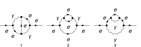
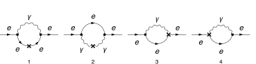
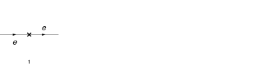

## Load FeynCalc and the necessary add-ons or other packages

This example uses a custom QED model created with FeynRules.

```mathematica
description = "Renormalization, QED, MSbar, 2-loop";
If[ $FrontEnd === Null, 
  	$FeynCalcStartupMessages = False; 
  	Print[description]; 
  ];
If[ $Notebooks === False, 
  	$FeynCalcStartupMessages = False 
  ];
LaunchKernels[8];
$LoadAddOns = {"FeynArts", "FeynHelpers"};
<< FeynCalc`
$FAVerbose = 0;
$ParallelizeFeynCalc = True; 
 
FCCheckVersion[10, 2, 0];
If[ToExpression[StringSplit[$FeynHelpersVersion, "."]][[1]] < 2, 
 	Print["You need at least FeynHelpers 2.0 to run this example."]; 
 	Abort[]; 
 ]
```

$$\text{FeynCalc }\;\text{10.2.0 (dev version, 2026-05-18 15:58:48 +02:00, 1a8e687c). For help, use the }\underline{\text{online} \;\text{documentation},}\;\text{ visit the }\underline{\text{forum}}\;\text{ and have a look at the supplied }\underline{\text{examples}.}\;\text{ The PDF-version of the manual can be downloaded }\underline{\text{here}.}$$

$$\text{If you use FeynCalc in your research, please evaluate FeynCalcHowToCite[] to learn how to cite this software.}$$

$$\text{Please keep in mind that the proper academic attribution of our work is crucial to ensure the future development of this package!}$$

$$\text{FeynArts }\;\text{3.12 (27 Mar 2025) patched for use with FeynCalc, for documentation see the }\underline{\text{manual}}\;\text{ or visit }\underline{\text{www}.\text{feynarts}.\text{de}.}$$

$$\text{If you use FeynArts in your research, please cite}$$

$$\text{ $\bullet $ T. Hahn, Comput. Phys. Commun., 140, 418-431, 2001, arXiv:hep-ph/0012260}$$

$$\text{FeynHelpers }\;\text{2.0.0 (2026-02-05 17:03:01 +02:00, 5db84fbb). For help, use the }\underline{\text{online} \;\text{documentation},}\;\text{ visit the }\underline{\text{forum}}\;\text{ and have a look at the supplied }\underline{\text{examples}.}\;\text{ The PDF-version of the manual can be downloaded }\underline{\text{here}.}$$

$$\text{ If you use FeynHelpers in your research, please evaluate FeynHelpersHowToCite[] to learn how to cite this work.}$$

## Configure some options

```mathematica
modelDir = FileNameJoin[{$UserBaseDirectory, "Applications", "FeynCalc", "Examples", "Models", "QED"}]
```

$$\text{/home/vs/.Wolfram/Applications/FeynCalc/Examples/Models/QED}$$

```mathematica
FAPatch[PatchModelsOnly -> True, FAModelsDirectory -> modelDir];

(*Successfully patched FeynArts.*)
```

```mathematica
renConstants = Zpsi | ZA | ZAmxt | Ze | Zxi
```

$$\text{Zpsi}|\text{ZA}|\text{ZAmxt}|\text{Ze}|\text{Zxi}$$

## Generate Feynman diagrams

Nicer typesetting

```mathematica
FCAttachTypesettingRule[mu, "\[Mu]"];
FCAttachTypesettingRule[nu, "\[Nu]"];
FCAttachTypesettingRule[rho, "\[Rho]"];
FCAttachTypesettingRule[si, "\[Sigma]"];
```

```mathematica
diagLeptonSE = InsertFields[CreateTopologies[2, 1 -> 1, 
     ExcludeTopologies -> {Tadpoles, WFCorrections, WFCorrectionCTs}], {F[2, {1}]} -> {F[2, {1}]}, 
    InsertionLevel -> {Particles}, Model -> FileNameJoin[{modelDir, "QED"}], 
    GenericModel -> FileNameJoin[{modelDir, "QED"}], ExcludeParticles -> {F[2, {2 | 3}]}];
```

```mathematica
diagLeptonSECT = InsertFields[CreateCTTopologies[2, 1 -> 1, 
     ExcludeTopologies -> {Tadpoles, WFCorrections, WFCorrectionCTs}], {F[2, {1}]} -> {F[2, {1}]}, 
    InsertionLevel -> {Particles}, Model -> FileNameJoin[{modelDir, "QED"}], 
    GenericModel -> FileNameJoin[{modelDir, "QED"}], ExcludeParticles -> {F[2, {2 | 3}]}];
```

```mathematica
diagLeptonTreeSECT = InsertFields[CreateCTTopologies[1, 1 -> 1, 
     ExcludeTopologies -> {Tadpoles, WFCorrections, WFCorrectionCTs}], {F[2, {1}]} -> {F[2, {1}]}, 
    InsertionLevel -> {Particles}, Model -> FileNameJoin[{modelDir, "QED"}], 
    GenericModel -> FileNameJoin[{modelDir, "QED"}], ExcludeParticles -> {F[2, {2 | 3}]}];
```

Self-energy diagrams

```mathematica
Paint[diagLeptonSE, ColumnsXRows -> {3, 1}, SheetHeader -> None, 
   Numbering -> Simple, ImageSize -> 128 {3, 1}];
```



1-loop counter-term diagrams

```mathematica
Paint[diagLeptonSECT, ColumnsXRows -> {4, 1}, SheetHeader -> None, 
   Numbering -> Simple, ImageSize -> 128 {4, 1}];
```



Tree-level counter-term diagrams

```mathematica
Paint[diagLeptonTreeSECT, ColumnsXRows -> {4, 1}, SheetHeader -> None,
   Numbering -> Simple, ImageSize -> 128 {4, 1}];
```



## Master integrals

The only required masters are 1- and 2-loop tadpoles

```mathematica
tadpoleMaster = Get[FileNameJoin[{$FeynCalcDirectory, "Examples", "MasterIntegrals","Tadpoles", "tad1LxFx1x1xxEp999x.m"}]];
```

```mathematica
tadpoleMaster1 = tadpoleMaster /. m1 -> ml /. tad1LxFx1x1xxEp999x -> "tad1Lv1";
tadpoleMaster2 = tadpoleMaster /. m1 -> mxt /. tad1LxFx1x1xxEp999x -> "tad1Lv2";
```

```mathematica
tadpoleMaster1
```

$$\left\{G^{\text{tad1Lv1}}(1)\to -e^{\gamma  \;\text{ep}} \left(\text{ml}^2\right)^{1-\text{ep}} \Gamma (\text{ep}-1),\left\{\text{FCTopology}\left(\text{tad1Lv1},\left\{\frac{1}{(\text{k1}^2-\text{ml}^2+i \eta )}\right\},\{\text{k1}\},\{\},\{\},\{\}\right)\right\}\right\}$$

```mathematica
tadpoleMaster2
```

$$\left\{G^{\text{tad1Lv2}}(1)\to -e^{\gamma  \;\text{ep}} \left(\text{mxt}^2\right)^{1-\text{ep}} \Gamma (\text{ep}-1),\left\{\text{FCTopology}\left(\text{tad1Lv2},\left\{\frac{1}{(\text{k1}^2-\text{mxt}^2+i \eta )}\right\},\{\text{k1}\},\{\},\{\},\{\}\right)\right\}\right\}$$

```mathematica
tadpoleMaster3 = Get[FileNameJoin[{$FeynCalcDirectory, "Examples", "MasterIntegrals","Tadpoles", 
        "tad2LxFx111x111xxEp1x.m"}]] /. m1 -> ml /. tad2LxFx111x111xxEp1x -> "tad2Lv1";
```

```mathematica
tadpoleMaster4 = Get[FileNameJoin[{$FeynCalcDirectory, "Examples", "MasterIntegrals","Tadpoles", 
        "tad2LxFx111x111xxEp1x.m"}]] /. m1 -> mxt /. tad2LxFx111x111xxEp1x -> "tad2Lv2";
```

```mathematica
tadpoleMaster5 = Get[FileNameJoin[{$FeynCalcDirectory, "Examples", "MasterIntegrals","Tadpoles", 
        "tad2LxAm2m1o4x111x122xxEp1x.m"}]] /. {m1 -> ml, m2 -> mxt} /. tad2LxAm2m1o4x111x122xxEp1x -> "tad2Lv3";
```

```mathematica
tadpoleMaster6 = Get[FileNameJoin[{$FeynCalcDirectory, "Examples", "MasterIntegrals","Tadpoles", 
        "tad2LxAm2m1o4x111x112xxEp1x.m"}]] /. {m1 -> ml, m2 -> mxt} /. tad2LxAm2m1o4x111x112xxEp1x -> "tad2Lv4";
```

## Obtain the amplitudes

```mathematica
{leptonSE$RawAmp, leptonSECT$RawAmp, diagLeptonTreeSECT$RawAmp} = 
   FCFAConvert[CreateFeynAmp[#, Truncated -> True, 
      	GaugeRules -> {}, PreFactor -> 1], 
     	IncomingMomenta -> {p}, OutgoingMomenta -> {p}, 
     	LorentzIndexNames -> {mu, nu}, DropSumOver -> True, 
     	LoopMomenta -> {k1, k2}, UndoChiralSplittings -> True, 
     	ChangeDimension -> D, SMP -> True, 
     	FinalSubstitutions -> {SMP["m_e"] -> 0, SMP["e"] -> 4 Pi Sqrt[a4]}] & /@ {
    	diagLeptonSE, diagLeptonSECT, diagLeptonTreeSECT};
```

## Calculate the amplitudes

### Lepton self-energy at 2 loops

The 2-loop lepton self-energy has superficial degree of divergence equal to 1

```mathematica
FCClearScalarProducts[];
divDegree = 1;
aux1 = FCLoopGetFeynAmpDenominators[Join[leptonSE$RawAmp[[1 ;; 1]], Nf leptonSE$RawAmp[[2 ;; 2]], leptonSE$RawAmp[[3 ;; 3]]], 
    {k1, k2}, denHead, Momentum -> {p}, "Massless" -> True];
aux2 = FCLoopAddAuxiliaryMass[aux1[[2]], {k1, k2}, -mxt^2, 0, Head -> denHead]
```

$$\left\{\text{denHead}\left(\frac{1}{(\text{k1}^2+i \eta )}\right)\to \frac{1}{(\text{k1}^2-\text{mxt}^2+i \eta )},\text{denHead}\left(\frac{1}{(\text{k2}^2+i \eta )}\right)\to \frac{1}{(\text{k2}^2-\text{mxt}^2+i \eta )},\text{denHead}\left(\frac{1}{((\text{k1}+\text{k2})^2+i \eta )}\right)\to \frac{1}{((\text{k1}+\text{k2})^2-\text{mxt}^2+i \eta )},\text{denHead}\left(\frac{1}{((\text{k1}-p)^2+i \eta )}\right)\to \frac{1}{((\text{k1}-p)^2-\text{mxt}^2+i \eta )},\text{denHead}\left(\frac{1}{((\text{k1}-\text{k2}-p)^2+i \eta )}\right)\to \frac{1}{((\text{k1}-\text{k2}-p)^2-\text{mxt}^2+i \eta )},\text{denHead}\left(\frac{1}{((\text{k2}-p)^2+i \eta )}\right)\to \frac{1}{((\text{k2}-p)^2-\text{mxt}^2+i \eta )},\text{denHead}\left(\frac{1}{((\text{k1}+p)^2+i \eta )}\right)\to \frac{1}{((\text{k1}+p)^2-\text{mxt}^2+i \eta )},\text{denHead}\left(\frac{1}{((-\text{k1}+\text{k2}+p)^2+i \eta )}\right)\to \frac{1}{((-\text{k1}+\text{k2}+p)^2-\text{mxt}^2+i \eta )}\right\}$$

```mathematica
AbsoluteTiming[leptonSE$Amp = (aux1[[1]] /. aux2) // Contract[#, FCParallelize -> True] & // 
      SUNSimplify[#, FCI -> True, FCParallelize -> True] & // DiracSimplify[#, FCI -> True, FCParallelize -> True] &;]
```

$$\{0.759848,\text{Null}\}$$

```mathematica
isoSymbols = FCMakeSymbols[KK, Range[1, $KernelCount], List]
```

$$\{\text{KK1},\text{KK2},\text{KK3},\text{KK4},\text{KK5},\text{KK6},\text{KK7},\text{KK8}\}$$

```mathematica
AbsoluteTiming[leptonSE$Amp1 = Collect2[leptonSE$Amp, p, IsolateNames -> isoSymbols, FCParallelize -> True];]
```

$$\{0.396808,\text{Null}\}$$

```mathematica
AbsoluteTiming[leptonSE$Amp2 = FourSeries[leptonSE$Amp1, {p, 0, 1}, FCParallelize -> True];]
```

$$\{0.579686,\text{Null}\}$$

```mathematica
AbsoluteTiming[leptonSE$Amp3 = Collect2[FRH2[leptonSE$Amp2, isoSymbols], FeynAmpDenominator, FCParallelize -> True];]
```

$$\{0.229368,\text{Null}\}$$

The rest of the calculation follows the standard multiloop template

```mathematica
FCClearScalarProducts[]
SPD[p] = pp;
```

```mathematica
AbsoluteTiming[{leptonSE$Amp4, leptonSE$Topos} = FCLoopFindTopologies[leptonSE$Amp3, {k1, k2}, FCI -> True, FCParallelize -> True, 
     FCLoopBasisOverdeterminedQ -> True, FinalSubstitutions -> {Hold[SPD][p] -> pp}];]
```

$$\text{FCLoopFindTopologies: Number of the initial candidate topologies: }2$$

$$\text{FCLoopFindTopologies: Number of the identified unique topologies: }2$$

$$\text{FCLoopFindTopologies: Number of the preferred topologies among the unique topologies: }0$$

$$\text{FCLoopFindTopologies: Number of the identified subtopologies: }0$$

$$\text{FCLoopFindTopologyMappings: }\;\text{Final number of found topologies: }2$$

$$\{0.802641,\text{Null}\}$$

```mathematica
AbsoluteTiming[leptonSE$Amp5 = FCLoopTensorReduce[leptonSE$Amp4, leptonSE$Topos, FCParallelize -> True];]
```

$$\{1.27803,\text{Null}\}$$

```mathematica
AbsoluteTiming[leptonSE$Amp6 = DiracSimplify[leptonSE$Amp5, FCParallelize -> True];]
```

$$\{0.312581,\text{Null}\}$$

```mathematica
AbsoluteTiming[{leptonSE$Amp7, leptonSE$Topos2} = FCLoopRewriteOverdeterminedTopologies[leptonSE$Amp6, leptonSE$Topos, FCParallelize -> True];]
```

$$\text{FCLoopRewriteIncompleteTopologies: }\;\text{No overdetermined topologies detected.}$$

$$\{0.022106,\text{Null}\}$$

```mathematica
AbsoluteTiming[{leptonSE$Amp8, leptonSE$Topos3} = FCLoopRewriteIncompleteTopologies[leptonSE$Amp7, leptonSE$Topos2, FCParallelize -> True];]
```

$$\text{FCLoopRewriteIncompleteTopologies: }\;\text{No incomplete topologies detected.}$$

$$\{0.043718,\text{Null}\}$$

```mathematica
AbsoluteTiming[leptonSE$SubTopos = FCLoopFindSubtopologies[leptonSE$Topos3, Flatten -> True, Remove -> True, FCParallelize -> True];]
```

$$\{0.087432,\text{Null}\}$$

```mathematica
{leptonSE$TopoMappings, 
    leptonSE$FinalTopos} = FCLoopFindTopologyMappings[leptonSE$Topos3, PreferredTopologies -> leptonSE$SubTopos, FCParallelize -> True];
```

$$\text{FCLoopFindTopologyMappings: }\;\text{Found }1\text{ mapping relations }$$

$$\text{FCLoopFindTopologyMappings: }\;\text{Final number of independent topologies: }1$$

```mathematica
AbsoluteTiming[leptonSE$AmpGLI = FCLoopApplyTopologyMappings[leptonSE$Amp8, {leptonSE$TopoMappings, 
      leptonSE$FinalTopos}, FCParallelize -> True];]
```

$$\{0.266187,\text{Null}\}$$

```mathematica
leptonSE$GLIs = Cases2[leptonSE$AmpGLI, GLI];
```

```mathematica
leptonSE$dir = FileNameJoin[{$TemporaryDirectory, "Reduction-leptonSE-2L-massless"}];
Quiet[CreateDirectory[leptonSE$dir]];
```

```mathematica
KiraCreateJobFile[leptonSE$FinalTopos, leptonSE$GLIs, leptonSE$dir]
```

$$\{\text{/tmp/Reduction-leptonSE-2L-massless/fctopology1/job.yaml}\}$$

```mathematica
KiraCreateIntegralFile[leptonSE$GLIs, leptonSE$FinalTopos, leptonSE$dir]
KiraCreateConfigFiles[leptonSE$FinalTopos, leptonSE$GLIs, leptonSE$dir, 
  KiraMassDimensions -> {pp -> 2, ml -> 1, mxt -> 1}]
```

$$\text{KiraCreateIntegralFile: Number of loop integrals: }75$$

$$\{\text{/tmp/Reduction-leptonSE-2L-massless/fctopology1/KiraLoopIntegrals}\}$$

$$\left(
\begin{array}{cc}
 \;\text{/tmp/Reduction-leptonSE-2L-massless/fctopology1/config/integralfamilies.yaml} & \;\text{/tmp/Reduction-leptonSE-2L-massless/fctopology1/config/kinematics.yaml} \\
\end{array}
\right)$$

```mathematica
KiraRunReduction[leptonSE$dir, leptonSE$FinalTopos, 
  KiraBinaryPath -> FileNameJoin[{$HomeDirectory, ".local", "bin", "kira"}], 
  KiraFermatPath -> FileNameJoin[{$HomeDirectory, "bin", "ferl64", "fer64"}]]
```

$$\{\text{True}\}$$

```mathematica
leptonSE$ReductionTables = KiraImportResults[leptonSE$FinalTopos, leptonSE$dir] // Flatten;
```

```mathematica
AbsoluteTiming[leptonSE$resPreFinal1 = (leptonSE$AmpGLI /. Dispatch[leptonSE$ReductionTables]);]
```

$$\{0.005153,\text{Null}\}$$

```mathematica
AbsoluteTiming[leptonSE$resPreFinal2 = Map[Collect2[#, GLI, DiracGamma, FCParallelize -> True] &, leptonSE$resPreFinal1];]
```

$$\{0.158533,\text{Null}\}$$

```mathematica
leptonSE$masters = Cases2[leptonSE$resPreFinal1, GLI];
```

```mathematica
leptonSE$MIMappings = FCLoopFindIntegralMappings[leptonSE$masters, Join[tadpoleMaster1[[2]], tadpoleMaster2[[2]], {tadpoleMaster3[[2]]}, {tadpoleMaster4[[2]]} 
   , {tadpoleMaster5[[2]]}, {tadpoleMaster6[[2]]}, leptonSE$FinalTopos], PreferredIntegrals -> {tadpoleMaster2[[1]][[1]] tadpoleMaster2[[1]][[1]], 
     tadpoleMaster1[[1]][[1]] tadpoleMaster1[[1]][[1]], tadpoleMaster1[[1]][[1]] tadpoleMaster2[[1]][[1]], 
     tadpoleMaster3[[1]][[1]], 
     tadpoleMaster4[[1]][[1]], 
     tadpoleMaster5[[1]][[1]], 
     tadpoleMaster6[[1]][[1]]}]
```

$$\left(
\begin{array}{cc}
 G^{\text{fctopology1}}(1,1,0)\to G^{\text{tad1Lv2}}(1)^2 & G^{\text{fctopology1}}(1,1,1)\to G^{\text{tad2Lv2}}(1,1,1) \\
 G^{\text{tad1Lv2}}(1)^2 & G^{\text{tad2Lv2}}(1,1,1) \\
\end{array}
\right)$$

```mathematica
isoSymbols1 = FCMakeSymbols[LL, Range[1, $KernelCount], List];
isoSymbols2 = FCMakeSymbols[LM, Range[1, $KernelCount], List];
```

```mathematica
AbsoluteTiming[leptonSE$resPreFinal2 = Collect2[leptonSE$resPreFinal1, D, GLI, IsolateNames -> isoSymbols1, FCParallelize -> True] // FCReplaceD[#, D -> 4 - 2 ep] & // ReplaceAll[#, leptonSE$MIMappings[[1]]] & // 
      ReplaceAll[#, {tadpoleMaster1[[1]], tadpoleMaster2[[1]], tadpoleMaster3[[1]], tadpoleMaster4[[1]], tadpoleMaster5[[1]],tadpoleMaster6[[1]]}] & // Collect2[#, ep, IsolateNames -> isoSymbols2, FCParallelize -> True] &;]
```

$$\{2.38576,\text{Null}\}$$

```mathematica
AbsoluteTiming[leptonSE$resPreFinal3 = leptonSE$resPreFinal2 // Series[#, {ep, 0, -1}] & // Normal // Series[(I*(4*Pi)^(-2 + ep))^2 #, {ep, 0, -1}] & // Normal;]
```

$$\{0.82969,\text{Null}\}$$

```mathematica
AbsoluteTiming[leptonSE$resPreFinal4 = Collect2[FRH2[FRH2[leptonSE$resPreFinal3, isoSymbols2], isoSymbols1], DiracGamma, pp, mxt, ep, FCParallelize -> True];]
```

$$\{0.123304,\text{Null}\}$$

```mathematica
isoSymbols3 = FCMakeSymbols[LH, Range[1, $KernelCount], List];
```

```mathematica
AbsoluteTiming[leptonSE$resPreFinal5 = Series[Total[Collect2[leptonSE$resPreFinal4, mxt, IsolateNames -> isoSymbols3, FCParallelize -> True]], {mxt, 0, 0}] // Normal;]
```

$$\{0.950428,\text{Null}\}$$

```mathematica
AbsoluteTiming[leptonSE$resPreFinal6 = Collect2[FRH2[leptonSE$resPreFinal5, isoSymbols3] // ReplaceAll[#, Log[m_Symbol^2] :> 2 Log[m]] &, DiracGamma, pp, mxt, ep, FCParallelize -> True];]
```

$$\{0.084178,\text{Null}\}$$

```mathematica
leptonSE$resFinal = Collect2[Collect2[leptonSE$resPreFinal6, ep, CA, CF, ml, Nf, SUNFDelta, a4, DiracGamma, GaugeXi, Factoring -> FullSimplify], 
   ep, ml, mxt]
```

$$\frac{i \;\text{a4}^2 \xi _{V(1)}^2 \gamma \cdot p}{2 \;\text{ep}^2}-\frac{i \;\text{a4}^2 \gamma \cdot p \left(54 N_f \xi _{V(1)}^2+32 N_f \xi _{V(1)}+54 N_f+15 \xi _{V(1)}^2+25 \xi _{V(1)}-60 \log (4 \pi ) \xi _{V(1)}^2+45\right)}{60 \;\text{ep}}-\frac{2 i \;\text{a4}^2 \log (\text{mxt}) \xi _{V(1)}^2 \gamma \cdot p}{\text{ep}}$$

### Lepton self-energy 1-loop CT

```mathematica
FCClearScalarProducts[];
divDegree = 1;
aux1 = FCLoopGetFeynAmpDenominators[leptonSECT$RawAmp, {k1}, denHead, Momentum -> {p}, "Massless" -> True];
aux2 = FCLoopAddAuxiliaryMass[aux1[[2]], {k1}, -mxt^2, 0, Head -> denHead]
```

$$\left\{\text{denHead}\left(\frac{1}{(\text{k1}^2+i \eta )}\right)\to \frac{1}{(\text{k1}^2-\text{mxt}^2+i \eta )},\text{denHead}\left(\frac{1}{((\text{k1}-p)^2+i \eta )}\right)\to \frac{1}{((\text{k1}-p)^2-\text{mxt}^2+i \eta )},\text{denHead}\left(\frac{1}{((\text{k1}+p)^2+i \eta )}\right)\to \frac{1}{((\text{k1}+p)^2-\text{mxt}^2+i \eta )}\right\}$$

```mathematica
leptonSECT$StrName = StringReplace[ToString[Hold[leptonSECT$Amp]], {"Hold[" -> "", "]" -> ""}]
```

$$\text{leptonSECT\$Amp}$$

```mathematica
AbsoluteTiming[leptonSECT$Amp = (aux1[[1]] /. aux2) // Contract[#, FCParallelize -> True] & // 
      SUNSimplify[#, FCParallelize -> True] & // DiracSimplify[#, FCParallelize -> True] &;]
```

$$\{0.295724,\text{Null}\}$$

```mathematica
AbsoluteTiming[leptonSECT$Amp1 = Collect2[leptonSECT$Amp, p, IsolateNames -> KK];]
AbsoluteTiming[leptonSECT$Amp2 = FourSeries[leptonSECT$Amp1, {p, 0, divDegree}, FCParallelize -> True];]
AbsoluteTiming[leptonSECT$Amp3 = Collect2[FRH[leptonSECT$Amp2], FeynAmpDenominator, FCParallelize -> True];]
```

$$\{0.124104,\text{Null}\}$$

$$\{0.069278,\text{Null}\}$$

$$\{0.103986,\text{Null}\}$$

The rest of the calculation follows the standard multiloop template

```mathematica
FCClearScalarProducts[];
SPD[p] = pp;
```

```mathematica
{leptonSECT$Amp4, leptonSECT$Topos} = FCLoopFindTopologies[leptonSECT$Amp3, {k1}, FCParallelize -> True, 
    FCLoopBasisOverdeterminedQ -> True, FinalSubstitutions -> {Hold[SPD][p] -> pp}, Names -> leptonSEtopo];
```

$$\text{FCLoopFindTopologies: Number of the initial candidate topologies: }1$$

$$\text{FCLoopFindTopologies: Number of the identified unique topologies: }1$$

$$\text{FCLoopFindTopologies: Number of the preferred topologies among the unique topologies: }0$$

$$\text{FCLoopFindTopologies: Number of the identified subtopologies: }0$$

$$\text{FCLoopFindTopologyMappings: }\;\text{Final number of found topologies: }1$$

```mathematica
AbsoluteTiming[leptonSECT$Amp5 = FCLoopTensorReduce[leptonSECT$Amp4, leptonSECT$Topos, FCParallelize -> True];]
```

$$\{0.486722,\text{Null}\}$$

```mathematica
AbsoluteTiming[leptonSECT$Amp6 = DiracSimplify[leptonSECT$Amp5, FCParallelize -> True];]
```

$$\{0.122048,\text{Null}\}$$

```mathematica
{leptonSECT$Amp7, leptonSECT$Topos2} = FCLoopRewriteOverdeterminedTopologies[leptonSECT$Amp6, leptonSECT$Topos, FCParallelize -> True];
```

$$\text{FCLoopRewriteIncompleteTopologies: }\;\text{No overdetermined topologies detected.}$$

```mathematica
{leptonSECT$Amp8, leptonSECT$Topos3} = FCLoopRewriteIncompleteTopologies[leptonSECT$Amp7, leptonSECT$Topos2, FCParallelize -> True];
```

$$\text{FCLoopRewriteIncompleteTopologies: }\;\text{No incomplete topologies detected.}$$

```mathematica
AbsoluteTiming[leptonSECT$SubTopos = FCLoopFindSubtopologies[leptonSECT$Topos2, Flatten -> True, Remove -> True, FCParallelize -> True];]
```

$$\{0.047655,\text{Null}\}$$

```mathematica
AbsoluteTiming[{leptonSECT$TopoMappings, leptonSECT$FinalTopos} = FCLoopFindTopologyMappings[leptonSECT$Topos2, PreferredTopologies -> leptonSECT$SubTopos, FCParallelize -> True];]
```

$$\text{FCLoopFindTopologyMappings: }\;\text{Found }0\text{ mapping relations }$$

$$\text{FCLoopFindTopologyMappings: }\;\text{Final number of independent topologies: }1$$

$$\{0.055277,\text{Null}\}$$

```mathematica
AbsoluteTiming[leptonSECT$AmpGLI = FCLoopApplyTopologyMappings[leptonSECT$Amp8, {leptonSECT$TopoMappings, leptonSECT$FinalTopos},FCParallelize -> True];]
```

$$\{0.118211,\text{Null}\}$$

```mathematica
leptonSECT$GLIs = Cases2[leptonSECT$AmpGLI, GLI];
```

```mathematica
leptonSECT$dir = FileNameJoin[{$TemporaryDirectory, "Reduction-" <> leptonSECT$StrName <> "-1L-massless"}];
Quiet[CreateDirectory[leptonSECT$dir]];
```

```mathematica
KiraCreateJobFile[leptonSECT$FinalTopos, leptonSECT$GLIs, leptonSECT$dir]
```

$$\{\text{/tmp/Reduction-leptonSECT\$Amp-1L-massless/leptonSEtopo1/job.yaml}\}$$

```mathematica
KiraCreateIntegralFile[leptonSECT$GLIs, leptonSECT$FinalTopos, leptonSECT$dir]
KiraCreateConfigFiles[leptonSECT$FinalTopos, leptonSECT$GLIs, leptonSECT$dir, 
  KiraMassDimensions -> {pp -> 2, ml -> 1, mxt -> 1}]
```

$$\text{KiraCreateIntegralFile: Number of loop integrals: }5$$

$$\{\text{/tmp/Reduction-leptonSECT\$Amp-1L-massless/leptonSEtopo1/KiraLoopIntegrals}\}$$

$$\left(
\begin{array}{cc}
 \;\text{/tmp/Reduction-leptonSECT\$Amp-1L-massless/leptonSEtopo1/config/integralfamilies.yaml} & \;\text{/tmp/Reduction-leptonSECT\$Amp-1L-massless/leptonSEtopo1/config/kinematics.yaml} \\
\end{array}
\right)$$

```mathematica
KiraRunReduction[leptonSECT$dir, leptonSECT$FinalTopos, 
  KiraBinaryPath -> FileNameJoin[{$HomeDirectory, ".local", "bin", "kira"}], 
  KiraFermatPath -> FileNameJoin[{$HomeDirectory, "bin", "ferl64", "fer64"}]]
```

$$\{\text{True}\}$$

```mathematica
leptonSECT$ReductionTables = KiraImportResults[leptonSECT$FinalTopos, leptonSECT$dir] // Flatten;
```

```mathematica
leptonSECT$resPreFinal1 = Collect2[Total[leptonSECT$AmpGLI /. Dispatch[leptonSECT$ReductionTables]], GLI, 
    GaugeXi, D, DiracGamma, FCParallelize -> True];
```

```mathematica
leptonSECT$masters = Cases2[leptonSECT$resPreFinal1, GLI];
```

```mathematica
leptonSECT$MIMappings = FCLoopFindIntegralMappings[leptonSECT$masters, Join[tadpoleMaster1[[2]], tadpoleMaster2[[2]], 
    leptonSECT$FinalTopos], PreferredIntegrals -> {tadpoleMaster1[[1]][[1]], tadpoleMaster2[[1]][[1]]}]
```

$$\left(
\begin{array}{c}
 G^{\text{leptonSEtopo1}}(1)\to G^{\text{tad1Lv2}}(1) \\
 G^{\text{tad1Lv2}}(1) \\
\end{array}
\right)$$

Our master integrals are calculated using the standard multiloop normalization. To convert it back to the textbook normalization
we need to multiply by I*(4 Pi)^(ep-2)

At this point we need to insert the 1-loop renormalization constants

```mathematica
knownResults1L = {
    rc[delZA, 1] -> (-4*Nf)/(3*ep), 
    rc[delZAmxt, 1] -> -2 Nf/ep, 
    rc[delZxi, 1] -> (-4*Nf)/(3*ep), 
    rc[delZpsi, 1] -> -(GaugeXi[V[1]]/ep), 
    rc[delZe, 1] -> (2*Nf)/(3*ep)};
```

```mathematica
AbsoluteTiming[leptonSECT$resPreFinal2 = Collect2[leptonSECT$resPreFinal1, D, GLI, IsolateNames -> KK] // FCReplaceD[#, D -> 4 - 2 ep] & // 
            ReplaceAll[#, leptonSECT$MIMappings[[1]]] & // ReplaceAll[#, {tadpoleMaster1[[1]], tadpoleMaster2[[1]]}] & // 
          Collect2[#, ep, IsolateNames -> KK2] & // Series[(I*(4*Pi)^(-2 + ep)) #, {ep, 0, 1}] & // Normal // FCLoopAddMissingHigherOrdersWarning[#, ep, epHelp] & // FRH // 
     ReplaceAll[#, {Log[mxt^2] -> 2 Log[mxt]}] &;]
```

$$\{2.70048,\text{Null}\}$$

```mathematica
AbsoluteTiming[leptonSECT$resPreFinal2 = Collect2[leptonSECT$resPreFinal1, Join[{a4}, List @@ renConstants],IsolateNames -> KK] // ReplaceAll[#, Zxi -> ZA] & // ReplaceAll[#, {
         	(h : renConstants) :> 1 + (a4 rc[ToExpression["del" <> ToString[h]], 1] + a4^2 rc[ToExpression["del" <> ToString[h]], 2])}] & // Series[#, {a4, 0, 2}] & // Normal;]
```

$$\{0.068606,\text{Null}\}$$

```mathematica
AbsoluteTiming[leptonSECT$resPreFinal3 = Collect2[leptonSECT$resPreFinal2 // FRH, {rc, D, GLI}, IsolateNames -> KK] // FCReplaceD[#, {D -> 4 - 2 ep}] & // ReplaceRepeated[#, knownResults1L] & // 
        ReplaceAll[#, leptonSECT$MIMappings[[1]]] & // ReplaceAll[#, {tadpoleMaster1[[1]], tadpoleMaster2[[1]]}] & // If[! FreeQ[#, GLI], Abort[], #] & // Collect2[#, ep, IsolateNames -> KK] &;]
```

$$\{0.048127,\text{Null}\}$$

```mathematica
leptonSECT$resFinal = leptonSECT$resPreFinal3 // Series[(I*(4*Pi)^(-2 + ep)) #, {ep, 0, -1}] & // Normal // FRH // 
        Collect2[#, mxt, IsolateNames -> KK] & // Series[#, {mxt, 0, 0}] & // Normal // FRH // ReplaceAll[#, Log[m_^2] :> 2 Log[m]] & // Collect2[#, ep, ml, mxt] &
```

$$-\frac{i \;\text{a4}^2 \xi _{V(1)}^2 \gamma \cdot p}{\text{ep}^2}+\frac{i \;\text{a4}^2 \gamma \cdot p \left(54 N_f \xi _{V(1)}^2+32 N_f \xi _{V(1)}-6 N_f+15 \xi _{V(1)}^2+25 \xi _{V(1)}-60 \log (4 \pi ) \xi _{V(1)}^2\right)}{60 \;\text{ep}}+\frac{2 i \;\text{a4}^2 \log (\text{mxt}) \xi _{V(1)}^2 \gamma \cdot p}{\text{ep}}$$

### Determination of renormalization constants

```mathematica
diagLeptonTreeSECT$Amp = (Total[diagLeptonTreeSECT$RawAmp]) // ReplaceRepeated[#, {
        	(h : renConstants) :> 1 + (a4 rc[ToExpression["del" <> ToString[h]], 1] + a4^2 rc[ToExpression["del" <> ToString[h]], 2])}] & // 
    	Series[#, {a4, 0, 2}] & // Normal // ReplaceRepeated[#, knownResults1L] &
```

$$i \;\text{a4}^2 \;\text{rc}(\text{delZpsi},2) \gamma \cdot p-\frac{i \;\text{a4} \xi _{V(1)} \gamma \cdot p}{\text{ep}}$$

```mathematica
Collect2[Coefficient[SUNSimplify[leptonSE$resFinal + leptonSECT$resFinal + diagLeptonTreeSECT$Amp, SUNNToCACF -> False], a4, 2], a4, mxt, DiracGamma, Factoring -> FullSimplify]
```

$$\frac{i \gamma \cdot p \left(\text{ep} \left(4 \;\text{ep} \;\text{rc}(\text{delZpsi},2)-4 N_f-3\right)-2 \xi _{V(1)}^2\right)}{4 \;\text{ep}^2}$$

```mathematica
leptonSE$RenConstants2L = Collect2[Coefficient[SUNSimplify[leptonSE$resFinal + leptonSECT$resFinal + diagLeptonTreeSECT$Amp, SUNNToCACF -> False], a4, 2], a4, mxt, DiracGamma, Factoring -> FullSimplify] // 
   	FCMatchSolve[#, {ep, CF, DiracGamma, ml, mxt, SUNDelta, SUNTF, SUNFDelta, CA, GaugeXi, a4, Pair, pp, Nf, SUNN}] & // Collect2[#, ep] &
```

$$\text{FCMatchSolve: Solving for: }\{\text{rc}(\text{delZpsi},2)\}$$

$$\text{FCMatchSolve: A solution exists.}$$

$$\left\{\text{rc}(\text{delZpsi},2)\to \frac{\xi _{V(1)}^2}{2 \;\text{ep}^2}+\frac{4 N_f+3}{4 \;\text{ep}}\right\}$$

## Check the final results

Our final QED 2-loop wave-function renormalization constants

```mathematica
finalResults = Thread[Rule[List @@ renConstants, 
      (List @@ renConstants /. (h : renConstants) :> 1 + a4 rc[ToExpression["del" <> ToString[h]], 1] + a4^2 rc[ToExpression["del" <> ToString[h]], 2]) // 
       ReplaceAll[#, Join[SUNSimplify[knownResults1L, SUNNToCACF -> False], leptonSE$RenConstants2L]] &]] // SelectNotFree[#, Zpsi] &;
```

```mathematica
finalResults // TableForm
```

$$\begin{array}{l}
 \;\text{Zpsi}\to \;\text{a4}^2 \left(\frac{\xi _{V(1)}^2}{2 \;\text{ep}^2}+\frac{4 N_f+3}{4 \;\text{ep}}\right)-\frac{\text{a4} \xi _{V(1)}}{\text{ep}}+1 \\
\end{array}$$

```mathematica
knownResult = {rc[delZpsi, 2] -> (3 + 4*Nf)/(4*ep) + GaugeXi[V[1]]^2/(2*ep^2)}
```

$$\left\{\text{rc}(\text{delZpsi},2)\to \frac{\xi _{V(1)}^2}{2 \;\text{ep}^2}+\frac{4 N_f+3}{4 \;\text{ep}}\right\}$$

```mathematica
FCCompareResults[leptonSE$RenConstants2L, knownResult, 
  Text -> {"\tCompare to Grozing, Lectures on QED and QCD, Eq 5.52 hep-ph/0508242:", 
    "CORRECT.", "WRONG!"}, Interrupt -> {Hold[Quit[1]], Automatic}]
Print["\tCPU Time used: ", Round[N[TimeUsed[], 4], 0.001], " s."];

```mathematica

$$\text{$\backslash $tCompare to Grozing, Lectures on QED and QCD, Eq 5.52 hep-ph/0508242:} \;\text{CORRECT.}$$

$$\text{True}$$

$$\text{$\backslash $tCPU Time used: }48.23\text{ s.}$$