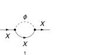
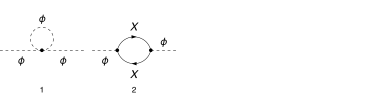
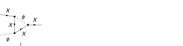
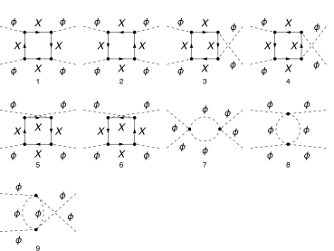
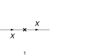
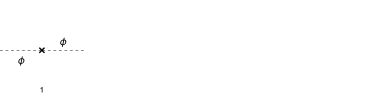
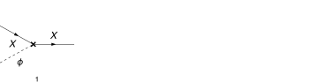

## Load FeynCalc and the necessary add-ons or other packages

This example uses a custom Yukawa model created with FeynRules.

```mathematica
description = "Renormalization, pseudoscalar Yukawa, MSbar, 1-loop";
If[ $FrontEnd === Null, 
  	$FeynCalcStartupMessages = False; 
  	Print[description]; 
  ];
If[ $Notebooks === False, 
  	$FeynCalcStartupMessages = False 
  ];
LaunchKernels[4];
$LoadAddOns = {"FeynArts", "FeynHelpers"};
<< FeynCalc`
$FAVerbose = 0;
$ParallelizeFeynCalc = True; 
 
FCCheckVersion[10, 2, 0];
If[ToExpression[StringSplit[$FeynHelpersVersion, "."]][[1]] < 2, 
 	Print["You need at least FeynHelpers 2.0 to run this example."]; 
 	Abort[]; 
 ]
```


## Configure some options

```mathematica
modelName = "YukawaPS";
```

```mathematica
modelDir = FileNameJoin[{$UserBaseDirectory, "Applications", "FeynCalc", "Examples", "Models", modelName}];
```

```mathematica
FAPatch[PatchModelsOnly -> True, FAModelsDirectory -> modelDir];

(*Successfully patched FeynArts.*)
```

Here we define all Z-factors for renormalization constants present in the Lagrangian

```mathematica
renConstants = Zg | Zla | Zx | Zphi | Zmphi | Zmx | Zx
```

$$\text{Zg}|\text{Zla}|\text{Zx}|\text{Zphi}|\text{Zmphi}|\text{Zmx}|\text{Zx}$$

## Generate Feynman diagrams

```mathematica
diagFermionSE = InsertFields[CreateTopologies[1, 1 -> 1, 
     ExcludeTopologies -> {Tadpoles, WFCorrections, WFCorrectionCTs}], {F[10]} -> {F[10]}, 
    InsertionLevel -> {Particles}, Model -> FileNameJoin[{modelDir, modelName}], 
    GenericModel -> FileNameJoin[{modelDir, "YukawaPS"}]];
```

```mathematica
diagScalarSE = InsertFields[CreateTopologies[1, 1 -> 1, 
     ExcludeTopologies -> {Tadpoles, WFCorrections, WFCorrectionCTs}], {S[1]} -> {S[1]}, 
    InsertionLevel -> {Particles}, Model -> FileNameJoin[{modelDir, modelName}], 
    GenericModel -> FileNameJoin[{modelDir, "YukawaPS"}]];
```

```mathematica
diagFermionScalarVTX = InsertFields[CreateTopologies[1, 2 -> 1, 
     ExcludeTopologies -> {Tadpoles, WFCorrections, WFCorrectionCTs}], {F[10], S[1]} -> {F[10]}, 
    InsertionLevel -> {Particles}, Model -> FileNameJoin[{modelDir, modelName}], 
    GenericModel -> FileNameJoin[{modelDir, "YukawaPS"}]];
```

```mathematica
diagScalar4VTX = InsertFields[CreateTopologies[1, 2 -> 2, 
     ExcludeTopologies -> {Tadpoles, WFCorrections, WFCorrectionCTs}], {S[1], S[1]} -> {S[1], S[1]}, 
    InsertionLevel -> {Particles}, Model -> FileNameJoin[{modelDir, modelName}], 
    GenericModel -> FileNameJoin[{modelDir, "YukawaPS"}]];
```

```mathematica
diagFermionSECT = InsertFields[CreateCTTopologies[1, 1 -> 1, 
     ExcludeTopologies -> {Tadpoles, WFCorrections, WFCorrectionCTs}], {F[10]} -> {F[10]}, 
    InsertionLevel -> {Particles}, Model -> FileNameJoin[{modelDir, modelName}], 
    GenericModel -> FileNameJoin[{modelDir, "YukawaPS"}]];
```

```mathematica
diagScalarSECT = InsertFields[CreateCTTopologies[1, 1 -> 1, 
     ExcludeTopologies -> {Tadpoles, WFCorrections, WFCorrectionCTs}], {S[1]} -> {S[1]}, 
    InsertionLevel -> {Particles}, Model -> FileNameJoin[{modelDir, modelName}], 
    GenericModel -> FileNameJoin[{modelDir, "YukawaPS"}]];
```

```mathematica
diagFermionScalarVTXCT = InsertFields[CreateCTTopologies[1, 2 -> 1, 
     ExcludeTopologies -> {Tadpoles, WFCorrections, WFCorrectionCTs}], {F[10], S[1]} -> {F[10]}, 
    InsertionLevel -> {Particles}, Model -> FileNameJoin[{modelDir, modelName}], 
    GenericModel -> FileNameJoin[{modelDir, "YukawaPS"}]];
```

```mathematica
diagScalar4VTXCT = InsertFields[CreateCTTopologies[1, 2 -> 2, 
     ExcludeTopologies -> {Tadpoles, WFCorrections, WFCorrectionCTs}], {S[1], S[1]} -> {S[1], S[1]}, 
    InsertionLevel -> {Particles}, Model -> FileNameJoin[{modelDir, modelName}], 
    GenericModel -> FileNameJoin[{modelDir, "YukawaPS"}]];
```

Self-energy and vertex diagrams

```mathematica
Paint[diagFermionSE, ColumnsXRows -> {2, 1}, SheetHeader -> None, 
   Numbering -> Simple, ImageSize -> 128 {2, 1}];
Paint[diagScalarSE, ColumnsXRows -> {4, 1}, SheetHeader -> None, 
   Numbering -> Simple, ImageSize -> 128 {4, 1}];
Paint[diagFermionScalarVTX, ColumnsXRows -> {4, 1}, SheetHeader -> None, 
   Numbering -> Simple, ImageSize -> 128 {4, 1}];
Paint[diagScalar4VTX, ColumnsXRows -> {4, 3}, SheetHeader -> None, 
   Numbering -> Simple, ImageSize -> 128 {4, 3}];
```









Counter-term diagrams

```mathematica
Paint[diagFermionSECT, ColumnsXRows -> {2, 1}, SheetHeader -> None, 
   Numbering -> Simple, ImageSize -> 128 {2, 1}];
Paint[diagScalarSECT, ColumnsXRows -> {4, 1}, SheetHeader -> None, 
   Numbering -> Simple, ImageSize -> 128 {4, 1}];
Paint[diagFermionScalarVTXCT, ColumnsXRows -> {4, 1}, SheetHeader -> None, 
   Numbering -> Simple, ImageSize -> 128 {4, 1}];
Paint[diagScalar4VTXCT, ColumnsXRows -> {4, 1}, SheetHeader -> None, 
   Numbering -> Simple, ImageSize -> 128 {4, 1}];
```








## Master integrals

The only required masters are 1-loop tadpoles


```mathematica
tadpoleMaster = Get[FileNameJoin[{$FeynCalcDirectory, "Examples", "MasterIntegrals","Tadpoles", "tad1LxFx1x1xxEp999x.m"}]];
```

```mathematica
tadpoleMaster1 = tadpoleMaster /. m1 -> mx /. tad1LxFx1x1xxEp999x -> "tad1Lv1";
tadpoleMaster2 = tadpoleMaster /. m1 -> mphi /. tad1LxFx1x1xxEp999x -> "tad1Lv2";
```

```mathematica
tadpoleMaster1
```

$$\left\{G^{\text{tad1Lv1}}(1)\to -e^{\gamma  \;\text{ep}} \left(\text{mx}^2\right)^{1-\text{ep}} \Gamma (\text{ep}-1),\left\{\text{FCTopology}\left(\text{tad1Lv1},\left\{\frac{1}{(\text{k1}^2-\text{mx}^2+i \eta )}\right\},\{\text{k1}\},\{\},\{\},\{\}\right)\right\}\right\}$$

```mathematica
tadpoleMaster2
```

$$\left\{G^{\text{tad1Lv2}}(1)\to -e^{\gamma  \;\text{ep}} \left(\text{mphi}^2\right)^{1-\text{ep}} \Gamma (\text{ep}-1),\left\{\text{FCTopology}\left(\text{tad1Lv2},\left\{\frac{1}{(\text{k1}^2-\text{mphi}^2+i \eta )}\right\},\{\text{k1}\},\{\},\{\},\{\}\right)\right\}\right\}$$

## Obtain the amplitudes

```mathematica
{fermionSE$RawAmp, scalarSE$RawAmp, fermionSECT$RawAmp, scalarSECT$RawAmp} = 
   FCFAConvert[CreateFeynAmp[#, Truncated -> True, PreFactor -> 1], 
     	IncomingMomenta -> {p}, OutgoingMomenta -> {p}, 
     	DropSumOver -> True, 
     	LoopMomenta -> {k}, UndoChiralSplittings -> True, 
     	ChangeDimension -> D, SMP -> True, 
     	FinalSubstitutions -> {GaugeXi[S[1]] -> gxi, Mphi -> mphi, Mx -> mx}] & /@ {
    	diagFermionSE, diagScalarSE, diagFermionSECT, diagScalarSECT};
```

```mathematica
{fermionScalarVTX$RawAmp, scalar4VTX$RawAmp, fermionScalarVTXCT$RawAmp, scalar4VTXCT$RawAmp} = 
   FCFAConvert[CreateFeynAmp[#, Truncated -> True, PreFactor -> 1], 
     	IncomingMomenta -> {p1, p2}, OutgoingMomenta -> {q1, q2}, 
     	DropSumOver -> True, 
     	LoopMomenta -> {k}, UndoChiralSplittings -> True, 
     	ChangeDimension -> D, SMP -> True, 
     	FinalSubstitutions -> {GaugeXi[S[1]] -> gxi, Mphi -> mphi, Mx -> mx}] & /@ {
    	diagFermionScalarVTX, diagScalar4VTX, diagFermionScalarVTXCT, diagScalar4VTXCT 
    	};
```

## Calculate the amplitudes

### Fermion self-energy

The 1-loop fermion self-energy has superficial degree of divergence equal to 1

```mathematica
FCClearScalarProducts[];
divDegree = 1;
aux1 = FCLoopGetFeynAmpDenominators[fermionSE$RawAmp, {k}, denHead, Momentum -> {p}, "Massless" -> True];
aux2 = FCLoopAddAuxiliaryMass[aux1[[2]], {k}, -mxt^2, 0, Head -> denHead]
```

$$\left\{\text{denHead}\left(\frac{1}{((k-p)^2-\text{mphi}^2+i \eta )}\right)\to \frac{1}{((k-p)^2-\text{mphi}^2+i \eta )}\right\}$$

```mathematica
fermionSE$StrName = StringReplace[ToString[Hold[fermionSE$Amp]], {"Hold[" -> "", "]" -> ""}]
```

$$\text{fermionSE\$Amp}$$

```mathematica
AbsoluteTiming[fermionSE$Amp = (aux1[[1]] /. aux2) // Contract[#, FCParallelize -> True] & // 
     DiracSimplify[#, FCParallelize -> True] &;]
```

$$\{0.083438,\text{Null}\}$$

```mathematica
AbsoluteTiming[fermionSE$Amp1 = Collect2[fermionSE$Amp, p, IsolateNames -> KK];]
AbsoluteTiming[fermionSE$Amp2 = FourSeries[fermionSE$Amp1, {p, 0, divDegree}, FCParallelize -> True];]
AbsoluteTiming[fermionSE$Amp3 = Collect2[FRH[fermionSE$Amp2], FeynAmpDenominator, FCParallelize -> True];]
```

$$\{0.025214,\text{Null}\}$$

$$\{0.027517,\text{Null}\}$$

$$\{0.030385,\text{Null}\}$$

The rest of the calculation follows the standard multiloop template

```mathematica
FCClearScalarProducts[];
SPD[p] = pp;
```

```mathematica
{fermionSE$Amp4, fermionSE$Topos} = FCLoopFindTopologies[fermionSE$Amp3, {k}, FCParallelize -> True, 
    FCLoopBasisOverdeterminedQ -> True, FinalSubstitutions -> {Hold[SPD][p] -> pp}, Names -> fermionSEtopo];
```

$$\text{FCLoopFindTopologies: Number of the initial candidate topologies: }1$$

$$\text{FCLoopFindTopologies: Number of the identified unique topologies: }1$$

$$\text{FCLoopFindTopologies: Number of the preferred topologies among the unique topologies: }0$$

$$\text{FCLoopFindTopologies: Number of the identified subtopologies: }0$$

$$\text{FCLoopFindTopologyMappings: }\;\text{Final number of found topologies: }1$$

```mathematica
AbsoluteTiming[fermionSE$Amp5 = FCLoopTensorReduce[fermionSE$Amp4, fermionSE$Topos, FCParallelize -> True];]
```

$$\{0.253825,\text{Null}\}$$

```mathematica
{fermionSE$Amp6, fermionSE$Topos2} = FCLoopRewriteOverdeterminedTopologies[fermionSE$Amp5, fermionSE$Topos];
```

$$\text{FCLoopRewriteOverdeterminedTopologies: }\;\text{Found }1\text{ overdetermined topologies.}$$

$$\text{FCLoopRewriteOverdeterminedTopologies: }\;\text{Generated }5\text{ new topologies through partial fractioning.}$$

$$\text{FCLoopRewriteOverdeterminedTopologies: }\;\text{Final number of topologies: }2$$

```mathematica
fermionSE$SubTopos = FCLoopFindSubtopologies[fermionSE$Topos2, Flatten -> True, Remove -> True]
```

$$\{\}$$

```mathematica
{fermionSE$TopoMappings, fermionSE$FinalTopos} = FCLoopFindTopologyMappings[fermionSE$Topos2, PreferredTopologies -> fermionSE$SubTopos];
```

$$\text{FCLoopFindTopologyMappings: }\;\text{Found }0\text{ mapping relations }$$

$$\text{FCLoopFindTopologyMappings: }\;\text{Final number of independent topologies: }2$$

```mathematica
fermionSE$AmpGLI = FCLoopApplyTopologyMappings[fermionSE$Amp6, {fermionSE$TopoMappings, fermionSE$FinalTopos}, FCParallelize -> True];
```

```mathematica
fermionSE$GLIs = Cases2[fermionSE$AmpGLI, GLI];
```

```mathematica
fermionSE$dir = FileNameJoin[{$TemporaryDirectory, "Reduction-" <> modelName <> "-" <> fermionSE$StrName <> "-1L"}];
Quiet[CreateDirectory[fermionSE$dir]];
```

```mathematica
KiraCreateJobFile[fermionSE$FinalTopos, fermionSE$GLIs, fermionSE$dir]
```

$$\{\text{/tmp/Reduction-YukawaPS-fermionSE\$Amp-1L/fcPFRTopology1/job.yaml},\text{/tmp/Reduction-YukawaPS-fermionSE\$Amp-1L/fcPFRTopology2/job.yaml}\}$$

```mathematica
KiraCreateIntegralFile[fermionSE$GLIs, fermionSE$FinalTopos, fermionSE$dir]
KiraCreateConfigFiles[fermionSE$FinalTopos, fermionSE$GLIs, fermionSE$dir, 
  KiraMassDimensions -> {pp -> 2, mphi -> 1, mx -> 1, gxi -> 0}]
```

$$\text{KiraCreateIntegralFile: Number of loop integrals: }3$$

$$\text{KiraCreateIntegralFile: Number of loop integrals: }2$$

$$\{\text{/tmp/Reduction-YukawaPS-fermionSE\$Amp-1L/fcPFRTopology1/KiraLoopIntegrals},\text{/tmp/Reduction-YukawaPS-fermionSE\$Amp-1L/fcPFRTopology2/KiraLoopIntegrals}\}$$

$$\left(
\begin{array}{cc}
 \;\text{/tmp/Reduction-YukawaPS-fermionSE\$Amp-1L/fcPFRTopology1/config/integralfamilies.yaml} & \;\text{/tmp/Reduction-YukawaPS-fermionSE\$Amp-1L/fcPFRTopology1/config/kinematics.yaml} \\
 \;\text{/tmp/Reduction-YukawaPS-fermionSE\$Amp-1L/fcPFRTopology2/config/integralfamilies.yaml} & \;\text{/tmp/Reduction-YukawaPS-fermionSE\$Amp-1L/fcPFRTopology2/config/kinematics.yaml} \\
\end{array}
\right)$$

```mathematica
KiraRunReduction[fermionSE$dir, fermionSE$FinalTopos, 
  KiraBinaryPath -> FileNameJoin[{$HomeDirectory, ".local", "bin", "kira"}], 
  KiraFermatPath -> FileNameJoin[{$HomeDirectory, "bin", "ferl64", "fer64"}]]
```

$$\{\text{True},\text{True}\}$$

```mathematica
fermionSE$ReductionTables = KiraImportResults[fermionSE$FinalTopos, fermionSE$dir] // Flatten;
```

```mathematica
fermionSE$resPreFinal = Collect2[Total[fermionSE$AmpGLI /. Dispatch[fermionSE$ReductionTables]] // FeynAmpDenominatorExplicit, GLI, 
    GaugeXi, flagCheck, D, DiracGamma, FCParallelize -> True];
```

```mathematica
fermionSE$masters = Cases2[fermionSE$resPreFinal, GLI];
```

```mathematica
fermionSE$MIMappings = FCLoopFindIntegralMappings[fermionSE$masters, Join[tadpoleMaster1[[2]], tadpoleMaster2[[2]], 
    fermionSE$FinalTopos], PreferredIntegrals -> {tadpoleMaster1[[1]][[1]], tadpoleMaster2[[1]][[1]]}]
```

$$\left(
\begin{array}{cc}
 G^{\text{fcPFRTopology1}}(1)\to G^{\text{tad1Lv2}}(1) & G^{\text{fcPFRTopology2}}(1)\to G^{\text{tad1Lv1}}(1) \\
 G^{\text{tad1Lv1}}(1) & G^{\text{tad1Lv2}}(1) \\
\end{array}
\right)$$

Our master integrals are calculated using the standard multiloop normalization. To convert it back to the textbook normalization
we need to multiply by I*(4 Pi)^(ep-2)

```mathematica
fermionSE$resFinal = Collect2[fermionSE$resPreFinal, D, GLI, IsolateNames -> KK] // FCReplaceD[#, D -> 4 - 2 ep] & // 
          ReplaceAll[#, fermionSE$MIMappings[[1]]] & // ReplaceAll[#, {tadpoleMaster1[[1]], tadpoleMaster2[[1]]}] & //If[! FreeQ[#, GLI], Print["Unsubstituted GLIs!"]; Abort[], #] & // 
       Collect2[#, ep, IsolateNames -> KK2] & // Series[(I*(4*Pi)^(-2 + ep)) #, {ep, 0, -1}] & // Normal // FRH //Collect2[#, DiracGamma] &
```

$$\frac{i g^2 \gamma \cdot p}{32 \pi ^2 \;\text{ep}}-\frac{i g^2 \;\text{mx}}{16 \pi ^2 \;\text{ep}}$$

```mathematica
fermionSE$RenConstants = (fermionSE$resFinal + Total[fermionSECT$RawAmp]) // ReplaceRepeated[#, {
          	(h : renConstants) :> 1 + alpha rc[ToExpression["del" <> ToString[h]], 1]}] & // 
      	Series[#, {alpha, 0, 1}] & // Normal // 
    	ReplaceAll[#, alpha -> 1] & // Collect2[#, DiracGamma] & // 
  	FCMatchSolve[#, {ep, CF, DiracGamma, mx, mxt, SUNDelta, SUNFDelta, gxi, g}] &
```

$$\text{FCMatchSolve: Solving for: }\{\text{rc}(\text{delZmx},1),\text{rc}(\text{delZx},1)\}$$

$$\text{FCMatchSolve: A solution exists.}$$

$$\left\{\text{rc}(\text{delZmx},1)\to -\frac{g^2}{32 \pi ^2 \;\text{ep}},\text{rc}(\text{delZx},1)\to -\frac{g^2}{32 \pi ^2 \;\text{ep}}\right\}$$

### Scalar self-energy

The 1-loop scalar self-energy has superficial degree of divergence equal to 2.

```mathematica
FCClearScalarProducts[];
divDegree = 2;
aux1 = FCLoopGetFeynAmpDenominators[scalarSE$RawAmp, {k}, denHead, Momentum -> {p}, "Massless" -> True];
aux2 = FCLoopAddAuxiliaryMass[aux1[[2]], {k}, -mxt^2, 0, Head -> denHead]
```

$$\left\{\text{denHead}\left(\frac{1}{((k-p)^2-\text{mx}^2+i \eta )}\right)\to \frac{1}{((k-p)^2-\text{mx}^2+i \eta )}\right\}$$

```mathematica
scalarSE$StrName = StringReplace[ToString[Hold[scalarSE$Amp]], {"Hold[" -> "", "]" -> ""}]
```

$$\text{scalarSE\$Amp}$$

```mathematica
AbsoluteTiming[scalarSE$Amp = (aux1[[1]] /. aux2) // Contract[#, FCParallelize -> True] & // 
     DiracSimplify[#, FCParallelize -> True] &;]
```

$$\{0.08775,\text{Null}\}$$

flagCheck is a safety flag to ensure that higher order terms in p (higher than the divergence degree) do not  contribute to the poles

```mathematica
AbsoluteTiming[scalarSE$Amp1 = Collect2[scalarSE$Amp, p, IsolateNames -> KK];]
AbsoluteTiming[scalarSE$Amp2 = FourSeries[scalarSE$Amp1, {p, 0, divDegree}, FCParallelize -> True];]
AbsoluteTiming[scalarSE$Amp3 = Collect2[FRH[scalarSE$Amp2], FeynAmpDenominator, FCParallelize -> True];]
```

$$\{0.002402,\text{Null}\}$$

$$\{0.074581,\text{Null}\}$$

$$\{0.024333,\text{Null}\}$$

The rest of the calculation follows the standard multiloop template

```mathematica
FCClearScalarProducts[];
SPD[p] = pp;
```

```mathematica
{scalarSE$Amp4, scalarSE$Topos} = FCLoopFindTopologies[scalarSE$Amp3, {k}, FCParallelize -> True, 
    FCLoopBasisOverdeterminedQ -> True, FinalSubstitutions -> {Hold[SPD][p] -> pp}, Names -> scalarSEtopo];
```

$$\text{FCLoopFindTopologies: Number of the initial candidate topologies: }2$$

$$\text{FCLoopFindTopologies: Number of the identified unique topologies: }2$$

$$\text{FCLoopFindTopologies: Number of the preferred topologies among the unique topologies: }0$$

$$\text{FCLoopFindTopologies: Number of the identified subtopologies: }0$$

$$\text{FCLoopFindTopologyMappings: }\;\text{Final number of found topologies: }2$$

```mathematica
AbsoluteTiming[scalarSE$Amp5 = FCLoopTensorReduce[scalarSE$Amp4, scalarSE$Topos, FCParallelize -> True];]
```

$$\{0.212145,\text{Null}\}$$

```mathematica
{scalarSE$Amp6, scalarSE$Topos2} = FCLoopRewriteOverdeterminedTopologies[scalarSE$Amp5, scalarSE$Topos];
```

$$\text{FCLoopRewriteIncompleteTopologies: }\;\text{No overdetermined topologies detected.}$$

```mathematica
scalarSE$SubTopos = FCLoopFindSubtopologies[scalarSE$Topos2, Flatten -> True, Remove -> True]
```

$$\{\}$$

```mathematica
{scalarSE$TopoMappings, scalarSE$FinalTopos} = FCLoopFindTopologyMappings[scalarSE$Topos2, PreferredTopologies -> scalarSE$SubTopos];
```

$$\text{FCLoopFindTopologyMappings: }\;\text{Found }0\text{ mapping relations }$$

$$\text{FCLoopFindTopologyMappings: }\;\text{Final number of independent topologies: }2$$

```mathematica
scalarSE$AmpGLI = FCLoopApplyTopologyMappings[scalarSE$Amp6, {scalarSE$TopoMappings, scalarSE$FinalTopos}, FCParallelize -> True];
```

```mathematica
scalarSE$GLIs = Cases2[scalarSE$AmpGLI, GLI];
```

```mathematica
scalarSE$dir = FileNameJoin[{$TemporaryDirectory, "Reduction-" <> modelName <> "-" <> scalarSE$StrName <> "-1L"}];
Quiet[CreateDirectory[scalarSE$dir]];
```

```mathematica
KiraCreateJobFile[scalarSE$FinalTopos, scalarSE$GLIs, scalarSE$dir]
```

$$\{\text{/tmp/Reduction-YukawaPS-scalarSE\$Amp-1L/scalarSEtopo1/job.yaml},\text{/tmp/Reduction-YukawaPS-scalarSE\$Amp-1L/scalarSEtopo2/job.yaml}\}$$

```mathematica
KiraCreateIntegralFile[scalarSE$GLIs, scalarSE$FinalTopos, scalarSE$dir]
KiraCreateConfigFiles[scalarSE$FinalTopos, scalarSE$GLIs, scalarSE$dir, 
  KiraMassDimensions -> {pp -> 2, mphi -> 1, mx -> 1, gxi -> 0}]
```

$$\text{KiraCreateIntegralFile: Number of loop integrals: }3$$

$$\text{KiraCreateIntegralFile: Number of loop integrals: }1$$

$$\{\text{/tmp/Reduction-YukawaPS-scalarSE\$Amp-1L/scalarSEtopo1/KiraLoopIntegrals},\text{/tmp/Reduction-YukawaPS-scalarSE\$Amp-1L/scalarSEtopo2/KiraLoopIntegrals}\}$$

$$\left(
\begin{array}{cc}
 \;\text{/tmp/Reduction-YukawaPS-scalarSE\$Amp-1L/scalarSEtopo1/config/integralfamilies.yaml} & \;\text{/tmp/Reduction-YukawaPS-scalarSE\$Amp-1L/scalarSEtopo1/config/kinematics.yaml} \\
 \;\text{/tmp/Reduction-YukawaPS-scalarSE\$Amp-1L/scalarSEtopo2/config/integralfamilies.yaml} & \;\text{/tmp/Reduction-YukawaPS-scalarSE\$Amp-1L/scalarSEtopo2/config/kinematics.yaml} \\
\end{array}
\right)$$

```mathematica
KiraRunReduction[scalarSE$dir, scalarSE$FinalTopos, 
  KiraBinaryPath -> FileNameJoin[{$HomeDirectory, ".local", "bin", "kira"}], 
  KiraFermatPath -> FileNameJoin[{$HomeDirectory, "bin", "ferl64", "fer64"}]]
```

$$\{\text{True},\text{True}\}$$

```mathematica
scalarSE$ReductionTables = KiraImportResults[scalarSE$FinalTopos, scalarSE$dir] // Flatten;
```

```mathematica
scalarSE$resPreFinal = Collect2[Total[scalarSE$AmpGLI /. Dispatch[scalarSE$ReductionTables]] // FeynAmpDenominatorExplicit, GLI, 
    GaugeXi, flagCheck, D, DiracGamma, FCParallelize -> True];
```

```mathematica
scalarSE$masters = Cases2[scalarSE$resPreFinal, GLI];
```

```mathematica
scalarSE$MIMappings = FCLoopFindIntegralMappings[scalarSE$masters, Join[tadpoleMaster1[[2]], tadpoleMaster2[[2]], 
    scalarSE$FinalTopos], PreferredIntegrals -> {tadpoleMaster1[[1]][[1]], tadpoleMaster2[[1]][[1]]}]
```

$$\left(
\begin{array}{cc}
 G^{\text{scalarSEtopo1}}(1)\to G^{\text{tad1Lv1}}(1) & G^{\text{scalarSEtopo2}}(1)\to G^{\text{tad1Lv2}}(1) \\
 G^{\text{tad1Lv1}}(1) & G^{\text{tad1Lv2}}(1) \\
\end{array}
\right)$$

Our master integrals are calculated using the standard multiloop normalization. To convert it back to the textbook normalization
we need to multiply by I*(4 Pi)^(ep-2)

```mathematica
scalarSE$resFinal = Collect2[scalarSE$resPreFinal, D, GLI, IsolateNames -> KK] // FCReplaceD[#, D -> 4 - 2 ep] & // 
          ReplaceAll[#, scalarSE$MIMappings[[1]]] & // ReplaceAll[#, {tadpoleMaster1[[1]], tadpoleMaster2[[1]]}] & //If[! FreeQ[#, GLI], Print["Unsubstituted GLIs!"]; Abort[], #] & // 
       Collect2[#, ep, IsolateNames -> KK2] & // Series[(I*(4*Pi)^(-2 + ep)) #, {ep, 0, -1}] & // Normal // FRH //Collect2[#, DiracGamma] &
```

$$\frac{i \left(-8 g^2 \;\text{mx}^2+4 g^2 \;\text{pp}+\text{la} \;\text{mphi}^2\right)}{32 \pi ^2 \;\text{ep}}$$

```mathematica
scalarSE$RenConstants = (scalarSE$resFinal + Total[scalarSECT$RawAmp]) // ReplaceRepeated[#, {
           	(h : renConstants) :> 1 + alpha rc[ToExpression["del" <> ToString[h]], 1]}] & //
       	Series[#, {alpha, 0, 1}] & // Normal // 
     	ReplaceAll[#, alpha -> 1] & // Collect2[#, pp, Pair] & // 
   	FCMatchSolve[#, {ep, g, gxi, la, DiracGamma, mphi, mx, pp}] & // ExpandAll
```

$$\text{FCMatchSolve: Solving for: }\{\text{rc}(\text{delZmphi},1),\text{rc}(\text{delZphi},1)\}$$

$$\text{FCMatchSolve: A solution exists.}$$

$$\left\{\text{rc}(\text{delZmphi},1)\to -\frac{g^2 \;\text{mx}^2}{4 \pi ^2 \;\text{ep} \;\text{mphi}^2}+\frac{g^2}{8 \pi ^2 \;\text{ep}}+\frac{\text{la}}{32 \pi ^2 \;\text{ep}},\text{rc}(\text{delZphi},1)\to -\frac{g^2}{8 \pi ^2 \;\text{ep}}\right\}$$

### Fermion-scalar vertex

The 1-loop fermion-scalar-vertex has superficial degree of divergence equal to 0. We set q1=0, so that p1+p2=q yields p1=-p2

```mathematica
FCClearScalarProducts[];
divDegree = 0;
aux1 = FCLoopGetFeynAmpDenominators[fermionScalarVTX$RawAmp /. q1 -> 0 /. p2 -> -p1 /. p1 -> p, {k}, denHead, Momentum -> {p}, "Massless" -> True];
aux2 = FCLoopAddAuxiliaryMass[aux1[[2]], {k}, -mxt^2, 0, Head -> denHead]
```

$$\left\{\text{denHead}\left(\frac{1}{((k-p)^2-\text{mphi}^2+i \eta )}\right)\to \frac{1}{((k-p)^2-\text{mphi}^2+i \eta )},\text{denHead}\left(\frac{1}{((k-p)^2-\text{mx}^2+i \eta )}\right)\to \frac{1}{((k-p)^2-\text{mx}^2+i \eta )}\right\}$$

```mathematica
fermionScalarVTX$StrName = StringReplace[ToString[Hold[fermionScalarVTX$Amp]], {"Hold[" -> "", "]" -> ""}]
```

$$\text{fermionScalarVTX\$Amp}$$

```mathematica
AbsoluteTiming[fermionScalarVTX$Amp = (aux1[[1]] /. aux2) // Contract[#, FCParallelize -> True] & // 
     DiracSimplify[#, FCParallelize -> True] &;]
```

$$\{0.087439,\text{Null}\}$$

```mathematica
AbsoluteTiming[fermionScalarVTX$Amp1 = Collect2[fermionScalarVTX$Amp, p, IsolateNames -> KK];]
AbsoluteTiming[fermionScalarVTX$Amp2 = FourSeries[fermionScalarVTX$Amp1, {p, 0, divDegree}, FCParallelize -> True];]
AbsoluteTiming[fermionScalarVTX$Amp3 = Collect2[FRH[fermionScalarVTX$Amp2], FeynAmpDenominator, FCParallelize -> True];]
```

$$\{0.011503,\text{Null}\}$$

$$\{0.018735,\text{Null}\}$$

$$\{0.023213,\text{Null}\}$$

The rest of the calculation follows the standard multiloop template

```mathematica
FCClearScalarProducts[];
SPD[p] = pp;
```

```mathematica
{fermionScalarVTX$Amp4, fermionScalarVTX$Topos} = FCLoopFindTopologies[fermionScalarVTX$Amp3, {k}, FCParallelize -> True, 
    FCLoopBasisOverdeterminedQ -> True, FinalSubstitutions -> {Hold[SPD][p] -> pp}, Names -> fermionScalarVTXtopo];
```

$$\text{FCLoopFindTopologies: Number of the initial candidate topologies: }1$$

$$\text{FCLoopFindTopologies: Number of the identified unique topologies: }1$$

$$\text{FCLoopFindTopologies: Number of the preferred topologies among the unique topologies: }0$$

$$\text{FCLoopFindTopologies: Number of the identified subtopologies: }0$$

$$\text{FCLoopFindTopologyMappings: }\;\text{Final number of found topologies: }1$$

```mathematica
AbsoluteTiming[fermionScalarVTX$Amp5 = FCLoopTensorReduce[fermionScalarVTX$Amp4, fermionScalarVTX$Topos, FCParallelize -> True];]
```

$$\{0.233739,\text{Null}\}$$

```mathematica
{fermionScalarVTX$Amp6, fermionScalarVTX$Topos2} = FCLoopRewriteOverdeterminedTopologies[fermionScalarVTX$Amp5, fermionScalarVTX$Topos];
```

$$\text{FCLoopRewriteOverdeterminedTopologies: }\;\text{Found }1\text{ overdetermined topologies.}$$

$$\text{FCLoopRewriteOverdeterminedTopologies: }\;\text{Generated }3\text{ new topologies through partial fractioning.}$$

$$\text{FCLoopRewriteOverdeterminedTopologies: }\;\text{Final number of topologies: }2$$

```mathematica
fermionScalarVTX$SubTopos = FCLoopFindSubtopologies[fermionScalarVTX$Topos2, Flatten -> True, Remove -> True]
```

$$\{\}$$

```mathematica
{fermionScalarVTX$TopoMappings, fermionScalarVTX$FinalTopos} = FCLoopFindTopologyMappings[fermionScalarVTX$Topos2, PreferredTopologies -> fermionScalarVTX$SubTopos];
```

$$\text{FCLoopFindTopologyMappings: }\;\text{Found }0\text{ mapping relations }$$

$$\text{FCLoopFindTopologyMappings: }\;\text{Final number of independent topologies: }2$$

```mathematica
fermionScalarVTX$AmpGLI = FCLoopApplyTopologyMappings[fermionScalarVTX$Amp6, {fermionScalarVTX$TopoMappings, fermionScalarVTX$FinalTopos}, FCParallelize -> True];
```

```mathematica
fermionScalarVTX$GLIs = Cases2[fermionScalarVTX$AmpGLI, GLI];
```

```mathematica
fermionScalarVTX$dir = FileNameJoin[{$TemporaryDirectory, "Reduction-" <> modelName <> "-" <> fermionScalarVTX$StrName <> "-1L"}];
Quiet[CreateDirectory[fermionScalarVTX$dir]];
```

```mathematica
KiraCreateJobFile[fermionScalarVTX$FinalTopos, fermionScalarVTX$GLIs, fermionScalarVTX$dir]
```

$$\{\text{/tmp/Reduction-YukawaPS-fermionScalarVTX\$Amp-1L/fcPFRTopology1/job.yaml},\text{/tmp/Reduction-YukawaPS-fermionScalarVTX\$Amp-1L/fcPFRTopology2/job.yaml}\}$$

```mathematica
KiraCreateIntegralFile[fermionScalarVTX$GLIs, fermionScalarVTX$FinalTopos, fermionScalarVTX$dir]
KiraCreateConfigFiles[fermionScalarVTX$FinalTopos, fermionScalarVTX$GLIs, fermionScalarVTX$dir, 
  KiraMassDimensions -> {pp -> 2, mphi -> 1, mx -> 1, gxi -> 0}]
```

$$\text{KiraCreateIntegralFile: Number of loop integrals: }2$$

$$\text{KiraCreateIntegralFile: Number of loop integrals: }2$$

$$\{\text{/tmp/Reduction-YukawaPS-fermionScalarVTX\$Amp-1L/fcPFRTopology1/KiraLoopIntegrals},\text{/tmp/Reduction-YukawaPS-fermionScalarVTX\$Amp-1L/fcPFRTopology2/KiraLoopIntegrals}\}$$

$$\left(
\begin{array}{cc}
 \;\text{/tmp/Reduction-YukawaPS-fermionScalarVTX\$Amp-1L/fcPFRTopology1/config/integralfamilies.yaml} & \;\text{/tmp/Reduction-YukawaPS-fermionScalarVTX\$Amp-1L/fcPFRTopology1/config/kinematics.yaml} \\
 \;\text{/tmp/Reduction-YukawaPS-fermionScalarVTX\$Amp-1L/fcPFRTopology2/config/integralfamilies.yaml} & \;\text{/tmp/Reduction-YukawaPS-fermionScalarVTX\$Amp-1L/fcPFRTopology2/config/kinematics.yaml} \\
\end{array}
\right)$$

```mathematica
KiraRunReduction[fermionScalarVTX$dir, fermionScalarVTX$FinalTopos, 
  KiraBinaryPath -> FileNameJoin[{$HomeDirectory, ".local", "bin", "kira"}], 
  KiraFermatPath -> FileNameJoin[{$HomeDirectory, "bin", "ferl64", "fer64"}]]
```

$$\{\text{True},\text{True}\}$$

```mathematica
fermionScalarVTX$ReductionTables = KiraImportResults[fermionScalarVTX$FinalTopos, fermionScalarVTX$dir] // Flatten;
```

```mathematica
fermionScalarVTX$resPreFinal = Collect2[Total[fermionScalarVTX$AmpGLI /. Dispatch[fermionScalarVTX$ReductionTables]] // FeynAmpDenominatorExplicit, GLI, 
    GaugeXi, flagCheck, D, DiracGamma, FCParallelize -> True];
```

```mathematica
fermionScalarVTX$masters = Cases2[fermionScalarVTX$resPreFinal, GLI];
```

```mathematica
fermionScalarVTX$MIMappings = FCLoopFindIntegralMappings[fermionScalarVTX$masters, Join[tadpoleMaster1[[2]], tadpoleMaster2[[2]], 
    fermionScalarVTX$FinalTopos], PreferredIntegrals -> {tadpoleMaster1[[1]][[1]], tadpoleMaster2[[1]][[1]]}]
```

$$\left(
\begin{array}{cc}
 G^{\text{fcPFRTopology1}}(1)\to G^{\text{tad1Lv2}}(1) & G^{\text{fcPFRTopology2}}(1)\to G^{\text{tad1Lv1}}(1) \\
 G^{\text{tad1Lv1}}(1) & G^{\text{tad1Lv2}}(1) \\
\end{array}
\right)$$

Our master integrals are calculated using the standard multiloop normalization. To convert it back to the textbook normalization
we need to multiply by I*(4 Pi)^(ep-2)

```mathematica
fermionScalarVTX$resFinal = Collect2[fermionScalarVTX$resPreFinal, D, GLI, IsolateNames -> KK] //FCReplaceD[#, D -> 4 - 2 ep] & // 
           ReplaceAll[#, fermionScalarVTX$MIMappings[[1]]] & // ReplaceAll[#, {tadpoleMaster1[[1]], tadpoleMaster2[[1]]}] & //If[! FreeQ[#, GLI], Print["Unsubstituted GLIs!"]; Abort[], #] & // 
        Collect2[#, ep, IsolateNames -> KK2] & // Series[(I*(4*Pi)^(-2 + ep)) #, {ep, 0, -1}] & // Normal // FRH //DiracSubstitute67 // Collect2[#, DiracGamma] &
```

$$\frac{g^3 \bar{\gamma }^5}{16 \pi ^2 \;\text{ep}}$$

```mathematica
fermionScalarVTX$RenConstants = (fermionScalarVTX$resFinal + Total[fermionScalarVTXCT$RawAmp]) // ReplaceRepeated[#, {
            	(h : renConstants) :> 1 + alpha rc[ToExpression["del" <> ToString[h]], 1]}] & //
        	Series[#, {alpha, 0, 1}] & // Normal // ReplaceAll[#, Join[fermionSE$RenConstants, scalarSE$RenConstants]] & // 
     	ReplaceAll[#, alpha -> 1] & // Collect2[#, pp, Pair] & // 
   	FCMatchSolve[#, {ep, g, gxi, la, DiracGamma, mphi, mx, pp}] & // ExpandAll
```

$$\text{FCMatchSolve: Solving for: }\{\text{rc}(\text{delZg},1)\}$$

$$\text{FCMatchSolve: A solution exists.}$$

$$\left\{\text{rc}(\text{delZg},1)\to \frac{5 g^2}{32 \pi ^2 \;\text{ep}}\right\}$$

### Four-scalar vertex

The 1-loop four-scalar-vertex has superficial degree of divergence equal to 0. We set q1=q2=0, so that p1+p2=0 yields p1=-p2

```mathematica
FCClearScalarProducts[];
divDegree = 0;
aux1 = FCLoopGetFeynAmpDenominators[scalar4VTX$RawAmp /. q1 | q2 -> 0 /. p2 -> -p1 /. p1 -> p, {k}, denHead, Momentum -> {p}, "Massless" -> True];
aux2 = FCLoopAddAuxiliaryMass[aux1[[2]], {k}, -mxt^2, 0, Head -> denHead]
```

$$\left\{\text{denHead}\left(\frac{1}{((k-p)^2-\text{mphi}^2+i \eta )}\right)\to \frac{1}{((k-p)^2-\text{mphi}^2+i \eta )},\text{denHead}\left(\frac{1}{((k-p)^2-\text{mx}^2+i \eta )}\right)\to \frac{1}{((k-p)^2-\text{mx}^2+i \eta )}\right\}$$

```mathematica
scalar4VTX$StrName = StringReplace[ToString[Hold[scalar4VTX$Amp]], {"Hold[" -> "", "]" -> ""}]
```

$$\text{scalar4VTX\$Amp}$$

```mathematica
AbsoluteTiming[scalar4VTX$Amp = (aux1[[1]] /. aux2) // Contract[#, FCParallelize -> True] & // 
     DiracSimplify[#, FCParallelize -> True] &;]
```

$$\{0.1486,\text{Null}\}$$

```mathematica
AbsoluteTiming[scalar4VTX$Amp1 = Collect2[scalar4VTX$Amp, p, IsolateNames -> KK];]
AbsoluteTiming[scalar4VTX$Amp2 = FourSeries[scalar4VTX$Amp1, {p, 0, divDegree}, FCParallelize -> True];]
AbsoluteTiming[scalar4VTX$Amp3 = Collect2[FRH[scalar4VTX$Amp2], FeynAmpDenominator, FCParallelize -> True];]
```

$$\{0.02314,\text{Null}\}$$

$$\{0.045538,\text{Null}\}$$

$$\{0.053174,\text{Null}\}$$

The rest of the calculation follows the standard multiloop template

```mathematica
FCClearScalarProducts[];
SPD[p] = pp;
```

```mathematica
{scalar4VTX$Amp4, scalar4VTX$Topos} = FCLoopFindTopologies[scalar4VTX$Amp3, {k}, FCParallelize -> True, 
    FCLoopBasisOverdeterminedQ -> True, FinalSubstitutions -> {Hold[SPD][p] -> pp}, Names -> scalar4VTXtopo];
```

$$\text{FCLoopFindTopologies: Number of the initial candidate topologies: }2$$

$$\text{FCLoopFindTopologies: Number of the identified unique topologies: }2$$

$$\text{FCLoopFindTopologies: Number of the preferred topologies among the unique topologies: }0$$

$$\text{FCLoopFindTopologies: Number of the identified subtopologies: }0$$

$$\text{FCLoopFindTopologyMappings: }\;\text{Final number of found topologies: }2$$

```mathematica
AbsoluteTiming[scalar4VTX$Amp5 = FCLoopTensorReduce[scalar4VTX$Amp4, scalar4VTX$Topos, FCParallelize -> True];]
```

$$\{0.160307,\text{Null}\}$$

```mathematica
{scalar4VTX$Amp6, scalar4VTX$Topos2} = FCLoopRewriteOverdeterminedTopologies[scalar4VTX$Amp5, scalar4VTX$Topos];
```

$$\text{FCLoopRewriteIncompleteTopologies: }\;\text{No overdetermined topologies detected.}$$

```mathematica
scalar4VTX$SubTopos = FCLoopFindSubtopologies[scalar4VTX$Topos2, Flatten -> True, Remove -> True]
```

$$\{\}$$

```mathematica
{scalar4VTX$TopoMappings, scalar4VTX$FinalTopos} = FCLoopFindTopologyMappings[scalar4VTX$Topos2, PreferredTopologies -> scalar4VTX$SubTopos];
```

$$\text{FCLoopFindTopologyMappings: }\;\text{Found }0\text{ mapping relations }$$

$$\text{FCLoopFindTopologyMappings: }\;\text{Final number of independent topologies: }2$$

```mathematica
scalar4VTX$AmpGLI = FCLoopApplyTopologyMappings[scalar4VTX$Amp6, {scalar4VTX$TopoMappings, scalar4VTX$FinalTopos}, FCParallelize -> True];
```

```mathematica
scalar4VTX$GLIs = Cases2[scalar4VTX$AmpGLI, GLI];
```

```mathematica
scalar4VTX$dir = FileNameJoin[{$TemporaryDirectory, "Reduction-" <> modelName <> "-" <> scalar4VTX$StrName <> "-1L"}];
Quiet[CreateDirectory[scalar4VTX$dir]];
```

```mathematica
KiraCreateJobFile[scalar4VTX$FinalTopos, scalar4VTX$GLIs, scalar4VTX$dir]
```

$$\{\text{/tmp/Reduction-YukawaPS-scalar4VTX\$Amp-1L/scalar4VTXtopo1/job.yaml},\text{/tmp/Reduction-YukawaPS-scalar4VTX\$Amp-1L/scalar4VTXtopo2/job.yaml}\}$$

```mathematica
KiraCreateIntegralFile[scalar4VTX$GLIs, scalar4VTX$FinalTopos, scalar4VTX$dir]
KiraCreateConfigFiles[scalar4VTX$FinalTopos, scalar4VTX$GLIs, scalar4VTX$dir, 
  KiraMassDimensions -> {pp -> 2, mphi -> 1, mx -> 1, gxi -> 0}]
```

$$\text{KiraCreateIntegralFile: Number of loop integrals: }1$$

$$\text{KiraCreateIntegralFile: Number of loop integrals: }1$$

$$\{\text{/tmp/Reduction-YukawaPS-scalar4VTX\$Amp-1L/scalar4VTXtopo1/KiraLoopIntegrals},\text{/tmp/Reduction-YukawaPS-scalar4VTX\$Amp-1L/scalar4VTXtopo2/KiraLoopIntegrals}\}$$

$$\left(
\begin{array}{cc}
 \;\text{/tmp/Reduction-YukawaPS-scalar4VTX\$Amp-1L/scalar4VTXtopo1/config/integralfamilies.yaml} & \;\text{/tmp/Reduction-YukawaPS-scalar4VTX\$Amp-1L/scalar4VTXtopo1/config/kinematics.yaml} \\
 \;\text{/tmp/Reduction-YukawaPS-scalar4VTX\$Amp-1L/scalar4VTXtopo2/config/integralfamilies.yaml} & \;\text{/tmp/Reduction-YukawaPS-scalar4VTX\$Amp-1L/scalar4VTXtopo2/config/kinematics.yaml} \\
\end{array}
\right)$$

```mathematica
KiraRunReduction[scalar4VTX$dir, scalar4VTX$FinalTopos, 
  KiraBinaryPath -> FileNameJoin[{$HomeDirectory, ".local", "bin", "kira"}], 
  KiraFermatPath -> FileNameJoin[{$HomeDirectory, "bin", "ferl64", "fer64"}]]
```

$$\{\text{True},\text{True}\}$$

```mathematica
scalar4VTX$ReductionTables = KiraImportResults[scalar4VTX$FinalTopos, scalar4VTX$dir] // Flatten;
```

```mathematica
scalar4VTX$resPreFinal = Collect2[Total[scalar4VTX$AmpGLI /. Dispatch[scalar4VTX$ReductionTables]] //FeynAmpDenominatorExplicit, GLI, 
    GaugeXi, flagCheck, D, DiracGamma, FCParallelize -> True];
```

```mathematica
scalar4VTX$masters = Cases2[scalar4VTX$resPreFinal, GLI];
```

```mathematica
scalar4VTX$MIMappings = FCLoopFindIntegralMappings[scalar4VTX$masters, Join[tadpoleMaster1[[2]], tadpoleMaster2[[2]], 
    scalar4VTX$FinalTopos], PreferredIntegrals -> {tadpoleMaster1[[1]][[1]], tadpoleMaster2[[1]][[1]]}]
```

$$\left(
\begin{array}{cc}
 G^{\text{scalar4VTXtopo1}}(1)\to G^{\text{tad1Lv1}}(1) & G^{\text{scalar4VTXtopo2}}(1)\to G^{\text{tad1Lv2}}(1) \\
 G^{\text{tad1Lv1}}(1) & G^{\text{tad1Lv2}}(1) \\
\end{array}
\right)$$

Our master integrals are calculated using the standard multiloop normalization. To convert it back to the textbook normalization
we need to multiply by I*(4 Pi)^(ep-2)

```mathematica
scalar4VTX$resFinal = Collect2[scalar4VTX$resPreFinal, D, GLI, IsolateNames -> KK] // FCReplaceD[#, D -> 4 - 2 ep] & // 
          ReplaceAll[#, scalar4VTX$MIMappings[[1]]] & // ReplaceAll[#, {tadpoleMaster1[[1]], tadpoleMaster2[[1]]}] & //If[! FreeQ[#, GLI], Print["Unsubstituted GLIs!"]; Abort[], #] & // 
       Collect2[#, ep, IsolateNames -> KK2] & // Series[(I*(4*Pi)^(-2 + ep)) #, {ep, 0, -1}] & // Normal // FRH //Collect2[#, DiracGamma] &
```

$$-\frac{3 i \left(4 g^2-\text{la}\right) \left(4 g^2+\text{la}\right)}{32 \pi ^2 \;\text{ep}}$$

```mathematica
scalar4VTX$RenConstants = (scalar4VTX$resFinal + Total[scalar4VTXCT$RawAmp]) // ReplaceRepeated[#, {
            	(h : renConstants) :> 1 + alpha rc[ToExpression["del" <> ToString[h]], 1]}] & //
        	Series[#, {alpha, 0, 1}] & // Normal // ReplaceAll[#, Join[fermionSE$RenConstants, scalarSE$RenConstants]] & // 
     	ReplaceAll[#, alpha -> 1] & // Collect2[#, pp, Pair] & // 
   	FCMatchSolve[#, {ep, g, gxi, la, DiracGamma, mphi, mx, pp}] & // ExpandAll
```

$$\text{FCMatchSolve: Solving for: }\{\text{rc}(\text{delZla},1)\}$$

$$\text{FCMatchSolve: A solution exists.}$$

$$\left\{\text{rc}(\text{delZla},1)\to -\frac{3 g^4}{2 \pi ^2 \;\text{ep} \;\text{la}}+\frac{g^2}{4 \pi ^2 \;\text{ep}}+\frac{3 \;\text{la}}{32 \pi ^2 \;\text{ep}}\right\}$$

## Check the final results

Our final pseudoscalar Yukawa 1-loop renormalization constants

```mathematica
finalResults = Thread[Rule[List @@ renConstants, 
    (List @@ renConstants /. (h : renConstants) :> 1 + rc[ToExpression["del" <> ToString[h]], 1]) // ReplaceAll[#, Join[fermionSE$RenConstants, scalarSE$RenConstants, 
        fermionScalarVTX$RenConstants, scalar4VTX$RenConstants]] &]]
```

$$\left\{\text{Zg}\to \frac{5 g^2}{32 \pi ^2 \;\text{ep}}+1,\text{Zla}\to -\frac{3 g^4}{2 \pi ^2 \;\text{ep} \;\text{la}}+\frac{g^2}{4 \pi ^2 \;\text{ep}}+\frac{3 \;\text{la}}{32 \pi ^2 \;\text{ep}}+1,\text{Zx}\to 1-\frac{g^2}{32 \pi ^2 \;\text{ep}},\text{Zphi}\to 1-\frac{g^2}{8 \pi ^2 \;\text{ep}},\text{Zmphi}\to -\frac{g^2 \;\text{mx}^2}{4 \pi ^2 \;\text{ep} \;\text{mphi}^2}+\frac{g^2}{8 \pi ^2 \;\text{ep}}+\frac{\text{la}}{32 \pi ^2 \;\text{ep}}+1,\text{Zmx}\to 1-\frac{g^2}{32 \pi ^2 \;\text{ep}},\text{Zx}\to 1-\frac{g^2}{32 \pi ^2 \;\text{ep}}\right\}$$

We can compare our results to the calculation in Chapter 51 in Srednicki's Quantum Field Theory book.
However, we need to keep in mind that there the mass terms get a single renormalization constant instead
of a combination of those and that the author uses D=4-ep

```mathematica
Join[fermionSE$RenConstants, scalarSE$RenConstants, 
   fermionScalarVTX$RenConstants, scalar4VTX$RenConstants] // InputForm
```

```mathematica
{rc[delZmx, 1] -> -1/32*g^2/(ep*Pi^2), 
 rc[delZx, 1] -> -1/32*g^2/(ep*Pi^2), rc[delZmphi, 1] -> 
  g^2/(8*ep*Pi^2) + la/(32*ep*Pi^2) - (g^2*mx^2)/(4*ep*mphi^2*Pi^2), 
 rc[delZphi, 1] -> -1/8*g^2/(ep*Pi^2), 
 rc[delZg, 1] -> (5*g^2)/(32*ep*Pi^2), 
 rc[delZla, 1] -> g^2/(4*ep*Pi^2) - (3*g^4)/(2*ep*la*Pi^2) + 
   (3*la)/(32*ep*Pi^2)}
```

```mathematica
knownResult = {rc[delZmx, 1] -> -1/32*g^2/(ep*Pi^2), rc[delZx, 1] -> -1/32*g^2/(ep*Pi^2), rc[delZmphi, 1] -> g^2/(8*ep*Pi^2) + la/(32*ep*Pi^2) - (g^2*mx^2)/(4*ep*mphi^2*Pi^2), rc[delZphi, 1] -> -1/8*g^2/(ep*Pi^2), 
    rc[delZg, 1] -> (5*g^2)/(32*ep*Pi^2), rc[delZla, 1] -> g^2/(4*ep*Pi^2) - (3*g^4)/(2*ep*la*Pi^2) + (3*la)/(32*ep*Pi^2)};
```

```mathematica
renConstants
```

$$\text{Zg}|\text{Zla}|\text{Zx}|\text{Zphi}|\text{Zmphi}|\text{Zmx}|\text{Zx}$$

```mathematica
{rc[delZx$SRQFT, 1], rc[delZphi$SRQFT, 1], rc[delZmx$SRQFT, 1], rc[delZmphi$SRQFT, 1], rc[delZg$SRQFT, 1], rc[delZla$SRQFT, 1]} = {(Zx - 1), (Zphi - 1), (Zmx Zx - 1), (Zmphi Zphi - 1), (Zg Zx Sqrt[Zphi] - 1 ), (Zla Zphi^2 - 1)} // ReplaceRepeated[#, {
          	(h : renConstants) :> 1 + alpha rc[ToExpression["del" <> ToString[h]], 1]}] & // 
      	Series[#, {alpha, 0, 1}] & // Normal // ReplaceAll[#, Join[fermionSE$RenConstants, scalarSE$RenConstants, fermionScalarVTX$RenConstants, scalar4VTX$RenConstants]] & // 
   	ReplaceAll[#, {alpha -> 1, ep -> 1/2 ep}] & // Simplify
```

$$\left\{-\frac{g^2}{16 \pi ^2 \;\text{ep}},-\frac{g^2}{4 \pi ^2 \;\text{ep}},-\frac{g^2}{8 \pi ^2 \;\text{ep}},\frac{\text{la} \;\text{mphi}^2-8 g^2 \;\text{mx}^2}{16 \pi ^2 \;\text{ep} \;\text{mphi}^2},\frac{g^2}{8 \pi ^2 \;\text{ep}},\frac{3 \left(\text{la}^2-16 g^4\right)}{16 \pi ^2 \;\text{ep} \;\text{la}}\right\}$$

Here are the literature results

```mathematica
resLit = {
  (*delZx$SRQFT*) - g^2/(16 Pi^2) 1/ep, 
  (*delZphi$SRQFT*) - g^2/(4 Pi^2) 1/ep, 
  (*delZmx$SRQFT*) - g^2/(8 Pi^2) 1/ep, 
  (*delZmphi$SRQFT*) 1/ep (la/(16 Pi^2) - g^2/(2 Pi^2) mx^2/mphi^2), 
  (*delZg$SRQFT*) g^2/(8 Pi^2) 1/ep, 
  (*delZla$SRQFT*) 1/ep (3 la/(16 Pi^2) - 3 g^4/(Pi^2 la)) 
  }
```

$$\left\{-\frac{g^2}{16 \pi ^2 \;\text{ep}},-\frac{g^2}{4 \pi ^2 \;\text{ep}},-\frac{g^2}{8 \pi ^2 \;\text{ep}},\frac{\frac{\text{la}}{16 \pi ^2}-\frac{g^2 \;\text{mx}^2}{2 \pi ^2 \;\text{mphi}^2}}{\text{ep}},\frac{g^2}{8 \pi ^2 \;\text{ep}},\frac{\frac{3 \;\text{la}}{16 \pi ^2}-\frac{3 g^4}{\pi ^2 \;\text{la}}}{\text{ep}}\right\}$$

```mathematica
FCCompareResults[{rc[delZx$SRQFT, 1], rc[delZphi$SRQFT, 1], rc[delZmx$SRQFT, 1], 
    rc[delZmphi$SRQFT, 1], rc[delZg$SRQFT, 1], rc[delZla$SRQFT, 1]} /. Rule -> Equal, resLit /. Rule -> Equal, 
  Text -> {"\tCheck the final result:", 
    "CORRECT.", "WRONG!"}, Interrupt -> {Hold[Quit[1]], Automatic}]
Print["\tCPU Time used: ", Round[N[TimeUsed[], 4], 0.001], " s."];

```mathematica

$$\text{$\backslash $tCheck the final result:} \;\text{CORRECT.}$$

$$\text{True}$$

$$\text{$\backslash $tCPU Time used: }42.264\text{ s.}$$